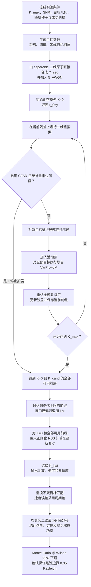
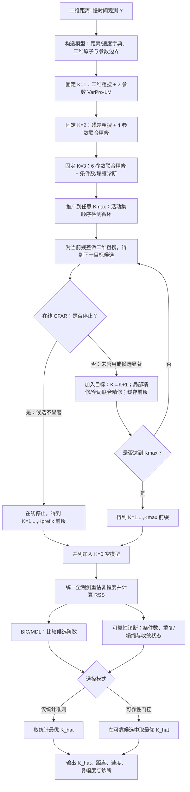
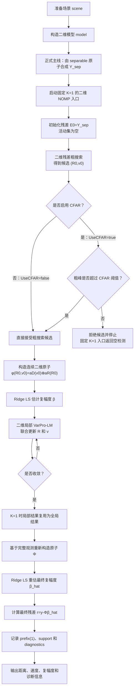

# 未知 $K$ 的二维 NOMP 联合精修：模型、实现与实验演进

> **文档定位：** 本文保留从固定 $K=1/2/3$ 到 unknown-$K$、候选选择、门控与随机几何实验的完整演进记录。当前公式总览、代码对应和正式结论以[《20.2D_NOMP联合精修》](./20.2D_NOMP联合精修.md)为准；若历史段落与第 20 篇、当前代码或正式结果文件冲突，以后三者为准。
>
> **项目主目标：** 在准静态二维距离–速度场景中，实现目标数未知的二维 NOMP 联合精修，并在固定观测模型、SNR、目标生成方式、算法参数和统计判据后，测量距离差与速度差共同作用时，算法能够稳定分辨的最小二维归一化间隔。
>
> **正式主线：** 由精确可分离（separable）二维原子直接合成 $Y_{\mathrm{sep}}$，使用等幅随机相位、unknown-$K$、完整前缀 BIC 与可选 CFAR；正式五带边界为 $d_{\min}=0.35$ Rayleigh。文中使用 `scene.y2d_roi` 的早期示例属于 physical-LFM 链路或模型失配演示，不是该正式边界的观测来源。

## 0. 当前雷达配置与正式主线

> **配置来源与适用范围：** 下列数值由当前 `src/core/generate_domp_scene.m`、`src/core/build_range_doppler_model.m` 和正式启动脚本 `experiments/range_doppler/run_2d_nomp_unknown_k_k3_random_geometry_gap_boundary_mc500.m` 共同确定。第 19 篇保留了实验演进记录，因此后文早期实验可能采用不同的局部参数；凡讨论当前正式五带边界，均以下列配置为准。正式 Monte Carlo 在距离–慢时间层直接合成 $Y_{\mathrm{sep}}$，不会为每个 trial 重放完整回波链路；但下列雷达参数仍通过距离 PSF、慢时间 Doppler 原子、无模糊区间和 Rayleigh 标尺进入正式模型。

### 0.1 雷达、波形与采样参数

| 项目 | 符号或代码量 | 当前配置 |
| --- | --- | --- |
| 雷达体制与速度符号 | — | X 波段单站脉冲多普勒；代码采用双程时延和双程 Doppler，径向速度以“接近雷达为正” |
| 载频与波长 | $f_0,\lambda=c/f_0$ | $f_0=10\ \mathrm{GHz}$，$\lambda=0.03\ \mathrm m$ |
| 发射波形 | $T_p,B,\mu=B/T_p$ | LFM，$T_p=10\ \mu\mathrm s$，$B=10\ \mathrm{MHz}$，$\mu=10^{12}\ \mathrm{Hz/s}$，时宽带宽积 $BT_p=100$ |
| 快时间采样 | $F_s,N,T_s$ | $F_s=10\ \mathrm{MHz}$，每脉冲 $N=1000$ 点，$T_s=0.1\ \mu\mathrm s$，记录长度 $N/F_s=100\ \mu\mathrm s$ |
| 脉冲重复参数 | $T_r,\mathrm{PRF}$ | PRI/PRT $T_r=100\ \mu\mathrm s$，$\mathrm{PRF}=10\ \mathrm{kHz}$ |
| CPI 脉冲数与名义时长 | $N_p,N_pT_r$ | $N_p=64$，名义相干处理时长 $6.4\ \mathrm{ms}$；慢时间样点为 $0{:}63\,T_r$，首末脉冲相隔 $6.3\ \mathrm{ms}$ |
| 距离标尺 | $\Delta R_{\mathrm{res}},R_{\mathrm{ua}}$ | 项目采用 $\Delta R_{\mathrm{res}}=c/(2B)=15\ \mathrm m$ 作为 Rayleigh 归一化标尺；名义无模糊距离 $R_{\mathrm{ua}}=cT_r/2=15\ \mathrm{km}$ |
| 速度标尺与周期 | $\Delta v_{\mathrm{res}},v_{\mathrm{ua}},P_v$ | $\Delta v_{\mathrm{res}}=\lambda/(2N_pT_r)=2.34375\ \mathrm{m/s}$，$v_{\mathrm{ua}}=\lambda/(4T_r)=75\ \mathrm{m/s}$，主区间 $[-75,75)\ \mathrm{m/s}$，周期 $P_v=150\ \mathrm{m/s}$ |
| 正式字典的加窗口径 | $w_R,w_D$ | 距离 PSF 使用频域 Hamming 窗；正式 separable 慢时间原子使用矩形窗 $w_D[m]=1$。场景生成器中的慢时间 Hamming 窗只用于距离–Doppler FFT 显示，不进入正式 $Y_{\mathrm{sep}}$ 估计原子 |

这里的 $15\ \mathrm m$ 和 $2.34375\ \mathrm{m/s}$ 是当前代码用于几何生成、误差判定和边界报告的 Rayleigh 标尺，不是过采样网格步长。距离维 Hamming 窗会改变实际 PSF 主瓣形状，因此 $15\ \mathrm m$ 应理解为项目冻结的名义归一化分辨率，而不是另行测得的半功率主瓣宽度。

### 0.2 正式五带边界的观测与搜索配置

| 项目 | 正式冻结值 |
| --- | --- |
| 正式观测 | 精确 separable $Y_{\mathrm{sep}}$ 加复 AWGN；距离 ROI 含 $N_R=23$ 个粗采样，故 $Y_{\mathrm{sep}}\in\mathbb C^{23\times64}$，向量化后 $M=1472$ |
| 距离 ROI | 模型 ROI 以 $3000\ \mathrm m$ 为中心、半宽 $180\ \mathrm m$；由于端点采用严格不等号，实际粗距离轴为 $2835{:}15{:}3165\ \mathrm m$ |
| 粗搜索网格 | `RangeOversample=4`，距离细网格 92 点、步长约 $3.62637\ \mathrm m$；`VelocityOversample=8`，估计范围 $[-30,30)\ \mathrm{m/s}$，实际速度网格为 $-29.8828125{:}0.29296875{:}29.8828125\ \mathrm{m/s}$，共 205 点 |
| 目标、噪声与候选阶数 | 真实 $K=3$，$K_{\max}=5$，等幅、独立均匀随机相位；$20\ \mathrm{dB}$ `fixed_per_target` |
| 随机几何 | `CenterSamplingMode='safe_roi_uniform'`；距离/速度归一化半跨度分别为 $0.90/0.55$ Rayleigh；五带为 $[0.20,0.25)$、$[0.25,0.30)$、$[0.30,0.35)$、$[0.35,0.40)$、$[0.40,+\infty)$ |
| 统计协议 | 每带 500 个独立场景，共 2500 个场景；完整前缀 BIC 为主模式，CFAR+BIC 为同观测配对次模式，共 5000 行求解结果；双侧 Wilson 95% 下限需不低于 95%；正式种子为 3141593，带间步长为 100000 |

`safe_roi_uniform` 会直接在安全 ROI 内随机抽取每个 trial 的场景中心。因此，正式启动脚本中保留的 `CenterVelocityMps=12` 在该分支下只是名义/兼容参数，并不表示所有正式场景都固定在 $12\ \mathrm{m/s}$；$3000\ \mathrm m$ 则用于固定距离模型 ROI 的中心。

### 0.3 当前正式主线总流程

下图先给出当前正式 separable unknown-$K$ 主线的完整闭环，后文各节分别展开目标构造、二维原子、序贯前缀、联合精修、选阶和统计评价。



固定 $K$ 实验可以理解为：在已知阶数处停止前缀扩展，直接输出对应活动集，不再对 $K=0{:}K_{\max}$ 进行 BIC 选阶；unknown-$K$ 正式实验则执行上图的完整流程。

## 1. 项目最终要解决什么问题

> **本阶段代码对照：** 先用 `experiments/range_doppler/run_2d_nomp_unknown_k_k3_random_geometry_gap_boundary_mc500.m` 确认正式问题的冻结条件，再看 `src/algorithms/nomp_range_doppler_unknown_k.m` 理解“前缀生成—候选重估—BIC 选阶”的输出定义；最后由 `demos/demo_2d_unknown_k_k3_random_geometry_gap_boundary.m` 核对置换不变匹配、周期速度误差和端到端成功标签。本节负责界定问题，不对应一个单独求解函数。

给定距离压缩后的二维距离–慢时间复数观测

\[
Y\in\mathbb C^{N_R\times N_p},
\qquad
y=\operatorname{vec}(Y),
\]

目标数 $K$ 未知，需要同时估计

\[
\widehat K,
\qquad
\{(\widehat R_k,\widehat v_k,\widehat c_k)\}_{k=1}^{\widehat K},
\]

其中 $R_k$ 是距离，$v_k$ 是径向速度，$c_k$ 是复幅度。当前准静态可分离模型为

\[
y_{\mathrm{sep}}=\sum_{k=1}^{K}c_k\phi(R_k,v_k)+w,
\]

\[
\phi(R,v)=a_D(v)\otimes a_R(R).
\]

等价的矩阵形式为

\[
Y_{\mathrm{sep}}=\sum_{k=1}^{K}c_k\,a_R(R_k)a_D(v_k)^{\mathsf T}+W.
\]

这里的“准静态”并不要求速度为零，而是指在一个 CPI 内用固定的初始距离 $R_k$ 和近似恒定的径向速度 $v_k$ 描述目标运动；同时假设加速度、距离走动以及由运动引起的距离响应变化，相对于当前 CPI 和距离分辨率足够小。因此，速度仍然通过慢时间 Doppler 相位保留，但暂不在原子中显式描述加速度、距离走动和更复杂的运动耦合。

由于慢时间离散采样引起多普勒周期模糊，速度只能模 $P_v=2v_{\mathrm{ua}}$ 唯一确定；本文选取半开区间 $[-v_{\mathrm{ua}},v_{\mathrm{ua}})$ 作为无模糊速度主区间。除非某一历史实验明确限制在不跨越周期端点的局部速度 ROI，本文的速度差均应理解为周期差

\[
d_v(\widehat v,v)
=\operatorname{mod}\!\left(
\widehat v-v+\frac{P_v}{2},P_v
\right)-\frac{P_v}{2}.
\]

后文个别历史公式为简洁写成 $\widehat v-v$ 或 $v_i-v_j$；在完整无模糊速度区间上，应以 $d_v$ 代替普通差值。

项目需要同时解决两个层次的问题：

1. **模型阶数选择**：观测中有多少个目标，即估计 $\widehat K$；
2. **连续参数估计**：给定候选阶数后，联合精修所有目标的距离、速度和复幅度。

因此，unknown-$K$ 不是只增加一个 BIC 公式，而是“顺序检测、连续联合精修、候选前缀缓存、模型选择和可靠性诊断”的完整系统。

## 2. 二维观测、二维原子与 Kronecker 字典

> **本阶段代码对照：** 建议依次阅读 `src/core/build_range_doppler_model.m`、`src/core/build_psf_dictionary.m`、`src/core/build_doppler_dictionary.m` 和 `src/core/build_range_doppler_atoms.m`；它们分别确定坐标轴与 ROI、距离响应、慢时间复指数及二维向量化原子。随后用 `tests/test_range_doppler_core.m` 核对尺寸、归一化和列主序约定。正式 separable 观测的 Monte Carlo 合成则看 `demos/demo_2d_unknown_k_random_k_random_geometry.m` 中的场景生成与加噪部分。

### 2.1 为什么选择距离–慢时间复数矩阵

项目需要区分观测所在的数据层级，以及该观测由哪条路线产生：

| 数据层级 | 主要用途 | 当前定位 |
|---|---|---|
| 原始快时间–慢时间回波 | 完整物理建模 | 计算和调试复杂，暂不作为主入口 |
| 精确 separable 距离–慢时间矩阵 $Y_{\mathrm{sep}}$ | 直接由 $a_R(R)a_D(v)^{\mathsf T}$ 合成 | **当前正式二维 NOMP/unknown-$K$ 主观测** |
| physical-LFM 距离压缩矩阵 $Y_{\mathrm{phys}}=\texttt{scene.y2d\_roi}$ | 完整 LFM 链路、距离走动与失配审计 | 独立物理扩展；不能替代正式 separable 结论 |
| 距离–多普勒 FFT 图 | 显示、传统检测和初始化 | 不直接替代连续参数精修观测 |

两条距离–慢时间路线具有相同的矩阵尺寸和向量化顺序，但数据来源和模型匹配关系不同。正式主线使用 $Y_{\mathrm{sep}}$；`scene.y2d_roi` 只用于 physical-LFM 匹配或有意的模型失配实验。二者都保留脉冲间复相位，速度无需先量化到 Doppler FFT bin。MATLAB 入口使用列主序向量化：

\[
y=Y(:)=\operatorname{vec}(Y).
\]

因此距离维在向量中变化最快，原子构造、粗搜索和残差回写必须始终使用同一顺序。

### 2.2 单目标二维原子

距离原子和速度原子分别为

\[
a_R(R)\in\mathbb C^{N_R},
\qquad
a_D(v)\in\mathbb C^{N_p}.
\]

当前 Doppler 原子采用 approaching-positive 符号约定：

\[
a_D(v)[m]\propto
w_D[m]\exp\!\left(
j2\pi\frac{2v}{\lambda}m\,\mathrm{PRT}
\right).
\]

二维矩阵原子和向量原子为

\[
A(R,v)=a_R(R)a_D(v)^{\mathsf T},
\]

\[
\phi(R,v)=\operatorname{vec}(A(R,v))
=a_D(v)\otimes a_R(R).
\]

代码中使用非共轭转置构造矩阵原子：

```matlab
atom_matrix = range_atom * doppler_atom.';
atom_vector = atom_matrix(:);
```

#### 2.2.1 为什么准静态目标可以采用这种二维原子

参考二维 delay–Doppler NOMP 的可分离原子结构，本文针对 LFM 脉压后的距离–慢时间复数观测，在 CPI 内距离走动和加速度可忽略的准静态条件下，将距离维原子定义为连续 LFM-PSF 响应 $a_R(R)$，将速度维原子定义为慢时间 Doppler 复指数 $a_D(v)$。由于此时距离响应与慢时间 Doppler 相位近似可分离，单目标矩阵原子可写为 $A(R,v)=a_R(R)a_D(v)^{\mathsf T}$，按列向量化后得到二维连续原子 $\phi(R,v)=\operatorname{vec}(A(R,v))=a_D(v)\otimes a_R(R)$。这里的外积/Kronecker 结构不是任意把两个一维字典拼接起来，而是由准静态前向模型推导得到；在正式 separable 主线中，观测生成器与估计器使用同一二维原子，因此该原子与 $Y_{\mathrm{sep}}$ 的数据生成模型严格匹配。具体地，距离压缩后，第 $m$ 个脉冲上的目标回波可以近似写成

\[
Y[n,m]
\approx c\,a_R[n;R]\,a_D[m;v]+W[n,m].
\]

其中，$a_R[n;R]$ 描述目标位于距离 $R$ 时的距离压缩 PSF，$a_D[m;v]$ 描述速度 $v$ 在慢时间上的相干相位演化，$c$ 是在一个 CPI 内近似不变的复幅度。这个近似成立的关键不是目标静止，而是以下三个条件：

1. **CPI 内近似恒速。** 目标可以有非零速度，但加速度和微动可以暂不考虑，所以在一个 CPI 内假设目标径向速度近似恒定，因此每个目标的慢时间相位随脉冲序号线性增长，表现为固定 Doppler 频率的复指数；只有存在不可忽略的加速度时，才会出现二次相位和慢时间调频。
2. **距离走动相对较小。** 目标在 CPI 内的距离变化满足
\[
   |v|(N_p-1)\,\mathrm{PRT}\ll \Delta R_{\mathrm{res}},
   \qquad
   \Delta R_{\mathrm{res}}\approx\frac{c_0}{2B},
\]

其中 $c_0$ 为光速、$B$ 为信号带宽。因而各个脉冲上的距离压缩包络可以视为同一个 $a_R(R)$，不必为每个慢时间采样重新平移距离 PSF。
3. **距离响应与慢时间相位可以分离。** 在上述条件下，距离维主要由 $R$ 决定，慢时间维主要由 $v$ 决定，二者的耦合项可以忽略，于是二维矩阵原子可写为

   \[
   A(R,v)=a_R(R)a_D(v)^{\mathsf T}.
   \]

对矩阵原子按列向量化后，利用

\[
\operatorname{vec}(xy^{\mathsf T})=y\otimes x,
\]

就得到

\[
\phi(R,v)=\operatorname{vec}(A(R,v))
        =a_D(v)\otimes a_R(R).
\]

因此，当前 separable 原子的含义是：用距离 PSF 表示“目标在哪个距离”，用慢时间复指数表示“目标以什么速度演化”，再按照 $Y$ 的列优先顺序将两者组合起来。这样既保留了距离–速度联合估计所需的复相位信息，也避免显式构造一个巨大的二维 Kronecker 字典。

以当前仿真参数为例，距离分辨率约为

\[
\Delta R_{\mathrm{res}}=\frac{3\times10^8}{2\times10^7}=15\ \mathrm{m}.
\]

当 $N_p=64$、$\mathrm{PRT}=100\ \mu\mathrm{s}$、$v=25\ \mathrm{m/s}$ 时，CPI 内距离走动量约为

\[
25\times(64-1)\times100\ \mu\mathrm{s}
\approx 0.1575\ \mathrm{m},
\]

它远小于 15 m 的距离分辨率，因此在这个量级下采用可分离二维原子是有物理依据的。这个数值只说明当前仿真配置下的适用性，不应被当作所有雷达参数下的通用阈值。

相应地，以下情况会破坏或明显削弱这种构造：CPI 过长、目标速度过大导致距离走动不可忽略、存在明显加速度或微动、目标复幅度在 CPI 内快速变化，或者需要保留完整宽带 LFM 的距离–慢时间耦合。此时应使用距离走动补偿、含运动参数的物理 LFM 原子，或其他非可分离二维原子；当前代码中的 physical_lfm 原型正是为这类扩展保留的接口，但不是 unknown-$K$ 主线的默认模型。

### 2.3 双目标和多目标观测

多目标观测是多个二维原子的线性叠加：

\[
\Phi_K=
\begin{bmatrix}
\phi(R_1,v_1)&\cdots&\phi(R_K,v_K)
\end{bmatrix},
\qquad
y=\Phi_Kc+w.
\]

当目标靠近时，困难来自：

- 二维原子列相关性增大；
- 活动集 Gram 矩阵条件数升高；
- 粗搜索峰融合或被残差误差掩盖；
- 联合优化更容易落入错误吸引域。

验证双目标和多目标原子的目的，是确认 vec/Kronecker 顺序、复幅度线性叠加和联合精修模型均正确。它是从 $K=1$ 进入固定 $K=2/3$ 和未知 $K$ 的基础。

### 2.4 完整 Kronecker 字典与矩阵化粗搜索

若距离网格字典和速度网格字典分别为

\[
A_R\in\mathbb C^{N_R\times G_R},
\qquad
A_D\in\mathbb C^{N_p\times G_v},
\]

则完整二维字典为

\[
D=A_D\otimes A_R.
\]

它包含全部距离–速度网格组合，但没有必要显式分配。对于当前残差矩阵 (E)，项目使用等价的矩阵公式

\[
C=A_R^{\mathsf H}E\,\overline{A_D},
\]

再按二维原子能量归一化得到 score map：

\[
T(R_i,v_j)
=\frac{|\phi(R_i,v_j)^{\mathsf H}r|^2}
{\|\phi(R_i,v_j)\|_2^2}.
\]

因此当前粗搜索在数学上等价于完整 Kronecker 字典相关，但避免了巨大的显式二维字典。

## 3. 从固定 $K$ 到未知 $K$ 的算法主线



本章按照“单目标基础验证—固定阶数多目标验证—未知阶数端到端验证”的顺序组织。不同实验层级使用同一条算法主线，但各自能够支撑的结论不同，不能因为某一层结果成立，就把结论直接外推到下一层。

| 证据层级 | 可以支持的结论 | 不能替代的结论 |
| --- | --- | --- |
| 模型匹配的 $K=1$ | 二维原子、速度符号、复幅度回代、连续精修和边界处理实现正确 | 多目标分辨能力与选阶能力 |
| $K=1$ 模型失配审计 | 单目标条件下的模型失配地板和参数偏差 | 模型匹配 separable 条件下的正式分辨边界 |
| 固定 $K=2$ 和 $K=3$ | 已知阶数下的目标耦合、Gram 病态和联合精修能力 | unknown-$K$ 的选阶正确率 |
| unknown-$K$ Monte Carlo | 残差检测、候选前缀、CFAR/BIC 选阶和端到端成功率 | 超出冻结观测模型与参数范围的普遍结论 |

因此，合理的证据递进是：先用 $K=1$ 建立可解释、可重复的二维连续估计基线，并单独审计模型失配；再用固定 $K=2$ 和 $K=3$ 研究多目标交叉耦合和已知阶数分辨；最后由 unknown-$K$ 实验评价残差检测、候选生成、CFAR/BIC 选阶及端到端成功率。上述四类证据相互衔接，但不能互相替代。

### 3.1 $K=1$：局部连续精修

> **本阶段代码对照：** 
>
> 若从完整求解链进入，先看 `src/algorithms/nomp_range_doppler_refinement.m` 如何得到单目标粗网格起点；
>
> 若只研究连续精修，则直接看 `src/algorithms/joint_varpro_range_doppler_refinement.m`。
>
> 幅度内层由 `src/core/solve_ridge_least_squares.m` 完成；
>
> $K=1$ 的接口与收敛合同由 `tests/test_range_doppler_k1_refinement.m` 验证。

$K=1$ 是整个二维 NOMP/unknown-$K$ 链路的单目标地基。它不负责分辨两个目标，而是先回答一个更基本的问题：给定一个二维距离–速度原子，代码能否从粗网格初值出发，把连续距离、连续速度和复幅度正确估计出来。

正式 separable 主线中的单目标模型为

\[
y_{\mathrm{sep}}
=\beta\,\phi(R,v)+w,
\qquad
\phi(R,v)=a_D(v)\otimes a_R(R),
\]

其中

\[
\theta=
\begin{bmatrix}
R&v
\end{bmatrix}^{\mathsf T}
\]

包含两个非线性参数，$\beta\in\mathbb C$ 是单目标复幅度这一线性参数。对于并非由同一 separable 原子直接生成、但仍用该原子解释的其他观测，只能写成近似关系 $y\approx\beta\phi(R,v)+w$，不能继承上式的严格模型匹配含义。

当前实现采用 Variable Projection（VarPro）：给定外层参数 $\theta=(R,v)$ 后，在内层通过复最小二乘求得当前最优幅度 $\widehat\beta(\theta)$；LM 外层只更新 $R$ 和 $v$，并在每个试探点重新回代 $\widehat\beta(\theta)$。因此，“不把复幅度放进 LM 外层”并不表示幅度保持不变，而是利用其线性结构在每个外层点直接求到条件最优值。

**整个流程**：



上图只表示当前正式 separable 的 K=1 主线。若改用 `scene.y2d_roi`，则进入独立的观测失配或物理扩展复核；其数据来源与正式 $Y_{\mathrm{sep}}$ 不同，不应把该分支的残差或定位结果直接解释成正式主线结论。

#### 3.1.1 K=1 的两种启动方式

当前代码有两个求解入口。第一种是直接观察“粗搜索 + 单目标精修”两个底层步骤。下面先给出与正式主线模型匹配的 $Y_{\mathrm{sep}}$ 示例：

```matlab
scene = generate_domp_scene(3000, 25, Inf, 120, 4);
model = build_range_doppler_model(scene, ...
    'VelocityOversample', 8, ...
    'VelocityLimits', [-40, 40]);

true_atom = build_range_doppler_atoms(model, 3000, 25);
Y_sep = reshape(true_atom, ...
    model.num_range_samples, model.num_pulses);
candidate = coarse_range_doppler_search(Y_sep, model);

[range_m, velocity_mps, amp, refinement_diagnostics] = ...
    joint_varpro_range_doppler_refinement( ...
        Y_sep, candidate.range_m, candidate.velocity_mps, model);
```

这里的 `scene` 用于提供 ROI、距离 PSF、脉冲参数和速度网格，估计输入则由同一 separable 原子直接合成。若把 `Y_sep` 改为 `scene.y2d_roi`，实验就变成 physical-LFM 观测配合 separable 原子的模型失配复核，必须单独标注。`scene.range_slowtime` 是完整距离轴，`scene.echo_doppler` 是 FFT 后的 RDM，也都不能直接替代当前 ROI 观测。

第二种是完整的固定阶数二维 NOMP 入口：

```matlab
[ranges, velocities, support, amps, diagnostics] = ...
    nomp_range_doppler_refinement(Y_sep, model, 1);
```

它在内部自动完成二维粗搜索、K=1 局部 VarPro-LM、复幅度更新和残差回写，并保存 `support` 和 `diagnostics.prefix(1)`。由于活动集中只有一个目标，K=1 时局部精修已经等于全局活动集精修，代码会设置

```matlab
diagnostics.prefix(1).global_reused_local = true;
```

因此，这两个入口使用相同的 K=1 精修内核；区别是第一种允许手动控制初始点，适合研究精修器本身，第二种适合运行端到端固定 K 检测流程。默认 `UseCFAR=false` 时，第二种入口假设 K=1，即不会判断“有没有目标”；只有启用 `UseCFAR=true`，才会在精修前根据粗搜索峰值和噪声阈值决定是否接受这个候选。

#### 3.1.2 从二维观测到二维原子

正式主线的 $Y_{\mathrm{sep}}$ 与 physical-LFM 分支的 `scene.y2d_roi` 都采用

\[
Y\in\mathbb C^{N_R\times N_p},
\qquad
y=Y(:)\in\mathbb C^{N_RN_p}.
\]

行对应距离采样，列对应脉冲慢时间。列优先向量化意味着距离维变化最快，后续原子构造、粗搜索和残差回写必须使用完全相同的顺序，距离原子由匹配滤波器 PSF 在连续距离 $R$ 处生成：

\[
a_R(R)\in\mathbb C^{N_R}.
\]

本文规定径向速度 $v>0$ 表示目标接近雷达，$v<0$ 表示目标远离雷达，对应慢时间原子：

\[
a_D(v)[m]\propto
w_D[m]\exp\left(
j2\pi\frac{2v}{\lambda}mT_r
\right),
\qquad m=0,\ldots,N_p-1.
\]

二维矩阵原子和向量原子为

\[
A(R,v)=a_R(R)a_D(v)^{\mathsf T},
\]

\[
\phi(R,v)=\operatorname{vec}(A(R,v))
=a_D(v)\otimes a_R(R).
\]

这里采用可分离二维原子，是因为当前研究对象主要是准静态目标：在一个 CPI 内目标可近似用恒定速度描述，距离走动相对于距离分辨率较小，且复幅度变化和加速度暂不作为主模型的一部分。因此，同一个距离 PSF 可以沿慢时间重复使用，再叠加由速度决定的相干 Doppler 相位。若距离走动、加速度或微动不可忽略，则上述外积结构不再充分，应转向距离走动补偿或物理 LFM 原子。

代码中必须使用非共轭转置：

```matlab
atom_matrix = range_atom * doppler_atom.';
Phi = atom_matrix(:);
```

`build_range_doppler_atoms` 会分别构造距离原子和 Doppler 原子，并将二维矩阵按列向量化。两部分归一化后，K=1 的活动原子矩阵 `Phi` 尺寸为 $N_RN_p\times1$。当前 unknown-$K$ 主线默认使用 `AtomMode='separable'`；`physical_lfm` 是独立的物理 LFM 原子原型，不作为当前 unknown-$K$ 主线的默认模型。

#### 3.1.3 二维粗搜索：确定局部精修的起点

K=1 的第一次检测尚无已估计目标，因此正式主线的初始残差矩阵就是完整观测：

\[
E_0=Y_{\mathrm{sep}}.
\]

这里的 $E_0$ 是已经构造好的残差；后面的相关运算只是在该残差上寻找最匹配的候选原子，并不是重新构造残差。

如果距离和速度粗网格字典分别为

\[
A_R\in\mathbb C^{N_R\times G_R},
\qquad
A_D\in\mathbb C^{N_p\times G_v},
\]

完整的二维 Kronecker 字典为

\[
D=A_D\otimes A_R
\in\mathbb C^{N_RN_p\times G_RG_v}.
\]

网格点 $(R_i,v_j)$ 对应的某一列为

\[
\phi_{ij}
=a_D(v_j)\otimes a_R(R_i)
=\operatorname{vec}\!\left(
a_R(R_i)a_D(v_j)^{\mathsf T}
\right).
\]

该候选与残差的匹配相关值是一个复数标量：

\[
\begin{aligned}
C_{ij}
&=\phi_{ij}^{\mathsf H}\operatorname{vec}(E_0)\\
&=a_R(R_i)^{\mathsf H}E_0\,
\overline{a_D(v_j)}.
\end{aligned}
\]

它表示候选距离响应和候选慢时间相位与当前残差进行二维相干匹配后的结果。若距离和速度都接近真实参数，各采样点会近似同相累加，$|C_{ij}|$ 较大；若其中任一参数失配，包络或相位无法同时对齐，求和会发生抵消。

代码不显式分配完整的 $D$，而是一次计算全部 $(i,j)$ 的矩阵相关：

\[
C=A_R^{\mathsf H}E_0\,\overline{A_D}
\in\mathbb C^{G_R\times G_v}.
\]

两种写法严格满足

\[
D^{\mathsf H}\operatorname{vec}(E_0)
=\operatorname{vec}(C).
\]

因此，矩阵化计算只是利用可分离结构批量完成所有 Kronecker 原子的相关，并没有改变粗搜索准则。上式右侧出现 $\overline{A_D}$，是因为本文的矩阵原子采用非共轭转置 $a_Ra_D^{\mathsf T}$。更完整的逐元素推导见《20.2D_NOMP联合精修》第 4.5 节。

粗搜索得分为

\[
T(R_i,v_j)=
\frac{|C_{ij}|^2}
{\|a_R(R_i)\|_2^2\|a_D(v_j)\|_2^2}.
\]

取最大得分点得到粗网格初值

\[
(R_0,v_0)=\arg\max_{R_i,v_j}T(R_i,v_j).
\]

当前字典列通常已归一化，此时得分等于 $|C_{ij}|^2$；保留分母是为了使公式对未归一化字典仍然成立。这里的 $(R_0,v_0)$ 只是 NOMP 的粗检测/初始化结果，不是最终估计。连续精修可以把它移动到粗网格之间的 off-grid 位置。完整 NOMP 入口还会把粗网格索引保存到 `support`，用于记录“目标是如何被发现的”；连续的 `ranges` 和 `velocities` 才是最终物理估计。

#### 3.1.4 VarPro 内层幅度回代：每个 LM 试探点都重新求幅度

粗搜索只给出距离–速度初值

\[
\theta_0=
\begin{bmatrix}
R_0&v_0
\end{bmatrix}^{\mathsf T},
\qquad
\phi_0=\phi(R_0,v_0).
\]

复幅度 $\beta$ 与观测模型呈线性关系，因此没有必要把 $\operatorname{Re}\beta$ 和 $\operatorname{Im}\beta$ 一起放入 LM 外层迭代。对任意外层试探点 $\theta=(R,v)$，代码先构造 $\phi(R,v)$，再在内层求解该参数点对应的条件最优幅度：

\[
\widehat\beta(R,v)
=\arg\min_{\beta\in\mathbb C}
\left[
\|y-\phi(R,v)\beta\|_2^2
+\lambda_{\mathrm{ridge}}|\beta|^2
\right].
\]

K=1 时，上式具有直观的闭式表达式：

\[
\widehat\beta(R,v)
=\frac{\phi(R,v)^{\mathsf H}y}
{\|\phi(R,v)\|_2^2+\lambda_{\mathrm{ridge}}}.
\]

因此，每当 LM 改变 $(R,v)$ 时，原子 $\phi(R,v)$ 和幅度 $\widehat\beta(R,v)$ 都会一起重新计算。

##### `Ridge` 与实际 $\lambda_{\mathrm{ridge}}$ 的关系

`Ridge` 是用户输入的相对正则强度。记 $\Phi\in\mathbb C^{N_RN_p\times K_{\mathrm{act}}}$ 为当前活动原子矩阵，并定义平均列能量
\[
\overline e_{\Phi}
=\frac{
\operatorname{Re}\operatorname{tr}(\Phi^{\mathsf H}\Phi)
}{K_{\mathrm{act}}}
=\frac{1}{K_{\mathrm{act}}}
\sum_{k=1}^{K_{\mathrm{act}}}\|\phi_k\|_2^2.
\]

`solve_ridge_least_squares` 实际使用
\[
\lambda_{\mathrm{ridge}}
=\texttt{Ridge}\,
\max\!\left(\overline e_{\Phi},1\right),
\]

并通过 `ridge_diagnostics.ridge_scale` 报告该数值。这样做的含义是：当字典列的平均能量大于 1 时，正则系数随原子能量同比放大；当平均能量小于 1 时，$\max(\cdot,1)$ 防止有效正则强度低于输入的 `Ridge`。

当前正式 separable 模型中的每个二维原子都会进行单位范数归一化；考虑实现中的数值保护项，可写为

\[
\|\phi_k\|_2\approx1,
\qquad
\max\!\left(\overline e_{\Phi},1\right)=1,
\qquad
\lambda_{\mathrm{ridge}}=\texttt{Ridge}.
\]

当前默认 `Ridge=1e-8`，所以 K=1 的实际系数为

\[
\lambda_{\mathrm{ridge}}=10^{-8},
\qquad
\widehat\beta(R,v)
=\frac{\phi(R,v)^{\mathsf H}y}
{\|\phi(R,v)\|_2^2+10^{-8}}
\approx
\frac{\phi(R,v)^{\mathsf H}y}{1+10^{-8}}.
\]

这一极小正则主要用于数值稳定，默认设置下对单位范数单目标幅度的收缩可以忽略。上述缩放只补偿字典列能量，不会根据原子间相干性或 Gram 条件数自动选择新的 `Ridge`。

##### 消去幅度后的外层目标

将条件最优幅度代回后，纯数据残差为

\[
r(R,v)
=y-\phi(R,v)\widehat\beta(R,v),
\]

LM 用于接受或拒绝试探步的约化目标为

\[
F(R,v)
=\|r(R,v)\|_2^2
+\lambda_{\mathrm{ridge}}
|\widehat\beta(R,v)|^2.
\]

因此外层问题为

\[
(\widehat R,\widehat v)
=\arg\min_{R,v}F(R,v),
\]

而 $\widehat\beta(R,v)$ 在每一个外层试探点都由内层重新回代。该“非线性外层 + 线性内层”的结构就是本项目所说的 VarPro。

相关诊断字段需要按以下口径区分：

| 诊断字段 | 数学含义 |
| --- | --- |
| `objective_history` | $F=\|r\|_2^2+\lambda_{\mathrm{ridge}}|\widehat\beta|^2$，用于 LM 步接受 |
| `data_rss_history` | 纯数据项 $\|r\|_2^2$ |
| `ridge_penalty_history` | 正则项 $\lambda_{\mathrm{ridge}}|\widehat\beta|^2$ |
| `relative_residual_history` | $\|r\|_2/\|y\|_2$，不包含 Ridge 惩罚 |

最后还要区分两个不同参数：$\lambda_{\mathrm{ridge}}$ 只用于稳定线性复幅度求解，下一小节中的 LM 阻尼 $\mu_{\mathrm{eff}}$ 用于稳定非线性距离–速度步长；二者作用对象不同，不能混用。默认 BIC 使用的也是单独计算的未正则化数据 RSS，而不是这里的含 Ridge 目标 $F$。

#### 3.1.5 两个连续参数的联合 Jacobian

K=1 的外层物理参数为

\[
\theta=
\begin{bmatrix}R&v\end{bmatrix}^{\mathsf T},
\qquad
\Phi=\phi(R,v)\in\mathbb C^{N_RN_p\times1}.
\]

距离和速度确定二维原子的距离响应形状与慢时间 Doppler 相位变化规律，但不能确定目标的回波强度和整体初始相位；后两者由复幅度 $\beta$ 描述。因此，在每个 LM 当前点和试探点，代码都会先针对该 $(R,v)$ 重新求条件最优幅度 $\widehat\beta(R,v)$，再构造残差和目标函数。Jacobian 则在当前接受点处描述：当距离和速度发生小变化时，已经回代最优复幅度后的拟合模型如何变化。

**边界感知的距离导数**

代码直接对连续、已归一化的二维原子做有限差分。定义

\[
R_- = \max(R_{\min},R-h_R),
\qquad
R_+ = \min(R_{\max},R+h_R),
\]

则实际计算为

\[
\frac{\partial\phi}{\partial R}
\approx
\frac{\phi(R_+,v)-\phi(R_-,v)}{R_+-R_-}.
\]

当 $R$ 远离边界时，$R_-=R-h_R$、$R_+=R+h_R$，上式退化为中心差分；靠近边界时，差分区间会被截短并自动变为单边或非对称差分。由于差分对象是 `build_range_doppler_atoms` 返回的归一化原子，距离响应归一化随 $R$ 变化的影响也包含在该数值导数中。

**separable 速度解析导数**

采用 approaching-positive 约定时，慢时间原子满足

\[
a_D[m;v]
\propto
w_D[m]\exp\!\left(
j\frac{4\pi}{\lambda}v\,mT_r
\right),
\qquad m=0,\ldots,N_p-1.
\]

当前窗口 $w_D[m]$ 与 $v$ 无关，其归一化因子也不随 $v$ 改变，因此 separable 模式可以使用解析导数

\[
\frac{\partial a_D[m;v]}{\partial v}
=j\frac{4\pi}{\lambda}mT_r\,a_D[m;v],
\]

并得到

\[
\frac{\partial\phi}{\partial v}
=\frac{\partial a_D}{\partial v}\otimes a_R.
\]

为避免和第 1 节的周期速度差 $d_v(\cdot,\cdot)$ 混淆，将乘入当前条件最优复幅度后的两列基本模型导数记为

\[
b_R=\frac{\partial\phi}{\partial R}\widehat\beta,
\qquad
b_v=\frac{\partial\phi}{\partial v}\widehat\beta.
\]

**幅度方向消元与投影/Kaufman 近似**

改变 $(R,v)$ 时，$b_R$ 或 $b_v$ 中落在当前活动原子 $\Phi$ 张成空间内的成分，可以通过重新调整复幅度来解释，不应全部用于推动距离和速度更新；真正驱动外层更新的是消去这些幅度方向后剩余的原子形状变化。对 $j\in\{R,v\}$，当前实现先求

\[
u_j=\arg\min_u
\left(
\|b_j-\Phi u\|_2^2
+\lambda_{\mathrm{ridge}}|u|^2
\right),
\]

再构造带 ridge 增广项的投影导数列和残差：

\[
J_j=
\begin{bmatrix}
b_j-\Phi u_j\\
-\sqrt{\lambda_{\mathrm{ridge}}}u_j
\end{bmatrix},
\qquad
\widetilde r=
\begin{bmatrix}
r\\
-\sqrt{\lambda_{\mathrm{ridge}}}\widehat\beta
\end{bmatrix}.
\]

因此，相对于物理参数 $(R,v)$ 的增广投影模型 Jacobian 为

\[
\widetilde J_\theta
=\begin{bmatrix}J_R&J_v\end{bmatrix}
\in\mathbb C^{(N_RN_p+1)\times2}.
\]

这里采用的是“模型方向 Jacobian”记号。由于 $r=y-\Phi\widehat\beta$，其局部残差关系为

\[
\widetilde r(\theta+\Delta\theta)
\approx
\widetilde r(\theta)
-\widetilde J_\theta\Delta\theta.
\]

这解释了下一节正规方程右端使用 $\operatorname{Re}(J_u^{\mathsf H}\widetilde r)$ 而不是再额外添加负号。当前实现将该结构明确标记为 `projected_kaufman_approximation`，并设置 `jacobian_is_exact_golub_pereyra=false`；因此应称为投影/Kaufman 近似 Jacobian，而不是严格完整的 Golub–Pereyra Jacobian。

最后需要区分物理参数 Jacobian 和真正送入 LM 的无量纲 Jacobian：$\widetilde J_\theta$ 的两列分别按米和米每秒求导，代码还会使用 `model.range_scale_m` 与 `model.velocity_scale_mps` 对两列进行缩放。当前这两个尺度取过采样搜索网格步长，而不是 Rayleigh 分辨率。具体的 $J_u=\widetilde J_\theta S$、实数正规方程、边界处理和步接受规则在第 3.1.6 节展开。

#### 3.1.6 无量纲 LM 更新、边界与接受规则

距离和速度的物理单位与典型数值尺度不同：距离以米计，速度以米每秒计。若直接在物理坐标中构造 LM 系统，Jacobian 两类列的量级、Hessian 对角项和阻尼作用可能仅因单位选择而失衡。因此，当前实现使用过采样搜索网格步长作为数值坐标尺度。对 K=1，定义

\[
S=\operatorname{diag}(s_R,s_v),
\qquad
\Delta\theta=S\Delta u,
\]

其中

\[
s_R=\texttt{model.range\_scale\_m}
=\texttt{model.range\_grid\_step\_m},
\]

\[
s_v=\texttt{model.velocity\_scale\_mps}
=\texttt{model.velocity\_grid\_step\_mps}.
\]

这里的 $s_R$、$s_v$ 是算法预条件尺度，不是 Rayleigh 分辨率；改变网格过采样倍数会改变这两个数值，但不会改变项目用于报告物理分辨能力的 Rayleigh 标尺。若上一节的 $\widetilde J_\theta$ 是相对于物理参数 $(R,v)$ 的增广投影模型 Jacobian，则由链式法则，无量纲增量 $\Delta u$ 对应的 Jacobian 为

\[
J_u=\widetilde J_\theta S.
\]

这等价于把距离导数列乘以 $s_R$、速度导数列乘以 $s_v$。LM 求得 $\Delta u$ 后，再通过 $\Delta\theta=S\Delta u$ 转回物理单位。

##### 实数正规方程与对角保护

距离和速度都是实参数，但 $J_u$ 和增广残差 $\widetilde r$ 为复数。代码先构造

\[
H_u^{(0)}=\operatorname{Re}(J_u^{\mathsf H}J_u),
\qquad
g_u=\operatorname{Re}(J_u^{\mathsf H}\widetilde r),
\]

再显式对称化

\[
H_u=\frac{H_u^{(0)}+\left(H_u^{(0)}\right)^{\mathsf T}}{2}.
\]

为了防止某个 Jacobian 列极弱时 Hessian 对角项接近零，定义

\[
d_{\mathrm{floor}}
=10^{-12}
\max\!\left(
\operatorname{Re}\operatorname{tr}(H_u),
\epsilon_H
\right),
\]

\[
d_i=\max\!\left([H_u]_{ii},d_{\mathrm{floor}}\right),
\qquad
D_H=\operatorname{diag}(d_1,d_2).
\]

其中 $\epsilon_H$ 表示与当前数值类型一致的机器精度保护量。进入 LM trial 前，代码还计算尺度归一化梯度

\[
\gamma_g
=
\left\|
\begin{bmatrix}
g_{u,1}/\sqrt{d_1+\epsilon_H}\\
g_{u,2}/\sqrt{d_2+\epsilon_H}
\end{bmatrix}
\right\|_\infty.
\]

若 $\gamma_g<\texttt{GradientTolerance}$，则无需继续试探 LM 步，并以 `projected gradient tolerance` 停止。

##### Gram 条件数增强的 LM 阻尼

记 $\mu$ 为当前基础 LM 阻尼，$\kappa_G$ 为当前活动原子 Gram 矩阵的条件数。代码使用

\[
\gamma_{\mathrm{cond}}
=\min\!\left(
\texttt{MaxConditionDamping},
\max\!\left(
1,
\frac{\kappa_G}{\texttt{ConditionNumberReference}}
\right)
\right),
\]

\[
\mu_{\mathrm{eff}}
=\min\!\left(
\texttt{MaxDamping},
\mu\,\gamma_{\mathrm{cond}}
\right).
\]

随后求解

\[
\left(H_u+\mu_{\mathrm{eff}}D_H\right)\Delta u=g_u,
\]

这里根据 $\kappa_G$ 增强的是非线性 LM 阻尼，而不是线性幅度子问题中的 $\lambda_{\mathrm{ridge}}$。K=1 且单原子单位范数时通常有 $\kappa_G=1$；在默认 `ConditionNumberReference=50` 下，$\gamma_{\mathrm{cond}}=1$，因此不会额外放大阻尼。该机制主要在多目标原子接近、Gram 矩阵病态时发挥作用。

##### 从无量纲建议步到受约束物理步长

LM 解出的 $\Delta u=[\Delta u_R,\Delta u_v]^{\mathsf T}$ 先映射为建议物理步长

\[
\Delta R_{\mathrm{prop}}=s_R\Delta u_R,
\qquad
\Delta v_{\mathrm{prop}}=s_v\Delta u_v.
\]

随后依次执行：

1. 限制最大距离步长和最大速度步长；
2. 距离超出 ROI 时 clip 到边界；
3. 完整无模糊速度区间使用 wrap；
4. 局部速度 ROI 使用 clip；
5. 约束后重新计算实际物理步长；
6. 在候选位置重建二维原子、重新估计全部复幅度，并重新计算带 ridge 目标。

令候选参数为 $(R_{\mathrm{cand}},v_{\mathrm{cand}})$。距离实际步长为

\[
\Delta R_{\mathrm{act}}=R_{\mathrm{cand}}-R.
\]

完整无模糊速度区间采用周期边界，因此速度实际步长为周期差

\[
\Delta v_{\mathrm{act}}
=d_v(v_{\mathrm{cand}},v),
\]

局部速度 ROI 则使用普通差值 $\Delta v_{\mathrm{act}}=v_{\mathrm{cand}}-v$。后续步长收敛判断使用的是约束后的 $(\Delta R_{\mathrm{act}},\Delta v_{\mathrm{act}})$，而不是约束前的建议步长。

##### 候选接受、阻尼更新与停止状态

当前 LM 比较的是第 3.1.4 节定义的带 ridge 总目标 $F$。记

\[
N_y=\|y\|_2^2+\epsilon_y,
\]

则代码要求的最小下降量为

\[
\delta_F
=\texttt{ObjectiveTolerance}
\max\!\left(
F_{\mathrm{current}},
N_y\epsilon_F
\right),
\]

只有满足

\[
F_{\mathrm{candidate}}
<F_{\mathrm{current}}-\delta_F
\]

才接受候选步。接受后更新距离、速度、复幅度、残差和诊断量，并令基础阻尼 $\mu$ 乘以 `DampingDecrease`；拒绝时令 $\mu$ 乘以 `DampingIncrease`，然后在不超过 `MaxLmTrials` 的范围内重新求解阻尼后的 LM 系统。两种更新都受机器精度下限或 `MaxDamping` 上限保护。

当前实现的主要停止状态可以区分为：

| 条件 | `stop_reason` |
| --- | --- |
| Jacobian、Hessian 或梯度出现非有限值 | `non-finite projected Jacobian` |
| 尺度归一化梯度低于阈值 | `projected gradient tolerance` |
| 已接受步的实际距离、速度增量均低于阈值 | `range-velocity step tolerance` |
| 所有 LM trial 均未接受，但最后的受约束实际步已经很小 | `stationary LM step` |
| 所有 LM trial 均未接受，且实际步仍不小 | `LM step rejected` |
| 达到外层迭代上限 | `maximum iterations reached` |

因此，K=1 的 LM 不只是“求一步并检查是否下降”，而是“梯度检查—条件数增强阻尼—物理步长限制—周期或区间边界处理—幅度重新回代—严格目标下降判定”的完整闭环。当前 K=1 不存在多目标原子塌缩问题，但仍需记录距离/速度 clip 或 wrap 次数、阻尼变化、步长、停止原因以及目标函数是否保持单调不增。

#### 3.1.7 K=1 的最终输出与判断

直接调用连续精修器时，K=1 的四个输出可以写为

```matlab
[range_m, velocity_mps, amp, d] = ...
    joint_varpro_range_doppler_refinement( ...
        Y, initial_range_m, initial_velocity_mps, model);
```

其中 `range_m`、`velocity_mps` 和 `amp` 为最终距离、速度和复幅度，`d` 为该次 VarPro-LM 的完整诊断结构。通过固定 K 的完整 NOMP 入口调用时，首先得到

```matlab
[ranges, velocities, support, amps, nomp_d] = ...
    nomp_range_doppler_refinement(Y, model, 1, ...);
```

只有当 `nomp_d.num_detected >= 1` 时，才可以读取

```matlab
p1 = nomp_d.prefix(1);
d = p1.global_diagnostics;
```

这一保护在启用 CFAR 时尤其重要：如果第一个粗搜索候选未超过阈值，则 `num_detected=0`、`prefix` 为空，此时不存在 `prefix(1)`。因此，K=1 的最终判断应依次区分检测层、优化层和物理估计层。

**检测层：是否真的形成 K=1 前缀**

- 固定 K=1 且 `UseCFAR=false` 时，入口假定需要拟合一个目标，不负责检验目标是否存在；
- `UseCFAR=true` 时，应先检查 `num_detected`、`cfar_stop_reason` 和 `cfar_history`，确认粗搜索峰值是否通过检测阈值；
- 只有形成 K=1 前缀后，距离、速度、复幅度和内层精修诊断才有意义。

**优化层：数值求解是否可信**

常用的内层诊断包括

```matlab
d.converged
d.stop_reason
d.iterations
d.final_data_rss
d.final_ridge_penalty
d.final_objective
d.final_relative_residual
d.objective_history
d.data_rss_history
d.accepted_history
d.damping_history
d.gradient_norm_history
d.range_clip_count
d.velocity_clip_count
d.velocity_wrap_count
```

三类目标量应保持各自口径：

\[
d.\texttt{final\_objective}
=d.\texttt{final\_data\_rss}
+d.\texttt{final\_ridge\_penalty},
\]

\[
d.\texttt{final\_relative\_residual}
=\sqrt{
\frac{d.\texttt{final\_data\_rss}}
{\|y\|_2^2+\epsilon}
}.
\]

`objective_history` 对应 LM 接受规则使用的带 ridge 总目标，应保持单调不增；`data_rss_history` 是纯数据项，不应与带 ridge 目标混写。`projected gradient tolerance`、`range-velocity step tolerance` 和 `stationary LM step` 通常表示局部求解已经稳定；`LM step rejected`、`non-finite projected Jacobian` 或 `maximum iterations reached` 则应结合最后步长、残差和边界事件进一步审计，而不能只凭 `converged` 一个布尔量下结论。

**物理层：参数估计是否正确**

若已知真值，应至少计算周期速度口径下的归一化误差

\[
e_R=\frac{|\widehat R-R_{\mathrm{true}}|}{\Delta R_{\mathrm{res}}},
\qquad
e_v=\frac{|d_v(\widehat v,v_{\mathrm{true}})|}
{\Delta v_{\mathrm{res}}}.
\]

在模型匹配且真实复幅度已知时，还可以计算

\[
e_\beta
=\frac{|\widehat\beta-\beta_{\mathrm{true}}|}
{\max(|\beta_{\mathrm{true}}|,\epsilon)}.
\]

其中 $d_v(\cdot,\cdot)$ 是第 1 节定义的周期速度差；在不跨越速度周期端点的局部 ROI 内，它退化为普通速度差。没有真值时，残差下降只能说明当前模型对数据的拟合改善，不能单独证明物理定位正确；若发生 clip 或 wrap，还应结合最终边界位置解释参数结果。

K=1 的 `final_resolution_diagnostics` 会标记为不适用的单目标情形，不产生双目标间隔或分辨率结论。K=1 真正需要评价的是 off-grid 定位、复幅度恢复、速度符号和周期边界、残差下降、数值收敛以及模型失配地板。

#### 3.1.8 真值如何设置与如何做基线实验

K=1 基线首先要区分“模型匹配的算法验证”和“观测—原子失配审计”。两类实验回答的问题不同，不能把结果放在同一个证据口径下解释。

##### 模型匹配的 separable 主基线

若目的是验证粗搜索、VarPro、Jacobian、LM 和复幅度回代是否正确，应直接用估计器的同一套二维原子生成 off-grid 观测：

```matlab
true_range = 3001.234;
true_velocity = 23.456;
true_amp = 1.2 * exp(1j * 0.7);

true_atom = build_range_doppler_atoms( ...
    model, true_range, true_velocity);
y_clean = true_atom * true_amp;
Y = reshape(y_clean, model.num_range_samples, model.num_pulses);

candidate = coarse_range_doppler_search(Y, model);
[range_m, velocity_mps, amp, diagnostics] = ...
    joint_varpro_range_doppler_refinement( ...
        Y, candidate.range_m, candidate.velocity_mps, model);
```

这条路线中，生成观测和估计观测使用完全相同的原子定义，因此在无噪声、真值位于参数边界内且优化进入正确吸引域时，距离、速度、复幅度和残差都可以直接与真值比较。实验至少应同时记录：

- 粗网格的距离、速度误差；
- 连续精修后的 $e_R$、$e_v$ 和 $e_\beta$；
- 初始与最终纯数据残差、带 ridge 目标及其下降比例；
- `stop_reason`、迭代次数、接受步数和阻尼轨迹；
- 距离/速度是否发生 clip 或 wrap。

这能够把“粗网格量化误差”“连续精修误差”和“数值停止行为”分开。若加入复 AWGN，还必须冻结随机种子、SNR 定义、噪声加入层级、试验次数和成功阈值；单次无噪声收敛只能作为正确性基线，不能替代 Monte Carlo 稳定性结论。

##### 完整回波链路的模型失配审计

由场景生成器构造完整回波时，真实距离和速度由前两个输入设置：

```matlab
scene = generate_domp_scene(3000, 25, Inf, 120, 4);
scene.target_ranges_m
scene.target_velocities_mps
```

上例的真值为 $R_{\mathrm{true}}=3000\ \mathrm m$、$v_{\mathrm{true}}=25\ \mathrm{m/s}$。若将 `scene.y2d_roi` 作为观测，却仍使用默认 separable 原子估计，则完整回波中的距离走动和其他未建模效应可能无法被单个 separable 原子完全表示。因此，即使 `SNR=Inf`，最终纯数据残差也可能停在非零的模型失配地板。

这类实验主要用于回答模型适配性问题，而不是验证理想 separable 求解器能否精确回到自身生成的真值。其距离和速度仍可与场景真值比较，但复幅度只有在生成链路和估计原子的幅相口径一致时才适合直接计算 $e_\beta$。模型失配结果也不能替代当前正式 separable Monte Carlo 的分辨边界证据。

#### 3.1.9 $K=1$ 的研究价值与边界

$K=1$ 的定位是验证“单个二维连续原子能否被正确检测、精修和回代”，属于二维算法的基础层与数值基线，而不是多目标超分辨证据。模型匹配的 $K=1$ 实验可以验证：

- 二维原子的 `vec/Kronecker` 顺序是否正确；
- Doppler 正负号和速度坐标是否正确；
- 粗网格初值能否被连续精修拉到 off-grid 真值；
- 复幅度回代、残差更新和带 ridge 目标是否一致；
- 速度周期边界处的 wrap 以及局部 ROI 的 clip 是否正确；
- SNR、初值偏差和边界位置如何影响收敛率与参数误差；
- 单目标条件下的迭代次数、阻尼轨迹和数值稳定性。

若要比较“距离—速度联合更新”与“固定一个参数只更新另一个参数”，必须在相同观测、相同初值、相同停止阈值和相同计算预算下设置受控基线，再比较成功率、误差和迭代代价；$K=1$ 本身并不预先保证联合更新一定更稳定。完整回波链路实验还可以测量 separable 原子的模型失配地板，但该结果属于模型适配性证据，应与模型匹配基线分开报告。

但是，$K=1$ 本身不能回答：

- 两个近距离目标能否分开；
- 距离轴、速度轴或双轴亚分辨率能达到什么边界；
- 活动集 Gram 矩阵病态和目标塌缩如何影响联合估计；
- unknown-$K$ 是否能正确选择目标数。

至此，$K=1$ 实验已经完成对二维原子、速度符号、连续参数精修、复幅度回代和边界处理的基础验证，但尚未引入多目标原子之间的相关性与活动集耦合。下一节将目标数固定为 $K=2$，在沿用同一二维原子和 VarPro-LM 内核的基础上，新增残差上的第二目标检测、四参数全局联合精修、双复幅度联合回代以及 Gram 条件数和目标塌缩诊断。这样可以先评价已知阶数下的双目标分辨能力，再在后文单独引入 unknown-$K$ 选阶，避免把联合精修失败与阶数判断错误混为一谈。

### 3.2 固定 $K=2$：完整四参数联合精修

> **本阶段代码对照：** 主算法仍是 `src/algorithms/nomp_range_doppler_refinement.m` 与 `src/algorithms/joint_varpro_range_doppler_refinement.m`；实验入口看 `experiments/range_doppler/eval_2d_nomp_k2_superresolution.m`，独立二维间隔扫描看 `experiments/range_doppler/pilot_2d_nomp_k2_joint_grid.m`。对应合同测试为 `tests/test_range_doppler_k2_refinement.m`、`tests/test_range_doppler_k2_superresolution_experiment.m` 和 `tests/test_range_doppler_k2_joint_grid.m`。

固定 $K=2$ 的作用，是在已知场景中恰有两个目标的条件下，分离“候选生成是否正确”和“四参数联合精修是否有效”这两个问题。它可以评价双目标的已知阶数分辨能力，但不负责判断目标数；目标存在性与 unknown-$K$ 选阶应由后文的 CFAR/BIC 实验单独评价。

#### 3.2.1 $K=2$ 的启动方式

固定 $K=2$ 有两个不同层级的运行入口。研究完整的双目标检测与联合精修流程时，应优先使用入口一；只有在单独测试四参数 VarPro-LM 精修器、并且已经有两组初值时，才使用入口二。

**入口一：完整固定 $K=2$ NOMP（推荐主入口）**

这个入口不要求手动给出两个目标的初始距离和速度。程序会先在完整观测上搜索第一个目标，再在消去第一个目标后的残差上搜索第二个目标，最后自动启动四参数联合精修。

下面给出一个可以直接运行的完整示例：

```matlab
setup_project(false);

% 两个目标的真实参数；同一位置的距离和速度按下标配对
true_ranges_m = [2996; 3004];
true_velocities_mps = [11.4; 12.6];

% 生成参考场景；这里只复用其ROI、PSF和脉冲参数
scene = generate_domp_scene(3000, 12, Inf, 120, 4);

% 建立距离/速度网格、二维原子及连续参数边界
model = build_range_doppler_model( ...
    scene, 'VelocityOversample', 8, ...
    'VelocityLimits', [-30, 30]);

% 正式主线：由同一separable原子直接合成模型匹配观测
true_amps = [1; 0.8 * exp(1j * 0.4)];
Phi_true = build_range_doppler_atoms( ...
    model, true_ranges_m, true_velocities_mps);
Y_sep = reshape(Phi_true * true_amps, ...
    model.num_range_samples, model.num_pulses);

% 固定 K=2 的完整入口
[ranges, velocities, support, amps, diagnostics] = ...
    nomp_range_doppler_refinement(Y_sep, model, 2);
```

这里设置的两个真实目标分别为

$$
(R_1,v_1)=(2996\ \mathrm{m},11.4\ \mathrm{m/s}),\qquad
(R_2,v_2)=(3004\ \mathrm{m},12.6\ \mathrm{m/s}).
$$

`build_range_doppler_atoms` 的距离和速度输入按元素配对，而不是把所有距离与所有速度任意组合。这里的 `Y_sep` 是正式主线观测；若改用由相同真实目标生成的 `scene.y2d_roi`，就应明确标为 physical-LFM 观测配合 separable 原子的模型失配实验。无论哪条路线，都不应把一维距离像 `scene.y_roi` 或已做 Doppler FFT 的 `scene.echo_doppler` 直接替代距离–慢时间复数矩阵。

调用中的数字 `2` 表示本次按固定双目标模型运行。默认 `UseCFAR=false`，因此算法假定需要加入两个目标，并执行完整的两轮检测与精修。其内部启动顺序为：

```text
输入 Y 和 model
  → 在 Y 上粗搜第一个目标
  → 对第一个目标做 K=1 局部 VarPro-LM
  → 在当前活动集上做 Ridge LS 幅度回代并更新残差
  → 在残差上粗搜第二个目标
  → 对第二个目标做 K=1 局部 VarPro-LM
  → 组成 [R1,v1,R2,v2] 四参数初值
  → 回到完整观测 Y 做双目标联合 VarPro-LM
  → 联合 Ridge LS 重估两个复幅度
  → 更新最终残差并输出诊断
```

五个输出的含义如下：

- `ranges`、`velocities`：联合精修后的连续距离和速度估计；
- `support`：两次二维粗搜索命中的网格索引，每一行为 `[距离索引, 速度索引]`；
- `amps`：在最终两个二维原子上联合估计的复幅度；
- `diagnostics`：残差、收敛状态、条件数、重复目标和每一级活动集前缀等诊断量。

CFAR 是可选的在线停止器，而不是固定 $K=2$ 的必需步骤。若希望在加入每个候选目标前做显著性判断，可以写成：

```matlab
[ranges, velocities, support, amps, diagnostics] = ...
    nomp_range_doppler_refinement( ...
        Y_sep, model, 2, 'UseCFAR', true, 'CFARPfa', 1e-3);
```

启用 CFAR 后会出现分支：第一次候选未通过时返回空目标集；第一次通过而第二次未通过时只保留第一个目标；两次都通过时才完成 $K=2$ 联合精修。因此，启用 CFAR 后，函数参数中的 `2` 更准确地表示“最多检测两个目标”。CFAR 只负责在线决定是否继续加入候选，不等价于后文 unknown-$K$ 中对 $K=0,1,2,\ldots$ 的 BIC 阶数选择。

**入口二：直接启动四参数联合 VarPro-LM**

如果两个目标的近似位置已经由真值邻近网格、其他检测器或人为设置给出，可以绕过两轮粗搜索，直接调用联合精修后端：

```matlab
initial_ranges = [2995; 3005];
initial_velocities = [11; 13];

[ranges, velocities, amps, diagnostics] = ...
    joint_varpro_range_doppler_refinement( ...
        Y_sep, initial_ranges, initial_velocities, model);
```

这里的 `initial_ranges(1)` 必须与 `initial_velocities(1)` 属于同一个目标，第二组初值同理。该入口不会执行二维粗搜索、残差顺序检测或 CFAR，也不会返回 `support`；它直接从给定的

$$
\theta_0=[R_{0,1},v_{0,1},R_{0,2},v_{0,2}]^T
$$

附近启动四参数联合优化。因此，它适合研究联合精修器本身的收敛域和估计精度，但不能单独代表完整的固定 $K=2$ NOMP 流程。若初值离真实目标过远、两个初值落到同一个峰上，或者初值顺序中的距离与速度配错，联合 LM 可能收敛到错误吸引域或发生目标塌缩。

| 对比项 | 完整固定 $K=2$ 入口 | 直接联合精修入口 |
| --- | --- | --- |
| 主函数 | `nomp_range_doppler_refinement` | `joint_varpro_range_doppler_refinement` |
| 是否手动给两个初值 | 否 | 是 |
| 是否执行两次粗搜索 | 是 | 否 |
| 是否在第一个目标残差上找第二个目标 | 是 | 否 |
| 是否支持可选 CFAR 分支 | 是 | 否 |
| 是否执行四参数联合 VarPro-LM | 是 | 是 |
| 最终复幅度 | 联合 Ridge LS 回代 | 联合 Ridge LS 回代 |
| 是否返回粗网格 `support` | 是 | 否 |
| 主要用途 | 完整检测、精修和性能评估 | 单独验证联合精修器与初值敏感性 |

#### 3.2.2 $K=1$ 与 $K=2$ 的流程对比

$K=1$ 和 $K=2$ 使用同一个二维原子、Ridge LS 幅度子问题和 VarPro-LM 内核，但两者回答的问题不同：$K=1$ 验证单个二维原子的 off-grid 连续定位，$K=2$ 则验证两个相关原子能否从同一份观测中被联合分解。令 $M=N_RN_p$ 为向量化观测长度，两种活动集的区别如下。

| 对比项 | $K=1$ | $K=2$ |
| --- | --- | --- |
| 观测模型 | $y\approx\phi(R_1,v_1)\beta_1$ | $y\approx\phi(R_1,v_1)\beta_1+\phi(R_2,v_2)\beta_2$ |
| 非线性参数 | $\theta_1=[R_1,v_1]^{\mathsf T}$ | $\theta_2=[R_1,v_1,R_2,v_2]^{\mathsf T}$ |
| 活动原子矩阵 | $\Phi_1\in\mathbb C^{M\times1}$ | $\Phi_2\in\mathbb C^{M\times2}$ |
| 粗搜索 | 在完整观测上搜索 1 次 | 先在完整观测上搜索，再在第一目标残差上搜索 |
| 新目标局部精修 | 1 次 $K=1$ VarPro-LM | 每个新目标加入前先做 $K=1$ VarPro-LM |
| 活动集全局精修 | 局部精修即完整活动集精修 | 回到完整观测做四参数联合 VarPro-LM |
| 增广 Jacobian | $(M+1)\times2$ | $(M+2)\times4$ |
| 复幅度估计 | 单目标 Ridge LS | 两目标联合 Ridge LS |
| 结构诊断 | 不存在目标间塌缩 | 检查粗支撑重复、原子相干性、Gram 条件数和目标塌缩 |
| 证据含义 | 单目标定位与模型一致性 | 已知双目标条件下的联合可辨识性与经验超分辨能力 |

**统一的活动集与幅度子问题**

对任意固定 $K$，活动原子矩阵写为

$$
\Phi_K(\theta)
=
\left[
\phi(R_1,v_1),\ldots,\phi(R_K,v_K)
\right],
$$

复幅度由内层 Ridge LS 联合回代：

$$
\widehat{\boldsymbol\beta}(\theta)
=
\arg\min_{\boldsymbol\beta}
\left[
\|y-\Phi_K(\theta)\boldsymbol\beta\|_2^2
+
\lambda_{\mathrm{ridge}}\|\boldsymbol\beta\|_2^2
\right].
$$

相应的增广残差为

$$
\widetilde r(\theta)
=
\begin{bmatrix}
y-\Phi_K(\theta)\widehat{\boldsymbol\beta}(\theta)\\
-\sqrt{\lambda_{\mathrm{ridge}}}\,\widehat{\boldsymbol\beta}(\theta)
\end{bmatrix},
$$

因此 $K=1$ 和 $K=2$ 的增广残差长度分别为 $M+1$ 和 $M+2$。这里的 Ridge LS、有效正则系数和投影/Kaufman 近似 Jacobian 均沿用第 3.1 节的定义。

**从顺序检测到四参数联合精修**

$K=1$ 的完整处理链为

$$
Y
\rightarrow
\text{二维粗搜索}
\rightarrow
(R_{0,1},v_{0,1})
\rightarrow
\text{K=1 VarPro-LM}
\rightarrow
(\widehat R_1,\widehat v_1,\widehat\beta_1)
\rightarrow
r_1.
$$

当活动集中只有一个目标时，局部精修已经覆盖全部非线性参数，不需要再执行一次内容相同的全局精修。固定 $K=2$ 则先用同一 $K=1$ 内核依次生成两组初值：

$$
Y
\rightarrow
\text{第一目标粗搜索与局部精修}
\rightarrow
r_1
\rightarrow
\text{第二目标粗搜索与局部精修}.
$$

此时得到

$$
\theta_{2,0}
=
[\widetilde R_1,\widetilde v_1,
\widetilde R_2,\widetilde v_2]^{\mathsf T}.
$$

第二目标的局部精修只用于产生合适初值；最终优化必须回到完整观测 $y$，并使用

$$
\Phi_2(\theta_2)
=
\left[
\phi(R_1,v_1),
\phi(R_2,v_2)
\right]
$$

同时重估 $\boldsymbol\beta=[\beta_1,\beta_2]^{\mathsf T}$。若始终只在 $r_1$ 上优化第二个目标，就会把第一目标的参数误差冻结在残差中，无法校正两个相关原子之间的相互泄漏。

**$K=2$ 的无量纲 LM 系统**

相对于物理参数 $\theta_2$ 的增广投影模型 Jacobian 记为

$$
\widetilde J_{\theta,2}
=
\left[
\widetilde J_{R_1},
\widetilde J_{v_1},
\widetilde J_{R_2},
\widetilde J_{v_2}
\right]
\in\mathbb C^{(M+2)\times4}.
$$

当前实现对两个目标使用相同的距离和速度坐标尺度，因此

$$
S_2
=
\operatorname{diag}(s_R,s_v,s_R,s_v),
\qquad
J_{u,2}=\widetilde J_{\theta,2}S_2.
$$

这里的 $s_R$ 和 $s_v$ 分别是 `model.range_scale_m` 与 `model.velocity_scale_mps`，即过采样搜索网格步长，而不是 Rayleigh 分辨率。进入 LM 的实数正规方程为

$$
H_{u,2}
=
\operatorname{Re}(J_{u,2}^{\mathsf H}J_{u,2}),
\qquad
g_{u,2}
=
\operatorname{Re}(J_{u,2}^{\mathsf H}\widetilde r),
$$

$$
\left(H_{u,2}+\mu_{\mathrm{eff}}D_H\right)\Delta u
=
g_{u,2}.
$$

按照每个目标对应两个参数的方式分块后，$H_{u,2}$ 可写成

$$
H_{u,2}
=
\begin{bmatrix}
H_{11} & H_{12}\\
H_{21} & H_{22}
\end{bmatrix},
$$

其中 $H_{11}$ 和 $H_{22}$ 描述各目标自身的距离–速度局部曲率，$H_{12}=H_{21}^{\mathsf T}$ 描述两个目标之间的交叉耦合。原子越接近，这些目标间块通常越不可忽略，Gram 条件数和条件数增强阻尼也越重要。

LM 给出 $\Delta u$ 后，代码按照第 3.1.6 节的规则映射回物理步长，执行距离 clip、速度 wrap 或 clip，并在候选位置重新构造 $\Phi_2$、联合回代两个复幅度、重新计算带 ridge 总目标。只有目标函数满足严格下降条件时才接受该步。

因此，固定 $K=2$ 不是两个独立 $K=1$ 问题的拼接：两个 $K=1$ 求解只负责生成初值，最终结果来自完整观测上的四参数联合更新和双复幅度联合回代。

#### 3.2.3 固定 $K=2$ 的蒙特卡洛验证

前面的启动示例只对一份观测 $Y$ 运行一次，用于确认双目标粗搜索、残差更新和四参数联合精修能够正常工作。若要评价固定 $K=2$ 算法的稳定性、二维超分辨能力和经验失效边界，则需要在相同实验协议下重复产生独立噪声、目标中心位置和相对相位，并统计成功率、参数误差和失败类型。这里的每次试验都假设存在两个目标，回答的是“已知 $K=2$ 时能否完整恢复两个二维参数对”。

**（1）当前蒙特卡洛实验验证的模型层级**

当前主实验函数使用精确可分离二维原子构造干净观测：

$$
y_{\mathrm{clean}}
=
\Phi_2\boldsymbol\beta
=
\beta_1\phi(R_1,v_1)+\beta_2\phi(R_2,v_2),
$$

然后加入独立复高斯白噪声：

$$
y=y_{\mathrm{clean}}+w,
\qquad
w\sim\mathcal{CN}(0,\sigma^2I).
$$

噪声功率按照整幅干净二维观测的平均功率设置：

$$
\sigma^2
=
\frac{\operatorname{mean}(|y_{\mathrm{clean}}|^2)}
{10^{\mathrm{SNR}_{\mathrm{dB}}/10}}.
$$

因此，本实验中的 `SNRdB` 是整幅双目标干净观测的场景总功率 SNR，而不是每个目标各自固定的 SNR。记 $\phi_k=\phi(R_k,v_k)$；当前二维原子已归一化，因此

$$
\|\Phi_2\boldsymbol\beta\|_2^2
=
|\beta_1|^2+|\beta_2|^2
+2\operatorname{Re}
\left\{
\beta_1^*\beta_2\phi_1^{\mathsf H}\phi_2
\right\}
$$

会随目标间隔、原子相干性和相对相位改变，代码也会逐次调整噪声方差，使每次试验的场景总功率 SNR 保持在设定值附近。这是一种有效但需要明确标注的 `scene_power` 口径；它不能与后文采用 `fixed_per_target` 的实验直接混合比较，除非统一噪声定义并重新运行。这一层验证的是“二维原子模型成立时，顺序粗搜索与联合 VarPro-LM 的算法能力”，得到的是特定原子、初始化、SNR 口径和成功判据下的经验算法分辨边界。

**（2）第一类实验：三类典型几何的蒙特卡洛基线**

三类典型几何由 `eval_2d_nomp_k2_superresolution` 统一生成。该函数在每个归一化间隔处分别测试：

| `ScenarioModes` | 距离间隔 | 速度间隔 | 作用 |
| --- | :--: | :--: | :-: |
| `range_axis` | $\Delta R=\eta\Delta R_{\mathrm{res}}$ | $\Delta v=0$ | 只依靠距离维分开目标 |
| `velocity_axis` | $\Delta R=0$ | $\Delta v=\eta\Delta v_{\mathrm{res}}$ | 只依靠速度维分开目标 |
| `joint` | $\Delta R=\eta\Delta R_{\mathrm{res}}$ | $\Delta v=\eta\Delta v_{\mathrm{res}}$ | 距离和速度同时存在间隔 |

其中

$$
\eta_R=\frac{\Delta R}{\Delta R_{\mathrm{res}}},
\qquad
\eta_v=\frac{\Delta v}{\Delta v_{\mathrm{res}}}
$$

是相对于距离和速度 Rayleigh 分辨率的归一化间隔。对第一类基线，`range_axis` 使用 $\eta_R=\eta$、$\eta_v=0$，`velocity_axis` 使用 $\eta_R=0$、$\eta_v=\eta$，`joint` 使用 $\eta_R=\eta_v=\eta$。两个真实目标关于随机中心对称放置：

$$
R_{1,2}=R_c\mp\frac{\Delta R}{2},
\qquad
v_{1,2}=v_c\mp\frac{\Delta v}{2}.
$$

针对当前“两个目标等强”的研究假设，基线超分辨曲线从 $\eta=1$ 开始。$\eta=1$ 对应一个 Rayleigh 分辨单元，可作为常规分辨与亚分辨研究的参考分界；$\eta>1$ 主要用于检查容易分离区域，可以保留 $\eta=1.2$ 作为程序正确性的附加校验点，但不必放入主曲线。

当前间隔采用分段加密规则：

```text
eta=1.0～0.6：保留 0.2 的粗步长，用于覆盖总体趋势
eta=0.6～0.4：缩短为 0.05，开始观察成功率转折
eta=0.4～0.1：缩短为 0.025，重点定位亚分辨失效边界
```

对应 MATLAB 设置为：

```matlab
eta_refined = [ ...
    1.00, 0.80, 0.60, ...
    0.55, 0.50, 0.45, 0.40, ...
    0.375:-0.025:0.10];
```

该设置共有 19 个间隔点。对于当前模型

$$
\Delta R_{\mathrm{res}}=15\ \mathrm m,
\qquad
\Delta v_{\mathrm{res}}=2.34375\ \mathrm{m/s},
$$

扫描范围对应

$$
\Delta R=15\ \mathrm m\;\longrightarrow\;1.5\ \mathrm m,
\qquad
\Delta v=2.34375\ \mathrm{m/s}\;\longrightarrow\;0.234375\ \mathrm{m/s}.
$$

以下代码复现实验目录中已经保存的 MC100 三几何基线：

```matlab
setup_project(false);

eta_refined = [ ...
    1.00, 0.80, 0.60, ...
    0.55, 0.50, 0.45, 0.40, ...
    0.375:-0.025:0.10];

results_k2_mc = eval_2d_nomp_k2_superresolution( ...
    'ScenarioModes', ["range_axis", "velocity_axis", "joint"], ...
    'NormalizedSeparations', eta_refined, ...
    'NumTrials', 100, ...
    'SNRdB', 20, ...
    'Seed', 137, ...
    'CenterRangeM', 3000, ...
    'CenterVelocityMps', 12, ...
    'AmplitudeRatio', 1.0, ...
    'PhaseMode', 'random', ...
    'MatchToleranceRangeRayleigh', 0.1, ...
    'MatchToleranceVelocityRayleigh', 0.1, ...
    'NompOptions', {'UseCFAR', false}, ...
    'SaveResults', true, ...
    'WriteCsv', true, ...
    'OutputMat', fullfile('data', ...
        'range_doppler_k2_equal_amp_eta1_to_01_mc100.mat'), ...
    'OutputSummaryCsv', fullfile('data', ...
        'range_doppler_k2_equal_amp_eta1_to_01_mc100_summary.csv'), ...
    'OutputTrialsCsv', fullfile('data', ...
        'range_doppler_k2_equal_amp_eta1_to_01_mc100_trials.csv'));
```

上例包含三种几何、19 个间隔和每点 100 次独立试验，因此总运行次数为

$$
N_{\mathrm{run}}=3\times19\times100=5700.
$$

`AmplitudeRatio=1.0` 表示两个目标的幅度模相等。实验器默认值是 0.8，如果不显式设置，就不是等强目标。`PhaseMode='random'` 表示第二个目标相对于第一个目标的相位在每次试验中随机变化；等幅只表示 $|\beta_1|=|\beta_2|$，并不要求两目标同相。若需要先排除相位影响，可以用 `PhaseMode='in_phase'` 做受控基线，再用 `random` 评价相位变化下的统计性能。

默认情况下，目标中心还会在距离和速度各自半个粗网格步长内随机抖动，使目标不总是落在同一个网格相位上。若只想验证固定中心，可以额外设置：

```matlab
'CenterJitterRangeM', 0, ...
'CenterJitterVelocityMps', 0
```

用于统计比较时应保留默认随机抖动，否则结果可能过度依赖某一个特定的 off-grid 位置。若为了定位程序错误而关闭抖动，应把该结果标为固定中心诊断，不能替代随机中心统计。

固定 $K=2$ 联合精修基线应保持 `UseCFAR=false`。此时每次试验都会尝试生成两个粗搜索候选并完成四参数联合 VarPro-LM，可以把失败归因于残差候选、初值、原子相关性或联合精修本身。若启用 CFAR，第二目标可能在进入活动集前被阈值截断，检测失败和参数精修失败会混在同一个成功率中；CFAR 应在后续在线停止或 unknown-$K$ 实验中单独评价。

**（3）单次蒙特卡洛试验的内部流程**

每个试验点的处理顺序为：

```text
根据当前 eta 和场景类型计算 ΔR、Δv
  → 随机产生安全的目标中心位置
  → 构造关于中心对称的两个真实目标
  → 产生目标相对相位和复幅度
  → 构造两个精确二维原子并线性叠加
  → 加入一份新的复高斯噪声
  → 固定 K=2 完成两次粗搜索和四参数联合 VarPro-LM
  → 对估计目标与真实目标做二维最优配对
  → 计算距离、速度、幅度、残差和条件数指标
  → 记录本次成功或失败及失败原因
```

估计目标不能只按输出顺序和真值逐项相减，因为输出顺序是检测顺序，可能发生交换。现有实验代码比较“原顺序”和“交换顺序”的二维归一化代价：

$$
C
=
\sum_{k=1}^{2}
\left[
\left(\frac{\widehat R_k-R_k}{\Delta R_{\mathrm{res}}}\right)^2
+
\left(\frac{d_v(\widehat v_k,v_k)}{\Delta v_{\mathrm{res}}}\right)^2
\right],
$$

其中 $d_v(\widehat v,v)$ 是第 1 节定义的周期速度差。代码选择代价较小的配对后再计算误差，从而保证同一目标的距离和速度始终作为一个二维参数对参与判断；在当前不跨越周期端点的局部速度 ROI 内，$d_v$ 与普通速度差相同。

**（4）成功判据**

当前每次试验只有同时满足以下条件才记为成功：

1. 两个目标的最大归一化距离误差不超过阈值：

   $$
   e_{R,\max}
   =
   \max_k\frac{|\widehat R_k-R_k|}{\Delta R_{\mathrm{res}}}
   \leq\varepsilon_R;
   $$

2. 两个目标的最大归一化速度误差不超过阈值：

   $$
   e_{v,\max}
   =
   \max_k\frac{|d_v(\widehat v_k,v_k)|}{\Delta v_{\mathrm{res}}}
   \leq\varepsilon_v;
   $$

3. 两个联合精修原子没有触发 `duplicate_warning`，即没有塌缩到同一个二维位置；
4. 两次粗搜索得到两个不同的 `support`；
5. 加入目标后的相对残差保持单调不增；
6. 求解过程中没有出现 MATLAB 异常；异常样本由 `catch` 分支标记为 `SolverFailed=true`，并保持 `Success=false`。

当前默认

$$
\varepsilon_R=\varepsilon_v=0.1,
$$

即距离和速度误差都不能超过各自 Rayleigh 分辨率的 10%。这个判据比直接固定为若干米或若干米每秒更适合不同雷达参数之间的比较。当前 `Success` 不额外要求联合精修器返回 `converged=true`：某些停止状态虽然不是梯度容差收敛，但最终估计仍可能满足定位与结构判据。因此，成功率用于评价最终恢复结果，`stop_reason` 和 `converged` 则作为数值诊断单独审计。

**（5）主要评估参数**

蒙特卡洛结果不应只报告一个平均误差，至少应包含以下指标：

| 指标 | MATLAB 字段 | 说明 |
| --- | --- | --- |
| 双目标成功率 | `SuccessRate` | 同时满足距离、速度和结构判据的试验比例 |
| 成功率置信区间 | `SuccessRateCI_Low/High` | 当前使用 Wilson 二项分布置信区间 |
| 距离 RMSE | `RangeRMSE_m` | 两目标距离误差的统计均方根，单位 m |
| 速度 RMSE | `VelocityRMSE_mps` | 两目标速度误差的统计均方根，单位 m/s |
| 最大归一化距离误差 | `MeanMaxRangeErrorRayleigh` | 每次最差目标的距离误差，再对试验求平均 |
| 最大归一化速度误差 | `MeanMaxVelocityErrorRayleigh` | 每次最差目标的速度误差，再对试验求平均 |
| 最终相对残差 | `MeanFinalRelativeResidual` | 双目标联合拟合后剩余能量水平 |
| 最大原子相干性 | `MeanFinalMaxCoherence` | 两个最终二维原子的相关程度 |
| Gram 条件数 | `MeanFinalGramConditionNumber` | 双目标活动集的病态程度 |
| 塌缩率 | `CollapseRate` | 两个目标被精修到重复位置的比例 |
| 粗支撑唯一性 | 单次表中的 `CoarseSupportUnique`；二维网格汇总中的 `CoarseSupportUniqueRate` | 两次粗搜索是否命中不同网格 |
| 求解失败率 | `SolverFailureRate` | 发生 MATLAB 异常或求解失败的比例 |

成功率定义为

$$
P_{\mathrm{success}}
=
\frac{N_{\mathrm{success}}}{N_{\mathrm{MC}}}.
$$

距离和速度统计 RMSE 分别为

$$
\operatorname{RMSE}_R
=
\sqrt{
\frac{1}{2N_{\mathrm{MC}}}
\sum_{m=1}^{N_{\mathrm{MC}}}
\sum_{k=1}^{2}
(\widehat R_k^{(m)}-R_k^{(m)})^2
},
$$

$$
\operatorname{RMSE}_v
=
\sqrt{
\frac{1}{2N_{\mathrm{MC}}}
\sum_{m=1}^{N_{\mathrm{MC}}}
\sum_{k=1}^{2}
d_v\!\left(\widehat v_k^{(m)},v_k^{(m)}\right)^2
}.
$$

成功率用于描述“有多少次完整恢复两个目标”，RMSE 用于描述参数误差大小；二者不能互相替代。例如，少量能够产生估计值但定位严重错误的试验可能使 RMSE 明显增大，而发生求解异常的试验在 RMSE 汇总中会因误差为 `NaN` 被忽略。因此应同时报告成功率、可计算试验的 RMSE 和求解失败率，不能只看其中一项。

**（6）运行后如何查看结果**

函数返回的 `results_k2_mc` 包含三层信息：

```matlab
% 实验配置和实际距离/速度分辨率
disp(results_k2_mc.config);
disp(results_k2_mc.resolutions);
disp(results_k2_mc.success_definition);

% 每个场景、每个 eta 的统计汇总
disp(results_k2_mc.summary);

% 每一次独立试验的真值、估计值和诊断量
disp(results_k2_mc.trials(1:min(10, height(results_k2_mc.trials)), :));
```

为了先看最核心的统计量，可以只显示：

```matlab
summary_view = results_k2_mc.summary(:, { ...
    'Scenario', 'Eta', 'NumTrials', ...
    'SuccessRate', 'SuccessRateCI_Low', 'SuccessRateCI_High', ...
    'RangeRMSE_m', 'VelocityRMSE_mps', ...
    'MeanFinalRelativeResidual', ...
    'MeanFinalGramConditionNumber', ...
    'CollapseRate', 'SolverFailureRate'});

disp(summary_view);
```

若要检查失败样本，可使用：

```matlab
failed_trials = results_k2_mc.trials( ...
    ~results_k2_mc.trials.Success, :);

disp(failed_trials(:, { ...
    'Scenario', 'Eta', 'Trial', ...
    'TrueRange1_m', 'TrueRange2_m', ...
    'EstimatedRange1_m', 'EstimatedRange2_m', ...
    'TrueVelocity1_mps', 'TrueVelocity2_mps', ...
    'EstimatedVelocity1_mps', 'EstimatedVelocity2_mps', ...
    'MaxRangeErrorRayleigh', 'MaxVelocityErrorRayleigh', ...
    'Collapsed', 'CoarseSupportUnique', ...
    'SolverFailed', 'ErrorIdentifier'}));
```

判断结果时，首先看 `SuccessRate` 及其置信区间随 $\eta$ 的变化；其次结合 `RangeRMSE_m`、`VelocityRMSE_mps` 判断误差来自哪个参数轴；最后结合 `FinalMaxCoherence`、`FinalGramConditionNumber`、`Collapsed` 和 `CoarseSupportUnique` 分析失败究竟来自原子高度相关、粗搜索重复还是联合 LM 塌缩。

**（7）成功率曲线的绘制与物理量映射**

蒙特卡洛运行结束后，使用 `plot_2d_nomp_k2_success_curves` 读取保存的 MAT 或 summary CSV。推荐调用为：

```matlab
setup_project(false);

plot_2d_nomp_k2_success_curves( ...
    'SummaryFile', fullfile('data', ...
        'range_doppler_k2_equal_amp_eta1_to_01_mc100.mat'), ...
    'EtaLimits', [0.1, 1.0], ...
    'ShowConfidence', false, ...
    'MaxXTicks', 8, ...
    'SuccessThreshold', 0.95, ...
    'OutputFile', fullfile('images', ...
        '2d_nomp_k2_equal_amp_eta1_to_01_success.png'));
```

绘图函数不再直接用 $\eta$ 作为主横轴，而是按照实验模型自动换算为实际物理间隔：

```text
仅距离分离：横轴为距离间隔 DeltaR，单位 m
仅速度分离：横轴为速度间隔 Deltav，单位 m/s
联合分离  ：每个刻度同时显示 DeltaR / Deltav
```

三幅子图中的物理间隔均从左向右减小，横轴标签统一保留两位小数。由于 $\eta=0.6$ 以下的数据点较密，函数通过 `MaxXTicks` 限制显示的刻度数量，但所有成功率数据点仍然完整绘制，不会因为减少刻度而丢失结果。

`ShowConfidence=false` 只绘制成功率主曲线。若设置为

```matlab
'ShowConfidence', true
```

每个结果点会额外显示一条竖直误差棒，它表示成功率的 Wilson 95% 置信区间，而不是定位误差区间。例如 100 次试验全部成功时，观测成功率虽然为 100%，但 Wilson 95% 下限约为 96.3%，所以误差棒仍会从 100% 向下延伸。主图可以关闭误差棒以突出趋势，但统计汇总中仍应保留置信区间数值。

`EtaLimits=[0.1,1.0]` 只控制绘图显示范围，不会重新计算或插值成功率。若结果文件中包含 $\eta=1.2$ 校验点，该选项会在主图中将其隐藏；新增任何 $\eta$ 点都必须重新运行蒙特卡洛实验后才能绘制。

**（8）第二类实验：独立 $\eta_R$–$\eta_v$ 二维网格**

三类典型几何适合建立轴向和对角基线，但没有覆盖“距离间隔较小而速度间隔较大”等非对角组合。`pilot_2d_nomp_k2_joint_grid` 通过独立扫描 $\eta_R$ 和 $\eta_v$，用于采样有限网格上的二维成功率表面：

```matlab
setup_project(false);

results_k2_grid = pilot_2d_nomp_k2_joint_grid( ...
    'RangeNormalizedSeparations', [0.30, 0.25, 0.20, 0.15, 0.10], ...
    'VelocityNormalizedSeparations', [0.30, 0.25, 0.20, 0.15, 0.10], ...
    'NumTrials', 100, ...
    'SNRdB', 20, ...
    'Seed', 137, ...
    'AmplitudeRatio', 1.0, ...
    'PhaseMode', 'random', ...
    'MatchToleranceRangeRayleigh', 0.1, ...
    'MatchToleranceVelocityRayleigh', 0.1, ...
    'SuccessRateThreshold', 0.90, ...
    'NompOptions', {'UseCFAR', false}, ...
    'Plot', true, ...
    'SaveResults', true, ...
    'WriteCsv', true, ...
    'OutputMat', fullfile('data', ...
        'range_doppler_k2_equal_amp_eta_grid_mc100.mat'), ...
    'OutputSummaryCsv', fullfile('data', ...
        'range_doppler_k2_equal_amp_eta_grid_mc100_summary.csv'), ...
    'OutputTrialsCsv', fullfile('data', ...
        'range_doppler_k2_equal_amp_eta_grid_mc100_trials.csv'), ...
    'OutputBoundaryCsv', fullfile('data', ...
        'range_doppler_k2_equal_amp_eta_grid_mc100_boundary.csv'), ...
    'OutputFigure', fullfile('images', ...
        '2d_nomp_k2_equal_amp_eta_grid_mc100.png'));
```

该函数没有 `SaveFigure` 参数；设置 `Plot=true` 后会自动把图像导出到唯一的 `OutputFigure`。因此，`OutputFigure` 只能给出一次，并且文件名应明确标记为 $K=2$。

该设置包含 $5\times5$ 个二维间隔点、每点 100 次试验，总运行次数为

$$
N_{\mathrm{run}}=5\times5\times100=2500.
$$

其主要输出为：

- `results_k2_grid.trials`：每次独立试验的完整记录；
- `results_k2_grid.summary`：每个 $(\eta_R,\eta_v)$ 点的距离成功率、速度成功率、联合成功率、RMSE、条件数和失败率；
- `results_k2_grid.boundary.joint_success_rate`：二维联合成功率矩阵；
- `results_k2_grid.boundary.joint_feasible_mask`：联合成功率点估计达到 `SuccessRateThreshold` 的可行区域；
- `results_k2_grid.boundary.range_frontier`：对每个 $\eta_R$，要求当前及全部更大已测 $\eta_v$ 均达标时的最小 $\eta_v$；
- `results_k2_grid.boundary.velocity_frontier`：对每个 $\eta_v$，要求当前及全部更大已测 $\eta_R$ 均达标时的最小 $\eta_R$。

可以用以下命令查看二维联合成功率：

```matlab
disp(results_k2_grid.summary(:, { ...
    'EtaRange', 'EtaVelocity', 'NumTrials', ...
    'RangeSuccessRate', 'VelocitySuccessRate', ...
    'JointSuccessRate', 'JointCI_Low', 'JointCI_High', ...
    'RangeRMSE_m', 'VelocityRMSE_mps', ...
    'MeanFinalGramConditionNumber', ...
    'P95FinalGramConditionNumber', ...
    'CollapseRate', 'ResidualMonotoneRate', ...
    'CoarseSupportUniqueRate', 'SolverFailureRate'}));

disp(results_k2_grid.boundary.range_frontier);
disp(results_k2_grid.boundary.velocity_frontier);
```

需要特别区分“计算了 Wilson 区间”和“使用 Wilson 下限定义边界”。当前脚本虽然在 `JointCI_Low` 与 `JointCI_High` 中保存了 Wilson 区间，但可行掩膜实际使用

$$
\widehat P_{\mathrm{joint}}(\eta_R,\eta_v)
\geq
\texttt{SuccessRateThreshold},
$$

即成功率点估计。因此，`range_frontier` 和 `velocity_frontier` 应称为“离散网格上的点估计 stay-above 经验边界”，不能直接解释为保守的 Wilson 95% 边界。若论文结论要求“真实成功概率的 Wilson 95% 下限不低于阈值”，应在候选转折区追加到每点 500 次，并改用 `JointCI_Low` 的连续达标条件重新提取边界。

**（9）建议的实验递进顺序**

建议按“程序正确性—先导扫描—正式复核”的层次组织：

```text
无噪声与合同测试，确认流程和字段正确
  → 三类典型几何、每点 100 次基线扫描
  → 独立 eta_R–eta_v 网格、每点 100 次先导扫描
  → 对成功率转折点和论文结论点追加到每点 500 次并检查 Wilson 下限
  → 改变 SNR，比较二维分辨边界随噪声的变化
  → 用独立观测模型复核关键条件下的模型失配影响
```

正式结果至少应报告 SNR 数值及其定义、每点试验数、随机种子、目标幅度比、相位模式、中心抖动、距离/速度归一化间隔、定位误差阈值、结构成功条件以及是否启用 CFAR。若只报告“运行 100 次”，但不说明这些条件，成功率无法被复现，也不能与后续 $K=3$ 或 unknown-$K$ 结果公平比较。尤其需要注明本节采用场景总功率 SNR；跨实验比较前必须先统一为相同的噪声口径。

## 4. 固定 $K=3$：六参数联合机制

> **本阶段代码对照：** 先看 `demos/demo_2d_k3_joint_refinement.m` 理解三目标调用，再由 `src/algorithms/nomp_range_doppler_refinement.m` 核对顺序检测和前缀缓存，由 `src/algorithms/joint_varpro_range_doppler_refinement.m` 与 `src/core/solve_ridge_least_squares.m` 核对六参数联合更新和 Ridge 线性子问题。
>
> 六几何、二维网格和随机间隔实验分别见 `experiments/range_doppler/pilot_2d_nomp_k3_mechanism.m`、`experiments/range_doppler/pilot_2d_nomp_k3_joint_grid.m`、`experiments/range_doppler/eval_2d_nomp_k3_random_spacing_joint.m` 及其冻结入口 `experiments/range_doppler/run_2d_nomp_k3_random_spacing_mc500.m`；正式边界图由 `visualization/plot_2d_nomp_k3_p95_combined.m` 和 `visualization/plot_2d_nomp_k3_joint_p95_slices.m` 汇总。
>
> 基本正确性由 `tests/test_range_doppler_k3_refinement.m` 验证。

本章研究的是**固定 $K=3$** 条件下的三目标恢复机制：关闭 CFAR 后，算法按三个目标依次生成候选，并在完整观测上完成六参数联合精修。它能够检验第三次残差检测、三原子病态性和六参数联合优化，但不能单独证明 unknown-$K$ 的选阶正确性；CFAR/BIC 的端到端选阶结论统一留到第 5 章。

### 4.1 从 $K=2$ 到 $K=3$：新增了什么

| 对比项 | 固定 $K=2$ | 固定 $K=3$ |
| --- | :--: | :--: |
| 目标数 | 2 | 3 |
| 非线性位置参数 | 4 个 | 6 个 |
| 复幅度 | 2 个 | 3 个 |
| 活动原子矩阵 | $N_RN_p\times2$ | $N_RN_p\times3$ |
| 联合 Jacobian 列数 | 4 | 6 |
| LM 线性系统 | $4\times4$ | $6\times6$ |
| 目标对数量 | 1 对 | 3 对 |
| 顺序粗搜索次数 | 2 次 | 3 次 |

$K=3$ 并不是在 $K=2$ 结果后附加一个输出。算法必须先获得可用的双目标活动集和残差，再从该残差中启动第三个目标；第三个候选加入后，优化变量是

$$
\boldsymbol\theta_3=
[R_1,v_1,R_2,v_2,R_3,v_3]^{\mathsf T},
$$

因此前两个目标也会被重新调整。固定 $K=3$ 的核心问题可以概括为：第三个目标是否仍能在双目标残差中显现，以及三个相关原子能否在六参数联合更新中保持独立。

### 4.2 三目标模型、Ridge 线性子问题与残差

令 $Y\in\mathbb C^{N_R\times N_p}$ 为距离–慢时间观测矩阵，$y=\operatorname{vec}(Y)$。三目标模型写为

$$
y=\Phi_3(\boldsymbol\theta_3)\boldsymbol\beta_3+w,
$$

其中

$$
\Phi_3=
\begin{bmatrix}
\phi(R_1,v_1)&\phi(R_2,v_2)&\phi(R_3,v_3)
\end{bmatrix},
\qquad
\boldsymbol\beta_3=
[\beta_1,\beta_2,\beta_3]^{\mathsf T}.
$$

对于任意活动阶数 $k\leq3$，代码在给定位置参数后求解

$$
\widehat{\boldsymbol\beta}_k
=
\arg\min_{\boldsymbol\beta}
\left\|y-\Phi_k\boldsymbol\beta\right\|_2^2
+\lambda_{\mathrm{ridge},k}\left\|\boldsymbol\beta\right\|_2^2,
$$

其中真正进入目标函数的有效正则系数为

$$
\lambda_{\mathrm{ridge},k}
=
\texttt{Ridge}\,
\max\!\left(
\frac{\operatorname{Re}\operatorname{tr}(\Phi_k^{\mathsf H}\Phi_k)}{k},
1
\right).
$$

实现中通过增广最小二乘求解该问题，不显式计算矩阵逆。向量残差与粗搜索使用的矩阵残差分别定义为

$$
r_k=y-\Phi_k\widehat{\boldsymbol\beta}_k,
\qquad
E_k=\operatorname{unvec}_{N_R\times N_p}(r_k).
$$

这样可以避免把矩阵观测 $Y,E_k$ 与向量原子 $\phi,\Phi_k$ 混写：Ridge LS 和联合精修使用 $r_k$，矩阵化二维粗搜索使用 $E_k$，两者只是同一残差的不同排布。

### 4.3 为什么第三个目标更依赖残差质量

第三个目标不是从原始观测 $Y$ 中搜索，而是从双目标联合拟合后的 $E_2$ 中搜索。若先固定前两个原子，则相应的 Ridge 平滑矩阵为

$$
H_{\lambda,2}
=
\Phi_2
(\Phi_2^{\mathsf H}\Phi_2+lambda_{\mathrm{ridge},2}I)^{-1}
\Phi_2^{\mathsf H}.
$$

把真实观测分解为 $y=\Phi_2\boldsymbol\beta_{1:2}+\phi_3\beta_3+w$ 后，有

$$
r_2
=
(I-H_{\lambda,2})y,
$$

其中第三个目标在残差中的有效成分为

$$
(I-H_{\lambda,2})\phi_3\beta_3.
$$

当 $\lambda_{\mathrm{ridge},2}\to0$ 且 $\Phi_2$ 满列秩时，$H_{\lambda,2}$ 才退化为普通正交投影 $P_{\Phi_2}$。因此，直接写成 $(I-P_{\Phi_2})\phi_3\beta_3$ 只对应无 Ridge 的特例。

如果 $\phi_3$ 与前两个活动原子的张成空间高度相关，第三目标能量会被明显削弱，同时前两目标的拟合误差、旁瓣和噪声仍会留在 $r_2$ 中。由此可能出现第三峰降低或偏移、与旁瓣混合、粗初值落出正确吸引域等现象。固定 $K=3$ 的第三次检测正是在测量这一机制；它不等同于判断真实阶数究竟是 2 还是 3。

### 4.4 六参数 Ridge-VarPro-LM

在当前 $\boldsymbol\theta_3$ 下，先由 Ridge LS 得到 $\widehat{\boldsymbol\beta}_3$。记三个原子对物理参数的幅度加权导数矩阵为

$$
D_3=
\begin{bmatrix}
\widehat\beta_1\,\partial_R\phi_1 &
\widehat\beta_1\,\partial_v\phi_1 &
\widehat\beta_2\,\partial_R\phi_2 &
\widehat\beta_2\,\partial_v\phi_2 &
\widehat\beta_3\,\partial_R\phi_3 &
\widehat\beta_3\,\partial_v\phi_3
\end{bmatrix}.
$$

代码再对 $D_3$ 解一个同尺度的 Ridge 投影子问题，得到

$$
B_3
=
\arg\min_B
\left\|D_3-\Phi_3B\right\|_F^2
+\lambda_{\mathrm{ridge},3}\left\|B\right\|_F^2.
$$

由此构造增广投影 Jacobian 与增广残差

$$
\widetilde J_{\theta,3}
=
\begin{bmatrix}
D_3-\Phi_3B_3\\
-\sqrt{\lambda_{\mathrm{ridge},3}}\,B_3
\end{bmatrix}
\in\mathbb C^{(N_RN_p+3)\times6},
$$

$$
\widetilde r_3
=
\begin{bmatrix}
r_3\\
-\sqrt{\lambda_{\mathrm{ridge},3}}\,\widehat{\boldsymbol\beta}_3
\end{bmatrix}.
$$

距离和速度的单位不同，因此先定义无量纲坐标缩放

$$
S_3
=
\operatorname{diag}(s_R,s_v,s_R,s_v,s_R,s_v),
\qquad
J_{u,3}=\widetilde J_{\theta,3}S_3.
$$

随后在无量纲坐标中求解阻尼系统

$$
\left[
\operatorname{Re}(J_{u,3}^{\mathsf H}J_{u,3})
+\mu\operatorname{diag}(d)
\right]\Delta u
=
\operatorname{Re}(J_{u,3}^{\mathsf H}\widetilde r_3),
$$

并以 $\Delta\boldsymbol\theta_3=S_3\Delta u$ 还原物理参数增量。实现会限制单步距离和速度更新，对距离执行裁剪、对速度执行裁剪或周期 wrap，并且只有完整 Ridge 目标函数下降时才接受候选步。这里的 `diagnostics.jacobian_model` 明确记录为 `projected_kaufman_approximation`：它是保留全部六列活动参数的投影 Kaufman 近似，不应表述为精确的 Golub–Pereyra 简化残差 Jacobian。三目标时所有交叉项都进入 $6\times6$ 系统，因此病态性不能只看某一对目标的相关系数，还要联合检查三目标 Gram 条件数、最小归一化间隔、幅度补偿和目标塌缩。

### 4.5 顺序检测、局部启动与前缀缓存

固定 $K=3$ 的主调用为

```matlab
[ranges, velocities, support, amps, diagnostics] = ...
    nomp_range_doppler_refinement( ...
        Y, model, 3, ...
        'UseCFAR', false);
```

其顺序流程为

```text
E0=Y
  → 第 1 次二维粗搜 → K=1 局部 VarPro-LM
  → 在完整观测上做 K=1 Ridge LS → 得到 r1、E1 和 K=1 前缀
  → 在 E1 上第 2 次粗搜 → 新目标 K=1 局部 VarPro-LM
  → 回到完整观测做四参数联合 VarPro-LM
  → 联合 Ridge LS → 得到 r2、E2 和 K=2 前缀
  → 在 E2 上第 3 次粗搜 → 新目标 K=1 局部 VarPro-LM
  → 回到完整观测做六参数联合 VarPro-LM
  → 联合 Ridge LS → 得到 r3、E3 和 K=3 前缀及诊断
```

每次粗搜索都会排除已有的粗网格支撑及连续参数邻域，降低重复检测同一目标的概率。局部精修只负责把新候选送入合理吸引域；当活动集达到 $K=2$ 或 $K=3$ 后，算法会回到完整观测重新联合调整全部目标，而不是只在当前残差上固定旧目标。

### 4.6 CFAR 的接口语义与证据边界

当设置 `'UseCFAR', true` 时，传入的 3 应理解为最多生成三个候选的 $K_{\max}$，而不是保证返回恰好三个目标：

```text
第 1 次 CFAR 不通过 → 返回 K=0
第 2 次 CFAR 不通过 → 保留 K=1 前缀
第 3 次 CFAR 不通过 → 保留 K=2 前缀
三次均通过          → 生成 K=3 前缀
```

这一分支用于说明算法接口和前缀生成机制。第 4.9 节的固定 $K=3$ 分辨实验统一设置 `'UseCFAR', false`，因此其成功率评价的是“三次候选生成 + 六参数联合精修”，而不是 CFAR 或 BIC 的选阶能力。真实 $K=3$、算法只知道 $K_{\max}$ 时的漏检、过检和选阶准确率在第 5 章单独评价。

### 4.7 三目标几何与 $K=2$ 的比较口径

$K=2$ 对称目标对通常写为

$$
R_{1,2}=R_c\mp\frac{\Delta R}{2},
\qquad
v_{1,2}=v_c\mp\frac{\Delta v}{2},
$$

而 $K=3$ 等间距主网格使用

$$
R_k=R_c+[-1,0,1]_k\Delta R,
\qquad
v_k=v_c+[-1,0,1]_k\Delta v.
$$

因此，相同的 $(\eta_R,\eta_v)$ 表示两类实验具有相同的**相邻目标间隔**，不表示目标簇总宽度相同；$K=3$ 的两个外侧目标相隔 $2\Delta R$ 和 $2\Delta v$，中间目标同时受到两侧目标影响。

第 4.9 节六几何实验中的标量 $\eta$ 只是保持给定三点形状不变的整体缩放量，并不总等于最近目标对的归一化间隔。例如 `close_pair_far` 的近目标对在距离轴和速度轴上均只相隔 $0.5\eta$。因此，不同几何的 $\eta_{95}$ 可以比较“形状缩放到何处开始失效”，但不能未经换算就解释为完全相同的物理间隔边界。

### 4.8 最终输出、诊断与向 unknown-$K$ 的过渡

六参数联合精修结束后，最终幅度仍按 Ridge 线性子问题统一重估：

$$
\widehat{\boldsymbol\beta}_3
=
\arg\min_{\boldsymbol\beta}
\left\|y-\Phi_3\boldsymbol\beta\right\|_2^2
+\lambda_{\mathrm{ridge},3}\left\|\boldsymbol\beta\right\|_2^2,
\qquad
r_{\mathrm{final}}=y-\Phi_3\widehat{\boldsymbol\beta}_3.
$$

代码返回三个目标的距离、速度和复幅度，并记录相对残差、最大原子相干性、Gram 与原子条件数、最小归一化间隔、`duplicate_warning`、LM 迭代轨迹、`stop_reason` 以及 $K=1,2,3$ 的活动集前缀。`converged=true` 是数值停止状态，不是固定 $K=3$ 成功判据中的必要条件；反过来，仅有低残差或 LM 报告收敛也不能证明三个目标均被正确恢复。

本章的证据链到此为止：$K=1$ 验证单原子模型与连续精修，固定 $K=2$ 检验双目标耦合，固定 $K=3$ 检验第三次残差启动和六参数联合稳定性。下一章才使用这些前缀计算 CFAR/BIC 分数并回答“应当选择哪个 $K$”。

### 4.9 $K=3$ 的蒙特卡洛仿真步骤与评估指标

本节只给出固定 $K=3$ 的正式蒙特卡洛测量方案：算法明确知道目标数为 3，关闭 CFAR，重点评价第三次残差粗搜索和六参数联合 VarPro-LM。

#### 4.9.1 三目标场景、扫描变量与 SNR 口径

当前固定 $K=3$ 主实验使用精确可分离二维原子。三个目标沿距离–速度对角线关于随机中心对称放置：

$$
R_k=R_c+[-1,0,1]_k\Delta R,
\qquad
v_k=v_c+[-1,0,1]_k\Delta v.
$$

因此 $\Delta R$ 和 $\Delta v$ 是相邻目标间隔，两个外侧目标的间隔分别为 $2\Delta R$ 和 $2\Delta v$。使用 Rayleigh 分辨率归一化后：

$$
\eta_R=\frac{\Delta R}{\Delta R_{\mathrm{res}}},
\qquad
\eta_v=\frac{\Delta v}{\Delta v_{\mathrm{res}}}.
$$

需要特别区分“目标数”和“参数维度”：$K=3$ 表示二维距离–速度平面中有三个目标，并不表示问题变成三维。每个目标仍然只有 $(R_k,v_k)$ 两个连续位置参数。

与 $K=2$ 只有一组目标间隔不同，一般三目标几何包含两组相邻距离间隔和两组相邻速度间隔：

$$
\eta_{R,12},\quad \eta_{R,23},\quad
\eta_{v,12},\quad \eta_{v,23}.
$$

若直接扫描这四个变量，实验规模会迅速增大。当前项目通过预定义三目标几何降低维度：等间距 `joint` 令

$$
\eta_{R,12}=\eta_{R,23}=\eta_R,
\qquad
\eta_{v,12}=\eta_{v,23}=\eta_v,
$$

因此只需扫描 $(\eta_R,\eta_v)$；`nonuniform`、`l_shape` 和 `close_pair_far` 则固定四个间隔之间的比例，只扫描一个整体缩放变量 $\eta$。

如果只按“距离间隔是否为零、速度间隔是否为零”分类，$K=3$ 首先有三种基础情况：

| 基础情况 | 三目标距离 | 三目标速度 | 主要考察内容 |
| --- | :-: | :-: | :-: |
| 仅距离分离 `range_axis` | $R_c+[-1,0,1]\Delta R$ | $[v_c,v_c,v_c]$ | 三目标同速度，只依靠距离维分开 |
| 仅速度分离 `velocity_axis` | $[R_c,R_c,R_c]$ | $v_c+[-1,0,1]\Delta v$ | 三目标同距离，只依靠速度维分开 |
| 距离–速度联合分离 `joint` | $R_c+[-1,0,1]\Delta R$ | $v_c+[-1,0,1]\Delta v$ | 两个轴同时提供可分性 |

但 $K=3$ 有三个二维点，仅用这三类还不能覆盖三点间距的非均匀性。项目中的固定 $K=3$ 机理脚本 `pilot_2d_nomp_k3_mechanism` 实际定义了六种情况：

| `ScenarioModes` | 归一化距离偏移 | 归一化速度偏移 | 几何含义 |
| --- | :-: | :-: | :-: |
| `range_axis` | $[-1,0,1]$ | $[0,0,0]$ | 同速度、等距离间隔 |
| `velocity_axis` | $[0,0,0]$ | $[-1,0,1]$ | 同距离、等速度间隔 |
| `joint` | $[-1,0,1]$ | $[-1,0,1]$ | 同号等间距对角线 |
| `nonuniform` | $[-1,0,2]$ | $[-1,0,2]$ | 相邻间隔分别为 $\Delta$ 和 $2\Delta$ |
| `l_shape` | $[-1,0,0]$ | $[0,0,1]$ | L 型；一对同速度，另一对同距离 |
| `close_pair_far` | $[-0.25,0.25,2.5]$ | $[-0.25,0.25,-2.5]$ | 一对近目标加一个远目标 |

六种几何分别代表以下分离机理和评估目的。

1. **`range_axis`：仅距离分离。** 三个目标的速度完全相同，距离按照 $[-1,0,1]\Delta R$ 等间隔排列。该场景关闭了速度维提供的区分信息，用于测量算法仅依靠距离维时能否稳定分辨三个目标。

2. **`velocity_axis`：仅速度分离。** 三个目标的距离完全相同，速度按照 $[-1,0,1]\Delta v$ 等间隔排列。该场景关闭了距离维提供的区分信息，用于测量算法仅依靠速度维时的三目标分辨能力，并与 `range_axis` 对照距离维和速度维的性能差异。

3. **`joint`：距离–速度联合等间隔。** 三个目标的二维坐标沿同号对角线排列，即距离和速度同时按照 $[-1,0,1]$ 变化。相邻目标同时具有距离差和速度差，用于测量两个维度共同提供可分性时的联合分辨能力。后续独立扫描 $(\eta_R,\eta_v)$ 的二维网格，也采用这一等间距几何。

4. **`nonuniform`：非均匀间隔。** 三个目标在距离和速度维均采用 $[-1,0,2]$ 偏移，第一、第二个目标的相邻间隔为一个单位，第二、第三个目标的相邻间隔为两个单位。该场景用于检验三目标不等间隔时的恢复稳定性，并观察较近目标对是否决定整体成功率。

5. **`l_shape`：L 型排列。** 三个目标的归一化二维坐标为 $(-1,0)$、$(0,0)$ 和 $(0,1)$。第一、第二个目标速度相同，只能依靠距离分离；第二、第三个目标距离相同，只能依靠速度分离。该场景用于检验一次三目标恢复中能否同时处理“仅距离可分”的目标对和“仅速度可分”的目标对。

6. **`close_pair_far`：近目标对加远目标。** 前两个目标位于 $(-0.25,-0.25)$ 和 $(0.25,0.25)$，彼此间隔较小；第三个目标位于 $(2.5,-2.5)$，与前两个目标明显分离。该场景重点检验近目标对能否被分开、远目标是否会掩盖近目标对，以及第三次残差搜索和三目标联合精修是否稳定。

因此，`range_axis`、`velocity_axis` 和 `joint` 给出三种基础分离机理；`nonuniform`、`l_shape` 和 `close_pair_far` 则进一步覆盖非等间隔、混合轴分离以及“近目标对加远目标”等三目标特有结构。

表中的距离偏移需乘 $\Delta R=\eta\Delta R_{\mathrm{res}}$，速度偏移需乘 $\Delta v=\eta\Delta v_{\mathrm{res}}$。因此六种情况不是六组固定物理距离，而是六种距离–速度排列方式，每种情况内部仍需扫描 $\eta$。

所以，在固定 $K=3$ 实验中，基础分离机理为 **3 类**，正式几何测量扩展为 **6 类**。unknown-$K$ 使用的七种几何及其端到端评估统一放在第 5.6 节。

六种几何的曲线实验使用一个整体缩放量 $\eta$：保持当前三目标排列形状不变，让目标簇随 $\eta$ 减小而同比例压缩，得到每种几何的成功率曲线 $P_{\mathrm{success}}(\eta)$。正式扫描从 $\eta=1.2$ 开始向小间隔方向递减，共采用 20 个间隔点：

```text
eta = [1.20, 1.00, 0.80, 0.60, 0.55, 0.50, 0.45, 0.40,
       0.375, 0.350, 0.325, 0.300, 0.275, 0.250,
       0.225, 0.200, 0.175, 0.150, 0.125, 0.100]
SNR = 20 dB
每个“几何–eta”条件 100 次
```

对于 `joint` 场景，还要独立扫描 $(\eta_R,\eta_v)$，得到成功率曲面 $P_{\mathrm{success}}(\eta_R,\eta_v)$。该曲面可以区分“距离近、速度远”“距离远、速度近”和“双轴同时拥挤”。根据六几何 500 次复核得到的三个 95% **点估计锚点**——仅距离约 $0.85$、仅速度约 $0.59$、同间隔联合约 $0.375$——正式网格在距离轴的 $0.8\sim0.9$、速度轴的 $0.55\sim0.65$ 以及联合补偿区 $0.35\sim0.45$ 加密：

```text
eta_R = [1.00, 0.90, 0.85, 0.80, 0.70, 0.60, 0.50,
         0.45, 0.40, 0.375, 0.35, 0.30, 0.25, 0.20, 0.10]
eta_v = [0.80, 0.70, 0.65, 0.60, 0.55, 0.50, 0.45,
         0.40, 0.375, 0.35, 0.30, 0.25, 0.20, 0.15, 0.10]
每个二维网格点 100 次
```

成功率转折区和论文边界点追加到每点 500 次，并可在局部将间隔步长缩小到 0.05 或 0.025。

三个目标采用等幅随机相位：

$$
|\beta_1|=|\beta_2|=|\beta_3|,
\qquad
\angle\beta_2,\angle\beta_3\sim\mathcal U(0,2\pi).
$$

当前三个固定 $K=3$ 实验脚本均采用场景总功率 SNR。令 $N=N_RN_p$，则每次试验先计算

$$
P_{\mathrm{scene}}
=
\frac{1}{N}\left\|y_{\mathrm{clean}}\right\|_2^2,
\qquad
\sigma_w^2
=
\frac{P_{\mathrm{scene}}}{10^{\mathrm{SNR}_{\mathrm{dB}}/10}},
$$

再生成 $w\sim\mathcal{CN}(0,\sigma_w^2I)$。由于 $P_{\mathrm{scene}}$ 会随目标相位、间隔和原子相干性变化，噪声方差也会逐次调整；因此本章结果属于 `scene_power` 口径，不能与第 5 章的 `fixed_per_target` 结果直接作数值比较，除非先统一噪声定义并重新运行。

目标中心在安全 ROI 内围绕给定中心作亚网格抖动，使三目标不会总落在相同的粗网格相位上。每次试验重新生成相位、中心抖动和复高斯噪声，并记录随机种子。局部边界脚本在不同几何或切片间复用同一 seed，形成 common-random-number 对照；这有利于降低条件差异的随机波动，但这些跨条件试验不应描述为彼此独立。

#### 4.9.2 固定 $K=3$ 的运行步骤

项目现有函数名仍保留 `pilot_` 历史前缀，但以下调用均按每点 100 次及完整结果落盘的正式统计配置执行。

正式测量首先覆盖六种典型距离–速度排列，每个“几何–间隔”条件运行 100 次并保存完整结果：

```matlab
setup_project(false);

eta_formal = [ ...
    1.20, 1.00, 0.80, 0.60, ...
    0.55, 0.50, 0.45, 0.40, ...
    0.375:-0.025:0.10];

results_k3_cases = pilot_2d_nomp_k3_mechanism( ...
    'ScenarioModes', [ ...
        "range_axis", "velocity_axis", "joint", ...
        "nonuniform", "l_shape", "close_pair_far"], ...
    'NormalizedSeparations', eta_formal, ...
    'NumTrials', 100, ...
    'SNRdB', 20, ...
    'Seed', 307, ...
    'AmplitudeRatios', [1 1], ...
    'PhaseModes', "random", ...
    'MatchToleranceRangeRayleigh', 0.1, ...
    'MatchToleranceVelocityRayleigh', 0.1, ...
    'NompOptions', {'UseCFAR', false}, ...
    'Plot', true, ...
    'SaveResults', true, ...
    'WriteCsv', true, ...
    'OutputMat', fullfile('data', ...
        'range_doppler_k3_six_geometries_mc100.mat'), ...
    'OutputSummaryCsv', fullfile('data', ...
        'range_doppler_k3_six_geometries_mc100_summary.csv'), ...
    'OutputTrialsCsv', fullfile('data', ...
        'range_doppler_k3_six_geometries_mc100_trials.csv'));
```

该设置共有 $6\times20$ 个“几何–间隔”条件，每点 100 次，共运行

$$
N_{\mathrm{run}}=6\times20\times100=12000
$$

次固定 $K=3$ 试验，用于比较不同距离–速度排列的成功率和失效机制。由于每点只有 100 次，这一轮应称为**全局先导扫描**：它负责定位转折区，不能替代 500 次局部复核及 Wilson 区间。另需注意，`pilot_2d_nomp_k3_mechanism` 自带图中的水平线目前固定为 90%，只用于快速诊断；本文的 95% 边界以随后 `SuccessThreshold=0.95` 的合并图和 CSV 数值为准。

根据每点 100 次的全局先导结果，各几何的 95% 成功率候选交叉区间已经明显不同：

| 几何 | 100 次结果给出的相邻参考点 | 建议的 500 次局部复核区间 |
| --- | --- | --- |
| `range_axis` | $P(0.8)=96\%$，$P(0.6)=72\%$ | $0.70\sim0.85$，步长 0.025 |
| `velocity_axis` | $P(0.6)=98\%$，$P(0.55)=92\%$ | $0.54\sim0.62$，步长 0.01 |
| `joint` | $P(0.4)=96\%$，$P(0.375)=95\%$，$P(0.35)=90\%$ | $0.35\sim0.41$，重点保留 0.375 |
| `nonuniform` | $P(0.3)=96\%$，$P(0.275)=97\%$，$P(0.25)=89\%$ | $0.25\sim0.31$，重点保留 0.275 |
| `l_shape` | $P(0.375)=97\%$，$P(0.35)=94\%$ | $0.34\sim0.39$，步长 0.005–0.01 |
| `close_pair_far` | $P(0.325)=99\%$，$P(0.3)=92\%$ | $0.29\sim0.34$，步长 0.005–0.01 |

六种几何不应共用同一个局部复核网格，否则会在远离各自边界的区域产生大量无效计算。以下代码分别设置局部 $\eta$ 网格，并对每个“几何–间隔”条件运行 500 次：

```matlab
setup_project(false);

boundary_scenarios = [ ...
    "range_axis", "velocity_axis", "joint", ...
    "nonuniform", "l_shape", "close_pair_far"];

boundary_etas = {
    [0.85 0.825 0.80 0.775 0.75 0.725 0.70];
    [0.62 0.61 0.60 0.59 0.58 0.57 0.56 0.55 0.54];
    [0.41 0.40 0.39 0.38 0.375 0.37 0.36 0.35];
    [0.31 0.30 0.29 0.28 0.275 0.27 0.26 0.25];
    [0.39 0.38 0.375 0.37 0.365 0.36 0.355 0.35 0.34];
    [0.34 0.33 0.325 0.32 0.315 0.31 0.305 0.30 0.29]
};

results_k3_p95 = cell(numel(boundary_scenarios), 1);

for scenario_idx = 1:numel(boundary_scenarios)
    scenario = boundary_scenarios(scenario_idx);
    tag = char(scenario);

    results_k3_p95{scenario_idx} = ...
        pilot_2d_nomp_k3_mechanism( ...
        'ScenarioModes', scenario, ...
        'NormalizedSeparations', boundary_etas{scenario_idx}, ...
        'NumTrials', 500, ...
        'SNRdB', 20, ...
        'Seed', 4307, ...
        'AmplitudeRatios', [1 1], ...
        'PhaseModes', "random", ...
        'MatchToleranceRangeRayleigh', 0.1, ...
        'MatchToleranceVelocityRayleigh', 0.1, ...
        'NompOptions', {'UseCFAR', false}, ...
        'Plot', false, ...
        'SaveResults', true, ...
        'WriteCsv', true, ...
        'OutputMat', fullfile('data', sprintf( ...
            'range_doppler_k3_%s_p95_mc500.mat', tag)), ...
        'OutputSummaryCsv', fullfile('data', sprintf( ...
            'range_doppler_k3_%s_p95_mc500_summary.csv', tag)), ...
        'OutputTrialsCsv', fullfile('data', sprintf( ...
            'range_doppler_k3_%s_p95_mc500_trials.csv', tag)));
end

% 六组局部复核全部完成后，在同一张图中叠加六条曲线。
[figure_k3_p95, summary_k3_p95] = ...
    plot_2d_nomp_k3_p95_combined(results_k3_p95, ...
    'SuccessThreshold', 0.95, ...
    'SNRdB', 20, ...
    'YLimits', [85 100.5], ...
    'Visible', true, ...
    'SaveFigure', true, ...
    'OutputFile', fullfile('images', ...
        'range_doppler_k3_six_geometries_p95_mc500_combined.png'));
```

这里将六次仿真的 `Plot` 设为 `false`，避免循环内生成六张单独图片；每种几何的 MAT 和 CSV 仍分别保存。循环结束后，`plot_2d_nomp_k3_p95_combined` 合并六份 `summary`，统一绘制六条成功率曲线和六条平均 Gram 条件数曲线，并在成功率图上标出 95% 参考线。六种几何分别使用六种不同颜色和六种不同标记；同一种几何在成功率图与条件数图中保持相同的颜色–标记映射，中文图例统一放在整张图底部。该绘图函数也可以在仿真结束后单独调用；若不传入结果，则默认读取 `data` 目录中的六份 `p95_mc500_summary.csv`：

```matlab
plot_2d_nomp_k3_p95_combined([], ...
    'SuccessThreshold', 0.95, ...
    'OutputFile', fullfile('images', ...
        'range_doppler_k3_six_geometries_p95_mc500_combined.png'));
```

上述局部复核共包含 50 个“几何–间隔”条件，因此总运行次数为

$$
N_{\mathrm{run}}=50\times500=25000.
$$

若把“95% 分辨边界”定义为成功率点估计达到 95%，则每点至少需要成功 $475/500$ 次，并取“当前点及全部更大 $\eta$ 点均不低于 95%”时的最小 $\eta$，避免单点蒙特卡洛波动造成虚假交叉。若论文需要更强地声称“该采样点的真实成功概率之 Wilson 95% 置信下界不低于 95%”，则 500 次中至少需要成功 $485$ 次，即观测成功率至少为 97%。

现有六份 `p95_mc500_summary.csv` 给出的结果为：

| 几何 | 95% 点估计边界 $\widehat\eta_{0.95}$ | 最小 Wilson 下界达 95% 的采样点 | 解释 |
| --- | ---: | ---: | --- |
| `range_axis` | 0.85 | 0.85 | 仅距离分离 |
| `velocity_axis` | 0.59 | 未达到 | 最大采样点 0.62 的下界仍为 0.9487 |
| `joint` | 0.375 | 0.40 | 双轴联合分离 |
| `nonuniform` | 0.27 | 0.275 | 不等间隔整体缩放 |
| `l_shape` | 0.35 | 0.355 | 混合轴分离 |
| `close_pair_far` | 0.30 | 0.34 | 近目标对每轴间隔为 $0.5\eta$ |

第二列使用前述“当前点及全部更大 $\eta$ 点均达标”的点估计规则；第三列只报告**单个采样点**的 Wilson 下界是否达标，用作更严格的置信度锚点，不应在未做单调拟合时直接称为连续边界。尤其是 `velocity_axis`，当前扫描范围尚不足以支撑 Wilson 下界达到 95% 的结论。不同几何中的 $\eta$ 又是形状缩放量，因此该表适合比较算法在各类结构下何时失效，不等同于六种几何共享同一物理间隔阈值。

随后对 `joint` 场景独立扫描 $\eta_R$ 和 $\eta_v$，正式测量二维分辨边界：

```matlab
setup_project(false);

eta_range = [ ...
    1.00 0.90 0.85 0.80 0.70 0.60 0.50 ...
    0.45 0.40 0.375 0.35 0.30 0.25 0.20 0.10];

eta_velocity = [ ...
    0.80 0.70 0.65 0.60 0.55 0.50 0.45 ...
    0.40 0.375 0.35 0.30 0.25 0.20 0.15 0.10];

results_k3_fixed = pilot_2d_nomp_k3_joint_grid( ...
    'RangeNormalizedSeparations', eta_range, ...
    'VelocityNormalizedSeparations', eta_velocity, ...
    'NumTrials', 100, ...
    'SNRdB', 20, ...
    'Seed', 307, ...
    'CenterRangeM', 3000, ...
    'CenterVelocityMps', 12, ...
    'AmplitudeRatios', [1 1], ...
    'PhaseModes', "random", ...
    'MatchToleranceRangeRayleigh', 0.1, ...
    'MatchToleranceVelocityRayleigh', 0.1, ...
    'NompOptions', {'UseCFAR', false}, ...
    'Plot', true, ...
    'SaveResults', true, ...
    'WriteCsv', true, ...
    'OutputMat', fullfile('data', ...
        'range_doppler_k3_equal_amp_eta_grid15x15_mc100.mat'), ...
    'OutputSummaryCsv', fullfile('data', ...
        'range_doppler_k3_equal_amp_eta_grid15x15_mc100_summary.csv'), ...
    'OutputTrialsCsv', fullfile('data', ...
        'range_doppler_k3_equal_amp_eta_grid15x15_mc100_trials.csv'));
```

其中 `AmplitudeRatios=[1 1]` 表示第二、第三个目标相对第一个目标均与第一个目标等幅。脚本默认值 `[0.8 0.65]` 对应强弱目标；当前等强研究口径必须显式设置为 `[1 1]`。

距离、速度各取 15 个间隔，共有 $15\times15=225$ 个二维网格点；每点运行 100 次，因此总试验数为

$$
N_{\mathrm{run}}=15\times15\times100=22500.
$$

$15\times15$ 网格用于先定位成功率过渡区；正式报告 95% 边界时，在网格提示的区域做局部 500 次复核。这里仍然只有两个独立变量：距离间隔 $\eta_R$ 和速度间隔 $\eta_v$。固定一个 $\eta_v$ 扫描一组 $\eta_R$，得到一条距离方向折线；再换下一个固定的 $\eta_v$，得到一条新的折线。这样既保留二维耦合关系，又避免把 225 个点全部用 500 次重复，最后将所有局部结果合并为一张图。

```matlab
% 先导网格完成后，对成功率过渡区做每点500次的正式复核。
% 每个切片固定 eta_v、扫描 eta_R；每个切片的MAT/CSV单独保存，
% 循环结束后再保存合并汇总表和折线图。
setup_project(false);

eta_velocity_slices = [0.10 0.20 0.30 0.35 0.375 0.45 0.50 0.55];
eta_range_local = { ...
    [0.70 0.75 0.80 0.85 0.90], ... % eta_v = 0.10
    [0.60 0.65 0.70 0.75 0.80], ... % eta_v = 0.20
    [0.50 0.55 0.60 0.65 0.70], ... % eta_v = 0.30
    [0.35 0.40 0.45 0.50 0.55], ... % eta_v = 0.35
    [0.30 0.35 0.375 0.40 0.45], ... % eta_v = 0.375
    [0.30 0.325 0.35 0.375 0.40], ... % eta_v = 0.45
    [0.25 0.30 0.35 0.40 0.45], ... % eta_v = 0.50
    [0.10 0.15 0.20 0.25 0.30]};     % eta_v = 0.55

results_joint_p95 = cell(numel(eta_velocity_slices), 1);
for slice_idx = 1:numel(eta_velocity_slices)
    eta_v = eta_velocity_slices(slice_idx);
    eta_R = eta_range_local{slice_idx};
    tag = sprintf('v%03d', round(1000 * eta_v));
    results_joint_p95{slice_idx} = pilot_2d_nomp_k3_joint_grid( ...
        'RangeNormalizedSeparations', eta_R, ...
        'VelocityNormalizedSeparations', eta_v, ...
        'NumTrials', 500, ...
        'SNRdB', 20, ...
        'Seed', 5307, ...
        'CenterRangeM', 3000, ...
        'CenterVelocityMps', 12, ...
        'AmplitudeRatios', [1 1], ...
        'PhaseModes', "random", ...
        'MatchToleranceRangeRayleigh', 0.1, ...
        'MatchToleranceVelocityRayleigh', 0.1, ...
        'NompOptions', {'UseCFAR', false}, ...
        'Plot', false, ...
        'SaveResults', true, ...
        'WriteCsv', true, ...
        'OutputMat', fullfile('data', ...
            sprintf('range_doppler_k3_joint_p95_%s_mc500.mat', tag)), ...
        'OutputSummaryCsv', fullfile('data', ...
            sprintf('range_doppler_k3_joint_p95_%s_mc500_summary.csv', tag)), ...
        'OutputTrialsCsv', fullfile('data', ...
            sprintf('range_doppler_k3_joint_p95_%s_mc500_trials.csv', tag)));
end

[fig_joint_p95, summary_joint_p95] = ...
    plot_2d_nomp_k3_joint_p95_slices(results_joint_p95, ...
        'SuccessThreshold', 0.95, ...
        'SNRdB', 20, ...
        'Visible', true, ...
        'SaveFigure', true, ...
        'WriteSummaryCsv', true, ...
        'OutputFile', fullfile('images', ...
            'range_doppler_k3_joint_p95_slices_mc500.png'), ...
        'OutputSummaryCsv', fullfile('data', ...
            'range_doppler_k3_joint_p95_slices_mc500_summary.csv'));
```

上述局部复核共运行 $8\times5\times500=20000$ 次。生成的折线图左图横轴为 $\eta_R$，每种颜色固定一个 $\eta_v$，纵轴为三目标联合成功率，并标出 95% 目标线；右图使用相同颜色绘制 $\log_{10}$ 平均最终 Gram 条件数，用于解释边界附近的病态性。每个速度切片的原始 MAT、逐次试验 CSV 和汇总 CSV 会保存在 `data` 目录，合并图和合并汇总表分别保存为 `images/range_doppler_k3_joint_p95_slices_mc500.png` 和 `data/range_doppler_k3_joint_p95_slices_mc500_summary.csv`。

##### 4.9.2.1 随机间隔 `joint` 三目标压力测试

局部 500 次结果给出的点估计 95% 边界大致为：

| 固定 $\eta_v$ | 最小点估计 $\eta_R$（成功率不低于 95%） |
| ---: | ---: |
| 0.10 | 0.85 |
| 0.20 | 0.75 |
| 0.30 | 0.55 |
| 0.35 | 0.50 |
| 0.375 | 0.45 |
| 0.45 | 0.30 |
| 0.50 | 0.25 |
| 0.55 | 0.10 |

因此，首轮随机间隔测试把两个独立变量的活动范围定为

$$
\eta_R\in[0.10,0.90],\qquad
\eta_v\in[0.10,0.55].
$$

下限 0.10 是当前已测的最小间隔，上限 0.90 仍处于 $\eta<1$ 的超分辨域并接近 Rayleigh 分辨率；$\eta_v>0.55$ 在先导热图中大多属于容易区域，但还没有纳入局部 500 次正式切片。随机测试在这两个区间内独立均匀抽取 $\eta_R,\eta_v$，并按

$$
(R_c-\Delta R,v_c-\Delta v),\quad
(R_c,v_c),\quad
(R_c+\Delta R,v_c+\Delta v)
$$

构造三目标。冻结入口实际设置 `CenterSamplingMode='local_jitter'`：中心只在 $(3000\ \mathrm m,12\ \mathrm{m/s})$ 附近作不超过半个粗网格步长的随机抖动，并在必要时裁入安全范围；它不是在整个安全 ROI 内均匀抽取中心。只有改为 `safe_roi_uniform`，才是在允许三目标完整落入 ROI 的范围内均匀平移目标簇。

因此，当前脚本准确的定义是“随机间隔 + 局部抖动中心的 `joint` 对角几何”，不是任意三个二维位置的完全随机几何。每次抽到的 $\eta_R,\eta_v$、中心和目标真值都会写入逐次试验 CSV。启动脚本为 `experiments/range_doppler/run_2d_nomp_k3_random_spacing_mc500.m`；若要研究目标簇在整个安全 ROI 中的位置敏感性，应另以 `safe_roi_uniform` 运行并单独报告。

本次 500 次随机间隔正式测量得到成功 $412/500$，总体成功率为 82.4%，Wilson 95% 区间为 $[78.8\%,85.5\%]$；求解失败率为 0，目标塌缩率为 1.6%。这个 82.4% 是在整个间隔矩形上均匀抽样后的平均值，不是新的 95% 分辨边界。失败样本主要集中在 $\eta_R$ 和 $\eta_v$ 同时较小的左下区域，因此该矩形应解释为“随机压力测试范围”。若要构造总体成功率接近 95% 的随机工作集，应在每个 $\eta_v$ 下把 $\eta_R$ 限制在前表给出的 95% 边界右侧，并留出安全裕量。

默认输出还把 500 个样本划分到 $8\times8=64$ 个二维间隔箱中，平均每箱仅约 $500/64\approx7.8$ 个样本，部分箱更少。因此分箱热力图只能用于描述失败集中区域，不能据此重新声明局部 95% 边界；正式边界仍应使用预先指定条件下每点 500 次的切片结果。

在当前模型中，这个活动范围对应的物理相邻间隔为

$$
\Delta R\in[1.5,13.5]\ {\rm m},\qquad
\Delta v\in[0.2344,1.2891]\ {\rm m/s}.
$$

每一次固定 $K=3$ 试验的内部流程为：

```text
根据当前 eta_R、eta_v 计算物理间隔 DeltaR、Deltav
  → 在给定中心附近作亚网格 local_jitter，并裁入安全范围
  → 构造对称三目标真实距离和速度
  → 生成等幅随机相位复系数
  → 构造三个精确可分离二维原子并线性叠加
  → 按指定 SNR 加入新的圆对称复高斯噪声
  → 关闭 CFAR，顺序完成三次二维残差粗搜索
  → 每加入一个目标先做 K=1 局部 VarPro-LM
  → K=2 时进行四参数联合精修
  → K=3 时进行六参数联合 VarPro-LM
  → 在完整观测上联合重估三个复幅度并更新残差
  → 在 3! = 6 种排列中选择二维归一化匹配代价最小的配对
  → 计算距离/速度误差、成功标志和病态性诊断
  → 按当前 eta_R、eta_v 汇总全部独立试验
```

三目标不能按检测输出顺序直接与真值相减。对于每个排列 $\pi$，应计算

$$
C(\pi)=
\sum_{k=1}^{3}
\left[
\left(
\frac{\widehat R_k-R_{\pi(k)}}{\Delta R_{\mathrm{res}}}
\right)^2
+
\left(
\frac{\widehat v_k-v_{\pi(k)}}{\Delta v_{\mathrm{res}}}
\right)^2
\right],
$$

选择 $C(\pi)$ 最小的排列后，再计算定位误差和成功判据。

当前三类固定 $K=3$ 评估代码在速度匹配中直接使用 $\widehat v-v$。本章中心位于约 $12\ \mathrm{m/s}$，扫描范围远离无模糊区间端点，因此它与周期差在现有样本上等价。若以后把目标扩展到速度周期边界附近，则匹配代价和速度 RMSE 都应统一改用周期差 $d_v(\widehat v,v)$，否则跨边界的近邻会被误判为大误差。

#### 4.9.3 固定 $K=3$ 的成功判据

单次试验只有同时满足以下条件才记为成功：

1. 三个目标的最大归一化距离误差不超过 $0.1$ Rayleigh：

   $$
   \max_k
   \frac{|\widehat R_k-R_k|}{\Delta R_{\mathrm{res}}}
   \leq0.1;
   $$

2. 三个目标的最大归一化速度误差不超过 $0.1$ Rayleigh：

   $$
   \max_k
   \frac{|\widehat v_k-v_k|}{\Delta v_{\mathrm{res}}}
   \leq0.1;
   $$

3. 三目标活动集没有触发 `duplicate_warning`，即没有发生目标塌缩；
4. 三次粗搜索得到三个不同的粗网格 `support`；
5. 加入目标后的残差保持单调不增；
6. 求解器没有抛出异常。

该定义同时约束定位精度和活动集结构。当前 `Success` 不要求 `diagnostics.converged=true`；求解器即使因迭代上限等停止，只要最终满足上述定位、结构和残差条件，仍可记为成功。反过来，仅仅得到三个输出、LM 显示收敛或最终残差较低，都不能单独判为成功。

#### 4.9.4 固定 $K=3$ 的评估指标

| 指标 | MATLAB 字段 | 作用 |
| --- | --- | --- |
| 三目标联合成功率 | `SuccessRate` | 满足全部定位和结构判据的试验比例 |
| 成功率置信区间 | `SuccessRateCI_Low/High` | Wilson 二项分布置信区间 |
| 距离 RMSE | `RangeRMSE_m` | 三目标距离误差的统计均方根，单位 m |
| 速度 RMSE | `VelocityRMSE_mps` | 三目标速度误差的统计均方根，单位 m/s |
| 最大归一化距离误差 | `MeanMaxRangeErrorRayleigh` | 每次最差目标的距离误差，再对试验求平均 |
| 最大归一化速度误差 | `MeanMaxVelocityErrorRayleigh` | 每次最差目标的速度误差，再对试验求平均 |
| 最终相对残差 | `MeanFinalRelativeResidual` | 三目标联合拟合后的剩余能量 |
| 最大原子相干性 | `MeanFinalMaxCoherence` | 最相关目标对的相关程度 |
| Gram 条件数 | `MeanFinalGramConditionNumber`、`P95FinalGramConditionNumber` | 三目标活动集的平均和尾部病态程度 |
| 目标塌缩率 | `CollapseRate` | 三目标被精修到重复二维位置的比例 |
| 残差单调率 | `ResidualMonotoneRate` | 顺序加入目标后残差是否保持不增 |
| 粗支撑唯一率 | `CoarseSupportUniqueRate` | 三次粗搜索是否得到三个不同网格位置 |
| 求解失败率 | `SolverFailureRate` | MATLAB 异常或求解失败的比例 |

固定 $K=3$ 的总体距离和速度 RMSE 分别为

$$
\operatorname{RMSE}_R
=
\sqrt{
\frac{1}{3N_{\mathrm{MC}}}
\sum_{m=1}^{N_{\mathrm{MC}}}
\sum_{k=1}^{3}
(\widehat R_k^{(m)}-R_k^{(m)})^2
},
$$

$$
\operatorname{RMSE}_v
=
\sqrt{
\frac{1}{3N_{\mathrm{MC}}}
\sum_{m=1}^{N_{\mathrm{MC}}}
\sum_{k=1}^{3}
(\widehat v_k^{(m)}-v_k^{(m)})^2
}.
$$

成功率描述“有多少次完整恢复三个目标”，RMSE 描述可计算试验中的参数误差，条件数和塌缩率解释失败机制。三类指标必须同时报告。

#### 4.9.5 结果读取与失败审计

六种几何的标量 $\eta$ 扫描结果可以这样查看；每个 `Scenario` 对应一条随 $\eta$ 减小的成功率曲线：

```matlab
disp(results_k3_cases.summary(:, { ...
    'PhaseMode', 'Scenario', 'Eta', ...
    'DeltaRange_m', 'DeltaVelocity_mps', 'NumTrials', ...
    'SuccessRate', 'SuccessRateCI_Low', 'SuccessRateCI_High', ...
    'RangeRMSE_m', 'VelocityRMSE_mps', ...
    'MeanFinalGramConditionNumber', ...
    'CollapseRate', 'SolverFailureRate'}));
```

独立 $(\eta_R,\eta_v)$ 网格的核心汇总可以这样查看；其结果应组织为二维成功率矩阵或热力图，而不是单一曲线：

```matlab
disp(results_k3_fixed.summary(:, { ...
    'PhaseMode', 'EtaRange', 'EtaVelocity', 'NumTrials', ...
    'SuccessRate', 'SuccessRateCI_Low', 'SuccessRateCI_High', ...
    'RangeRMSE_m', 'VelocityRMSE_mps', ...
    'MeanFinalRelativeResidual', ...
    'MeanFinalGramConditionNumber', ...
    'P95FinalGramConditionNumber', ...
    'CollapseRate', 'CoarseSupportUniqueRate', ...
    'SolverFailureRate'}));
```

局部 500 次折线复核的汇总表可以按速度切片查看：

```matlab
disp(summary_joint_p95(:, { ...
    'PhaseMode', 'EtaRange', 'EtaVelocity', 'NumTrials', ...
    'SuccessRate', 'SuccessRateCI_Low', 'SuccessRateCI_High', ...
    'RangeRMSE_m', 'VelocityRMSE_mps', ...
    'MeanFinalGramConditionNumber', 'P95FinalGramConditionNumber', ...
    'CollapseRate', 'CoarseSupportUniqueRate', ...
    'SolverFailureRate'}));
```

折线图上的 95% 目标线用于定位候选边界；若要声称“真实成功率的 Wilson 95% 下界也不低于 95%”，仍需按前文规则检查 `SuccessRateCI_Low`，不能只看曲线是否穿过 95% 点估计线。

最后应从 `results_k3_fixed.trials` 中筛出失败样本，重点复盘：

```text
Success=false：三目标定位或结构判据未通过
Collapsed=true：六参数联合精修发生目标塌缩
CoarseSupportUnique=false：三次粗搜索没有得到三个不同支撑
SolverFailed=true：数值或实现异常
```

对这些失败样本，默认可以联合查看第三次粗搜索的胜出位置与峰值、逐前缀残差、最终 Gram 条件数、最大相干性、`duplicate_warning` 和 LM 轨迹，判断性能下降来自第三次候选生成还是六参数连续联合精修。需要注意，`StoreScoreMaps=false` 时诊断会删除完整 `score_map` 和 `excluded_mask`，代码也不会自动保存“多个 top peaks”列表；若确需复盘候选峰排序，应在专门的诊断运行中设置 `'StoreScoreMaps', true`，再从保存的相关谱中提取局部峰，而不能假定标准结果文件已经包含这些信息。

---

## 5. unknown-$K$ 的二维联合精修与模型选择

> **本阶段代码对照：** unknown-$K$ 主入口是 `src/algorithms/nomp_range_doppler_unknown_k.m`；顺序前缀由 `src/algorithms/nomp_range_doppler_refinement.m` 生成，联合精修由 `src/algorithms/joint_varpro_range_doppler_refinement.m` 完成，幅度与 BIC-RSS 重估调用 `src/core/solve_ridge_least_squares.m`。当前正式结果还启用了 `src/algorithms/iteration_cap_gated_range_doppler_refinement.m`。等间距基线由 `experiments/range_doppler/eval_2d_nomp_unknown_k_sweep.m` 编排；当前无结构随机几何五带边界的冻结入口为 `experiments/range_doppler/run_2d_nomp_unknown_k_k3_random_geometry_gap_boundary_mc500.m`，对应实现与测试为 `demos/demo_2d_unknown_k_k3_random_geometry_gap_boundary.m` 和 `tests/test_range_doppler_unknown_k_k3_random_geometry_gap_boundary_demo.m`。完整研发审计见同目录《19.5.2D_NOMP未知K联合精修：随机几何与边界审计》。

unknown-$K$ 的含义是：蒙特卡洛程序知道真实 $K_{\mathrm{true}}$ 以便计算指标，但求解器只接收候选上限 $K_{\max}=5$，并在实际生成的 $K=0,1,\ldots,K_{\max}$ 前缀中自动选择 $\widehat K$。真实 $K_{\mathrm{true}}=3$ 的固定分层仍属于 unknown-$K$ 实验，因为真实阶数只用于生成观测和事后评分，不会传给求解器。

本章保留完整的证据递进：先用 $K_{\mathrm{true}}\in\{0,1,2,3\}$ 等间距网格验证空模型、选阶和定位流程，再用固定真实 $K_{\mathrm{true}}=3$ 的局部切片测量二维联合边界，随后通过固定-$K$ 代表点、多起点和 FIM/CRB 审计定位失败机制，最后转入安全 ROI 内的无结构随机几何确认。前述实验属于不同阶段和不同几何，不能把它们的成功率直接混合成一个总体数字。

当前冻结的主边界来自无结构随机二维几何五带实验：真实 $K_{\mathrm{true}}=3$、$K_{\max}=5$、SNR $=20\ \mathrm{dB}$、`fixed_per_target`、安全 ROI 均匀中心、iteration-cap gate 开启、最大距离和速度误差门限均为 $0.10$ Rayleigh。完整前缀 BIC 的结果为：$[0.30,0.35)$ 带虽有 $481/500=96.2\%$ 的点成功率，但 Wilson 95% 下限为 $94.142\%$，未通过预设标准；$[0.35,0.40)$ 带为 $486/500=97.2\%$，Wilson 下限为 $95.355\%$，且更高间隔带连续通过。因此冻结网格上的保守经验工作边界为

$$
d_{\min,\mathrm{2D}}^{\mathrm{conservative}}
=0.35\ \text{Rayleigh}.
$$

这里的 $0.35$ 表示边界被夹在失败带 $[0.30,0.35)$ 与通过带 $[0.35,0.40)$ 之间，不是数学上精确等于 $0.35$ 的无条件相变点，也不能外推到 physical-LFM、真实数据、其他 SNR 或其他幅度分布。

### 5.1 Prefix-first 主基线

当前主基线先运行到完整 $K_{\max}$，缓存所有前缀，再事后进行模型选择：

```text
输入同一份二维观测
  → 保存 K=0 空模型
  → 二维 NOMP 顺序运行到 Kmax
  → 保存 K=1,...,Kmax 联合精修前缀
  → 可选：逐前缀执行 iteration-cap gate，不反馈后续候选生成
  → 对每个候选统一重算幅度和 RSS
  → 计算 BIC 和可靠性诊断
  → 选择 Khat
  → 输出所选前缀的距离、速度和复幅度
```

完整前缀 BIC 会运行到 $K_{\max}$；CFAR+BIC 则可能在某次候选加入前停止，所以实际候选上限记为 $K_{\mathrm{candidate,max}}\leq K_{\max}$。门控开启时，`ungated_prefix` 保留原顺序路径，`prefix` 保存门控后的候选，两者可以逐前缀比较。

这样可以区分：

- 粗搜索/联合精修失败；
- 正确阶数前缀根本没有生成；
- 正确前缀存在但 BIC 选错；
- 阶数正确但定位误差超限。

### 5.2 $K=0$ 空模型

候选集合为

$$
K\in\{0,1,\ldots,K_{\max}\}.
$$

空模型定义为

$$
\widehat y_0=0,
\qquad
\mathrm{RSS}_0=\|y\|_2^2.
$$

固定-$K$ NOMP 本身不输出 $K=0$，unknown-$K$ 包装器显式补上空模型，使 noise-only 场景可以选择“没有目标”。空模型也参与与非空前缀完全相同的 BIC 比较。

### 5.3 二维复高斯 BIC

每个二维目标包含：

- 1 个实距离参数；
- 1 个实速度参数；
- 1 个复幅度，即 2 个实参数。

因此每个目标对应 4 个实参数：

$$
p_K=4K.
$$

令 $M=N_RN_p$ 为复观测样本数。正式实验固定 `BICRidge=0`，因此对每个非空候选先计算无正则复幅度最小二乘解

$$
\widehat{\boldsymbol\beta}^{\mathrm{BIC}}_K
=
\arg\min_{\boldsymbol\beta}
\left\|y-\Phi_K\boldsymbol\beta\right\|_2^2,
\qquad
\mathrm{RSS}_K
=
\left\|y-\Phi_K\widehat{\boldsymbol\beta}^{\mathrm{BIC}}_K\right\|_2^2.
$$

当前默认的复高斯 BIC 为

$$
\mathrm{BIC}(K)
=2M\log\!\left(
\frac{\max(\mathrm{RSS}_K,
\epsilon_{\mathrm{rel}}\|y\|_2^2)}{M}
\right)
+4K\log M.
$$

其中 $\epsilon_{\mathrm{rel}}$ 是数值 RSS 地板的相对系数，默认 $10^{-12}$。公共未知噪声方差在所有候选中都存在；若把它计入参数数目，只会给全部 $K$ 增加相同的 $\log M$ 项，不影响最小 BIC 对应的阶数，因此比较式只保留 $4K$ 的阶数相关惩罚。

`solve_ridge_least_squares` 在 `BICRidge=0` 时使用无正则最小二乘求解，不显式形成 $(\Phi_K^{\mathsf H}\Phi_K)^{-1}$。若把 `BICRidge` 设为正数，代码仍只把数据 RSS 放入 BIC，不把 Ridge 惩罚写入似然；此时幅度不再是无正则高斯 MLE。因此所有正式 BIC 结论都冻结在 `BICRidge=0`，正 Ridge 只能作为单独的敏感性实验。

该 BIC 是当前项目的工程选阶准则。目标接近重复、候选位于参数边界或活动原子秩亏时，经典 BIC 的正则渐近条件可能不成立，因此不能把当前公式解释为对所有近邻场景都具有无条件选阶一致性保证。

### 5.4 统计选择、CFAR 与两类门控

BIC、CFAR、候选可靠性筛选和 iteration-cap gate 的职责不同：

| 机制 | 发生阶段 | 当前作用 |
| --- | --- | --- |
| CFAR，`UseCFAR` | 生成新前缀之前 | 判断当前残差峰是否足以加入下一个目标，可提前截断候选集合 |
| BIC，`SelectionMode='bic'` | 前缀生成之后 | 在全部有效候选中平衡数据 RSS 与参数数目，选择 $\widehat K$ |
| 可靠候选筛选，`SelectionMode='bic_reliable'` | BIC 选阶时 | 只在满足条件数、重复目标及可选收敛要求的候选中取最小分数 |
| iteration-cap gate，`UseIterationCapGate` | 每个前缀生成之后、BIC 之前 | 只对因迭代上限停止的前缀追加一次联合 LM，并以数据 RSS 严格改善决定是否替换 |

候选表保存：

- RSS、BIC 和相对残差；
- Gram 条件数和原子条件数；
- 最大相干性和最小归一化间隔；
- duplicate warning；
- 收敛状态和停止原因；
- 候选是否有效、是否可靠。

iteration-cap gate 对第 $K$ 阶前缀的最终保护条件可以概括为

$$
\mathrm{RSS}^{\mathrm{BIC}}_{K,\mathrm{extra}}
<
\mathrm{RSS}^{\mathrm{BIC}}_{K,\mathrm{base}}
-\tau
\max\!\left(
\mathrm{RSS}^{\mathrm{BIC}}_{K,\mathrm{base}},
\epsilon
\right),
$$

其中正式实现的相对容差为 $\tau=10^{-12}$。追加 LM 不满足条件、返回非有限值或抛出异常时，门控都会保留原前缀。该门控不是选阶惩罚，也不是 CFAR；它只用于避免“首阶段因迭代预算耗尽而留下可继续下降的前缀”。

当前统计主结果仍使用 `SelectionMode='bic'`；`bic_reliable` 作为可选敏感性口径。默认可靠性配置不强制 `converged=true`，但拒绝 `duplicate_warning`；因此“可靠”也不等于定位正确，端到端评价仍必须使用真实参数误差。

### 5.5 固定 $K=3$ 与 unknown-$K$ 实验的区别

两种实验可以使用完全相同的真实三目标观测，但算法获得的先验信息和最终任务不同；unknown-$K$ 正式基线还额外加入真实 $K=0,1,2$ 的分层对照。

| 对比项 | 固定 $K=3$ | unknown-$K$，真实场景 $K=3$ |
| --- | --- | --- |
| 算法是否知道目标数 | 明确知道有 3 个目标 | 不知道，只知道 $K_{\max}=5$ |
| 候选模型 | 只运行三目标模型 | 比较 $K=0,1,\ldots,K_{\max}$ |
| 顺序搜索 | 强制完成三次目标搜索 | bic 完成到 $K_{\max}$；cfar_bic 可在任意一次加入前停止 |
| BIC | 不需要 | 用于当前实现的自动选阶；未单独实现 MDL |
| 最终目标数 | 始终输出 3 个 | 可能输出 $0,1,\ldots,K_{\max}$ |
| 主要研究问题 | 第三次粗搜索和六参数联合精修能否恢复三个目标 | 对真实 $K=0,1,2,3$，能否先选对 $\widehat K$，再完成相应维数的定位 |
| 主要失败来源 | 粗支撑错误、局部吸引域错误、目标塌缩、求解失败 | 还包括 CFAR 提前停止、BIC 欠估和 BIC 过估 |
| 主要指标 | 成功率、RMSE、条件数、塌缩率 | 各真实 $K$ 的选阶准确率、端到端定位率、欠/过估率、混淆矩阵和 oracle 指标 |

两类实验的详细处理流程分别见第 4.9 节和第 5.6.3 节。这里先强调：固定 $K=3$ 与 unknown-$K$ 可以使用同一套观测生成器，区别在于是否把真实目标数提供给算法，以及最终是否需要完成自动选阶。

当前联合精修、幅度线性子问题、Gram 矩阵和 Jacobian 已按任意正整数 $K$ 动态构造；顺序检测保存 $K=1,\ldots,K_{\max}$ 的活动集前缀，CFAR 模式同时记录实际生成到的最大前缀。因此原 `4.4 任意 Kmax 与前缀缓存` 不再单独成节，其必要内容归入本节和 5.1 的 Prefix-first 主基线。

两类实验通过 oracle 指标建立联系：

- `OracleCandidateRate`：真实 $K_{\mathrm{true}}$ 前缀是否实际生成；
- `OracleLocalizationRate`：不考虑最终选阶，直接评价真实 $K_{\mathrm{true}}$ 前缀的定位能力；
- `SelectedLocalizationRate`：评价 unknown-$K$ 最终自动选择结果的端到端定位能力。

因此：

```text
固定 K=3 / OracleLocalizationRate 高，SelectedLocalizationRate 低
  → 三目标后端可用，主要损失来自 CFAR 或 BIC 选阶

OracleCandidateRate 低
  → 真实 K=3 前缀没有生成，通常是 CFAR 在第三目标前停止

OracleCandidateRate 高但 OracleLocalizationRate 低
  → K=3 前缀存在，但第三次粗搜索或六参数联合精修失败

OrderAccuracy 高但 SelectedLocalizationRate 低
  → 阶数多数选对，但部分三目标参数仍超过双轴定位门限
```

一句话概括：固定 $K=3$ 测量“三目标后端能做到多好”，unknown-$K$ 测量“算法不知道目标数时，能否先选出真实 $K$，再完成相应维数的联合定位”；其中真实 $K=3$ 是与前一节固定 $K=3$ 结果的直接对照。

### 5.6 实验主线、正式结果与机制审计

> **本阶段代码对照：** 本节包含多轮历史实验，阅读任一结果前都应先找该小节明确列出的 `experiments/range_doppler/run_*.m` 冻结入口，再看对应 `demos/demo_*.m` 的 trial 编排和指标计算。当前正式五带结论只对应 `run_2d_nomp_unknown_k_k3_random_geometry_gap_boundary_mc500.m` → `demo_2d_unknown_k_k3_random_geometry_gap_boundary.m` → `tests/test_range_doppler_unknown_k_k3_random_geometry_gap_boundary_demo.m` 这条链；随机 $K$ 泛化则对应 `run_2d_nomp_unknown_k_random_geometry_k0to3_kmax5_mc500.m` 与 `demo_2d_unknown_k_random_k_random_geometry.m`。

本节按研发和证据层级保留下列四类内容：

| 层级 | 对应小节 | 主要作用 | 能否作为当前随机几何边界 |
| --- | --- | --- | --- |
| 等间距随机-$K$ 基线 | 5.6.1–5.6.10 | 验证 $K=0{:}3$ 选阶、等间距二维边界及独立 seed 稳定性 | 不能，几何被限制为对称等间距 |
| 无固定排列随机-$K$ 泛化 | 5.6.11 | 检查安全 ROI 随机中心和随机二维排列下的端到端性能 | 属于泛化证据，但不是最终五带确认 |
| 固定 $K=3$ 机制审计 | 5.6.12–5.6.17.4 | 用真值初始化、FIM/CRB、多起点和几何干预定位失败来源 | 不能替代 unknown-$K$ 选阶边界 |
| 随机二维几何五带确认 | 5.6.17.5 及 19.5 文档 | 冻结门控、随机生成器和五个最小二维间隔带，给出 Wilson 保守边界 | 是当前主边界证据 |

第一阶段等间距基线让每个 trial 从 $K_{\mathrm{true}}\in\{0,1,2,3\}$ 等概率抽取，并始终只向算法提供 $K_{\max}=5$；$K=4,5$ 只作为过估候选，不作为真实场景。后续随机几何实验改为各真实 $K$ 平衡抽样或固定真实 $K_{\mathrm{true}}=3$ 的确认性分层，因此必须按照各自小节的生成协议解释，不能继续沿用“每个 trial 等概率随机 $K$”概括全部第五章实验。

#### 5.6.1 第一阶段：$K_{\mathrm{true}}=0,1,2,3$ 等间距基线

unknown-$K$ 中的“未知”是指算法不知道目标数，而不是蒙特卡洛程序不知道真实值。生成观测时仍明确设置

$$
K_{\mathrm{true}}\in\{0,1,2,3\},
$$

以便计算选阶准确率和定位误差；求解时只向算法提供 $K_{\max}=5$，允许其从 $K=0,1,2,3,4,5$ 中自动选择 $\widehat K$。每次 trial 都重新生成中心亚网格抖动、目标相位和复高斯噪声；`bic` 与 `cfar_bic` 使用相同的真实 $K$、目标和噪声，以便进行配对比较。该阶段统一使用每目标等幅、随机相位、`SNRMode='fixed_per_target'` 和 SNR $=20\ \mathrm{dB}$。

##### 5.6.1.1 等间距 $(\eta_R,\eta_v)$ 网格

第一类目标围绕中心 $(R_c,v_c)$ 沿距离–速度同号对角线等间隔排列。代码中使用

$$
q_k=k-\frac{K_{\mathrm{true}}+1}{2},\qquad
R_k=R_c+q_k\Delta R,
$$

$$
v_k=v_c+q_k\Delta v,\qquad
k=1,\ldots,K_{\mathrm{true}}.
$$

因此不同 $K_{\mathrm{true}}$ 时的目标为

$$
K_{\mathrm{true}}=1:\ (R_c,v_c);
\qquad
K_{\mathrm{true}}=2:\ (R_c-\tfrac{\Delta R}{2},v_c-\tfrac{\Delta v}{2}),
\ (R_c+\tfrac{\Delta R}{2},v_c+\tfrac{\Delta v}{2});
\qquad
K_{\mathrm{true}}=3:\ (R_c-\Delta R,v_c-\Delta v),
\ (R_c,v_c),\ (R_c+\Delta R,v_c+\Delta v),
$$

其中

$$
\Delta R=\eta_R\Delta R_{\mathrm{res}},
\qquad
\Delta v=\eta_v\Delta v_{\mathrm{res}}.
$$

因此 $\eta_R,\eta_v$ 的物理含义随 $K_{\mathrm{true}}$ 要按代码中的 $q_k$ 解释：$K=2$ 时两目标的总间隔就是 $(\Delta R,\Delta v)$；$K=3$ 时 $(\Delta R,\Delta v)$ 是相邻目标间隔，最外侧两目标相差 $2\Delta R,2\Delta v$。不能把 $K=2$ 的两目标间隔和 $K=3$ 的外侧跨度直接混为同一个量。

在当前 MATLAB 模型中，代码读取的距离和速度 Rayleigh 分辨率分别为 $\Delta R_{\mathrm{res}}=15\ \mathrm{m}$ 和 $\Delta v_{\mathrm{res}}=2.34375\ \mathrm{m/s}$。因此例如 $(\eta_R,\eta_v)=(0.5,0.3)$ 在 $K=3$ 时对应相邻目标间隔 $7.5\ \mathrm{m}$ 和 $0.703125\ \mathrm{m/s}$。

该网格实验采用等幅单位模值和随机相位。为避免与二维原子 $\phi(R,v)$ 混淆，相位记为 $\varphi_k$：

$$
\beta_k=\exp(j\varphi_k),
\qquad
\varphi_k\sim\mathcal U(0,2\pi),
$$

并使用 `SNRMode='fixed_per_target'`。令 $M=N_RN_p$，则代码以第一个单位模值目标的单原子平均功率作为噪声参考：

$$
P_{\mathrm{target}}
=
\frac{1}{M}\left\|\phi(R_1,v_1)\right\|_2^2,
\qquad
\sigma_w^2
=
\frac{P_{\mathrm{target}}}{10^{\mathrm{SNR}_{\mathrm{dB}}/10}}.
$$

当前原子单位范数，因此 $P_{\mathrm{target}}=1/M$。这固定的是单目标参考 SNR；多目标无噪场景总功率仍会随真实 $K$、相位和原子相干性改变，所以逐 trial 的场景总 SNR 不一定等于 $20\ \mathrm{dB}$。$K_{\mathrm{true}}=0$ 时使用同一噪声尺度但不生成目标，因而没有可定义的 measured SNR。

目标中心在 $(R_c,v_c)$ 附近加入不超过半个离散网格步长的随机抖动，避免所有 trial 都落在相同网格位置。

距离和速度间隔分别取

```matlab
eta_range = [0.90 0.75 0.60 0.50 0.40 0.30 0.20 0.10];
eta_velocity = [0.55 0.45 0.35 0.25 0.15 0.10];
```

形成 $8\times6$ 个二维间隔条件。距离范围覆盖固定 $K=3$ 复核中观察到的有效区间，速度范围覆盖当前联合扫描的有效区间；该实验用于得到各真实 $K$ 的选阶准确率和端到端定位率随 $(\eta_R,\eta_v)$ 变化的二维边界。

##### 5.6.1.2 （可选扩展）固定 $K_{\mathrm{true}}=3$ 的七种距离–速度几何

七几何不是本节 unknown-$K$ 主基线的一部分，而是选阶基线稳定后用于检查二维排列泛化性的附加实验。主基线先完成下文的 $K_{\mathrm{true}}=0{:}3$ 等间隔网格。

除等间距网格外，还在固定

$$
\Delta R=0.625\Delta R_{\mathrm{res}},
\qquad
\Delta v=0.5\Delta v_{\mathrm{res}}
$$

下比较七种三目标排列。下表每个坐标 $(q_R,q_v)$ 表示实际偏移 $(q_R\Delta R,q_v\Delta v)$。

| 几何 | 三个目标的归一化二维偏移 | 主要考察内容 |
| --- | --- | --- |
| `diagonal` | $(-1,-1),(0,0),(1,1)$ | 同号对角线等间隔，距离和速度同向变化 |
| `anti_diagonal` | $(-1,1),(0,0),(1,-1)$ | 异号对角线等间隔，距离增大而速度减小 |
| `nonuniform` | $(-1,-1.2),(-0.2,0.25),(1.2,0.95)$ | 距离和速度均为确定性非等间隔 |
| `range_crowded` | $(-0.5,-1.5),(0,0),(0.5,1.5)$ | 距离间隙减半、速度间隙放大，重点考察距离拥挤 |
| `velocity_crowded` | $(-1.5,-0.5),(0,0),(1.5,0.5)$ | 距离间隙放大、速度间隙减半，重点考察速度拥挤 |
| `l_shape` | $(-1,-1),(-0.1,1),(1,-0.2)$ | 非共线三目标，检验对非对角排列的泛化能力 |
| `random_cluster` | 每个 trial 随机生成三个居中二维偏移 | 检验随机局部聚类下的几何泛化能力 |

`random_cluster` 先在归一化局部区域内随机生成三个二维点，再进行去均值和逐轴归一化，并要求归一化后的最小二维目标间隔不低于 0.45；若不满足约束则重新生成。这样既保留随机性，也避免三个目标数值重合。

七几何实验（作为可选扩展）采用

$$
\beta_k=\frac{1}{\sqrt3}\exp(j\varphi_k),
\qquad
\varphi_k\sim\mathcal U(0,2\pi),
$$

并按照整幅无噪三目标场景的平均功率加入 20 dB 复高斯噪声。所有确定性几何在相同 trial 编号下复用相同的中心抖动、随机相位和标准化噪声，从而可以公平比较几何变化本身造成的性能差异。这里采用的是 `scene_power` 口径，与等间距及最终五带实验的 `fixed_per_target` 不同，因此只适合在该七几何实验内部比较排列效应，不能与主线成功率直接作定量边界比较。

七种几何不是完整的 $(\eta_R,\eta_v)$ 边界扫描，而是在同一基准间隔下比较不同二维排列对选阶和定位性能的影响。

#### 5.6.2 正式运行设置

##### 5.6.2.1 $K_{\mathrm{true}}=0{:}3$ 随机 K 的等间距网格
以下代码在 DOMP 项目根目录运行；`setup_project(false)` 负责加入源码路径，输出文件写入项目根目录下的 `data` 文件夹。

项目中也提供了等价的正式启动脚本 `experiments/range_doppler/run_2d_nomp_unknown_k_k0to3_kmax5_mc500.m`；直接运行该脚本即可复现实验。下面给出完整参数，便于在命令行或 Live Script 中修改扫描范围。


```matlab
setup_project(false);

eta_range = [0.90 0.75 0.60 0.50 0.40 0.30 0.20 0.10];
eta_velocity = [0.55 0.45 0.35 0.25 0.15 0.10];

results_unknown_k0to3_kmax5 = eval_2d_nomp_unknown_k_sweep( ...
    'RangeSeparations', eta_range, ...
    'VelocitySeparations', eta_velocity, ...
    'SNRValues', 20, ...
    'SNRMode', 'fixed_per_target', ...
    'KMaxValues', 5, ...
    'TrueKValues', 0:3, ...
    'TrueKSamplingMode', 'random', ...
    'Modes', {'bic', 'cfar_bic'}, ...
    'NumTrials', 500, ...
    'Seed', 901, ...
    'CenterRangeM', 3000, ...
    'CenterVelocityMps', 12, ...
    'RangeOversample', 4, ...
    'VelocityOversample', 8, ...
    'VelocityLimitsMps', [-30 30], ...
    'RangeRoiHalfWidthM', 180, ...
    'PhaseMode', 'random', ...
    'SelectionCriterion', 'bic', ...
    'SelectionMode', 'bic', ...
    'BICRidge', 0, ...
    'UseIterationCapGate', false, ...
    'MatchToleranceRangeRayleigh', 0.1, ...
    'MatchToleranceVelocityRayleigh', 0.1, ...
    'CFARPfa', 1e-3, ...
    'CFARSearchCells', 2500, ...
    'NompOptions', {'LocalMaxIterations', 10, ...
        'GlobalMaxIterations', 10}, ...
    'Verbose', true, ...
    'SaveResults', true, ...
    'WriteCsv', true, ...
    'OutputMat', fullfile('data', ...
        'range_doppler_unknown_k_k0to3_kmax5_eta_grid8x6_mc500.mat'), ...
    'OutputSummaryCsv', fullfile('data', ...
        'range_doppler_unknown_k_k0to3_kmax5_eta_grid8x6_mc500_summary.csv'), ...
    'OutputConfusionCsv', fullfile('data', ...
        'range_doppler_unknown_k_k0to3_kmax5_eta_grid8x6_mc500_confusion.csv'), ...
    'OutputTrialsCsv', fullfile('data', ...
        'range_doppler_unknown_k_k0to3_kmax5_eta_grid8x6_mc500_trials.csv'));
```

启动函数会把相对输出路径统一解析为 DOMP 项目根目录下的 `data` 文件夹，而不再依赖 MATLAB 当前工作目录。运行结束后，控制台会逐项打印 MAT、汇总 CSV、混淆矩阵 CSV 和逐 trial CSV 的绝对路径；这些路径也会保存在 `results_unknown_k0to3_kmax5.output_files` 中。

`bic` 模式强制生成到 $K_{\max}$，再在完整前缀集合中选阶；`cfar_bic` 在每次准备加入新目标前先做 CFAR 判断，再在实际生成的前缀中使用 BIC。两种模式使用相同条件 seed，以便逐 trial 配对比较。该等间距历史基线显式使用 `BICRidge=0` 并关闭 iteration-cap gate；后续门控开启的随机几何结果属于更新后的算法配置，不能只用总体成功率与本批旧结果直接相减来归因门控效果。

该设置包含 $8\times6=48$ 个 $(\eta_R,\eta_v)$ 条件。`TrueKSamplingMode='random'` 表示每个 trial 从 $0,1,2,3$ 等概率抽取一个真实 K；因此每个 $(\eta_R,\eta_v)$ 条件总共运行 500 次，四个 K 的期望样本数各约为 125，实际样本数以汇总表中的 `NumTrials` 为准。

$$
48\times500=24000
$$

份独立观测。每份观测分别运行 `bic` 和 `cfar_bic` 两种模式，所以算法运行总数为

$$
48\times500\times2=48000.
$$

这里的 500 次是每个 $(\eta_R,\eta_v)$ 条件的总蒙特卡洛重复数，而不是每个真实 K 各跑 500 次；真实 K 的分布由固定种子控制并在逐 trial CSV 中保存。由于采用随机抽样，各真实 K 的实际样本数会围绕 125 波动，解读分层成功率时应同时报告该层的 `NumTrials`。

本主基线将 $K_{\max}$ 设为 5，因此真实 $K=0,1,2,3$ 时 $K=4,5$ 是允许选出的过估模型；`OverestimateRate` 可以直接反映 BIC 或 CFAR+BIC 的过估情况。

##### 5.6.2.2 $K_{\mathrm{true}}=3$ 局部边界精修（每点 500 次）

主网格的每个条件虽然运行了 500 次，但随机抽取真实 K 后每个三目标分层实际只有约 100–150 次。局部复核固定真实 $K_{\mathrm{true}}=3$，只加密上一次结果中的成功率转折带；求解器仍只接收 $K_{\max}=5$，因此这不是把算法改成固定 $K=3$，而是提高 unknown-$K$ 三目标边界的统计精度。

局部复核使用 6 个速度切片和 42 个距离–速度条件：

| $\eta_v$ | 加密的 $\eta_R$ 范围 | 条件数 |
| ---: | --- | ---: |
| 0.55 | 0.10:0.025:0.25 | 7 |
| 0.45 | 0.30:0.025:0.45 | 7 |
| 0.35 | 0.40:0.025:0.55 | 7 |
| 0.25 | 0.50:0.025:0.65 | 7 |
| 0.15 | 0.65:0.025:0.80 | 7 |
| 0.10 | 0.65:0.025:0.80 | 7 |

每个条件运行 BIC 和 CFAR+BIC 两种模式各 500 次，共

$$
42\times500\times2=42000
$$

次算法运行。启动脚本为 `experiments/range_doppler/run_2d_nomp_unknown_k_k3_boundary_refine_mc500.m`，也可以在 DOMP 项目根目录直接运行：

```matlab
run('experiments/range_doppler/run_2d_nomp_unknown_k_k3_boundary_refine_mc500.m');
```

这次测量主要用于确定三目标 95% 成功率边界，并同时观察 `OrderAccuracy`、`OracleCandidateRate`、`OracleLocalizationRate` 和 `SelectedLocalizationRate`：若 oracle 前缀可用率接近 100% 但 oracle 定位率较低，问题在三目标后端联合定位；若 oracle 前缀可用率下降，则还存在 CFAR 提前停止或候选生成失败。结果保存为 `range_doppler_unknown_k_k3_boundary_refine_mc500_*.mat/csv`。

##### 5.6.2.3 （可选）七种 $K_{\mathrm{true}}=3$ 距离–速度几何

等间距网格之外，还应比较 `diagonal`、`anti_diagonal`、`nonuniform`、`range_crowded`、`velocity_crowded`、`l_shape` 和 `random_cluster` 七种排列。该附加几何比较先保留每种几何 100 次，用于检查排列效应；若要把某一几何作为论文边界结论，再单独追加每点 500 次：

```matlab
results_k3_geometry = demo_2d_unknown_k_k3_geometry_generalization( ...
    'GeometryNames', { ...
        'diagonal', 'anti_diagonal', 'nonuniform', ...
        'range_crowded', 'velocity_crowded', ...
        'l_shape', 'random_cluster'}, ...
    'EtaRange', 0.625, ...
    'EtaVelocity', 0.5, ...
    'NumTrials', 100, ...
    'KMax', 5, ...
    'SNRdB', 20, ...
    'Seed', 1301, ...
    'MatchToleranceRayleigh', 0.1, ...
    'CFARPfa', 1e-3, ...
    'CFARSearchCells', 2500, ...
    'GenerateFigure', true, ...
    'SaveResults', true, ...
    'WriteCsv', true, ...
    'OutputMat', fullfile('data', ...
        'range_doppler_unknown_k_k3_seven_geometries_mc100.mat'), ...
    'OutputSummaryCsv', fullfile('data', ...
        'range_doppler_unknown_k_k3_seven_geometries_mc100_summary.csv'), ...
    'OutputPairedCsv', fullfile('data', ...
        'range_doppler_unknown_k_k3_seven_geometries_mc100_paired.csv'), ...
    'OutputTrialsCsv', fullfile('data', ...
        'range_doppler_unknown_k_k3_seven_geometries_mc100_trials.csv'), ...
    'OutputGeometryCsv', fullfile('data', ...
        'range_doppler_unknown_k_k3_seven_geometries_mc100_definitions.csv'), ...
    'OutputFigure', fullfile('images', ...
        'range_doppler_unknown_k_k3_seven_geometries_mc100.png'));
```

几何比较除选阶率和定位率外，还应记录 `MinRangeGapRayleigh`、`MinVelocityGapRayleigh`、`Min2DGapRayleigh` 和 `TrueMaxCoherence`，用于区分距离拥挤、速度拥挤和整体二维相干性。

该几何实验在固定 $(\eta_R,\eta_v)=(0.625,0.5)$ 下比较七种排列，不扫描完整间隔曲线。每种几何生成 100 份独立观测，共 700 份观测；每份观测分别运行完整 BIC 和 CFAR+BIC，因此共有 1,400 次算法运行。若需要得到某一种几何的分辨边界，应固定该几何后另行扫描 $\eta_R$、$\eta_v$ 或整体缩放量 $\eta$。

#### 5.6.3 单次试验流程

```text
生成真实 $K_{\mathrm{true}}\in\{0,1,2,3\}$ 的二维含噪观测
  → 加入 K=0 空模型，RSS0=||y||^2
  → 顺序运行二维 NOMP，并缓存 K=1,...,Kmax 联合精修前缀
  → CFAR 模式可在加入下一个目标前在线停止
  → 可选：对触及迭代上限的各阶前缀追加 LM，并用 BIC-RSS 保护是否替换
  → 对每个已生成候选在完整观测上统一重估复幅度和 RSS
  → 计算 BIC、条件数、重复目标和收敛诊断
  → 选择 BIC 最小或可靠候选中的最优阶数 Khat
  → 对所选候选做与 $K_{\mathrm{true}}$ 相匹配的最优配对和双轴定位判断
  → 同时读取真实 $K_{\mathrm{true}}$ 前缀，形成 oracle 对照
  → 汇总选阶、端到端定位和前缀可用性指标
```

#### 5.6.4 成功判据

unknown-$K$ 必须分别判断“阶数是否选对”和“所选模型的参数是否定准”。首先，选阶正确要求

$$
\widehat K=K_{\mathrm{true}}.
$$

当 $K_{\mathrm{true}}>0$ 且 $\widehat K=K_{\mathrm{true}}$ 时，对估计目标与真实目标进行全排列最优匹配。令匹配后的最大归一化距离误差和速度误差分别为

$$
e_R^{\max}
=\max_k\frac{|\widehat R_k-R_k|}{\Delta R_{\mathrm{res}}},
\qquad
e_v^{\max}
=\max_k\frac{|d_v(\widehat v_k,v_k)|}{\Delta v_{\mathrm{res}}},
$$

其中速度位于周期 $P_v=2v_{\mathrm{ua}}$ 的无模糊区间，代码使用周期差

$$
d_v(\widehat v,v)
=
\operatorname{mod}\!\left(
\widehat v-v+\frac{P_v}{2},P_v
\right)
-\frac{P_v}{2}.
$$

因此跨越无模糊区间两端、但在周期意义上相近的速度不会被误记为大误差。目标全排列的匹配代价和匹配后的速度门限都使用同一周期差。

端到端成功要求同时满足

$$
\widehat K=K_{\mathrm{true}},
\qquad
e_R^{\max}\le 0.1,
\qquad
e_v^{\max}\le 0.1.
$$

只要发生 $\widehat K\ne K_{\mathrm{true}}$，即使已输出的部分目标位置准确，也记为端到端失败；$K_{\mathrm{true}}=0$ 时，端到端成功等价于选出空模型 $\widehat K=0$。为了将模型选择损失与后端损失分开，还要对真实 $K_{\mathrm{true}}$ 前缀使用相同的双轴定位门限，得到 oracle 定位结果。

#### 5.6.5 结果评估指标

主启动代码采用随机 K 且每个 $(\eta_R,\eta_v)$ 条件运行 500 次，因此下面的指标仍按真实 K 分层统计，但每层样本数不是预先固定的 125；报告结果时必须同时给出该层实际样本数。若需要每个真实 K 严格使用相同样本数，应将 `TrueKSamplingMode` 改为 `balanced`，此时 `NumTrials=500` 表示每个真实 K 各运行 500 次，即每个间隔条件总共 2000 次；当前主基线不采用这种扩展口径。

| 指标 | MATLAB 字段 | 含义 |
| --- | --- | --- |
| 选阶准确率 | `OrderAccuracy` | 对每个真实 $K=k$ 报告 $P(\widehat K=k\mid K_{\mathrm{true}}=k)$ |
| 端到端定位率 | `SelectedLocalizationRate` | 所选阶数和对应 K 个二维参数均满足成功判据的比例 |
| oracle 定位率 | `OracleLocalizationRate` | 直接评价真实 $K_{\mathrm{true}}$ 前缀，表示给定正确阶数时的后端上限 |
| oracle 前缀可用率 | `OracleCandidateRate` | 算法是否实际生成真实 K 的候选前缀 |
| 欠估率 | `UnderestimateRate` | $P(\widehat K<K_{\mathrm{true}})$ |
| 过估率 | `OverestimateRate` | $P(\widehat K>K_{\mathrm{true}})$ |
| 平均估计阶数 | `MeanKHat` | 阶数估计的总体偏差 |
| 平均候选上限 | `MeanKCandidateMax` | CFAR 停止后实际生成到的最大前缀 |
| CFAR 停止率 | `CFARStopRate` | 未运行到配置 $K_{\max}$ 的比例 |
| 选阶混淆矩阵 | `order_confusion` | 各真实 K 到估计 K 的条件概率 |
| 求解失败率 | `SolverFailureRate` | 算法异常或无有效输出的比例 |
| 门控尝试、接受与失败 | `MeanIterationCapGateAttempts`、`MeanIterationCapGateAcceptances`、`MeanIterationCapGateSolverFailures` | iteration-cap gate 开启时，每个 trial 对已生成前缀进行后处理复核的平均次数 |
| 门控触发率 | `AnyIterationCapGateAcceptanceRate`、`AnyIterationCapGateSolverFailureRate` | 至少一个前缀接受门控结果或发生门控求解失败的 trial 比例 |

门控字段只在 `UseIterationCapGate=true` 时用于解释结果，不能与 CFAR 停止率混为一谈；门控失败时实现回退到原前缀，不能把它自动计为整次主求解失败。逐 trial 还要保存 `SelectedMaxRangeErrorRayleigh` 和 `SelectedMaxVelocityErrorRayleigh`，分别描述所选模型在最优匹配后的最大距离误差和最大速度误差。七几何实验另外记录：

| 指标 | MATLAB 字段 | 含义 |
| --- | --- | --- |
| 最小距离间隔 | `MinRangeGapRayleigh` | 任意目标对的最小归一化距离差 |
| 最小速度间隔 | `MinVelocityGapRayleigh` | 任意目标对的最小归一化速度差 |
| 最小二维间隔 | `Min2DGapRayleigh` | 任意目标对在归一化距离–速度平面中的最小欧氏距离 |
| 最大真实相干性 | `TrueMaxCoherence` | 三个真实原子之间的最大非对角相干性 |
| BIC 与 CFAR+BIC 差值 | `CFARChange` | 两种模式在相同 trial 上的定位成功率变化 |

还应计算条件定位率：

$$
P_{\mathrm{loc}\mid K}
=
P(\text{定位成功}\mid\widehat K=K_{\mathrm{true}}=K),
$$

用于区分“选阶错误”和“阶数正确但对应维数的联合精修失败”。$K_{\mathrm{true}}=0$ 还应单独报告误报率 $P(\widehat K>0\mid K_{\mathrm{true}}=0)$。成功率、选阶率、端到端定位率和 oracle 前缀率均属于二项比例，应同时报告成功次数、总试验数和 Wilson 95% 置信区间。当前未知-$K$ 等间距主网格每个条件采用 500 次作为正式测量口径；若要对某个真实 K 单独声称“成功率不低于 95%”，仍建议改用 `balanced` 并对该 K 单独追加 500 次或更多复核。

等间距网格的主要结果应按 `SweepMode` 和 `TrueK` 分层，画成 $(\eta_R,\eta_v)$ 二维热力图，至少分别展示 `OrderAccuracy`、`SelectedLocalizationRate`、`OracleLocalizationRate`、`UnderestimateRate` 和 `OverestimateRate`。其中 $K_{\mathrm{true}}=3$ 是与固定 $K=3$ 结果的直接对照，$K_{\mathrm{true}}=0$ 重点看误报率。七几何实验应使用分组柱状图比较各几何下的 BIC 与 CFAR+BIC 端到端定位率，并结合最小二维间隔和真实相干性解释失败原因。

#### 5.6.6 结果查看与失败样本审计

```matlab
disp(results_unknown_k0to3_kmax5.summary(:, { ...
    'SweepMode', 'RangeSeparation', 'VelocitySeparation', ...
    'SNRdB', 'KMax', 'TrueK', 'NumTrials', ...
    'OrderAccuracy', 'SelectedLocalizationRate', ...
    'OracleLocalizationRate', 'OracleCandidateRate', ...
    'UnderestimateRate', 'OverestimateRate', ...
    'MeanKHat', 'MeanKCandidateMax', ...
    'CFARStopRate', 'SolverFailureRate'}));

disp(results_unknown_k0to3_kmax5.order_confusion);
```

应从逐 trial 结果中分别筛出：

```text
Khat<Ktrue：真实目标未进入或 BIC 欠估
Khat>Ktrue：过分裂或 BIC 过估
Khat=Ktrue 但定位失败：对应维数后端或粗初始化失败
OracleCandidateAvailable=false：CFAR 在真实 $K_{\mathrm{true}}$ 前缀生成前提前停止
SolverFailed=true：数值或实现异常
```

失败样本应联合查看最后一次粗搜索的胜出位置与相关峰值、逐前缀残差、最终 Gram 条件数、最大相干性、`duplicate_warning` 和 LM 轨迹，判断性能下降来自在线检测、模型选择还是连续联合精修。默认 `StoreScoreMaps=false` 时，标准输出只保留本轮胜出候选及其分数，不会保留完整相关谱或“多个 top peaks”列表；若要复盘候选峰排序，应在专门的诊断重跑中设置 `'StoreScoreMaps', true`，再从保存的 `score_map` 中提取局部峰。对于 $K_{\mathrm{true}}=0$，重点审计 $\widehat K>0$ 的误报样本。

#### 5.6.7 三目标边界结果的绘图与边界提取 demo

局部边界复核完成后，不需要再次运行 42,000 次算法。项目中的`demos/demo_2d_unknown_k_k3_boundary_refine_summary.m`直接读取已经生成的 summary CSV，重新计算 Wilson 95% 置信区间，提取每个固定$\eta_v$ 切片上的距离边界，并生成结果图、逐点统计表和边界汇总表。

默认启动方式如下：

```matlab
setup_project(false);

report_k3_boundary = ...
    demo_2d_unknown_k_k3_boundary_refine_summary( ...
        'InputCsv', fullfile('data', ...
            ['range_doppler_unknown_k_k3_boundary_' ...
             'refine_mc500_summary.csv']), ...
        'TargetSuccessRate', 0.95, ...
        'PlotWilsonCI', false, ...
        'GenerateFigure', true, ...
        'WriteCsv', true);
```

其中 `PlotWilsonCI=false` 表示图中只绘制成功率曲线，不绘制置信区间误差棒；
Wilson 区间仍会被计算并写入结果 CSV。若需要在图中显示 Wilson 误差棒，则运行：

```matlab
report_k3_boundary_ci = ...
    demo_2d_unknown_k_k3_boundary_refine_summary( ...
        'PlotWilsonCI', true, ...
        'WriteCsv', false, ...
        'OutputFigure', fullfile('images', ...
            ['range_doppler_unknown_k_k3_boundary_' ...
             'refine_mc500_with_ci.png']));
```

默认生成三个文件：

```text
images/range_doppler_unknown_k_k3_boundary_refine_mc500.png
data/range_doppler_unknown_k_k3_boundary_refine_mc500_report.csv
data/range_doppler_unknown_k_k3_boundary_refine_mc500_boundary.csv
```

绘图包括四部分：

1. 全前缀 BIC 在六个 $\eta_v$ 切片上的端到端定位成功率；
2. CFAR+BIC 在相同切片上的端到端定位成功率；
3. `OracleLocalizationRate-SelectedLocalizationRate`，用于观察选阶造成的定位损失；
4. 平均估计阶数 `MeanKHat`，用于观察欠估或过估方向。

若某个条件运行 $n$ 次，其中成功 $x$ 次，则点估计为

$$
\widehat p=\frac{x}{n}.
$$

Wilson 95% 置信区间采用

$$
\frac{
\widehat p+\dfrac{z^2}{2n}
\pm
z\sqrt{
\dfrac{\widehat p(1-\widehat p)}{n}
+\dfrac{z^2}{4n^2}
}
}{
1+\dfrac{z^2}{n}
},
\qquad z=1.95996.
$$

Wilson 区间描述的是“有限次蒙特卡洛试验对真实成功概率估计的不确定性”，不是距离或速度定位误差区间。例如，500 次中成功率点估计为 95% 时，其 Wilson 95% 下限约为 92.7%；因此

$$
\widehat p\ge 0.95
$$

只能说明当前样本的点估计达到 95%，不能说明“真实成功率以 95% 置信下限不低于 95%”。demo 同时给出三种边界字段：

| 字段 | 含义 |
| --- | --- |
| `FirstPointEstimate95EtaR` | 当前切片中第一个成功率点估计不低于 95% 的 $\eta_R$ |
| `FirstWilsonLower95EtaR` | 第一个 Wilson 95% 下限不低于 95% 的 $\eta_R$ |
| `ConservativeWilson95TailEtaR` | 从该点开始，当前点及所有更大已测 $\eta_R$ 的 Wilson 下限均不低于 95% |

第三个字段最适合报告“保守 95% 边界”，因为它不会把单个由蒙特卡洛波动产生的非单调达标点直接当成最终边界。

#### 5.6.8 本轮 $42$ 点、两种模式、每点 $500$ 次的结果分析

本轮数据来自：

```text
data/range_doppler_unknown_k_k3_boundary_refine_mc500.mat
data/range_doppler_unknown_k_k3_boundary_refine_mc500_summary.csv
data/range_doppler_unknown_k_k3_boundary_refine_mc500_confusion.csv
data/range_doppler_unknown_k_k3_boundary_refine_mc500_trials.csv
```

实验固定真实 $K_{\mathrm{true}}=3$，但求解器不知道真实目标数，只接收
$K_{\max}=5$，并在候选 $K=0,1,\ldots,5$ 中自动选择 $\widehat K$。
实验采用 SNR $=20$ dB、`fixed_per_target`、等幅随机相位、距离和速度最大定位误差均不超过 0.1 Rayleigh 的成功判据。模型分辨率为

$$
\Delta R_{\mathrm{res}}=15\ \mathrm m,
\qquad
\Delta v_{\mathrm{res}}=2.34375\ \mathrm{m/s}.
$$

42 个间隔条件在 BIC 和 CFAR+BIC 两种模式下各运行 500 次，因此每种模式包含

$$
42\times500=21000
$$

次三目标试验，两种模式合计 42,000 次算法运行。

##### （1）总体选阶和定位结果

将 42 个条件等权汇总后得到：

| 模式 | 选阶准确率 | Selected 定位率 | Oracle 定位率 | Oracle 前缀可用率 | 过估率 | 欠估率 | 平均 $\widehat K$ | 求解失败率 |
| --- | ---: | ---: | ---: | ---: | ---: | ---: | ---: | ---: |
| BIC | 96.43% | 95.43% | 95.87% | 100.00% | 3.57% | 0 | 3.050 | 0 |
| CFAR+BIC | 97.53% | 95.82% | 95.86% | 99.97% | 2.43% | 0.033% | 3.033 | 0 |

对应的选阶混淆计数为：

| 模式 | $\widehat K=2$ | $\widehat K=3$ | $\widehat K=4$ | $\widehat K=5$ |
| --- | ---: | ---: | ---: | ---: |
| BIC | 0 | 20,250 | 443 | 307 |
| CFAR+BIC | 7 | 20,482 | 323 | 188 |

这组结果说明：

- 两种模式都能够以较高概率判断真实场景包含三个目标；
- 全前缀 BIC 的主要选阶错误是过估到 $K=4$ 或 $K=5$，而不是漏掉第三个目标；
- CFAR+BIC 将总体选阶准确率提高约 1.10 个百分点，并将过估率降低约 1.14 个百分点；
- CFAR+BIC 的端到端定位率只提高约 0.39 个百分点，而 oracle 定位率几乎没有变化；
- 两种模式的求解失败率均为 0，当前性能下降不是 MATLAB 异常或非有限数值造成的。

因此，CFAR 的主要作用是限制无意义的后续前缀、减少 BIC 过估；它没有改变给定真实 $K=3$ 前缀时的后端定位能力。由于 `OracleCandidateRate` 接近 100%，困难条件下的主要瓶颈不是“第三个候选完全没有生成”，而是三目标近邻条件下的粗初始化和联合定位。

##### （2）95% 成功率边界

每个 $\eta_v$ 切片上的边界如下。表中的“首个 Wilson 达标点”表示该点自身的 Wilson 95% 下限不低于 95%；“保守尾部边界”还要求所有更大已测 $\eta_R$ 同时达标。

| $\eta_v$ | BIC 首个 Wilson 达标 $\eta_R$ | CFAR+BIC 首个 Wilson 达标 $\eta_R$ | BIC 保守尾部边界 | CFAR+BIC 保守尾部边界 |
| ---: | :--: | :--: | :--: | :--: |
| 0.10 | 0.750 | 0.750 | 0.750 | 0.750 |
| 0.15 | 0.725 | 0.725 | 0.725 | 0.725 |
| 0.25 | 0.625 | 0.600 | 当前网格内未形成连续达标尾部 | 0.600 |
| 0.35 | 0.500 | 0.500 | 0.500 | 0.500 |
| 0.45 | 0.350 | 0.350 | 0.350 | 0.350 |
| 0.55 | 0.175 | 0.175 | 0.225 | 0.225 |

当 $\eta_v=0.25$ 时，BIC 在 $\eta_R=0.625$ 的 Wilson 下限达到 95%，但
$\eta_R=0.650$ 的点估计发生小幅回落，使保守尾部判据未通过；这属于有限蒙特卡洛样本下的局部非单调现象，不能解释成“目标间隔变大反而必然更难”。后续已在

$$
\eta_v=0.25,\qquad
\eta_R\in[0.60,0.675]
$$

附近增加独立 seed 和更密的局部点，结果见 5.6.9；没有重新扫描全部 42 个条件。

当 $\eta_v=0.55$ 时，$\eta_R=0.175$ 本身已达到严格 Wilson 标准，但 $\eta_R=0.200$ 出现一次小幅回落，因此保守尾部边界为 0.225。该现象同样说明：最终边界应根据局部曲线或单调包络确定，而不应只取第一个偶然达标点。

##### （3）物理间隔的解释

归一化间隔与物理间隔的关系为

$$
\Delta R=\eta_R\Delta R_{\mathrm{res}},
\qquad
\Delta v=\eta_v\Delta v_{\mathrm{res}}.
$$

例如，CFAR+BIC 的两个代表性保守边界为：

$$
(\eta_R,\eta_v)=(0.750,0.10)
\Rightarrow
(\Delta R,\Delta v)
\approx(11.25\ \mathrm m,\ 0.2344\ \mathrm{m/s}),
$$

$$
(\eta_R,\eta_v)=(0.225,0.55)
\Rightarrow
(\Delta R,\Delta v)
\approx(3.375\ \mathrm m,\ 1.2891\ \mathrm{m/s}).
$$

速度间隔较大时，速度维能够帮助区分三个目标，因此所需距离间隔可以明显减小；速度间隔接近零时，二维问题逐渐退化为只依赖距离维分离的三目标问题。

##### （4）为什么存在一条二维分辨边界

可分离二维原子为

$$
\phi(R,v)=a_D(v)\otimes a_R(R).
$$

两个归一化目标原子的相关性满足

$$
\rho_{ij}
=
\left\langle
\phi(R_i,v_i),\phi(R_j,v_j)
\right\rangle
=
\rho_R(\Delta R_{ij})\rho_v(\Delta v_{ij}),
$$

其中

$$
\rho_R(\Delta R)
=
\left\langle a_R(R_i),a_R(R_j)\right\rangle,
\qquad
\rho_v(\Delta v)
=
\left\langle a_D(v_i),a_D(v_j)\right\rangle.
$$

因此，距离差和速度差不是两个互不相关的独立成功条件，而是共同决定二维原子相干性。若 $\eta_R$ 和 $\eta_v$ 同时减小，则

$$
|\rho_R|\rightarrow1,
\qquad
|\rho_v|\rightarrow1,
\qquad
|\rho_{ij}|\rightarrow1.
$$

三个等间隔目标的活动集 Gram 矩阵近似为

$$
G=
\begin{bmatrix}
1&\rho_1&\rho_2\\
\rho_1^*&1&\rho_1\\
\rho_2^*&\rho_1^*&1
\end{bmatrix},
$$

其中 $\rho_1$ 是相邻目标原子的相关性，$\rho_2$ 是首尾目标原子的相关性。目标逐渐重合时，

$$
G\rightarrow
\begin{bmatrix}
1&1&1\\
1&1&1\\
1&1&1
\end{bmatrix},
$$

矩阵秩降为 1，最小特征值趋近于 0，条件数趋于无穷。此时无正则幅度子问题

$$
\widehat{\boldsymbol\beta}
=
\arg\min_{\boldsymbol\beta}
\left\|y-\Phi(\boldsymbol\theta)\boldsymbol\beta\right\|_2^2
$$

会对噪声更加敏感。实现中不显式计算 $(\Phi^{\mathsf H}\Phi)^{-1}$：BIC 的正式口径 `BICRidge=0` 使用 QR/反斜杠求解无正则 LS，连续精修则使用第 4 章所述的 Ridge-VarPro 增广线性子问题和 Kaufman 投影 Jacobian。

若讨论局部统计可辨识性，应另用无正则 nuisance 投影定义 Fisher 信息矩阵

$$
\mathcal I_{\boldsymbol\theta}
=
\frac{2}{\sigma^2}
\operatorname{Re}
\left[
D^{\mathsf H}P_\Phi^\perp D
\right],
\qquad
P_\Phi^\perp=I-\Phi\Phi^\dagger,
$$

其中 $D$ 是带真实复幅度的物理参数导数矩阵，$\Phi^\dagger$ 为 Moore–Penrose 伪逆。原子高度相关时，算法的投影 Jacobian 与理论信息矩阵都可能出现近奇异方向。对局部无偏估计，在可辨识子空间内有

$$
\operatorname{Cov}(\widehat{\boldsymbol\theta})
\succeq
\mathcal I_{\boldsymbol\theta}^{\dagger}.
$$

因此，距离和速度误差会在某个间隔附近迅速增大。这里的 CRB 是局部统计下界，不等同于 LM 实际使用的近似 Hessian，也不保证描述粗搜索失败或多峰跳转。

在有限 SNR、固定误差容差和指定算法初始化条件下，可以把 95% 成功率边界近似理解为某个相干性或最小信息量的等值线：

$$
\left|
\rho_R(\eta_R)\rho_v(\eta_v)
\right|
\approx
\rho_{\mathrm{crit}},
$$

或

$$
\lambda_{\min}(\mathcal I_{\boldsymbol\theta})
\approx
\lambda_{\mathrm{crit}}.
$$

因此边界不是一个单独的“最小距离间隔”，而是一条

$$
\eta_R^{\min}=f(\eta_v)
$$

形式的二维条件曲线。速度间隔越大，允许的距离间隔越小；速度间隔越小，则必须依靠更大的距离间隔保持可辨识性。

当前边界仅适用于本轮的 SNR、真实 $K=3$、等幅随机相位、对角线等间距几何、定位门限和 NOMP/LM 参数。改变 SNR、目标幅度比、相位模式、目标排列、CFAR 参数或成功容差后，临界曲线都会移动。因此本轮结果应表述为“给定实验条件下的经验 95% 联合分辨边界”，而不是与条件无关的绝对物理极限。

#### 5.6.9 独立 seed 的局部边界复核

本轮二维扫描测量的是在固定 SNR、固定真实 $K_{\mathrm{true}}=3$ 和指定成功门限下，距离间隔与速度间隔如何**共同决定** unknown-$K$ 三目标的选阶与定位成功率，即

$$
P_{\mathrm{success}}=P_{\mathrm{success}}(\eta_R,\eta_v).
$$

它并不是拟合一条简单的“距离与速度线性关系”。实验通过固定若干 $\eta_v$，再扫描 $\eta_R$，获得二维成功率曲面的切片；各切片的 95% 交点共同组成经验边界

$$
\eta_R^{\min}=f(\eta_v).
$$

原 500 次结果在 $\eta_v=0.25$、$\eta_R=0.625\sim0.650$ 附近存在小幅非单调波动。为判断这是有限样本波动还是稳定现象，项目增加了独立 seed 的局部复核脚本：

```matlab
setup_project(false);
run(fullfile('experiments', 'range_doppler', ...
    'run_2d_nomp_unknown_k_k3_v025_local_seed2_mc500.m'));
```

脚本采用

```matlab
eta_velocity = 0.25;
eta_range = 0.600:0.0125:0.675;
independent_seed = 9307;
num_trials = 500;
```

共包含 7 个距离点、2 种选阶模式和每条件 500 次试验，即运行

$$
7\times2\times500=7000
$$

次求解。真实目标数固定为 3 只是为了保证每个局部点确实获得 500 个三目标样本；求解器仍只知道 $K_{\max}=5$，并分别通过完整前缀 BIC 和 CFAR+BIC 自动估计 $\widehat K$。新 seed 与原 $\eta_v=0.25$ 切片使用的 seed 系列相互独立，BIC 与 CFAR+BIC 在同一条件内仍共享目标、相位和噪声，以保留配对比较。

结果单独保存为：

```text
data/range_doppler_unknown_k_k3_v025_local_seed2_mc500.mat
data/range_doppler_unknown_k_k3_v025_local_seed2_mc500_summary.csv
data/range_doppler_unknown_k_k3_v025_local_seed2_mc500_confusion.csv
data/range_doppler_unknown_k_k3_v025_local_seed2_mc500_trials.csv
```

这次复核的目的不是重新测量整条二维边界，而是回答三个局部问题：

1. $\eta_R=0.650$ 的成功率回落能否在独立随机样本中重现；
2. $\eta_v=0.25$ 时，BIC 的 Wilson 95% 保守尾部边界能否稳定落在 $0.60\sim0.675$ 内；
3. BIC 与 CFAR+BIC 的局部差异主要来自选阶，还是来自给定 $K=3$ 前缀后的定位。

##### （1）独立 seed 的实际结果

第二个 seed 已经完成。端到端定位成功率及其 Wilson 95% 下限为：

| $\eta_R$ | BIC 成功率 | BIC Wilson 下限 | CFAR+BIC 成功率 | CFAR+BIC Wilson 下限 |
| ---: | ---: | ---: | ---: | ---: |
| 0.6000 | 94.8% | 92.49% | 95.8% | 93.66% |
| 0.6125 | 97.4% | 95.60% | 97.8% | 96.10% |
| 0.6250 | 97.6% | 95.85% | 98.4% | 96.87% |
| 0.6375 | 98.6% | 97.14% | 98.6% | 97.14% |
| 0.6500 | 96.4% | 94.38% | 97.2% | 95.36% |
| 0.6625 | 98.4% | 96.87% | 99.2% | 97.96% |
| 0.6750 | 98.4% | 96.87% | 99.0% | 97.68% |

在本次 7 个局部点、每模式共 3500 次试验中，汇总结果为：

| 模式 | 选阶准确率 | 端到端定位率 | oracle $K=3$ 定位率 | 过估率 | 欠估率 |
| --- | ---: | ---: | ---: | ---: | ---: |
| BIC | 97.94% | 97.37% | 98.06% | 2.06% | 0 |
| CFAR+BIC | 99.14% | 98.00% | 98.06% | 0.86% | 0 |

两种模式的 oracle 定位率完全相同，说明 CFAR 的主要收益仍是抑制 $K=4,5$ 的过估，而不是提高给定三目标前缀后的连续参数定位能力。

第二个 seed 下，BIC 在 $\eta_R=0.650$ 仍有一次局部回落，但在 0.6625 和 0.675 又恢复。该点的 18 次端到端失败可分为：

- 13 次选阶错误，全部为过估到 $K=4$ 或 $K=5$；
- 5 次在正确选择 $K=3$ 后仍未通过定位门限；
- oracle $K=3$ 前缀有 13 次定位失败；
- 求解器异常或非有限数值为 0 次。

因此，该回落既包含 BIC 过估，也包含三目标后端定位的有限样本波动，不能归因于单一模块。由于当前扫描在不同 $\eta_R$ 点使用不同条件 seed，逐点曲线本来就不要求严格单调；Wilson 区间和独立重复比强行对曲线做单调解释更可靠。

##### （2）两批独立结果的合并判断

在两批结果共同包含的三个距离点上，每个模式均可合并为 1000 次独立试验：

| 模式 | $\eta_R$ | 合并端到端成功率 | 合并 Wilson 95% 下限 |
| --- | ---: | ---: | ---: |
| BIC | 0.600 | 95.8% | 94.37% |
| BIC | 0.625 | 97.3% | 96.10% |
| BIC | 0.650 | 96.6% | 95.29% |
| CFAR+BIC | 0.600 | 96.6% | 95.29% |
| CFAR+BIC | 0.625 | 98.0% | 96.93% |
| CFAR+BIC | 0.650 | 97.1% | 95.87% |

合并后，$\eta_R=0.650$ 虽然仍比相邻点略低，但其 Wilson 下限已经超过 95%，说明它不是一个稳定的“失败岛”。以完整前缀 BIC 作为主结果时，当前可以把

$$
\eta_v=0.25
\quad\Longrightarrow\quad
\eta_R^{\min}\approx0.625
$$

作为较稳妥的严格边界；CFAR+BIC 对照的边界约为

$$
\eta_v=0.25
\quad\Longrightarrow\quad
\eta_R^{\min}\approx0.600.
$$

对应物理相邻间隔分别为

$$
\Delta v=0.25\times2.34375
\approx0.586\ {\rm m/s},
$$

$$
\Delta R_{\mathrm{BIC}}
=0.625\times15
=9.375\ {\rm m},
\qquad
\Delta R_{\mathrm{CFAR+BIC}}
=0.600\times15
=9.000\ {\rm m}.
$$

#### 5.6.10 为什么距离–速度联合分离优于单轴分离

固定 $K=3$ 的六种几何结果已经对这一问题做过直接比较。该组机制实验按整幅无噪场景功率设置噪声（`scene_power`），而 unknown-$K$ 主线和最终五带实验采用 `fixed_per_target`；所以下表用于比较同一六几何实验内部的相对趋势，不能与主线边界作成功率的直接定量换算。在相同标量 $\eta$ 下，三个代表性场景为：

| 场景 | 相邻目标差异 |
| --- | --- |
| `range_axis` | $(\Delta R,\Delta v)=(\eta\Delta R_{\rm res},0)$ |
| `velocity_axis` | $(\Delta R,\Delta v)=(0,\eta\Delta v_{\rm res})$ |
| `joint` | $(\Delta R,\Delta v)=(\eta\Delta R_{\rm res},\eta\Delta v_{\rm res})$ |

因此，“相同 $\eta$”并不表示三种场景具有相同的二维总分离量。`joint` 同时使用了两个观测维度，本来就比只使用一个维度携带更多区分信息。100 次六几何结果中的代表性数据为：

| $\eta$ | 场景 | 成功率 | 平均最大原子相干性 | 平均最终 Gram 条件数 |
| ---: | --- | ---: | ---: | ---: |
| 0.60 | 仅距离分离 | 72% | 0.861 | 177.9 |
| 0.60 | 仅速度分离 | 98% | 0.537 | 43.3 |
| 0.60 | 距离–速度联合 | 100% | 0.437 | 4.38 |
| 0.40 | 仅距离分离 | 25% | 0.901 | 1718.6 |
| 0.40 | 仅速度分离 | 66% | 0.812 | 289.1 |
| 0.40 | 距离–速度联合 | 96% | 0.731 | 24.1 |

这里的核心原因是二维可分离原子的内积具有乘积结构：

$$
\phi(R,v)=a_D(v)\otimes a_R(R),
$$

$$
\left|
\left\langle
\phi_i,\phi_j
\right\rangle
\right|
=
\left|
\rho_R(\Delta R_{ij})
\right|
\left|
\rho_v(\Delta v_{ij})
\right|.
$$

若只在距离维分离，则 $\Delta v=0$，从而

$$
|\rho_v(0)|=1,
\qquad
|\langle\phi_i,\phi_j\rangle|
=|\rho_R(\Delta R_{ij})|.
$$

若只在速度维分离，同理有

$$
|\langle\phi_i,\phi_j\rangle|
=|\rho_v(\Delta v_{ij})|.
$$

而联合分离时，对 $|\rho_R|,|\rho_v|\in[0,1]$ 总有

$$
|\rho_R\rho_v|
\leq
\min\{|\rho_R|,|\rho_v|\}.
$$

当 $0<|\rho_R|<1$ 且 $0<|\rho_v|<1$ 时，上式为严格不等式。所以联合几何中的二维原子通常更接近正交，活动集 Gram 矩阵的最小特征值更大、条件数更小，幅度回代和距离–速度联合 Jacobian 对噪声的放大更弱。这是观测几何和可辨识性本身带来的优势，不是人为给联合算法增加了额外成功判据。

仅速度分离在当前数据中又明显优于仅距离分离，说明两个轴并不完全对称。其原因包括距离压缩原子与 Doppler 复指数原子的主瓣/旁瓣形状不同、有限采样下的正交性不同、距离和速度网格过采样率不同，以及当前“Rayleigh 分辨率”归一化对两个轴并不保证产生完全相同的原子相关性。因此不能把 $\eta_R=\eta_v$ 理解为两个维度具有完全相同的数值难度。

##### （1）本质极限和算法损失如何区分

当前结果支持以下分解：

| 可能原因 | 当前证据 | 判断 |
| --- | --- | --- |
| 目标本身过近，原子高度相关 | 间隔减小时 Gram 条件数由个位数上升到数百、数千，oracle 定位率也下降 | 是主要原因 |
| NOMP 顺序粗搜索和局部吸引域 | oracle 前缀仍会定位失败，且正确 $K=3$ 后仍有少量失败 | 有附加影响 |
| BIC/CFAR 选阶 | BIC 有 $K=4,5$ 过估；CFAR 降低过估并提高端到端成功率，但 oracle 率不变 | 影响最终成功率，但不是联合定位的根本极限 |
| MATLAB 求解器异常 | 本轮 `SolverFailureRate=0` | 不是当前原因 |

因此，目前最准确的结论不是“算法已经达到绝对理论极限”，而是：

> 当三目标同时在距离和速度上靠近时，观测模型首先进入高相干、低信息量区域；当前 NOMP 顺序初始化、VarPro-LM 联合精修和 BIC 选阶又在这一病态区域产生附加损失。本轮测到的是当前信号模型、SNR、初始化和成功门限下的经验算法边界，而不是已经证明的信息论极限。

为判断“还有多少是算法可改进空间”，后续已经完成以下对照：

1. **真值附近初始化的 oracle $K=3$ VarPro-LM**：若真值初始化能成功而 NOMP 初始化失败，差距主要来自粗搜索和局部吸引域；
2. **Fisher 信息矩阵/CRB 对照**：比较经验 RMSE 与 CRB；若两者同时在边界处迅速增大，说明已接近统计可辨识性极限；
3. **替代初始化与信息干预**：多起点搜索、真值初始化、FIM/CRB 以及距离–速度几何缩放用于分离初始化损失、分支选择损失和局部可辨识性限制；本轮保持 SNR 为 20 dB，没有把 SNR 扫描混入冻结边界。

这些对照见 5.6.12–5.6.17.4。它们支持继续使用“经验 95% 联合分辨边界”或“当前 NOMP 配置下的分辨边界”，仍不支持把结果表述为绝对超分辨极限。

#### 5.6.11 无固定排列的二维随机几何正式测量

固定等间距、单轴和 L 形等几何用于控制变量、解释机理和测量边界，但它们给出的结论是条件化结论，不能直接代表任意二维目标排列下的总体性能。因此后续正式验证无固定排列的随机二维几何，并从随机实验的失败样本中选择代表点开展局部信息与算法损失审计。

项目中的 `demos/demo_2d_unknown_k_random_k_random_geometry.m` 已扩展为支持两种中心抽样方式：

- `local_jitter`：中心只在指定位置附近做小网格抖动；
- `safe_roi_uniform`：考虑随机目标簇跨度后，在安全距离–速度 ROI 内均匀抽取中心。

正式实验使用 `safe_roi_uniform`。对于 $K\ge2$，首先独立产生二维随机因子，再将随机点集的包围盒中心平移到随机场景中心；不再强制目标位于对角线、反对角线、单轴、L 形或等间距排列。生成器只保留很弱的二维防重合门限，不要求距离维和速度维分别达到某个固定最小间隔，因此“距离很近但速度可分”和“速度很近但距离可分”的样本仍会被保留。

正式启动脚本为：

```matlab
setup_project(false);
run(fullfile('experiments', 'range_doppler', ...
    ['run_2d_nomp_unknown_k_random_geometry_' ...
    'k0to3_kmax5_mc500.m']));
```

主要参数为：

```matlab
'TrueKValues', 0:3, ...
'NumTrialsPerK', 500, ...
'KMax', 5, ...
'SNRdB', 20, ...
'SNRMode', 'fixed_per_target', ...
'CenterVelocityMps', 12, ...
'CenterSamplingMode', 'safe_roi_uniform', ...
'EtaRangeSpan', 0.90, ...
'EtaVelocitySpan', 0.55, ...
'RandomMinimum2DGap', 0.10, ...
'RandomMinimumAxisSpan', 0, ...
'CFARPfa', 1e-3, ...
'CFARSearchCells', 2500.
```

这里 $K=0{:}3$ 采用每个 $K$ 各 500 次的平衡抽样，而不是让 $K=0,1$ 的容易样本随机占据更多比例。这样可以直接报告每个真实 $K$ 的选阶率和端到端定位率；如果以后获得实际场景中的 $P(K)$，可以再对分层结果加权，不需要重新运行算法。

`EtaRangeSpan` 和 `EtaVelocitySpan` 表示相对于随机中心的归一化半跨度：

$$
R_k=R_c+u_{R,k}\Delta R_{\rm res},
\qquad
u_{R,k}\in[-0.90,0.90],
$$

$$
v_k=v_c+u_{v,k}\Delta v_{\rm res},
\qquad
u_{v,k}\in[-0.55,0.55].
$$

它们不是任意两个目标之间预先固定的间隔。每次生成后，程序会根据实际坐标记录

$$
\eta_{R,\min}
=
\min_{i<j}\frac{|R_i-R_j|}{\Delta R_{\rm res}},
\qquad
\eta_{v,\min}
=
\min_{i<j}\frac{|d_v(v_i,v_j)|}{\Delta v_{\rm res}},
$$

$$
d_{\min}^{(2D)}
=
\min_{i<j}
\sqrt{
\left(\frac{R_i-R_j}{\Delta R_{\rm res}}\right)^2+
\left(\frac{d_v(v_i,v_j)}{\Delta v_{\rm res}}\right)^2
},
$$

以及真实二维原子的最大相干性 `TrueMaxCoherence`。因此后续既可以按真实 $K$ 汇总，也可以按最近二维间隔和原子相干性分箱，判断失败是否集中在高相干样本。

本轮共有

$$
4\ {\rm 个}\ K
\times500\ {\rm 场景/K}
\times2\ {\rm 模式}
=4000
$$

次算法运行。BIC 与 CFAR+BIC 对同一场景使用相同目标、相位和噪声，保留配对比较。当时的中间批次使用下列输出名；这些文件已不在当前工作区中保留，不能再作为当前复现入口：

```text
data/range_doppler_unknown_k_random_geometry_k0to3_kmax5_mc500.mat
data/range_doppler_unknown_k_random_geometry_k0to3_kmax5_mc500_summary.csv
data/range_doppler_unknown_k_random_geometry_k0to3_kmax5_mc500_confusion.csv
data/range_doppler_unknown_k_random_geometry_k0to3_kmax5_mc500_paired.csv
data/range_doppler_unknown_k_random_geometry_k0to3_kmax5_mc500_trials.csv
images/range_doppler_unknown_k_random_geometry_k0to3_kmax5_mc500.png
```

当前可复核、并已加入 iteration-cap gate 同观测开关配对的最终替代批次为：

```text
data/range_doppler_unknown_k_random_geometry_cap_gate_k0to3_kmax5_mc500.mat
data/range_doppler_unknown_k_random_geometry_cap_gate_k0to3_kmax5_mc500_summary.csv
data/range_doppler_unknown_k_random_geometry_cap_gate_k0to3_kmax5_mc500_confusion.csv
data/range_doppler_unknown_k_random_geometry_cap_gate_k0to3_kmax5_mc500_geometry_summary.csv
data/range_doppler_unknown_k_random_geometry_cap_gate_k0to3_kmax5_mc500_gate_paired.csv
data/range_doppler_unknown_k_random_geometry_cap_gate_k0to3_kmax5_mc500_bic_vs_cfar_paired.csv
data/range_doppler_unknown_k_random_geometry_cap_gate_k0to3_kmax5_mc500_trials.csv
images/range_doppler_unknown_k_random_geometry_cap_gate_k0to3_kmax5_mc500.png
```

该替代批次中，每个真实 $K$ 各有 500 个场景。端到端成功率为：

| $K_{\mathrm{true}}$ | 完整 BIC，门控关 | 完整 BIC，门控开 | CFAR+BIC，门控关 | CFAR+BIC，门控开 |
| ---: | ---: | ---: | ---: | ---: |
| 0 | 99.8% | 99.8% | 100.0% | 100.0% |
| 1 | 99.8% | 99.8% | 100.0% | 100.0% |
| 2 | 99.6% | 99.6% | 99.6% | 99.6% |
| 3 | 94.6% | 96.0% | 95.0% | 96.4% |

因此 iteration-cap gate 的可见收益集中在更困难的 $K=3$ 分层：两种选阶模式的点成功率均提高 1.4 个百分点，而 $K=0,1,2$ 的结果未变。这里报告的是同观测开关配对的点估计；例如门控后的完整 BIC 在 $K=3$ 上为 $480/500=96.0\%$，Wilson 95% 下限仍只有 $93.90\%$，所以该批次用于证明门控的配对增益和随机排列泛化，不能单独冻结 95% 保守边界。后者由 5.6.17.5 的五带确认给出。

这一步回答的是“当前算法能否泛化到指定支持范围内的无固定拓扑二维随机排列”，仍然不是理论极限测量。结果已经按 $K$、$d_{\min}^{(2D)}$、`TrueMaxCoherence` 和失败类型汇总，并据此选择代表样本进行真值初始化、Fisher 信息矩阵/CRB 与多起点对照。这里的“随机排列”仍受 `safe_roi_uniform`、跨度、最小防重合门限和固定 SNR 约束，不能外推到任意支持域。

#### 5.6.12 三目标代表点的局部信息下界与算法损失诊断

> **证据边界：** 5.6.12–5.6.17.4 均把真实阶数固定为 $K=3$，用于解释初始化、局部可辨识性和分支选择机制。它们不运行 unknown-$K$ 选阶，不能替代 BIC/CFAR 的端到端证据；unknown-$K$ 的正式边界仍以 5.6.11 的随机阶数批次和 5.6.17.5 所指向的五带确认实验为准。

项目已有两个可以直接复用的核心接口：

- `nomp_range_doppler_refinement`：固定 $K=3$ 的顺序二维NOMP与联合VarPro-LM；
- `joint_varpro_range_doppler_refinement`：从用户给定的三个距离、速度初值直接运行固定 $K=3$ 联合VarPro-LM。

新增的 `demos/demo_2d_k3_theoretical_limit_representatives.m` 将这两个接口与真值处投影Fisher信息矩阵和CRB连接起来，用于区分粗搜索/局部吸引域问题与信号本身的局部可辨识性问题。

demo会从上一轮随机几何逐次CSV中自动选择三个实际 $K=3$ 场景：

| 类别 | 来源 trial | 最小二维间隔 | 最大真实原子相干性 | 原随机实验BIC结果 |
| --- | ---: | ---: | ---: | --- |
| easy | 406 | 0.45156 | 0.81773 | 成功 |
| transition | 150 | 0.24697 | 0.95045 | 成功 |
| hard | 116 | 0.15013 | 0.98511 | 失败 |

选择过程由间隔区间、相干性区间和原始成功状态自动完成，不手工修改目标坐标。三组真实距离和速度直接读取 `TrueRangesM` 和 `TrueVelocitiesMps`，然后在新的独立 seed 下重新生成随机相位和噪声。

正式启动代码为：

```matlab
setup_project(false);
run(fullfile('experiments', 'range_doppler', ...
    'run_2d_k3_theoretical_limit_representatives_mc500.m'));
```

正式设置为：

```matlab
'SNRValues', 20, ...
'NumTrials', 500, ...
'MatchToleranceRayleigh', 0.10, ...
'LocalMaxIterations', 10, ...
'GlobalMaxIterations', 10, ...
'TruthInitMaxIterations', 10, ...
'TruthInitPerturbationRayleigh', 0.
```

本轮固定真实 $K=3$，并且把真实目标数提供给两个定位器。这是为了隔离“给定三个目标时能否定位”的极限，不再混入BIC或CFAR选阶。每份观测比较：

1. **当前NOMP路径**：残差粗搜索、单目标局部精修和三目标联合精修；
2. **真值初始化路径**：从真实距离和速度直接启动三目标VarPro-LM；
3. **局部统计下界**：在真值处计算消去未知复幅度后的投影Fisher信息矩阵和CRB。

投影Fisher信息矩阵近似为

$$
\mathcal I_{\boldsymbol\theta}
=
\frac{2}{\sigma^2}
\operatorname{Re}
\left[
D^{\mathsf H}
P_\Phi^\perp
D
\right],
$$

其中

$$
P_\Phi^\perp
=
I-\Phi\Phi^\dagger,
$$

$D$ 是带真实复幅度的距离、速度响应导数矩阵，$\Phi^\dagger$ 为 Moore–Penrose 伪逆。代码通过 `D - Phi * (Phi \ D)` 数值计算投影导数，并用 `pinv` 计算协方差下界，不显式形成正规方程逆；当 $\Phi$ 满列秩时，该投影与上式一致。为便于比较，导数按距离 Rayleigh 分辨率和速度 Rayleigh 分辨率归一化，因此 CRB 输出直接使用 Rayleigh 单位。

本轮先固定 $\mathrm{SNR}=20\,\mathrm{dB}$。实验规模为

$$
3\ {\rm 类几何}
\times1\ {\rm 个固定SNR}
\times500
=1500
$$

份独立观测；每份观测运行当前NOMP和真值初始化VarPro，约包含3000次定位求解，FIM/CRB在同一批随机相位条件下计算。

理论分辨能力本质上仍与信噪比有关。对高斯噪声模型，参数Fisher信息近似满足

$$
\mathcal I_{\boldsymbol\theta}
\propto
\frac{1}{\sigma^2}
\propto
10^{\mathrm{SNR}/10},
$$

因此CRB及其标准差量级分别满足

$$
\operatorname{CRB}(\boldsymbol\theta)
\propto
10^{-\mathrm{SNR}/10},
\qquad
\operatorname{std}(\hat{\boldsymbol\theta})
\propto
10^{-\mathrm{SNR}/20}.
$$

所以这里得到的理论诊断应严格表述为“$20\,\mathrm{dB}$ 条件下的局部信息下界”，而不是与信噪比无关的绝对边界。本轮固定 SNR，与前面的三目标随机几何实验保持同一噪声条件，并把主要变量限制为目标几何、原子相干性和初始化方式，避免把 SNR 变化与算法的粗搜索、局部收敛问题混在一起。

代码保留了局部 SNR 扫描入口，例如

```matlab
'SNRValues', [15 20 25], ...
```

但当前冻结证据链没有使用该可选扫描；后续多起点和距离–速度信息干预均保持 20 dB，因此不能从本章结果外推 SNR 变化下的边界移动。

结果文件为：

```text
data/range_doppler_k3_theoretical_limit_representatives_mc500.mat
data/range_doppler_k3_theoretical_limit_representatives_mc500_geometries.csv
data/range_doppler_k3_theoretical_limit_representatives_mc500_summary.csv
data/range_doppler_k3_theoretical_limit_representatives_mc500_trials.csv
images/range_doppler_k3_theoretical_limit_representatives_mc500.png
```

结果按以下逻辑解释：

| 现象 | 主要判断 |
| --- | --- |
| NOMP失败，真值初始化成功，CRB标准差远低于0.1 | 粗搜索或局部吸引域是主要瓶颈 |
| 两种初始化都失败，CRB也接近或超过0.1 | 更接近局部统计可辨识性极限 |
| 固定 $K=3$ 成功，而unknown-$K$失败 | 主要是CFAR/BIC选阶问题 |
| FIM最小特征值趋近0、条件数快速增大 | 距离–速度参数方向接近不可辨识 |

需要强调：CRB是已知模型、真值附近和局部无偏假设下的下界，不能单独描述低SNR时的全局门限效应、多峰似然和错误目标对应。若真值初始化结果与CRB仍不能解释困难场景，再考虑增加Ziv–Zakai或Barankin类全局界；当前不需要先扩展到这些更复杂的理论工具。

#### 5.6.13 hard场景的54次真值初始化失败诊断

代表点正式复核在 $20\,\mathrm{dB}$ 下得到：

| 几何 | 当前NOMP成功率 | 真值初始化成功率 | 真值初始化相对提升 |
| --- | ---: | ---: | ---: |
| easy | 100.0% | 100.0% | 0 |
| transition | 94.4% | 96.8% | 2.4个百分点 |
| hard | 68.2% | 89.2% | 21.0个百分点 |

hard场景的真值初始化路径在500次试验中成功446次、失败54次。由于逐次CSV只保存了匹配后的最大距离误差和最大速度误差，没有保存三个估计目标的坐标及最佳匹配排列，单凭原CSV只能判断距离或速度是否超差，不能判断目标对应关系是否改变。为此新增

```text
demos/analyze_2d_k3_hard_truth_init_failures.m
```

并使用原来的 `TrialSeed`、随机相位和噪声，仅复现54个失败样本，不重跑其余1446个观测。启动方式为：

```matlab
setup_project(false);
addpath(fullfile(pwd, 'demos'));
diagnostics = analyze_2d_k3_hard_truth_init_failures();
```

54个失败样本均被精确复现，复现不一致数为0。按照

$$
e_R=\max_k
\frac{|\widehat R_{\pi(k)}-R_k|}{\Delta R_{\mathrm{Rayleigh}}},
\qquad
e_v=\max_k
\frac{|d_v(\widehat v_{\pi(k)},v_k)|}{\Delta v_{\mathrm{Rayleigh}}}
$$

以及 $e_R,e_v\leq0.1$ 的成功判据。这里 $d_v$ 是 5.6.4 定义的周期速度差，失败类型如下：

| 失败类型 | 次数 | 占54次失败 | 占全部500次 |
| --- | ---: | ---: | ---: |
| 仅距离超差 | 44 | 81.5% | 8.8% |
| 仅速度超差 | 2 | 3.7% | 0.4% |
| 距离、速度同时超差 | 8 | 14.8% | 1.6% |
| 合计 | 54 | 100.0% | 10.8% |

因此

$$
\Pr(e_R>0.1\mid\mathrm{failure})
=\frac{52}{54}
=96.3\%,
$$

而

$$
\Pr(e_v>0.1\mid\mathrm{failure})
=\frac{10}{54}
=18.5\%.
$$

失败样本的距离误差中位数、上四分位数和最大值分别为 $0.1286$、$0.1676$ 和 $0.5552$ Rayleigh；速度误差中位数和最大值分别为 $0.0463$ 和 $0.2407$ Rayleigh。52次距离超差中有17次落在 $0.10<e_R\leq0.12$ 的阈值附近，说明部分失败只是略微越过严格的0.1 Rayleigh判据，但仍存在少数进入明显错误吸引域的样本。

##### 目标排序与可能的目标交换

`joint_varpro_range_doppler_refinement` 返回前会按照距离升序排列估计目标，而CSV中保存的三个真实目标不是距离升序。因此正常的最佳匹配排列不是恒等排列 `[1 2 3]`，而是

```text
[2 3 1]
```

54次失败中有50次保持该正常排列，另外4次使用了不同的最佳匹配排列，分别为 trial 170、342、372和475。它们占失败样本的7.4%，占全部500次的0.8%。这4次只能称为“可能的目标交换或非典型对应”，不能把输出排序本身误判成算法交换了目标。并且成功判据在计算误差前已经遍历全部 $3! = 6$ 种排列，即使重新匹配后，这4次仍然超差。因此目标交换不是54次失败的主要原因。

##### 成功与失败样本的局部信息对照

| 指标 | 真值初始化成功446次 | 真值初始化失败54次 |
| --- | ---: | ---: |
| 平均FIM最小特征值 | 314.03 | 155.86 |
| 平均FIM条件数 | 386.13 | 675.10 |
| 平均最大距离CRB标准差 | 0.0548 | 0.0730 |
| 平均最大速度CRB标准差 | 0.0254 | 0.0320 |

同一hard几何和同一 $20\,\mathrm{dB}$ 条件下，失败样本的FIM最小特征值约下降一半，FIM条件数明显增大，距离CRB标准差比成功样本高约33%。FIM 在给定噪声方差后由目标几何和真实复幅度（包括相位）决定，不依赖某一次具体噪声实现；因此该对照说明，失败样本更常伴随局部信息较弱的相位配置，而具体噪声实现进一步决定有限样本估计是否越过 0.1 Rayleigh 门限。不能把噪声实现本身说成改变了 FIM。

由此，hard场景的54次真值初始化失败应解释为：主要是高相干条件下距离方向病态导致距离误差越过0.1 Rayleigh，少部分同时伴随速度超差，只有极少数出现非典型目标对应。54次优化均正常完成，没有求解器异常。因而当前结果不是“目标完全不可辨识”的证据，而是表明在 $20\,\mathrm{dB}$、当前观测模型和0.1 Rayleigh成功判据下，该hard几何无法稳定达到95%成功率。

诊断结果保存为：

```text
data/range_doppler_k3_theoretical_limit_representatives_mc500_hard_truth_failure_diagnostics.csv
data/range_doppler_k3_theoretical_limit_representatives_mc500_hard_truth_failure_summary.csv
```

#### 5.6.14 hard场景的Top-$L$多起点恢复实验

前面的配对实验表明，hard场景中当前顺序NOMP的成功率为68.2%，真值初始化VarPro的成功率为89.2%，二者相差21个百分点。因此后续实验保持真实目标、SNR和成功判据不变，专门回答：

> 68.2%到89.2%之间的性能差距，有多少能够通过更好的初始化恢复？

新增

```text
demos/demo_2d_k3_hard_multistart_recovery.m
experiments/range_doppler/run_2d_k3_hard_multistart_recovery_mc500.m
```

该实验读取前一轮hard场景的500个 `TrialSeed`，重新生成完全相同的随机相位和噪声观测。原NOMP和真值初始化的成功状态直接读取已完成的逐次CSV，新实验只计算Top-$L$多起点路径，因此三种方法构成逐次配对比较。

##### 多起点初始化流程

多起点方法不改变最终的固定 $K=3$ 联合VarPro求解器，只改变进入联合精修前的活动集构造：

1. 从当前分支残差的二维匹配谱中保留Top-$L$个经过非极大值抑制的候选峰；
2. 将每个候选分别加入当前活动集，使用联合最小二乘复幅度计算完整观测的残差平方和；
3. 按残差平方和排序，并删除近似重复的活动集，只保留有限个最优分支形成下一层波束；
4. 重复到活动集包含三个目标；
5. 从每个完整三目标起点分别运行相同的联合VarPro-LM；
6. 以最终无正则化RSS最小的分支作为多起点输出。

其流程可写成

$$
\mathcal B_{k-1}
\xrightarrow{\text{每分支Top-}L\text{残差峰}}
\widetilde{\mathcal B}_{k}
\xrightarrow{\text{LS-RSS排序与去重}}
\mathcal B_k,
\qquad k=1,2,3,
$$

最后执行

$$
\widehat b
=
\arg\min_{b\in\mathcal B_3}
\left\|
y-\Phi\!\left(\widehat{\boldsymbol\theta}_{b,\mathrm{VarPro}}\right)
\widehat{\boldsymbol\beta}_{b}
\right\|_2^2.
$$

正式启动代码为：

```matlab
setup_project(false);

run(fullfile('experiments', 'range_doppler', ...
    'run_2d_k3_hard_multistart_recovery_mc500.m'));
```

正式参数为：

```matlab
'NumTrials', 500, ...
'SNRdB', 20, ...
'TopL', 3, ...
'BeamWidth', 8, ...
'CoarseDuplicateDistance', 0.05, ...
'PeakSuppressionRadiusRayleigh', 0.20, ...
'BeamDuplicateDistance', 0.10, ...
'RefinementDuplicateDistance', 0.05, ...
'GlobalMaxIterations', 10, ...
'Ridge', 1e-8, ...
'MatchToleranceRayleigh', 0.10
```

当前NOMP的默认粗搜索重复排除距离为0.5 Rayleigh，而hard代表点的最小二维间隔只有0.1501 Rayleigh。若继续使用0.5，真实近目标也可能被当作已有目标的重复候选而屏蔽。因此本实验将 `CoarseDuplicateDistance` 缩小为0.05，使相距0.1501 Rayleigh的两个真实目标仍有机会先后进入同一活动集。`PeakSuppressionRadiusRayleigh=0.20` 用于减少同一匹配谱主瓣相邻网格点形成的重复分支；每进入下一层波束后会重新计算残差谱，不会永久屏蔽后续目标。

##### 核心评估指标

设

$$
P_{\mathrm{base}}=P_{\mathrm{NOMP}},\qquad
P_{\mathrm{multi}}=P_{\mathrm{Top}\text{-}L},\qquad
P_{\mathrm{truth}}=P_{\mathrm{truth\ init}},
$$

则多起点追回21个百分点潜在差距的比例定义为

$$
\rho_{\mathrm{recover}}
=
\frac{
P_{\mathrm{multi}}-P_{\mathrm{base}}
}{
P_{\mathrm{truth}}-P_{\mathrm{base}}
}.
$$

在汇总CSV中，该指标记为 `RecoverableGapClosed`。此外还同时保存：

| 输出字段 | 含义 |
| --- | --- |
| `RescuedCount` | 原NOMP失败、RSS选中的多起点结果成功 |
| `LostCount` | 原NOMP成功、多起点结果反而失败 |
| `RescueRateAmongBaselineFailures` | 原NOMP失败样本中被多起点救回的比例 |
| `AnyBranchSuccessRate` | 所有最终分支中至少存在一个定位成功分支的比例 |
| `SelectionMissCount` | 存在成功分支，但最小RSS规则没有选中它 |
| `SolverFailureCount` | 多起点联合VarPro求解异常数 |
| `MeanElapsedSeconds` | 每个配对观测的平均多起点运行时间 |

`AnyBranchSuccessRate`与最终 `MultistartSuccessRate` 必须联合解释：

| 结果现象 | 主要判断 |
| --- | --- |
| 二者都接近真值初始化成功率 | 候选生成和RSS选择均有效，初始化损失大部分可恢复 |
| `AnyBranchSuccessRate`高，但最终多起点成功率低 | 成功分支已生成，主要瓶颈是RSS分支选择 |
| 两者都明显低于真值初始化成功率 | Top-$L$候选或波束宽度仍不足，未覆盖正确吸引域 |
| `LostCount`较大 | 新初始化策略不够稳健，不能直接替换当前NOMP |

真值初始化结果在这里是诊断参考路径，不是严格的数学成功率上界；若多起点偶尔超过真值初始化成功率，不应裁剪结果，而应检查噪声下不同初值是否进入了更优的有限样本极值。

正式结果保存为：

```text
data/range_doppler_k3_hard_multistart_recovery_mc500.mat
data/range_doppler_k3_hard_multistart_recovery_mc500_summary.csv
data/range_doppler_k3_hard_multistart_recovery_mc500_trials.csv
images/range_doppler_k3_hard_multistart_recovery_mc500.png
```

##### 500次正式结果

正式配对结果为：

| 方法 | 成功率 | 95% Wilson区间 |
| --- | ---: | ---: |
| 原始NOMP | 68.2% | 64.0%–72.1% |
| RSS选中的Top-$L$多起点 | 87.4% | 84.2%–90.0% |
| 8个最终分支中任一分支成功 | 93.8% | 91.3%–95.6% |
| 真值初始化VarPro | 89.2% | 86.2%–91.6% |

多起点相对原始NOMP净提高

$$
87.4\%-68.2\%=19.2\ {\rm 个百分点},
$$

因此追回的潜在差距为

$$
\rho_{\mathrm{recover}}
=
\frac{87.4\%-68.2\%}{89.2\%-68.2\%}
=91.43\%.
$$

逐次配对中，原NOMP失败而多起点成功103次，原NOMP成功而多起点失败7次，净增加96次成功。原NOMP的159次失败中有103次被救回，救回率为64.8%。对103与7这两个不一致方向进行精确McNemar检验得到

$$
p=5.25\times10^{-23},
$$

说明19.2个百分点的提高不是Monte Carlo波动，而是明确的初始化改进效果。

多起点与真值初始化之间有9次“多起点成功、真值初始化失败”和18次“多起点失败、真值初始化成功”，配对检验 $p=0.122$，两者差异在当前500次下不显著。与此同时，`AnyBranchSuccessRate=93.8%` 高于真值初始化的89.2%，再次说明真值初始化只是诊断参考路径，不是严格成功率上界。

最终多起点的63次失败可进一步分解为：

| 剩余失败来源 | 次数 | 占全部500次 |
| --- | ---: | ---: |
| 存在成功分支，但最小RSS选错 | 32 | 6.4% |
| 8个分支均未成功 | 31 | 6.2% |
| 合计 | 63 | 12.6% |

63次失败中仅距离超差44次，仅速度超差2次，距离和速度同时超差17次；共有61次涉及距离超差，占96.8%。因此多起点恢复大量初始化损失后，剩余定位瓶颈仍主要位于距离方向。

原NOMP失败样本中，多起点救回与仍未救回样本的局部信息对照为：

| 指标 | 多起点救回103次 | 仍未救回56次 |
| --- | ---: | ---: |
| 平均FIM最小特征值 | 296.75 | 156.35 |
| 平均FIM条件数 | 522.51 | 755.94 |
| 平均最大距离CRB标准差 | 0.0620 | 0.0757 |
| 平均最大速度CRB标准差 | 0.0284 | 0.0337 |

这说明多起点主要救回了“仍有足够局部信息、但原NOMP进入错误吸引域”的样本；未救回部分更加接近高相干几何下的统计困难区域。实验无求解器异常，平均每个观测耗时0.371秒，500次总耗时185.48秒，约3分5秒。

#### 5.6.15 32次RSS选枝失误的分支级复核

多起点候选池成功率为93.8%，但最小RSS选择后的成功率只有87.4%。两者之间的32次差异说明：正确解已经存在于8个最终分支中，但同阶最小RSS规则选择了定位错误的分支。由于所有分支均为固定 $K=3$，BIC复杂度惩罚完全相同，改用普通BIC仍等价于按RSS排序，不能解决该问题。

新增分支级复核代码：

```text
demos/demo_2d_k3_hard_selection_miss_audit.m
experiments/range_doppler/run_2d_k3_hard_selection_miss_audit.m
```

正式启动方式为：

```matlab
setup_project(false);

run(fullfile('experiments', 'range_doppler', ...
    'run_2d_k3_hard_selection_miss_audit.m'));
```

脚本自动从500次逐次CSV中读取 `SelectionMiss=1` 的32个 `Trial`，使用相同seed精确复现，并保存每个试验的8个分支。每个分支记录：

- 最终RSS、相对最小RSS的差值和RSS排名；
- 距离与速度最大归一化误差；
- Gram条件数、原子条件数和最大相干性；
- 幅度动态范围、迭代次数、收敛标志和重复目标警告；
- 给定归一化半径下的分支共识数量；
- 三个估计距离、速度以及是否为定位成功分支。

32次全部精确复现，复现不一致数为0。每次平均包含2.4375个定位成功分支。对每个试验，将最小RSS选中的错误分支与“RSS最低的成功分支”比较，得到：

| 指标 | 结果 |
| --- | ---: |
| 成功分支相对最小RSS差值的中位数 | 0.0761% |
| 成功分支相对最小RSS差值的最大值 | 1.9014% |
| 成功分支位于最小RSS的0.1%以内 | 59.4% |
| 成功分支位于最小RSS的0.5%以内 | 90.6% |
| 成功分支位于最小RSS的1%以内 | 93.8% |
| 成功分支具有更多共识分支 | 28.1% |
| 成功分支具有更低Gram条件数 | 18.8% |
| 成功分支具有更低原子条件数 | 18.8% |

这说明大部分选枝错误不是成功分支拟合明显较差，而是成功与错误分支的RSS差异极小。在噪声下，错误参数分支可能通过额外拟合噪声获得略低RSS，使最大似然式的最小RSS规则发生选择翻转。

进一步比较发现：

| 指标中位数 | RSS选中的错误分支 | RSS最低的成功分支 |
| --- | ---: | ---: |
| Gram条件数 | 170.95 | 249.08 |
| 最大原子相干性 | 0.9689 | 0.9843 |
| 幅度动态范围 | 9.38 | 2.98 |
| 分支共识数 | 7 | 7 |

正确hard分支本来就对应高度相干的三目标，因此它通常具有更高相干性和更差条件数。若简单增加“优先选择低Gram条件数”的质量门，会倾向于选择几何上被错误拉开的分支，反而降低定位准确率。当前0.25 Rayleigh共识半径下，共识数量也不能稳定区分两类分支。

最明显的差异是幅度动态范围：87.5%的选枝失误中，成功分支的幅度动态范围低于RSS选中的错误分支。当前仿真真实目标等幅，错误分支常通过一个很强或很弱的估计幅度轻微降低RSS并过拟合噪声。不过，直接加入“等幅优先”只能用于当前等幅机理实验，不能直接作为一般unknown-$K$算法规则，因为真实目标幅度未必相等。

因此本轮32次复核只用于发现机制，不能直接在这32个失败样本上调出选择阈值并宣称总体性能提高。据此形成了下列候选思路，其中扰动稳定性和独立子集验证已在 5.6.16 完成审计：

1. 在近最小RSS集合内进行子采样或扰动稳定性复核；
2. 将幅度正则化作为可关闭的模型先验，而不是固定等幅约束；
3. 对候选分支使用独立观测子集计算验证残差，抑制对同一噪声实现的过拟合；
4. 任何规则确定后都必须重新在全部500个hard样本上配对验证，统计救回数、丢失数和净成功率，不能只报告32个已知失败样本。

5.6.16 的结果表明，前述稳定性和幅度层四折验证均不能可靠选回正确分支，因此它们没有接入正式算法；幅度先验也继续保持可选研究方向，而不是冻结主线规则。

复核结果保存为：

```text
data/range_doppler_k3_hard_selection_miss_audit.mat
data/range_doppler_k3_hard_selection_miss_audit_summary.csv
data/range_doppler_k3_hard_selection_miss_audit_trials.csv
data/range_doppler_k3_hard_selection_miss_audit_branches.csv
images/range_doppler_k3_hard_selection_miss_audit.png
```

#### 5.6.16 近RSS分支的稳定性与四折验证复核

5.6.15表明，32次选枝失误中有90.6%的成功分支位于最小RSS的0.5%以内。为寻找不依赖真值、也不直接假设目标等幅的选枝规则，继续验证了“小扰动稳定性”和“四折验证残差”两种方案。

##### 小扰动稳定性

对每个试验先构造近RSS候选集合

$$
\mathcal C_{0.5\%}
=
\left\{
b:
\frac{\mathrm{RSS}_b-\mathrm{RSS}_{\min}}
{\mathrm{RSS}_{\min}}
\leq0.005
\right\}.
$$

对集合中每个分支增加8次独立小噪声扰动，扰动噪声标准差取原噪声标准差的25%，每次从该分支重新运行5次联合VarPro迭代。设第 $q$ 次扰动后的参数为 $\widehat{\boldsymbol\theta}_b^{(q)}$，原分支参数为 $\widehat{\boldsymbol\theta}_b^{(0)}$，使用最佳目标排列后的归一化RMS漂移

$$
d_b^{(q)}
=
\min_{\pi}
\sqrt{
\frac{1}{3}
\sum_{k=1}^{3}
\left[
\left(
\frac{\widehat R_{b,\pi(k)}^{(q)}
-\widehat R_{b,k}^{(0)}}{\Delta R_{\mathrm{res}}}
\right)^2
+
\left(
\frac{d_v\!\left(
\widehat v_{b,\pi(k)}^{(q)},
\widehat v_{b,k}^{(0)}
\right)}{\Delta v_{\mathrm{res}}}
\right)^2
\right]
}
$$

其中 $\Delta R_{\mathrm{res}}$ 和 $\Delta v_{\mathrm{res}}$ 是模型的距离、速度 Rayleigh 分辨率，不是当前 hard 场景的目标间隔。定义稳定性分数

$$
S_b=\operatorname{median}_{q=1,\ldots,8}d_b^{(q)},
$$

并在 $\mathcal C_{0.5\%}$ 中选择 $S_b$ 最小的分支。启动代码为：

```matlab
setup_project(false);

run(fullfile('experiments', 'range_doppler', ...
    'run_2d_k3_hard_selection_stability_audit.m'));
```

结果为：

| 指标 | 结果 |
| --- | ---: |
| 复核样本数 | 32 |
| 平均近RSS候选数 | 6.4062 |
| 近RSS集合包含成功分支 | 90.6% |
| 最小漂移规则选中成功分支 | 31.2%，即10/32 |
| 成功分支漂移中位数 | 0.05165 |
| 失败分支漂移中位数 | 0.01865 |

正确hard分支对应高度相干目标，本来就对微小噪声更加敏感；错误分支常把目标拉开，反而具有较小漂移。因此“优先选择最稳定分支”的方向不成立，不能接入正式算法。

结果文件为：

```text
data/range_doppler_k3_hard_selection_stability_audit.mat
data/range_doppler_k3_hard_selection_stability_audit_summary.csv
data/range_doppler_k3_hard_selection_stability_audit_trials.csv
data/range_doppler_k3_hard_selection_stability_audit_branches.csv
images/range_doppler_k3_hard_selection_stability_audit.png
```

##### 四折验证残差

将距离采样索引的奇偶性和脉冲索引的奇偶性组合为四个棋盘式子集。对每个固定候选分支 $b$ 和每一折 $f$，在其余三折重新估计复幅度

$$
\widehat{\boldsymbol\beta}_{b,-f}
=
\arg\min_{\boldsymbol\beta}
\left\{
\left\|
y_{-f}-\Phi_{b,-f}\boldsymbol\beta
\right\|_2^2
+
\lambda_{\mathrm{val}}
\left\|\boldsymbol\beta\right\|_2^2
\right\},
$$

其中输入 `ValidationRidge=1e-8`，$\lambda_{\mathrm{val}}$ 是 `solve_ridge_least_squares` 按当前训练子矩阵尺度换算后的有效系数；代码用增广 QR/反斜杠求解，不显式形成正规方程。然后在未参与本次幅度估计的第 $f$ 折计算

$$
E_{b,f}
=
\frac{1}{N_f}
\left\|
y_f-\Phi_{b,f}\widehat{\boldsymbol\beta}_{b,-f}
\right\|_2^2,
\qquad
E_b^{\mathrm{CV}}
=
\frac14\sum_{f=1}^{4}E_{b,f}.
$$

在近RSS集合内选择 $E_b^{\mathrm{CV}}$ 最小的分支。启动代码为：

```matlab
setup_project(false);

run(fullfile('experiments', 'range_doppler', ...
    'run_2d_k3_hard_selection_cross_validation_audit.m'));
```

结果为：

| 指标 | 结果 |
| --- | ---: |
| 近RSS集合包含成功分支 | 90.6% |
| 四折验证选中成功分支 | 3.1%，即1/32 |
| 成功分支验证MSE中位数 | $6.8253\times10^{-6}$ |
| 失败分支验证MSE中位数 | $6.8211\times10^{-6}$ |

成功和失败分支的验证误差几乎完全重合，错误分支甚至略低。需要注意，候选距离和速度仍由完整观测产生，四折操作只对复幅度重新拟合，因此这不是严格无信息泄漏的交叉拟合；但如此接近的验证误差已经说明，简单的幅度层四折验证不足以区分这些近似极值。

结果文件为：

```text
data/range_doppler_k3_hard_selection_cross_validation_audit.mat
data/range_doppler_k3_hard_selection_cross_validation_audit_summary.csv
data/range_doppler_k3_hard_selection_cross_validation_audit_trials.csv
data/range_doppler_k3_hard_selection_cross_validation_audit_candidates.csv
images/range_doppler_k3_hard_selection_cross_validation_audit.png
```

两次复核共同说明：32次情况不能简单解释为“最小RSS实现写错了”。在有限噪声实现下，定位错误的参数分支可能确实具有更低RSS、更低验证误差和更高扰动稳定性。若没有额外观测或可信先验，算法无法仅凭当前数据稳定识别“哪一个近似极值更接近无噪声真值”。因此当前不再继续叠加Gram、稳定性或交叉验证门限，以免把真值信息间接调入规则。

#### 5.6.17 距离–速度信息干预实验

hard场景的真值初始化失败中96.3%涉及距离超差，多起点剩余失败中96.8%涉及距离超差；与此同时，候选选枝的稳定性和四折验证均不能可靠区分近似极值。因此随后保持 SNR 不变，分别缩放距离几何与速度几何，检验哪一维新增信息更能解除二维参数耦合，并测量当前 hard 场景达到 95% 所需的几何改善。

本实验继续固定：

$$
K=3,\qquad \mathrm{SNR}=20\,\mathrm{dB},
$$

并复用原hard场景的500个seed、随机相位和标准化噪声实现。设原三目标距离和速度的中心为

$$
\bar R=\frac13\sum_{k=1}^{3}R_k,
\qquad
\bar v=\frac13\sum_{k=1}^{3}v_k.
$$

距离干预保持速度不变，只缩放相对中心的距离偏移：

$$
R_k(\gamma_R)
=
\bar R+\gamma_R(R_k-\bar R),
\qquad
v_k(\gamma_R)=v_k.
$$

速度对照保持距离不变：

$$
v_k(\gamma_v)
=
\bar v+\gamma_v(v_k-\bar v),
\qquad
R_k(\gamma_v)=R_k.
$$

正式扫描点为

$$
\gamma_R,\gamma_v
\in
\{1.0,1.1,1.2,1.4,1.6,2.0\}.
$$

$\gamma=1$ 是原hard场景，只运行一次；其余分别构成5个仅距离扩展条件和5个仅速度扩展条件。因此总规模为

$$
(1+5+5)\times500=5500
$$

份配对观测。对每份观测同时运行：

1. 当前顺序固定 $K=3$ NOMP；
2. Top-$L=3$、波束宽度8的多起点联合VarPro；
3. 8个分支中是否至少存在一个成功分支；
4. 真值初始化VarPro。

原hard场景的一对目标同时具有距离和速度分量，因此距离干预后的二维间隔并不是简单乘以 $\gamma_R$，而应逐对重新计算

$$
d_{ij}^{(2D)}(\gamma_R)
=
\sqrt{
\gamma_R^2
\left(
\frac{R_i-R_j}{\Delta R_{\mathrm{res}}}
\right)^2
+
\left(
\frac{v_i-v_j}{\Delta v_{\mathrm{res}}}
\right)^2
}.
$$

其中分母是模型 Rayleigh 分辨率，不是原 hard 场景的目标间隔。速度干预同理。每个条件保存：

- 最小距离间隔、最小速度间隔和最小二维间隔；
- 当前NOMP、多起点、任一分支和真值初始化成功率；
- 距离超差、速度超差及联合超差率；
- 原子最大相干性、Gram条件数；
- FIM最小特征值、FIM条件数；
- 距离和速度CRB标准差；
- 平均运行时间和求解器失败率。

95%边界同时报告两种口径：

1. 点估计口径：成功率点估计不低于95%；
2. 保守口径：95% Wilson区间下界不低于95%。

结果按照以下逻辑解释：

| 现象 | 判断 |
| --- | --- |
| 轻微增加 $\gamma_R$ 即明显提升，增加 $\gamma_v$ 效果有限 | 距离维有效信息是主要瓶颈 |
| 两种缩放产生近似提升 | 主要由二维联合间隔决定，而非单一距离维 |
| 多起点提高而真值初始化变化很小 | 初始化吸引域仍是主要因素 |
| 真值初始化和多起点同步提高 | 几何可辨识性随距离信息增加而改善 |
| 任一分支成功率达到95%，最终选择仍低 | 仍存在分支选择问题 |
| $\gamma_R=2$ 仍无法达到95% | 不能仅用距离间隔解释，应检查相位、幅度或观测模型 |

该实验首先回答“当前模型下距离维和速度维中哪一维更限制hard场景，以及需要多大的几何改善才能达到95%”。如果物理目标间隔不能改变，则后续才把结论转换为系统设计问题：提高有效带宽、增加脉冲维独立观测或引入明确且可验证的幅度先验。字典过采样只改善网格离散误差，不增加真实距离或速度信息，不能替代带宽、相干积累时间或独立观测。

对应实现为：

- `demos/demo_2d_k3_hard_information_intervention.m`：构造11个配对缩放条件，逐条件重跑顺序NOMP、Top-$L$多起点、任一分支上界和真值初始化，并计算FIM/CRB；
- `demos/demo_2d_k3_hard_multistart_recovery.m`：底层hard场景复现器，新增 `RangeGeometryScale`、`VelocityGeometryScale`、`RecomputeReferenceMethods` 和 `ComputeFisherDiagnostics` 参数；
- `experiments/range_doppler/run_2d_k3_hard_information_intervention_mc500.m`：每条件500次的正式启动脚本。

正式启动代码如下。应从项目根目录运行；脚本本身也会补齐项目和 `demos` 路径。

```matlab
setup_project(false);

run(fullfile( ...
    'experiments', 'range_doppler', ...
    'run_2d_k3_hard_information_intervention_mc500.m'));
```

启动脚本中使用的正式缩放点为：

```matlab
scale_values = [1.0 1.1 1.2 1.4 1.6 2.0];
```

其中 $\gamma=1$ 的基准只计算一次，不会在距离扫描和速度扫描中重复计数。正式运行结束后保存：

- `data/range_doppler_k3_hard_information_intervention_mc500.mat`：完整配置、11个条件结果、汇总表和全部逐次记录；
- `data/range_doppler_k3_hard_information_intervention_mc500_summary.csv`：每个缩放条件的成功率、Wilson区间、失败类型及FIM/CRB汇总；
- `data/range_doppler_k3_hard_information_intervention_mc500_trials.csv`：共5500份逐次观测结果；
- `images/range_doppler_k3_hard_information_intervention_mc500.png`：距离缩放、速度缩放、CRB和原子相干度的四联图。

该启动项是正式测量，不使用低成功率提前退出。11个条件复用相同的500个seed，并在每个seed下复用相同随机相位和标准化噪声，因此不同缩放条件之间是配对比较；变化的只有真实三目标相对中心的距离偏移或速度偏移。

##### 5.6.17.1 正式结果

缩放倍数为1时，实验准确复现了原hard场景：顺序NOMP成功率为68.2%，Top-$L$多起点为87.4%，8个分支中任一分支成功率为93.8%，真值初始化为89.2%。这说明本次干预实验与前面的hard场景结果可直接比较。这里的“任一分支成功率”只是当前8个候选分支的算法上界，不是物理或统计意义上的理论极限。

仅放大距离几何得到：

| $\gamma_R$ | 顺序NOMP | Top-$L$多起点 | 任一分支 | 真值初始化 |
| ---: | ---: | ---: | ---: | ---: |
| 1.0 | 68.2% | 87.4% | 93.8% | 89.2% |
| 1.1 | 72.6% | 88.2% | 93.2% | 90.4% |
| 1.2 | 76.2% | 88.0% | 92.4% | 90.4% |
| 1.4 | 80.4% | 90.0% | 94.4% | 91.2% |
| 1.6 | 83.8% | 91.2% | 94.6% | 92.2% |
| 2.0 | 89.0% | 92.8% | 94.4% | 93.6% |

距离扩展确实持续改善顺序NOMP和联合精修，但在 $\gamma_R\leq2$ 的扫描范围内，四种口径均未达到95%。任一分支曲线始终约为92.4%～94.6%，说明当前剩余失败不能全部归因于最终分支选择；真值初始化在 $\gamma_R=2$ 时仍只有93.6%，说明也不能只归因于普通初始化误差。

仅放大速度几何得到：

| $\gamma_v$ | 顺序NOMP | Top-$L$多起点 | 任一分支 | 真值初始化 |
| ---: | ---: | ---: | ---: | ---: |
| 1.0 | 68.2% | 87.4% | 93.8% | 89.2% |
| 1.1 | 74.0% | 89.0% | 93.6% | 91.0% |
| 1.2 | 77.2% | 91.4% | 94.4% | 93.4% |
| 1.4 | 85.6% | 94.0% | 96.6% | 95.0% |
| 1.6 | 91.0% | 96.2% | 98.6% | 96.8% |
| 2.0 | 93.6% | 97.0% | 98.0% | 97.8% |

按成功率点估计，任一分支和真值初始化在 $\gamma_v=1.4$ 达到95%，最终Top-$L$多起点在 $\gamma_v=1.6$ 达到95%；顺序NOMP在 $\gamma_v=2$ 时仍只有93.6%。按95% Wilson下界的保守口径，任一分支在 $\gamma_v=1.6$ 达标；Top-$L$多起点和真值初始化均到 $\gamma_v=2$ 才达标，其Wilson下界分别为95.11%和96.10%。顺序NOMP没有达到保守95%标准。

##### 5.6.17.2 为什么速度扩展更有效

原hard场景最近二维目标对的归一化分量约为

$$
\eta_R=0.1369,\qquad
\eta_v=0.0616,
$$

并且另一对目标的最小速度间隔只有 $0.0427$ Rayleigh。二维原子近似具有Kronecker结构

$$
\mathbf a(R,v)
=
\mathbf a_R(R)\otimes\mathbf a_v(v),
$$

因此两目标原子相关性近似满足

$$
\left|\mathbf a_i^{\mathrm H}\mathbf a_j\right|
\approx
\left|\rho_R(\Delta R_{ij})\right|
\left|\rho_v(\Delta v_{ij})\right|.
$$

增加任意一维间隔都可以降低联合相关性，但当前速度间隔更小。增大速度差会在脉冲维产生更明显的相位演化差异，使三个目标的二维Jacobian方向更容易区分，并通过联合拟合反过来稳定距离估计。FIM/CRB结果支持这一解释：

| 条件 | FIM最小特征值 | FIM条件数 | 最大距离CRB标准差 | 最大速度CRB标准差 |
| --- | ---: | ---: | ---: | ---: |
| 原hard场景 | 296.9 | 417.3 | 0.0568 | 0.0261 |
| 距离偏移放大2倍 | 658.1 | 1357.3 | 0.0439 | 0.0107 |
| 速度偏移放大2倍 | 1125.3 | 165.6 | 0.0263 | 0.0187 |

速度放大2倍后，FIM最小特征值提高到1125.3，条件数由417.3下降到165.6，而且距离CRB由0.0568下降到0.0263。距离放大2倍时两个CRB也都降低，因而绝对估计下界仍在改善；其FIM条件数升高表示各参数方向的信息增长不均衡，不能把条件数单独解释为精度恶化。

此前54次真值初始化失败中，距离单独超差44次、速度单独超差2次、两者同时超差8次。这只能说明失败最终主要表现为距离误差，不能直接证明距离间隔是根本原因。本次因果干预中，距离放大2倍后，顺序NOMP的距离单独超差率由12.4%降至7.4%；速度放大2倍后，该比例反而降至2.8%。因此更准确的结论是：

> 原hard几何中速度维提供的独立信息不足，使二维联合参数方向高度耦合；这种病态性最终主要投影为距离估计超差。增加速度间隔能够更有效地解除这种耦合。

所以，当前hard场景不能概括为单纯的“距离分辨率不足”。速度维几何是更关键的可辨识性控制变量；多起点能够解决大量初始化问题，但无法完全弥补速度维有效信息不足。

##### 5.6.17.3 独立 seed 的局部速度边界复核（已完成）

随后不再继续扩大距离扫描，而是在已经确定的速度过渡区间

$$
\gamma_v\in[1.4,2.0]
$$

内进行独立 seed 的局部细化。正式扫描采用

$$
\gamma_v
\in
\{1.40,1.50,1.60,1.70,1.80,1.90,2.00\},
$$

保持原hard场景的距离坐标不变，每个点重新运行500次，并使用一组未参与本次5500份观测的新seed。该复核只回答三个边界问题：

1. 任一分支成功率点估计及Wilson下界首次达到95%的 $\gamma_v$；
2. Top-$L$最终输出点估计及Wilson下界首次达到95%的 $\gamma_v$；
3. 真值初始化点估计及Wilson下界首次达到95%的 $\gamma_v$。

其中最重要的是Top-$L$最终输出的保守边界。上一轮干预实验先把待复核区间限制在

$$
1.6<\gamma_{v,95}^{\mathrm{Wilson}}\leq2.0.
$$

本轮保持 SNR 为 20 dB，先隔离几何变化，避免把 SNR 变化混入局部速度边界。独立 seed 复核结果及后续路线切换见 5.6.17.4。

对应实现为：

- `demos/demo_2d_k3_hard_velocity_boundary_refine.m`：只扫描速度几何，逐点重新计算四种成功率、Wilson区间和FIM/CRB，并自动汇总首次达到95%的缩放倍数；
- `experiments/range_doppler/run_2d_k3_hard_velocity_boundary_refine_mc500.m`：7个速度缩放点、每点500次的正式启动脚本；
- `demos/demo_2d_k3_hard_multistart_recovery.m`：新增 `TrialSeedOffset`，同时保存原seed和本轮实际seed。

本轮固定

```matlab
velocity_scale_values = [1.4 1.5 1.6 1.7 1.8 1.9 2.0];
num_trials = 500;
trial_seed_offset = 1000003;
```

实际seed按照

$$
s_t^{\mathrm{new}}
=
\operatorname{mod}
\left(
s_t^{\mathrm{old}}+1000003,\ 2^{32}
\right)
$$

生成。因此它与上一轮使用的seed集合分离，而7个 $\gamma_v$ 条件仍共享同一组新seed、随机相位和标准化噪声，能够进行配对比较。距离坐标和距离缩放倍数始终固定，即 $\gamma_R=1$。

正式启动代码为：

```matlab
setup_project(false);

run(fullfile( ...
    'experiments', 'range_doppler', ...
    'run_2d_k3_hard_velocity_boundary_refine_mc500.m'));
```

正式运行规模为

$$
7\times500=3500
$$

份配对观测，不设置成功率提前退出。运行完成后输出：

- `data/range_doppler_k3_hard_velocity_boundary_refine_mc500.mat`：完整配置、7个条件结果、边界表和逐次记录；
- `data/range_doppler_k3_hard_velocity_boundary_refine_mc500_summary.csv`：各 $\gamma_v$ 点的成功率、Wilson区间、几何指标和FIM/CRB；
- `data/range_doppler_k3_hard_velocity_boundary_refine_mc500_boundary.csv`：四种方法首次满足点估计95%和Wilson下界95%的 $\gamma_v$；
- `data/range_doppler_k3_hard_velocity_boundary_refine_mc500_trials.csv`：3500份逐次结果，同时保存 `SourceTrialSeed` 与 `TrialSeed`；
- `images/range_doppler_k3_hard_velocity_boundary_refine_mc500.png`：成功率点估计和Wilson下界两联图。

##### 5.6.17.4 速度局部边界的含义与路线切换

独立seed复核得到：

| 方法 | 点估计首次达到95% | 95% Wilson下界首次达到95% |
| --- | ---: | ---: |
| 顺序NOMP | 未达到 | 未达到 |
| Top-$L$多起点 | $\gamma_v=1.5$ | $\gamma_v=1.9$ |
| 任一分支上界 | $\gamma_v=1.4$ | $\gamma_v=1.5$ |
| 真值初始化 | $\gamma_v=1.4$ | 扫描范围内未达到 |

因此，对当前固定hard三目标距离排列，速度过渡区可以概括为

$$
\gamma_v\in[1.4,1.9].
$$

其中 $\gamma_v<1.4$ 仍属于困难区域；$\gamma_v=1.5$ 时Top-$L$最终输出的成功率点估计首次达到95%；$\gamma_v=1.9$ 时其95% Wilson下界首次达到95%。原hard几何的三对速度差为

$$
0.1443,\quad0.2443,\quad0.1000\ \mathrm{m/s},
$$

所以在 $\gamma_v=1.5$ 时变为

$$
0.2165,\quad0.3665,\quad0.1501\ \mathrm{m/s},
$$

在 $\gamma_v=1.9$ 时变为

$$
0.2742,\quad0.4642,\quad0.1901\ \mathrm{m/s}.
$$

这些数值只描述当前固定hard排列的条件化速度边界，不是任意三目标的通用速度极限。该实验中的三目标距离始终固定为

$$
\mathbf R=
[3061.95193,\ 3064.00577,\ 3059.38480]\ \mathrm m,
$$

对应三对归一化距离间隔约为

$$
0.1369,\quad0.1711,\quad0.3081
$$

个距离Rayleigh单元。这里的最小距离间隔 $0.1369$ 也不是已经证明的距离超分辨理论极限。实验反而说明：即使距离间隔固定得很小，只要速度差足够大，二维联合方法仍可能达到95%成功率。因此二维问题不能用单一“最小距离”或“最小速度”阈值描述，更合理的对象是

$$
P_{\mathrm{success}}
=
f(\eta_R,\eta_v,\text{三目标排列},
\text{相位},\text{幅度},\mathrm{SNR},\text{算法}),
$$

以及二维95%经验边界

$$
P_{\mathrm{success}}(\eta_R,\eta_v)=0.95.
$$

固定hard样本完成机制验证和局部边界复核后，没有继续在 $\gamma_v=1.8\sim1.9$ 之间加密，而是转向无固定排列的随机 $K=3$ 几何推广；该阶段及后续 unknown-$K$ 五带确认现已完成：

1. 固定 $K=3$ 和 $\mathrm{SNR}=20\,\mathrm{dB}$，暂不混入未知 $K$ 选阶误差；
2. 随机生成三目标二维位置，不再沿用同一个hard拓扑的中心缩放；
3. 重点覆盖当前发现的速度过渡范围，同时保留更容易和更困难的几何作为对照；
4. 保存三对完整的 $(\eta_{R,ij},\eta_{v,ij})$、最小二维间隔、最大原子相干度、Gram/FIM指标和定位结果；
5. 检验“增加速度信息可以补偿距离靠近”是否能够推广到不同三目标排列；
6. 在得到随机几何下的95%经验安全区、过渡区和困难区后，再把同一目标分布用于真实 $K\in\{0,1,2,3\}$、候选 $K_{\max}=5$ 的未知 $K$ 测量。

当时冻结的路线为

$$
\text{固定hard局部边界}
\longrightarrow
\text{随机 }K=3\text{ 几何推广}
\longrightarrow
\text{二维95\%经验区域}
\longrightarrow
\text{随机未知 }K\text{ 端到端测量}.
$$

##### 5.6.17.5 固定 $K=3$ 无结构随机几何推广（已拆分）

> 本节内容较长，现已完整迁移至独立文档：
> [《19.5.2D_NOMP未知K联合精修：随机几何与边界审计》](./19.5.2D_NOMP未知K联合精修_随机几何与边界审计.md)
>
> 新文档已按独立文章重组为第 1–7 章；全部启动代码、正式结果、候选簇与四折 CV 讨论、追加 LM/门控审计及五带边界协议均予保留。

内容分为三段：

1. 第 2–3 章：无结构随机 $K=3$ 几何、先导实验与最低 RSS 失败机制；
2. 第 4–5 章：解聚类、近 RSS 候选、四折 CV 与追加 LM/预算审计；
3. 第 6–7 章：迭代上限门控、unknown-$K$ 接入、配对确认及最终五带边界。

读完新文档后，从下方第 6 节继续。

### 5.7 当前冻结结论与适用边界

第 5 章的最终证据链可压缩为：

| 结论对象 | 当前可以支持的结论 | 适用边界 |
| --- | --- | --- |
| unknown-$K$ 算法合同 | 算法先生成 $K=0{:}K_{\mathrm{candidate,max}}$ 的前缀，再用 BIC 选阶；CFAR 只控制是否继续生成前缀，`bic_reliable` 只过滤不可靠候选，iteration-cap gate 只复核已生成且因达到迭代上限而停止的前缀 | 正式 BIC 口径固定 `BICRidge=0`；三类门控不能互相替代 |
| 等间距与七几何实验 | 能解释距离–速度联合信息、原子相干性、Gram 病态和选阶损失的变化 | 属于控制变量实验；七几何的 `scene_power` 结果不能与 `fixed_per_target` 主线直接换算边界 |
| 固定 $K=3$ 机制审计 | 真值初始化、多起点、FIM/CRB、分支复核和信息干预能够分离初始化损失、分支选择损失与局部信息不足 | 5.6.12–5.6.17.4 不含 unknown-$K$ 选阶，不能证明 BIC/CFAR 的端到端正确率 |
| 最终 unknown-$K$ 五带实验 | 在冻结配置下，完整前缀 BIC 配合 iteration-cap gate 的保守经验工作边界为 $0.35$ Rayleigh | 只适用于本项目的 separable 合成观测、目标分布、SNR、误差门限和算法配置 |

最终五带结果中，$[0.30,0.35)$ 带成功 $481/500=96.2\%$，但 Wilson 95% 下限为 $94.142\%$；$[0.35,0.40)$ 带成功 $486/500=97.2\%$，Wilson 下限为 $95.355\%$，且更大间隔带连续通过。因此冻结网格上的保守边界记为

$$
d_{\min,2D}^{\mathrm{conservative}}
=0.35\ \text{Rayleigh}.
$$

这里的 $0.35$ 是“最后一个未通过带与第一个连续通过带之间”的网格化工作边界，不是证明真实成功概率恰好在该点发生突变。它也不是单轴距离分辨率、单轴速度分辨率、信息论极限或实测数据上的普适阈值。完整的随机几何、门控与五带统计审计见[《19.5.2D_NOMP未知K联合精修：随机几何与边界审计》](./19.5.2D_NOMP未知K联合精修_随机几何与边界审计.md)。

---

## 6. CFAR、BIC 与 VarPro 的职责边界

> **本阶段代码对照：** CFAR 阈值实现看 `src/algorithms/compute_2d_cfar_threshold.m`，在线停止位置看 `src/algorithms/nomp_range_doppler_unknown_k.m`，迭代上限门控看 `src/algorithms/iteration_cap_gated_range_doppler_refinement.m`；BIC 候选 RSS 也在 unknown-K 主函数中计算，而 ridge 只在 `src/core/solve_ridge_least_squares.m` 的线性内层生效。验证时分别对照 `tests/test_range_doppler_cfar_noise_only.m`、`tests/test_range_doppler_unknown_k_bic.m` 和 `tests/test_range_doppler_iteration_cap_gate.m`，不要把三种判据混成同一个阈值。

第 5 节的 unknown-$K$ 流程包含三个不同层次的判断，不能把它们合并成一个“检测阈值”：

| 模块 | 处理对象 | 负责回答的问题 | 不负责的事情 |
| --- | --- | --- | --- |
| NOMP 粗搜索 + VarPro-LM | 当前活动集与残差 | 给定前缀，目标的距离、速度和复幅度是多少 | 不决定最终目标数 |
| CFAR | 下一次残差峰值 | 是否允许继续生成下一个前缀 | 不在已有候选中完成最终选阶 |
| BIC | 已生成的 $K=0,1,\ldots,K_{\mathrm{candidate,max}}$ 候选 | 哪个阶数在拟合误差和模型复杂度之间最合适 | 不替代连续参数精修 |
| Gram/Jacobian/duplicate 诊断 | 每个候选的数值状态 | 当前候选是否病态、塌缩或不可靠 | 默认不直接改变 BIC 统计结果 |

当前正式主线采用完整前缀 BIC（`UseCFAR=false`）作为主结果，同时用 CFAR+BIC（`UseCFAR=true`）作为在线停止对照。两种模式在相同的 $\eta_R,\eta_v$、真实 $K$、随机相位、噪声和种子下配对运行；BIC 或 CFAR 的差异只体现在候选前缀是否完整生成。CFAR 停止时必须保存实际生成到的最大前缀、停止原因和 `OracleCandidateRate`，不能把“没有生成候选”误记为后端联合精修失败。

### 6.1 当前 CFAR 统计量

二维粗搜索峰采用

$$
T=\frac{|a^{\mathsf H}r|^2}{\|a\|_2^2}.
$$

在固定原子和复高斯白噪声下，$T/\sigma^2$ 近似服从指数分布。设 `CFARPfa` 为整个序贯过程的总虚警率，$J$ 为最多检查次数，$N_{\mathrm{cell}}$ 为有效搜索单元数，则当前实现使用

$$
p_{\mathrm{fa,step}}=1-(1-p_{\mathrm{fa}})^{1/J},
\qquad
q=1-(1-p_{\mathrm{fa,step}})^{1/N_{\mathrm{cell}}},
$$

$$
\tau=\widehat{\sigma}^{2}\big[-\log(q)\big],
\qquad
T_{\max}>\tau
$$

作为本次是否继续加入目标的判据。噪声方差默认由

$$
\widehat{\sigma}^{2}=\operatorname{median}(|r|^2)/\log 2
$$

估计，也可以直接提供噪声方差；最后再施加 `NoiseVarianceFloor`。正式启动代码固定 `CFARPfa=10^{-3}`、`CFARSearchCells=2500`，而 $J$ 由当前请求的最大前缀长度给出。若第 $k$ 次候选不超过阈值，则 CFAR 在该候选加入前停止，实际前缀上限记为 $k-1$。

### 6.2 为什么不能直接使用原始网格数

过采样 PSF/Doppler 字典中的相邻原子高度相关，原始网格点并非独立搜索单元。因此 `SearchCells` 的含义是 CFAR 阈值中的“等效搜索单元数”，不应机械地等同于距离网格数与速度网格数的乘积。若直接使用全部相关网格点，阈值通常会偏保守，容易把真实第三目标判成“不显著”。

当前主基线固定

$$
R_{\mathrm{ROI,half}}=180\ \mathrm{m},
\qquad O_R=4,
\qquad O_v=8,
\qquad N_{\mathrm{cell}}=2500.
$$

该数值是实验控制参数，不是从单次含目标数据反推的结果。若以后更换 ROI、过采样率或字典构造，应先用 $K=0$ 噪声-only 重复试验校准有效单元数，再锁定 `CFARSearchCells`，最后才比较 $K=3$ 的 `CFARStopRate`、`OracleCandidateRate` 和端到端定位率。

### 6.3 SearchCells 敏感性结论

`SearchCells` 不应只看一次成功率曲线来调参。正式结果中应把 CFAR 的影响拆成三层：

1. $K_{\mathrm{true}}=0$ 的误报率 $P(\widehat K>0\mid K_{\mathrm{true}}=0)$，检验阈值是否过低；
2. $K_{\mathrm{true}}>0$ 的 `CFARStopRate` 和 `OracleCandidateRate`，检验真实前缀是否在在线检测阶段被截断；
3. 在真实前缀已经生成的条件下比较 `OracleLocalizationRate`，检验剩余损失是否来自粗搜索或 VarPro-LM，而不是 CFAR。

因此，若改变 `CFARSearchCells` 或 `CFARPfa`，应使用同一随机种子先做 $K=0$ 噪声-only 校准，再在固定的 $K=3$ 局部条件上进行配对复核。只有当误报率、前缀可用率和 oracle 定位率同时满足要求时，才把该设置带入完整的 500 次未知-$K$ 网格；否则应将其作为参数敏感性试验单独报告。

---

## 7. 当前结论与文档交接

> **本阶段代码对照：** 结论必须回到冻结证据链核对：正式配置看 `experiments/range_doppler/run_2d_nomp_unknown_k_k3_random_geometry_gap_boundary_mc500.m`，统计生成看 `demos/demo_2d_unknown_k_k3_random_geometry_gap_boundary.m`，自动合同看 `tests/test_range_doppler_unknown_k_k3_random_geometry_gap_boundary_demo.m`，最终数值看同名前缀的 MAT/CSV 和图像文件。若历史文字与这些文件或第 20 篇总览冲突，以当前代码和冻结结果为准。

截至 2026-07-21，本文所记录的正式 separable 主线已经收尾：固定 hard $K=3$ 机制与局部速度边界、无固定排列随机几何、真实 $K=0{:}3$ 的 unknown-$K$ 端到端测量，以及五带随机二维最小间隔确认均已完成。当前没有必须补跑的主线 Monte Carlo。

最终五带实验在冻结的 $K=3$、$K_{\max}=5$、20 dB `fixed_per_target`、安全 ROI 均匀中心、门控开启和 0.10 Rayleigh 定位容差下，得到

$$
d_{\min,2D}^{\mathrm{conservative}}
=0.35\ \text{Rayleigh}.
$$

该数值是冻结模型、生成分布和统计协议下的经验工作边界，不是普适理论分辨率。完整的候选选择、追加 LM、门控与五带审计过程见[《19.5.2D_NOMP未知K联合精修_随机几何与边界审计》](./19.5.2D_NOMP未知K联合精修_随机几何与边界审计.md)；统一后的观测路线、公式、代码映射和最终结论见[《20.2D_NOMP联合精修》](./20.2D_NOMP联合精修.md)。

