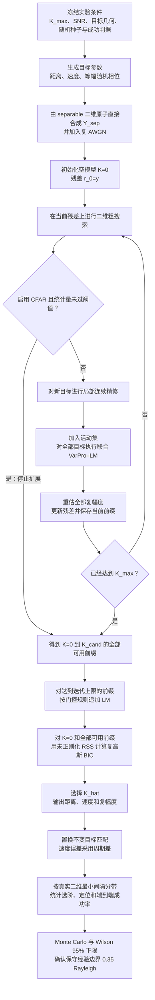

# 二维 NOMP 联合精修：目标构造、观测矩阵与数学推导

## 0. 文档定位与主线边界

> **本文只展开正式 separable 主线。** physical-LFM 只在本节用于说明两条路线的区别；相关观测链路、原子、数值导数、初始化和先导实验已集中迁移至[《20.5.2D_NOMP physical-LFM 扩展》](./20.5.2D_NOMP_physical-LFM扩展.md)，后文不再穿插讨论。

| 路线 | 观测与原子 | 当前证据定位 |
| --- | --- | --- |
| **本文正式主线** | 直接构造 $y_{\mathrm{sep}}=A_{\mathrm{sep}}(\boldsymbol\theta)\boldsymbol\beta+w$，其中 $A_{\mathrm{sep}}$ 的列为 $a_D(v_k)\otimes a_R(R_k)$ | 支撑二维 NOMP、VarPro–LM、unknown-$K$ BIC/CFAR、迭代上限门控及第 8 节全部正式 Monte Carlo 结论 |
| **physical-LFM 扩展** | 从完整 LFM 回波和脉冲压缩得到距离–慢时间观测，并用匹配原子或 separable 原子解释 | 独立研究分支；不能直接继承本文的正式边界 |

正式主线中的二维观测为

\[
Y_{\mathrm{sep}}
=\operatorname{reshape}\!\left(
A_{\mathrm{sep}}(\boldsymbol\theta)\boldsymbol\beta+w,
N_R,N_p
\right),
\qquad
w\sim\mathcal{CN}(0,\sigma^2I_M).
\]

第 8 节的正式边界只由上述 $Y_{\mathrm{sep}}$ 观测支撑。两条路线具有相同的距离–慢时间矩阵外形，但生成机制、原子可分离性、噪声口径和证据等级不同，不能共用同一条实验边界。除本节外，本文的公式、算法步骤和结果均默认指精确 separable 合成观测。

本文把项目中“二维 NOMP + 联合 VarPro–LM 精修”的数学链路写成一个可以独立阅读的推导。重点是：

1. 如何构造距离–速度二维目标；
2. 正式主线如何在距离–慢时间矩阵层构造模型匹配观测；
3. 二维原子、向量化和 Kronecker 字典之间的关系；
4. NOMP 的二维粗搜索、局部精修、活动集联合精修、幅度回代和残差递推；
5. 二维联合精修与一维 NOMP 在参数维数、Jacobian、相干性、复杂度和评价方式上的区别；
6. 复高斯似然、未知 $K$ 的 BIC、二维 CFAR 与迭代上限门控；
7. 置换不变定位误差、二维最小间隔、FIM/CRB 与 Wilson 成功边界；
8. 已完成正式实验如何验证上述数学链路。

除非特别说明，本文采用正式主线的准静态、可分离模型：

- 一个 CPI 内目标距离近似不随脉冲变化；
- 目标的复幅度在 CPI 内保持不变；
- 速度用“接近雷达为正”的符号约定；
- 输入是直接在距离–慢时间矩阵层合成的 $Y_{\mathrm{sep}}$；
- 估计器默认使用 AtomMode='separable'。

本文的正式数学主线不是“把距离–多普勒 FFT 图上的峰逐个拟合”，而是在 $Y_{\mathrm{sep}}$ 上直接拟合连续的 $(R,v)$。因此，本文可以作为当前 `separable` 二维 NOMP 主线的数学总览；候选簇、Top-$L$ 多起点等后续选择审计属于求解器外围机制，不改变这里的基本观测模型和 VarPro–LM 主式。

### 0.1 当前雷达、波形与采样配置

> **配置来源与口径：** 下列数值由当前 `src/core/generate_domp_scene.m`、`src/core/build_range_doppler_model.m` 和正式启动脚本 `experiments/range_doppler/run_2d_nomp_unknown_k_k3_random_geometry_gap_boundary_mc500.m` 共同确定。正式 Monte Carlo 在距离–慢时间层直接合成 $Y_{\mathrm{sep}}$；雷达参数通过距离 PSF、慢时间 Doppler 原子、无模糊区间和 Rayleigh 标尺进入本文的正式模型。

| 项目 | 符号或代码量 | 当前配置 |
| --- | --- | --- |
| 雷达体制与速度符号 | — | X 波段单站脉冲多普勒；代码采用双程时延和双程 Doppler，径向速度以“接近雷达为正” |
| 载频与波长 | $f_0,\lambda=c/f_0$ | $f_0=10\ \mathrm{GHz}$，$\lambda=0.03\ \mathrm m$ |
| 发射波形 | $T_p,B,\mu=B/T_p$ | LFM，$T_p=10\ \mu\mathrm s$，$B=10\ \mathrm{MHz}$，$\mu=10^{12}\ \mathrm{Hz/s}$，时宽带宽积 $BT_p=100$ |
| 快时间采样 | $F_s,N,T_s$ | $F_s=10\ \mathrm{MHz}$，每脉冲 $N=1000$ 点，$T_s=0.1\ \mu\mathrm s$，记录长度 $N/F_s=100\ \mu\mathrm s$ |
| 脉冲重复参数 | $T_r,\mathrm{PRF}$ | PRI/PRT $T_r=100\ \mu\mathrm s$，$\mathrm{PRF}=10\ \mathrm{kHz}$ |
| CPI 脉冲数与名义时长 | $N_p,N_pT_r$ | $N_p=64$，名义相干处理时长 $6.4\ \mathrm{ms}$；慢时间样点为 $0{:}63\,T_r$，首末脉冲相隔 $6.3\ \mathrm{ms}$ |
| 距离标尺 | $\Delta R_{\mathrm{res}},R_{\mathrm{ua}}$ | 项目采用 $\Delta R_{\mathrm{res}}=c/(2B)=15\ \mathrm m$ 作为 Rayleigh 归一化标尺；名义无模糊距离 $R_{\mathrm{ua}}=cT_r/2=15\ \mathrm{km}$ |
| 速度标尺与周期 | $\Delta v_{\mathrm{res}},v_{\mathrm{ua}},P_v$ | $\Delta v_{\mathrm{res}}=\lambda/(2N_pT_r)=2.34375\ \mathrm{m/s}$，$v_{\mathrm{ua}}=\lambda/(4T_r)=75\ \mathrm{m/s}$，主区间 $[-75,75)\ \mathrm{m/s}$，周期 $P_v=150\ \mathrm{m/s}$ |
| 正式字典的加窗口径 | $w_R,w_D$ | 距离 PSF 使用频域 Hamming 窗；正式 separable 慢时间原子使用矩形窗 $w_D[m]=1$。场景生成器中的慢时间 Hamming 窗只用于距离–Doppler FFT 显示，不进入正式 $Y_{\mathrm{sep}}$ 估计原子 |

“X 波段”指通常约 $8$–$12\ \mathrm{GHz}$ 的微波频段，本项目的 $10\ \mathrm{GHz}$ 载频位于其中；“单站”表示发射和接收共用同一站点，因而时延和 Doppler 都是双程关系；“脉冲多普勒”表示通过多个相干脉冲的慢时间相位变化估计径向速度。

这里的 $15\ \mathrm m$ 和 $2.34375\ \mathrm{m/s}$ 是当前代码用于几何生成、误差判定和边界报告的 Rayleigh 标尺，不是过采样网格步长。距离维 Hamming 窗会改变实际 PSF 主瓣形状，因此 $15\ \mathrm m$ 应理解为项目冻结的名义归一化分辨率，而不是另行测得的半功率主瓣宽度。

### 0.2 正式五带边界的观测与搜索配置

| 项目 | 正式冻结值 |
| --- | --- |
| 正式观测 | 精确 separable $Y_{\mathrm{sep}}$ 加复 AWGN；距离 ROI 含 $N_R=23$ 个粗采样，故 $Y_{\mathrm{sep}}\in\mathbb C^{23\times64}$，向量化后 $M=1472$ |
| 距离 ROI | 模型 ROI 以 $3000\ \mathrm m$ 为中心、半宽 $180\ \mathrm m$；由于端点采用严格不等号，实际粗距离轴为 $2835{:}15{:}3165\ \mathrm m$ |
| 粗搜索网格 | `RangeOversample=4`，距离细网格 92 点、步长约 $3.62637\ \mathrm m$；`VelocityOversample=8`，估计范围 $[-30,30)\ \mathrm{m/s}$，实际速度网格为 $-29.8828125{:}0.29296875{:}29.8828125\ \mathrm{m/s}$，共 205 点 |
| 目标、噪声与候选阶数 | 真实 $K=3$，$K_{\max}=5$，等幅、独立均匀随机相位；$20\ \mathrm{dB}$ `fixed_per_target` |
| 随机几何 | `CenterSamplingMode='safe_roi_uniform'`；距离/速度归一化半跨度分别为 $0.90/0.55$ Rayleigh；五带为 $[0.20,0.25)$、$[0.25,0.30)$、$[0.30,0.35)$、$[0.35,0.40)$、$[0.40,+\infty)$ |
| 统计协议 | 每带 500 个独立场景，共 2500 个场景；完整前缀 BIC 为主模式，CFAR+BIC 为同观测配对次模式，共 5000 行求解结果；双侧 Wilson 95% 下限需不低于 95%；正式种子为 3141593，带间步长为 100000 |

`safe_roi_uniform` 会直接在安全 ROI 内随机抽取每个 trial 的场景中心。因此，正式启动脚本中保留的 `CenterVelocityMps=12` 在该分支下只是名义/兼容参数，并不表示所有正式场景都固定在 $12\ \mathrm{m/s}$；$3000\ \mathrm m$ 则用于固定距离模型 ROI 的中心。

### 0.3 正式主线总流程

下图给出从冻结实验条件到 unknown-$K$ 选阶和二维边界统计的完整流程，后续公式均可对应到其中一个步骤。



固定 $K$ 实验在已知阶数处停止前缀扩展并直接输出对应活动集；unknown-$K$ 正式实验则保留 $K=0$ 和全部可用前缀，经门控复核后再使用 BIC 选择 $\widehat K$。

### 0.4 公式来源与审计口径

本文的公式按“建模假设→数学恒等式或统计分布→当前代码”的顺序得到，不是根据实验结果反向拟合公式。主要来源如下：

| 公式组 | 直接来源 | 本文位置 |
| --- | --- | --- |
| 距离/速度 Rayleigh 标尺与速度周期 | 带宽所给时延分辨尺度、慢时间 DFT 频率间隔以及离散相位的 $2\pi$ 周期性 | 第 1 节、第 4.2 节 |
| 二维外积原子、Kronecker 原子与矩阵化相关 | 准静态条件下的可分离响应、$\operatorname{vec}(ab^{\mathsf T})=b\otimes a$ 以及 Frobenius 内积恒等式 | 第 3–4 节 |
| 粗搜索分数 | 单个复幅度线性最小二乘的精确 RSS 下降量 | 第 5.1.1 节 |
| Ridge、VarPro、投影 Jacobian 与 LM | Tikhonov 增广最小二乘、线性幅度消元、增广列空间投影和实参数复残差的 Gauss–Newton 展开；当前 Jacobian 明确是 Kaufman 近似 | 第 5.4–5.6 节 |
| BIC 与 CFAR | 正则复高斯似然的极大化，以及固定原子白噪声相关分数的指数尾分布 | 第 5.8–5.9 节 |
| 投影 FIM/CRB 与 Wilson 边界 | 消去 nuisance 复幅度后的复高斯 Fisher 信息，以及二项成功计数的 Wilson 置信区间 | 第 6.4 节、第 7.4 节 |

因此，原子、粗搜、Ridge/VarPro、LM、BIC、CFAR 和 FIM/CRB 的主式在后文都有局部推导或明确的成立条件。第 8 节的 $0.35$ Rayleigh 则不是从上述公式解出的理论常数，而是冻结算法、生成分布和统计判据下的 Monte Carlo 经验边界。

## 1. 符号、坐标和基本假设

> **本阶段代码对照：** 用 `src/core/build_range_doppler_model.m` 核对距离轴、慢时间轴、波长、PRI 和 Rayleigh 标尺；用正式入口 `experiments/range_doppler/run_2d_nomp_unknown_k_k3_random_geometry_gap_boundary_mc500.m` 核对 SNR 口径、搜索范围及冻结参数。符号表是对这些代码量的数学命名，并不引入第二套独立配置。

| 符号 | 含义 | 单位或维度 |
|---|---|---|
| $c$ | 光速 | $\mathrm{m/s}$ |
| $\lambda$ | 载波波长 | $\mathrm m$ |
| $T_r$ | 脉冲重复间隔 PRI | $\mathrm s$ |
| $N_R$ | 距离 ROI 中的采样数 | — |
| $N_p$ | CPI 内脉冲数 | — |
| $M=N_RN_p$ | 向量化后的复观测样本数 | — |
| $B$ | 发射信号的等效带宽 | $\mathrm{Hz}$ |
| $K$ | 真实目标数或固定模型阶数 | — |
| $R_k$ | 第 $k$ 个目标距离 | $\mathrm m$ |
| $v_k$ | 第 $k$ 个目标径向速度 | $\mathrm{m/s}$ |
| $\beta_k$ | 第 $k$ 个目标复幅度 | 复数 |
| $\varphi_k$ | 第 $k$ 个目标初始相位 | $\mathrm{rad}$ |
| $\sigma^2$ | 每个复样本的白噪声功率 | 观测功率单位 |
| $\Delta R_{\mathrm{res}}$ | 名义距离 Rayleigh 分辨率 | $\mathrm m$ |
| $\Delta v_{\mathrm{res}}$ | 名义速度 Rayleigh 分辨率 | $\mathrm{m/s}$ |
| $A(\boldsymbol\theta)$ | 当前活动集二维原子矩阵 | $M\times K$ |
| $r$ | 向量化残差 $y-A\widehat{\boldsymbol\beta}$ | $M\times1$ |

其中 $c$、$\lambda$ 和 $T_r$ 是已知配置常数，只参与距离、Doppler 和尺度换算，不是当前估计器的未知量。因此 LM 外层只更新 $\boldsymbol\theta=[R_1,v_1,\ldots,R_K,v_K]^{\mathsf T}$，不会把 $c$、$\lambda$ 或 $T_r$ 放进优化变量；复幅度 $\boldsymbol\beta$ 则由 VarPro 的线性内层重新求解。

第 $k$ 个目标参数写为

\[
\theta_k=
\begin{bmatrix}
R_k\\
v_k
\end{bmatrix},\qquad
\beta_k=\rho_k e^{\mathrm j\varphi_k},\quad \rho_k\ge 0.
\]

整个场景的连续参数向量采用交错排列：

\[
\boldsymbol\theta=
[R_1,v_1,R_2,v_2,\ldots,R_K,v_K]^{\mathsf T}
\in\mathbb R^{2K}.
\]

在理想均匀采样和矩形窗条件下，常用的 Rayleigh 分辨率为

\[
\Delta R_{\mathrm{res}}=\frac{c}{2B},\qquad
\Delta v_{\mathrm{res}}=\frac{\lambda}{2N_pT_r}.
\]

其中，距离式来自时延分辨尺度 $1/B$ 与单站双程关系 $R=c\tau/2$；速度式则由慢时间频率间隔 $1/(N_pT_r)$ 代入 $f_D=2v/\lambda$ 得到。

实际实验中如果采用距离窗或慢时间窗，主瓣宽度会发生变化。因此 $\Delta R_{\mathrm{res}}$ 和 $\Delta v_{\mathrm{res}}$ 应以项目中实际字典或预先标定的 Rayleigh 基准为准；过采样网格步长不能代替物理分辨率。

令 $M=N_RN_p$，并把噪声矩阵按列向量化为 $w=\operatorname{vec}(W)$。当前白噪声模型应准确写为

\[
w\sim\mathcal{CN}(0,\sigma^2 I_M),
\]

即每个复样本满足 $w_n\sim\mathcal{CN}(0,\sigma^2)$，其实部和虚部方差均为 $\sigma^2/2$。给定干净观测 $y_{\mathrm{clean}}$ 时，若采用“总场景 SNR”，则

\[
\operatorname{SNR}_{\mathrm{scene}}
=10\log_{10}
\frac{\|y_{\mathrm{clean}}\|_2^2/M}{\sigma^2}.
\]

当前随机几何正式边界实验采用 `fixed_per_target`：单目标复幅度的模固定为 1，并按当前生成原子的实际列能量计算单目标参考功率

\[
P_{\mathrm{atom}}
=\frac{\|\phi_{\mathrm{sep}}(R,v)\|_2^2}{M}
\approx\frac{1}{M}
\]

设置噪声方差。近似等号来自当前 $\phi_{\mathrm{sep}}$ 的列二范数数值归一；代码本身使用 `mean(abs(reference_atom).^2)`，因而不需要假设浮点计算下的列范数严格等于 1。噪声直接在精确 separable 合成观测层加入：

\[
\sigma^2
=\frac{P_{\mathrm{atom}}}{10^{\operatorname{SNR}_{\mathrm{dB}}/10}}.
\]

因此多目标相干叠加后的实际总场景功率会随相位和几何变化，不能把 `fixed_per_target` 的 20 dB 直接解释为每个场景都具有完全相同的总观测 SNR。本文第 8 节的 20 dB 明确指 $Y_{\mathrm{sep}}$ 层的单目标参考 SNR。

## 2. 二维目标的构造

> **本阶段代码对照：** 一般规则几何可对照 `src/core/generate_domp_scene.m` 的目标参数接口；正式无固定排列随机几何应直接看 `demos/demo_2d_unknown_k_random_k_random_geometry.m` 的目标生成、`safe_roi_uniform` 中心采样和最小二维间隔计算。五带边界实验的具体范围与种子由 `experiments/range_doppler/run_2d_nomp_unknown_k_k3_random_geometry_gap_boundary_mc500.m` 冻结。

### 2.1 一般 $K$ 目标构造

先给定场景中心 $(R_c,v_c)$，再给定每个目标相对于中心的偏移：

\[
R_k=R_c+\delta R_k,\qquad
v_k=v_c+\delta v_k,\qquad k=1,\ldots,K.
\]

复幅度可以写成

\[
\beta_k=\rho_k e^{\mathrm j\varphi_k}.
\]

等幅随机相位实验对应

\[
\rho_k=\rho,\qquad
\varphi_k\overset{\mathrm{i.i.d.}}{\sim}\mathcal U[0,2\pi).
\]

若需要控制强弱目标，则只改变 $\rho_k/\rho_1$，不要同时改变目标间距和噪声定义，否则无法判断成功率下降究竟来自相干性还是幅度差。

### 2.2 由归一化间隔生成规则几何

定义中心对称索引

\[
q_k=k-\frac{K+1}{2}.
\]

若所有相邻目标的距离间隔和速度间隔分别为

\[
\Delta R=\eta_R\Delta R_{\mathrm{res}},\qquad
\Delta v=\eta_v\Delta v_{\mathrm{res}},
\]

则规则对角线目标可以写成

\[
R_k=R_c+q_k\Delta R,\qquad
v_k=v_c+q_k\Delta v.
\]

这里 $\eta_R$ 和 $\eta_v$ 是无量纲的 Rayleigh 归一化间隔。它们小于 1 时，对应维度进入名义分辨率以内；是否能够成功恢复，仍必须由多次噪声试验和定位误差共同判定。

对于 $K=3$，$q_k=(-1,0,1)$，因此

\[
\begin{aligned}
(R_1,v_1)&=(R_c-\Delta R,\;v_c-\Delta v),\\
(R_2,v_2)&=(R_c,\;v_c),\\
(R_3,v_3)&=(R_c+\Delta R,\;v_c+\Delta v).
\end{aligned}
\]

三种常用的固定 $K=3$ 几何为：

1. **距离轴几何**

   \[
   R_k=R_c+q_k\eta_R\Delta R_{\mathrm{res}},\qquad v_k=v_c.
   \]

   三个目标共享速度，只在距离轴排列。它主要检验距离 PSF 近邻造成的高相干。

2. **速度轴几何**

   \[
   R_k=R_c,\qquad v_k=v_c+q_k\eta_v\Delta v_{\mathrm{res}}.
   \]

   三个目标共享距离，只在慢时间相位斜率上分开。它主要检验速度维连续精修和速度相位累积。

3. **联合对角线几何**

   \[
   R_k=R_c+q_k\eta_R\Delta R_{\mathrm{res}},\qquad
   v_k=v_c+q_k\eta_v\Delta v_{\mathrm{res}}.
   \]

   两个维度同时变化。某一维的相干性可以由另一维的差异部分抵消，因此它通常不能用“只看距离”或“只看速度”的一维结论代替。

对非均匀间隔、L 型排列、近目标加远目标等几何，只需把 $(\delta R_k,\delta v_k)$ 从规则的 $q_k\Delta$ 改为指定的二维点集；后续观测模型和 NOMP 流程不变。

### 2.3 目标生成时必须固定的事项

正式 Monte Carlo 试验在每个条件下至少应固定：

- $K$ 是真实目标数还是算法已知阶数；
- $R_c,v_c$ 以及目标是否靠近边界；
- $\eta_R,\eta_v$ 如何转换成物理间隔；
- 幅度比 $\rho_k/\rho_1$；
- 相位是固定、随机还是分层随机；
- 噪声是否在每次 trial 重新生成；
- 目标参数是否在粗网格上，还是专门加入 off-grid 偏移；
- 目标排序只用于记录，成功判定时应允许目标置换匹配。

### 2.4 无固定排列的随机目标簇

第 8 节的正式随机几何不是把某一个目标固定在 $(R_c,v_c)$，再单独移动其余目标。它先在安全 ROI 内随机抽取一个**簇参考中心** $(R_c,v_c)$，再对 $K\ge2$ 个目标联合生成无量纲偏移 $u_k\in[-1,1]^2$，并按坐标分量重心化包围盒：

\[
f_k=u_k-
\frac{\min_j u_j+\max_j u_j}{2}.
\]

随后生成

\[
R_k=R_c+f_{k,R}\,\eta_{R,\mathrm{span}}\Delta R_{\mathrm{res}},
\qquad
v_k=v_c+f_{k,v}\,\eta_{v,\mathrm{span}}\Delta v_{\mathrm{res}}.
\]

只有当所有目标均位于安全 ROI 内，且由三对 $(R_i,v_i)$ 计算的最小二维间隔 $d_{\min}$ 落入预先冻结的 band 时才接受该 trial。$K=1$ 时唯一目标位于参考中心；$K\ge2$ 时没有任何目标被强制固定在参考中心。这个构造用于随机局部簇，而不是“已知中心目标加周边目标”的受控模型。

---

## 3. 正式主线的观测矩阵

> **本阶段代码对照：** 正式观测不是从显示用距离–Doppler 图反推，而是在 `demos/demo_2d_unknown_k_random_k_random_geometry.m` 或边界 demo 中调用 `src/core/build_range_doppler_atoms.m` 后，以原子矩阵、复幅度和复 AWGN 直接合成。阅读时同时核对 `src/core/build_range_doppler_model.m` 给出的矩阵尺寸，并用 `tests/test_range_doppler_core.m` 检查向量化/矩阵化约定。

本文的估计输入固定为距离–慢时间复数矩阵 $Y_{\mathrm{sep}}\in\mathbb C^{N_R\times N_p}$。矩阵行对应距离 ROI 采样，列对应 CPI 内脉冲；这一约定与 MATLAB 的列主序向量化、二维原子和后续 VarPro–LM 完全一致。

### 3.1 精确 separable 合成的距离–慢时间矩阵

在一个 CPI 内距离走动和加速度可忽略时，单目标的距离 PSF 与慢时间 Doppler 相位近似可分离。参考二维 delay–Doppler NOMP 的可分离建模思路，本项目将距离维具体化为连续 LFM-PSF 响应 $a_R(R)$，将速度维具体化为慢时间 Doppler 复指数 $a_D(v)$。因此，后文的外积/Kronecker 结构不是任意拼接两个一维字典，而是上述准静态假设和按列向量化共同推出的。

正式主线在相同的矩阵尺寸、ROI、距离 PSF 和慢时间采样约定下，直接构造

\[
Y_{\mathrm{sep}}
=\sum_{k=1}^{K}
\beta_k a_R(R_k)a_D(v_k)^{\mathsf T}+W,
\qquad
W(:)\sim\mathcal{CN}(0,\sigma^2I_M).
\]

因此观测模型与估计器使用同一组可分离原子，后文 $\phi(R,v)=a_D(v)\otimes a_R(R)$ 与正式合成观测严格对应。正式五带边界和 $K_{\mathrm{true}}=0{:}3$ 的端到端结果均属于这一观测层。

### 3.2 距离–多普勒 FFT 复数图仅作为对照层

若对 $Y_{\mathrm{sep}}$ 的慢时间维做 FFT，则

\[
D[\ell,q]
=\sum_{m=0}^{N_p-1}
w_D[m]\,Y_{\mathrm{sep}}[\ell,m]\,
e^{-\mathrm j2\pi qm/N_p}.
\]

它适合：

- RDM 可视化；
- 传统 FFT 峰值检测；
- 观察 Doppler 泄漏和旁瓣；
- 构造传统 CFAR 的显示或对比基线。

但需要注意：

1. 若只保存 $|D|$ 或功率图，复数相位已经丢失，不能直接作为当前复数 LS/VarPro 模型的观测；
2. FFT 频点会引入速度栅格量化和 off-grid 泄漏；
3. 慢时间窗会改变噪声相关性和原子形状；
4. 若在 FFT 后继续做连续精修，必须把 FFT 归一化、窗函数和边界条件写进原子模型。

因此，距离–多普勒图适合显示、FFT 峰值检测或传统 CFAR 对比，不作为本文连续复数 LS/VarPro–LM 的估计输入。

### 3.3 观测选择结论

本文后续只使用 $Y_{\mathrm{sep}}$ 作为二维 NOMP 输入，使用 $a_R(R)a_D(v)^{\mathsf T}$ 解释每个目标，并通过 $Y_{\mathrm{sep}}(:)$ 与 Kronecker 原子建立严格对应。距离–多普勒 FFT 图只承担显示或对照职责，不参与本文正式连续精修和边界统计。

---

## 4. 二维目标观测矩阵和原子的构造

> **本阶段代码对照：** 距离维公式对应 `src/core/build_psf_dictionary.m`，速度维复指数对应 `src/core/build_doppler_dictionary.m`，Kronecker 列与列归一化对应 `src/core/build_range_doppler_atoms.m`。建议打开 `tests/test_range_doppler_core.m` 对照每个函数的输入轴、输出尺寸和归一化，而不要仅凭公式猜测共轭、转置或 `vec` 顺序。

### 4.1 距离原子

距离压缩后，一个连续距离 $R$ 对应一个距离 PSF 向量

\[
a_R(R)\in\mathbb C^{N_R}.
\]

它由发射波形、匹配滤波器、距离采样轴和 ROI 共同决定。项目中 build_psf_dictionary 以连续距离为输入，并将每个距离列归一化。这里的 $R$ 是物理距离，不是“第几个过采样网格点”。

### 4.2 慢时间速度原子

设慢时间 $t_m=mT_r$，$m=0,\ldots,N_p-1$。在“接近为正”的约定下

\[
f_D(v)=\frac{2v}{\lambda}.
\]

不考虑慢时间窗时：

\[
\widetilde a_D(v)[m]
=\exp\!\left(
\mathrm j2\pi f_D(v)t_m
\right)
=\exp\!\left(
\mathrm j\frac{4\pi v}{\lambda}mT_r
\right).
\]

加入慢时间窗 $w_D[m]$ 并做二范数归一化：

\[
a_D(v)
=\frac{
\left[
w_D[m]\exp\!\left(
\mathrm j\frac{4\pi v}{\lambda}mT_r
\right)
\right]_{m=0}^{N_p-1}
}{
\left\|
\left[
w_D[m]\exp\!\left(
\mathrm j\frac{4\pi v}{\lambda}mT_r
\right)
\right]_{m=0}^{N_p-1}
\right\|_2
}.
\]

速度无模糊区间由

\[
|v|<v_{\mathrm{ua}},\qquad
v_{\mathrm{ua}}=\frac{\lambda}{4T_r}
\]

给出。这一边界可以直接从离散慢时间相位得到：若速度增加 $P_v$，要使每个脉冲的相位只多一个整数周期，需要

\[
\frac{4\pi P_v}{\lambda}mT_r=2\pi m,
\qquad
P_v=\frac{\lambda}{2T_r}=2v_{\mathrm{ua}}.
\]

因而 $a_D(v+P_v)=a_D(v)$，连续速度参数只能在一个长度为 $P_v$ 的主区间内唯一表示。代码选择 $[-v_{\mathrm{ua}},v_{\mathrm{ua}})$ 这个半开区间，以避免两个周期端点重复。

### 4.3 单目标二维矩阵原子

可分离模型中，单目标二维矩阵原子为

\[
\Psi(R,v)=a_R(R)a_D(v)^{\mathsf T}
\in\mathbb C^{N_R\times N_p}.
\]

这里是普通转置 ${}^{\mathsf T}$，不是共轭转置。原因是矩阵第 $m$ 列应该携带 $a_D(v)[m]$ 的相位，而不是其共轭。

对于 $K$ 个目标，干净观测矩阵为

\[
Y_{\mathrm{clean}}
=\sum_{k=1}^{K}
\beta_k\Psi(R_k,v_k),
\]

加噪后得到

\[
Y_{\mathrm{obs}}
=Y_{\mathrm{clean}}+W.
\]

这说明二维观测不是把三个目标矩阵横向拼接，而是三个二维原子的复幅度线性叠加。

### 4.4 向量化和 Kronecker 形式

MATLAB 使用按列向量化：

\[
y=\operatorname{vec}(Y_{\mathrm{obs}})
=Y_{\mathrm{obs}}(:)
\in\mathbb C^{N_RN_p}.
\]

由

\[
\operatorname{vec}(ab^{\mathsf T})=b\otimes a
\]

可得二维向量原子

\[
\phi(R,v)
=\operatorname{vec}(\Psi(R,v))
=a_D(v)\otimes a_R(R).
\]

定义活动集原子矩阵

\[
A(\boldsymbol\theta)
=
\begin{bmatrix}
\phi(R_1,v_1)&\cdots&\phi(R_K,v_K)
\end{bmatrix}
\in\mathbb C^{N_RN_p\times K},
\]

则多目标观测模型为

\[
y=A(\boldsymbol\theta)\boldsymbol\beta+w.
\]

若距离网格字典和速度网格字典分别为

\[
A_R=
\begin{bmatrix}
a_R(R_1^g)&\cdots&a_R(R_{G_R}^g)
\end{bmatrix},
\]

\[
A_D=
\begin{bmatrix}
a_D(v_1^g)&\cdots&a_D(v_{G_v}^g)
\end{bmatrix},
\]

完整的有限二维 Kronecker 字典为

\[
D=A_D\otimes A_R
\in\mathbb C^{N_RN_p\times G_RG_v}.
\]

它包含所有距离–速度网格组合，但当前实现不显式分配这个大矩阵。

### 4.5 矩阵化二维相关：在既有残差上进行原子匹配

> **本阶段代码对照：** 公式的直接实现是 `src/algorithms/coarse_range_doppler_search.m`；它接收当前残差向量/矩阵和两个一维字典，计算全部距离–速度网格的相关分数并返回峰值索引。上层调用位置在 `src/algorithms/nomp_range_doppler_refinement.m`，递推使用方式由 `tests/test_range_doppler_sequential_detection.m` 验证。这里的相关式是在既有残差上匹配候选原子，不是重新“构造残差”。

首先要区分“残差构造”和“残差相关”。当前残差矩阵 $E\in\mathbb C^{N_R\times N_p}$ 已由观测减去现有活动集的重构结果得到；第一次检测时活动集为空，所以 $E=Y_{\mathrm{obs}}$，后续轮次的具体递推见第 5.1 节。本节中的

\[
\phi_{ij}^{\mathsf H}\operatorname{vec}(E)
\]

**不是在构造残差**，而是在计算候选二维原子 $\phi_{ij}$ 与既有残差向量之间的复内积，即该候选对当前残差的匹配相关值。

对距离–速度网格点 $(R_i^g,v_j^g)$，记

\[
r_i=a_R(R_i^g)\in\mathbb C^{N_R},
\qquad
d_j=a_D(v_j^g)\in\mathbb C^{N_p}.
\]

对应的矩阵原子和向量原子分别为

\[
\Psi_{ij}=r_i d_j^{\mathsf T}
\in\mathbb C^{N_R\times N_p},
\qquad
\phi_{ij}=\operatorname{vec}(\Psi_{ij})
=d_j\otimes r_i
\in\mathbb C^{N_RN_p}.
\]

因此

\[
\underbrace{\phi_{ij}^{\mathsf H}}_{1\times N_RN_p}
\underbrace{\operatorname{vec}(E)}_{N_RN_p\times1}
\]

得到的是一个复数标量。利用向量内积与 Frobenius 内积的等价关系，有

\[
\begin{aligned}
q_{ij}
&=\phi_{ij}^{\mathsf H}\operatorname{vec}(E)\\
&=\operatorname{vec}(r_i d_j^{\mathsf T})^{\mathsf H}
  \operatorname{vec}(E)\\
&=\left\langle r_i d_j^{\mathsf T},E\right\rangle_F\\
&=r_i^{\mathsf H}E\,\overline{d_j}.
\end{aligned}
\]

逐元素展开为

\[
q_{ij}
=\sum_{n=1}^{N_R}\sum_{m=1}^{N_p}
\overline{r_i[n]d_j[m]}
\,E[n,m].
\]

这相当于拿候选距离–速度响应作为一个二维复数模板，与残差矩阵逐点匹配后相干求和。若候选距离正确，$r_i^{\mathsf H}E$ 会使距离响应对齐；若候选速度也正确，再乘 $\overline{d_j}$ 会使各脉冲的慢时间相位同相累加，因而 $|q_{ij}|$ 较大。距离或速度不匹配时，包络或相位不能同时对齐，求和会发生抵消。

这里右侧出现 $\overline{d_j}$，是因为本文将矩阵原子定义为非共轭外积 $r_i d_j^{\mathsf T}$，而不是 $r_i d_j^{\mathsf H}$；该约定与代码中的 `range_atom * doppler_atom.'` 一致。

若逐个遍历全部 $(i,j)$，就要分别计算每一个 $q_{ij}$。利用可分离结构，可以把所有候选一次写成

\[
C=A_R^{\mathsf H}E\,\overline{A_D}
\in\mathbb C^{G_R\times G_v},
\]

并且

\[
C_{ij}=q_{ij}
=\phi_{ij}^{\mathsf H}\operatorname{vec}(E).
\]

其维度对应为

\[
\underbrace{A_R^{\mathsf H}}_{G_R\times N_R}
\underbrace{E}_{N_R\times N_p}
\underbrace{\overline{A_D}}_{N_p\times G_v}
=
\underbrace{C}_{G_R\times G_v}.
\]

也可以把这一计算理解为两级匹配：

\[
B=A_R^{\mathsf H}E
\in\mathbb C^{G_R\times N_p}
\]

先在每个脉冲上同时匹配全部距离候选，再计算

\[
C=B\,\overline{A_D}
\]

沿慢时间同时匹配全部速度候选。完整 Kronecker 字典与矩阵化结果严格满足

\[
D^{\mathsf H}\operatorname{vec}(E)
=\operatorname{vec}(C),
\qquad
D=A_D\otimes A_R.
\]

因此矩阵化相关并没有改变粗搜索目标，只是避免显式存储完整字典。对未归一化原子，粗搜索使用

\[
S_{ij}
=\frac{|C_{ij}|^2}
{\|r_i\|_2^2\|d_j\|_2^2};
\]

当前距离和速度字典列均已归一化时，$S_{ij}=|C_{ij}|^2$。随后在排除已有目标邻域后寻找最大的 $S_{ij}$，得到新目标的粗距离和粗速度；这只是 NOMP 的粗检测/初始化步骤，后面仍需进行连续局部精修和全活动集联合精修。

---

## 5. 二维 NOMP 的数学流程

> **本阶段代码对照：** 本节应沿真实调用链阅读：`nomp_range_doppler_refinement.m` 负责编排粗搜、CFAR 停止、加目标、联合精修和残差递推，`coarse_range_doppler_search.m` 负责网格检测，`compute_2d_cfar_threshold.m` 负责阈值换算，`joint_varpro_range_doppler_refinement.m` 负责连续参数的 VarPro–LM，`solve_ridge_least_squares.m` 负责线性幅度回代。`nomp_range_doppler_unknown_k.m` 在外层传入 CFAR 配置、保存可用前缀、执行迭代上限门控并完成 BIC 选阶。

> **适用范围。** 本节至第 7 节只推导 $Y_{\mathrm{sep}}$ 与 $A_{\mathrm{sep}}$ 的精确可分离主线。

NOMP 可以概括为：

> 在当前残差上用二维粗网格找“新目标大致在哪”，再用连续参数精修消除网格失配；每加入一个目标后，对当前活动集进行联合精修并重新计算残差。

固定 $K$ 的主流程为：

~~~text
二维复数观测 Y
        ↓
初始化残差 E0 = Y，活动集为空
        ↓
对 m = 1,...,K：
    对当前残差做二维相关
        ↓
    排除已有目标邻域并取得最大候选
        ↓
    对新候选做局部二维 VarPro–LM
        ↓
    加入活动集
        ↓
    对全部 m 个目标做联合 VarPro–LM
        ↓
    回代复幅度，更新残差 Em
        ↓
达到固定 K，或由 CFAR/BIC/其他规则停止
~~~

### 5.1 二维残差粗搜索

初始残差为

\[
E_0=Y_{\mathrm{obs}}.
\]

第 $m$ 轮已有 $m-1$ 个目标时，令

\[
E_{m-1}
=Y_{\mathrm{obs}}
-\operatorname{reshape}\!\left(
A_{m-1}\widehat{\boldsymbol\beta}_{m-1},
N_R,N_p
\right).
\]

在网格点 $(R_i^g,v_j^g)$ 上计算

\[
C_{ij}
=
\left\langle
\Psi(R_i^g,v_j^g),E_{m-1}
\right\rangle_F.
\]

更一般地，对未归一化原子使用能量归一化分数

\[
S_{ij}
=
\frac{|C_{ij}|^2}{
\|a_R(R_i^g)\|_2^2
\|a_D(v_j^g)\|_2^2
}.
\]

当前项目的距离列和速度列通常已归一化，因此分数主要由 $|C_{ij}|^2$ 决定。排除已选目标附近的候选后，取

\[
(\widehat R_{\mathrm{grid}},
\widehat v_{\mathrm{grid}})
=\arg\max_{(i,j)\notin\mathcal E_{m-1}}S_{ij}.
\]

其中 $\mathcal E_{m-1}$ 是已有支撑点和连续参数邻域的排除集合。排除邻域的作用是避免同一个真实目标在相邻网格点上被重复检测。

#### 5.1.1 为什么粗搜索分数等于最优 RSS 下降

把当前矩阵残差向量化为 $r=\operatorname{vec}(E_{m-1})$，考察某个候选原子 $\phi$。若只允许加入这一个原子，其最优复幅度来自

\[
\widehat\alpha
=\arg\min_{\alpha\in\mathbb C}
\|r-\alpha\phi\|_2^2
=\frac{\phi^{\mathsf H}r}{\phi^{\mathsf H}\phi}.
\]

将 $\widehat\alpha$ 代回可得

\[
\begin{aligned}
\min_\alpha\|r-\alpha\phi\|_2^2
&=\|r\|_2^2-
\frac{|\phi^{\mathsf H}r|^2}{\|\phi\|_2^2},\\
\Delta\operatorname{RSS}(\phi)
&=\frac{|\phi^{\mathsf H}r|^2}{\|\phi\|_2^2}.
\end{aligned}
\]

而可分离二维原子满足

\[
\|\phi(R_i^g,v_j^g)\|_2^2
=\|a_R(R_i^g)\|_2^2\|a_D(v_j^g)\|_2^2,
\]

所以代码中的 $S_{ij}$ 正是“在该网格点加入一个最优复幅度原子时能够获得的最大 RSS 下降”，不是任意定义的热图强度。选择最大 $S_{ij}$ 等价于选择当前一步的一原子最小二乘最优候选。

还要区分两种尺度：粗搜索的 `DuplicateDistance` 使用 `range_scale_m` 和 `velocity_scale_mps`，当前两者是过采样网格步长；实验报告中的定位误差和二维间隔使用 Rayleigh 分辨率。前者是算法排重尺度，后者是物理评价尺度，二者不能互换。

### 5.2 为什么粗网格不是最终结果

设真实目标位于 $(R^\star,v^\star)$，而网格最大峰落在 $(R_i^g,v_j^g)$。只要真实参数不恰好落在网格上，就存在

\[
(R_i^g,v_j^g)\ne(R^\star,v^\star).
\]

如果把网格点直接作为估计，误差下限由网格步长决定；NOMP 的连续精修阶段要把参数从粗网格点移动到连续域中的局部最优点。因此：

- 粗搜索负责进入正确的吸引域；
- 局部精修负责去除 off-grid 偏差；
- 联合精修负责处理活动目标之间的相干和相互牵制。

### 5.3 单目标二维局部精修

> **本阶段代码对照：** 从 `src/algorithms/nomp_range_doppler_refinement.m` 查看粗网格点如何成为单目标初值，再到 `src/algorithms/joint_varpro_range_doppler_refinement.m` 查看该初值如何进入归一化坐标、边界投影和 LM 接受规则；最小验证入口是 `tests/test_range_doppler_k1_refinement.m`。

对新候选令

\[
\theta=[R,v]^{\mathsf T},\qquad
\phi(\theta)=a_D(v)\otimes a_R(R).
\]

二维原子的两个偏导为

\[
\frac{\partial\phi}{\partial R}
=a_D(v)\otimes\frac{\partial a_R(R)}{\partial R},
\]

\[
\frac{\partial\phi}{\partial v}
=\frac{\partial a_D(v)}{\partial v}\otimes a_R(R).
\]

在可分离模型中，速度原子元素级导数为

\[
\frac{\partial a_D(v)[m]}{\partial v}
=\mathrm j\frac{4\pi}{\lambda}mT_r\,a_D(v)[m],
\qquad m=0,\ldots,N_p-1.
\]

如果速度窗和归一化因子与 $v$ 无关，上式可以直接使用；若解析导数不可用，或归一化过程本身依赖 $v$，则使用中心有限差分：

\[
\frac{\partial\phi}{\partial v}
\approx
\frac{
\phi(R,v+h_v)-\phi(R,v-h_v)
}{2h_v}.
\]

距离方向当前实现采用有限差分：

\[
\frac{\partial\phi}{\partial R}
\approx
\frac{
\phi(R+h_R,v)-\phi(R-h_R,v)
}{2h_R},
\]

靠近边界时将差分区间裁剪到合法 ROI 内。

若未归一化距离响应记为 $\widetilde a_R(R)$，而实际原子为

\[
a_R(R)=\frac{\widetilde a_R(R)}{\|\widetilde a_R(R)\|_2},
\]

则对实参数 $R$ 的精确归一化导数为

\[
\frac{\partial a_R}{\partial R}
=\frac{\widetilde a_R'}{\|\widetilde a_R\|_2}
-\frac{\widetilde a_R\,
\operatorname{Re}(\widetilde a_R^{\mathsf H}\widetilde a_R')}
{\|\widetilde a_R\|_2^3}.
\]

当前代码不是先对未归一化响应求导再忽略第二项，而是直接对连续、已归一化二维原子做有限差分，因此归一化随距离变化的影响已经包含在数值导数中。可分离速度原子的窗幅和范数不随 $v$ 改变，所以第 5.3 节给出的解析速度导数与归一化操作相容。

### 5.4 变量投影：先消除复幅度

> **本阶段代码对照：** `src/algorithms/joint_varpro_range_doppler_refinement.m` 中的 `variable_projection` 在每个 LM 当前点和试探点重建原子矩阵，并调用 `src/core/solve_ridge_least_squares.m` 回代复幅度；后者是本节 ridge 正规方程的增广最小二乘实现。`tests/test_range_doppler_k1_refinement.m` 用于核对回代残差与收敛，未知-K 的 BIC-RSS 口径则另看 `tests/test_range_doppler_unknown_k_bic.m`。

对当前活动集 $\boldsymbol\theta$，构造

\[
A(\boldsymbol\theta)
=
\begin{bmatrix}
\phi(\theta_1)&\cdots&\phi(\theta_K)
\end{bmatrix}.
\]

固定连续参数时，复幅度是线性变量。因此可以先解

\[
\widehat{\boldsymbol\beta}(\boldsymbol\theta)
=\arg\min_{\boldsymbol\beta}
\left\|
y-A(\boldsymbol\theta)\boldsymbol\beta
\right\|_2^2.
\]

在无正则且 $A$ 满列秩时，闭式解和正交投影形式为

\[
\widehat{\boldsymbol\beta}=A^\dagger y,
\qquad
P_A=AA^\dagger,
\qquad
P_A^\perp=I-P_A,
\]

\[
F_0(\boldsymbol\theta)
=\min_{\boldsymbol\beta}\|y-A\boldsymbol\beta\|_2^2
=\|P_A^\perp y\|_2^2.
\]

这说明 VarPro 不是把复幅度固定住，而是在每一个候选 $\boldsymbol\theta$ 上先把线性幅度重新优化到最优值，再比较只依赖距离和速度的降维目标函数。

当前 `solve_ridge_least_squares(Phi, rhs, Ridge)` 接收的是相对 ridge 参数 `Ridge`。令 $K_{\mathrm{act}}$ 为当前活动原子数，代码实际使用的有效系数为

\[
\lambda_{\mathrm{ridge}}
=\texttt{Ridge}\max\!\left(
\frac{\operatorname{Re}\operatorname{tr}(A^{\mathsf H}A)}{K_{\mathrm{act}}},1
\right).
\]

该数值由 `ridge_diagnostics.ridge_scale` 返回。当前 separable 主线的距离列和 Doppler 列均作了数值归一，所以上式中的 `max(...,1)` 在当前实现下取 1；默认 `Ridge=1e-8` 时，$\lambda_{\mathrm{ridge}}=10^{-8}$。这个 `max` 只是给非单位能量字典提供尺度保护，并不会根据 Gram 条件数自动调参。若将来改用未归一化原子，$\lambda_{\mathrm{ridge}}$ 会随当前 $A(\boldsymbol\theta)$ 重新计算；本文后续把它视为常数的 Jacobian 推导，对当前归一化主线是一致的。

#### 5.4.1 `solve_ridge_least_squares` 从哪里来

它的起点就是 VarPro 原本的普通线性幅度子问题。对当前外层参数 $\boldsymbol\theta$，令 $\Phi=A(\boldsymbol\theta)$，则不加正则时的通用线性问题为

\[
\widehat X_{\mathrm{LS}}
=\arg\min_X\|\Phi X-Z\|_F^2.
\]

这里用 $Z$ 表示通用右端项，以避免与前文的带宽 $B$ 及第 5.5 节的导数矩阵 $B$ 混淆。当 `Ridge=0` 时，当前函数直接执行 `Phi \ rhs`，求的就是上式。超分辨多目标接近时，$\Phi$ 的列可能高度相关，$\Phi^{\mathsf H}\Phi$ 会出现很小的特征值，使普通最小二乘幅度对噪声和舍入误差敏感。当前实现因此在原线性子问题上加入很小的 Tikhonov 项；这不是新的 NOMP 检测阶段或观测模型，而是对 VarPro 线性内层的数值稳定化。

为了同时覆盖单列观测和多列右端项，带 ridge 的通用问题写为

\[
\widehat X
=\arg\min_X
\left(
\|\Phi X-Z\|_F^2
+\lambda_{\mathrm{ridge}}\|X\|_F^2
\right).
\]

在幅度回代中，$Z=y$、$X=\boldsymbol\beta$；在第 5.5.1 节计算投影系数时，$Z$ 取导数矩阵 $B$，$X$ 则收集各导数列对应的投影系数。因此，把这一步封装成支持多右端项的公共函数，可以保证幅度回代和 Jacobian 投影使用完全相同的 ridge 口径。

对上式取驻点可得

\[
\left(
\Phi^{\mathsf H}\Phi
+\lambda_{\mathrm{ridge}}I
\right)\widehat X
=\Phi^{\mathsf H}Z.
\]

这个正规方程说明 ridge 的作用是把 Gram 矩阵的全部特征值统一抬高 $\lambda_{\mathrm{ridge}}$，从而减轻小特征值导致的幅度爆炸。但当前代码不显式求逆，也不把正规方程作为主要求解路径，而是使用严格等价的增广最小二乘：

\[
\widehat X
=\arg\min_X
\left\|
\begin{bmatrix}
\Phi\\
\sqrt{\lambda_{\mathrm{ridge}}}I
\end{bmatrix}X
-
\begin{bmatrix}
 Z\\0
\end{bmatrix}
\right\|_F^2.
\]

把增广范数展开即可得到

\[
\left\|
\begin{bmatrix}
\Phi\\
\sqrt{\lambda_{\mathrm{ridge}}}I
\end{bmatrix}X
-
\begin{bmatrix}
 Z\\0
\end{bmatrix}
\right\|_F^2
=\|\Phi X-Z\|_F^2
+\lambda_{\mathrm{ridge}}\|X\|_F^2,
\]

所以它与原 ridge 目标完全相同。K=1 幅度回代时，$\Phi=\phi(R,v)$、$X=\beta$、$Z=y$，于是

\[
\widehat\beta(R,v)
=\frac{\phi(R,v)^{\mathsf H}y}
{\|\phi(R,v)\|_2^2+\lambda_{\mathrm{ridge}}}.
\]

`src/core/solve_ridge_least_squares.m` 与上述推导逐行对应：

| 代码步骤 | 数学含义 |
| --- | --- |
| `gram = Phi' * Phi` | 构造 $\Phi^{\mathsf H}\Phi$，用于计算相对 ridge 尺度和条件诊断 |
| `ridge_scale = ridge * max(real(trace(gram))/num_atoms, 1)` | 将输入的相对 `Ridge` 换成实际 $\lambda_{\mathrm{ridge}}$ |
| `coefficients = Phi \ rhs` | 当 $\lambda_{\mathrm{ridge}}=0$ 时求普通最小二乘 |
| `augmented_matrix = [Phi; sqrt(ridge_scale) * identity]` | 构造 $[\Phi;\sqrt{\lambda_{\mathrm{ridge}}}I]$ |
| `augmented_rhs = [rhs; zero_rhs]` | 构造 $[Z;0]$ |
| `coefficients = augmented_matrix \ augmented_rhs` | 由 MATLAB 反斜杠完成增广最小二乘求解 |
| `diagnostics.ridge_scale` | 返回真正进入目标函数的 $\lambda_{\mathrm{ridge}}$ |

因此，`solve_ridge_least_squares(Phi, rhs, Ridge)` 中三个输入的含义分别是：当前活动原子矩阵、需要拟合的观测或导数右端项，以及相对 ridge 强度；输出是相应的条件最优线性系数。它只负责线性内层问题，不更新距离或速度。

#### 5.4.2 消去幅度后的外层目标

代回幅度后，非线性参数的目标函数为

\[
F(\boldsymbol\theta)
=
\left\|
r(\boldsymbol\theta)
\right\|_2^2
+\lambda_{\mathrm{ridge}}
\left\|\widehat{\boldsymbol\beta}_{\lambda}\right\|_2^2,
\]

\[
r(\boldsymbol\theta)
=
y-A(\boldsymbol\theta)
\widehat{\boldsymbol\beta}_{\lambda}(\boldsymbol\theta).
\]

这一步就是 Variable Projection（VarPro）：复幅度每次由线性最小二乘重新求得，LM 只负责更新距离和速度。需要区分三个量：联合 LM 接受步时比较的是上式的带 ridge 总目标；实验报告中的 `data RSS` 只取 $\|r\|_2^2$；默认 BIC 又用 `BICRidge=0` 重新计算未正则化幅度和数据 RSS。三者不能混写成同一个“RSS”。

### 5.5 全部活动目标的联合 Jacobian

> **本阶段代码对照：** 直接查看 `src/algorithms/joint_varpro_range_doppler_refinement.m` 中的 `build_parameter_derivatives`、投影/Kaufman Jacobian 构造和实数正规方程。K=2、K=3 时并没有另一套 Jacobian；只是同一实现按活动目标数扩展为 $2K$ 列，分别由 `tests/test_range_doppler_k2_refinement.m` 与 `tests/test_range_doppler_k3_refinement.m` 覆盖。

令

\[
\boldsymbol\theta=
[R_1,v_1,\ldots,R_K,v_K]^{\mathsf T}.
\]

模型向量为

\[
\widehat y(\boldsymbol\theta)
=\sum_{k=1}^{K}
\widehat\beta_k\phi(R_k,v_k).
\]

先在当前复幅度保持不变时对模型求偏导，得到基本导数列

\[
B=
\begin{bmatrix}
\widehat\beta_1\phi_{1,R}&
\widehat\beta_1\phi_{1,v}&
\cdots&
\widehat\beta_K\phi_{K,R}&
\widehat\beta_K\phi_{K,v}
\end{bmatrix},
\]

其中

\[
\phi_{k,R}=\frac{\partial\phi(R_k,v_k)}{\partial R_k},\qquad
\phi_{k,v}=\frac{\partial\phi(R_k,v_k)}{\partial v_k}.
\]

二维联合精修的关键是：$B$ 同时包含全部 $2K$ 个参数列，且 Gram 矩阵

\[
G=A^{\mathsf H}A
\]

会通过不同目标原子之间的非对角项把这些列耦合起来。$B$ 本身还不是消去幅度后的 Jacobian；幅度随 $\boldsymbol\theta$ 重新最优化的一阶影响，由下一小节的列空间投影处理。因此联合精修不是先只优化所有距离、再只优化所有速度，也不是每个目标互不影响地独立拟合。

#### 5.5.1 当前代码使用的投影/Kaufman 近似

第 5.4.1 节的 ridge 子问题可以改写为普通增广最小二乘。定义

\[
\widetilde y=
\begin{bmatrix}y\\0\end{bmatrix},
\qquad
\widetilde A=
\begin{bmatrix}A\\
\sqrt{\lambda_{\mathrm{ridge}}}I
\end{bmatrix},
\]

则在当前 $\boldsymbol\theta$ 处的增广残差为

\[
\widetilde r=
\widetilde y-\widetilde A\widehat{\boldsymbol\beta}
=
\begin{bmatrix}
r\\
-\sqrt{\lambda_{\mathrm{ridge}}}\widehat{\boldsymbol\beta}
\end{bmatrix}.
\]

对 $B$ 求带 ridge 的线性投影系数

\[
C_\lambda
=
\arg\min_C
\left\|
B-AC
\right\|_F^2
+\lambda_{\mathrm{ridge}}\|C\|_F^2.
\]

它等价于把增广模型导数 $\widetilde B=[B^{\mathsf T},0^{\mathsf T}]^{\mathsf T}$ 投影到 $\widetilde A$ 的列空间，且

\[
C_\lambda
=\left(A^{\mathsf H}A+\lambda_{\mathrm{ridge}}I\right)^{-1}
A^{\mathsf H}B,
\qquad
\widetilde A C_\lambda
=P_{\widetilde A}\widetilde B.
\]

实现中不显式求逆，而是再次调用 `solve_ridge_least_squares(A,B,Ridge)` 得到 $C_\lambda$。从 $\widetilde B$ 中减去能被复幅度重调吸收的列空间分量，即得

\[
\widetilde J=
\left(I-P_{\widetilde A}\right)\widetilde B
=
\begin{bmatrix}
B-AC_\lambda\\
-\sqrt{\lambda_{\mathrm{ridge}}}C_\lambda
\end{bmatrix}.
\]

当前 joint_varpro_range_doppler_refinement.m 正是按这一结构计算：

- 先用当前复幅度缩放原子导数；
- 再用 ridge least-squares 求投影系数；
- 构造数据残差和 ridge 残差的增广向量；
- 用投影后的 $2K$ 列计算 LM 矩阵。

需要准确表述的是：上式保留了“对增广模型导数做正交补投影”这一 Kaufman 项，但没有加上精确 Golub–Pereyra 简化残差 Jacobian 的其余项。当前诊断字段因而把它标为 `projected_kaufman_approximation`，并明确 `jacobian_is_exact_golub_pereyra=false`。本文称其为“变量投影 + 投影/Kaufman 近似 Jacobian”，不把它夸大为严格的 Golub–Pereyra 精确 Jacobian。

#### 5.5.2 复数残差为什么得到实数正规方程

距离和速度是实参数，设无量纲实增量为 $\delta\in\mathbb R^{2K}$。若 $J_q$ 表示相对于该实坐标的复数模型 Jacobian，则局部残差近似为

\[
\widetilde r_{\mathrm{trial}}
\approx\widetilde r-J_q\delta.
\]

展开平方范数：

\[
\begin{aligned}
\|\widetilde r-J_q\delta\|_2^2
={}&\|\widetilde r\|_2^2
-2\delta^{\mathsf T}
\operatorname{Re}(J_q^{\mathsf H}\widetilde r)\\
&+\delta^{\mathsf T}
\operatorname{Re}(J_q^{\mathsf H}J_q)
\delta.
\end{aligned}
\]

因此 Gauss–Newton 正规方程为

\[
\operatorname{Re}(J_q^{\mathsf H}J_q)\delta
=\operatorname{Re}(J_q^{\mathsf H}\widetilde r).
\]

这正是代码取 `real(J'*J)` 和 `real(J'*residual)` 的原因。这里优化变量本身是实数，不需要把 $R,v$ 当作复变量做 Wirtinger 微分；复数只存在于观测、原子、幅度和残差中。

### 5.6 归一化坐标和 LM 更新

距离用米、速度用米每秒，两类参数的数量级可能不同。定义尺度

\[
s_R>0,\qquad s_v>0,
\]

当前联合精修代码实际读取

\[
s_R=\texttt{model.range\_scale\_m},\qquad
s_v=\texttt{model.velocity\_scale\_mps}.
\]

`build_range_doppler_model.m` 在当前配置中把这两个 scale 字段分别设为 `range_grid_step_m` 和 `velocity_grid_step_mps`，因此它们的当前数值就是过采样粗网格步长，而不是 Rayleigh 分辨率。区分“求解器读取的字段”和“当前模型构建器给它的值”后，日后即使更换预条件尺度，这里的推导也不会混淆。令

\[
S=\operatorname{diag}
(s_R,s_v,s_R,s_v,\ldots,s_R,s_v).
\]

若 $\widetilde J$ 是第 5.5 节对物理参数 $\boldsymbol\theta$ 的投影 Jacobian，并令物理增量为

\[
\Delta\boldsymbol\theta=S\delta,
\]

则对无量纲坐标 $\delta$ 的 Jacobian 必须是

\[
J_q=\widetilde J S.
\]

这一步是原文最需要修正的尺度位置：不能一边直接用未缩放的 $\widetilde J$ 建立正规方程，一边又在末端额外乘 $S$。当前 MATLAB 实现先逐列乘 `coordinate_scales` 得到 $J_q$，再计算

\[
H=\operatorname{Re}\!\left(J_q^{\mathsf H}J_q\right),
\]

\[
g=\operatorname{Re}\!\left(J_q^{\mathsf H}
\widetilde r\right).
\]

为避免极小对角元，定义

\[
d_i=\max(H_{ii},d_{\mathrm{floor}}),
\qquad D_H=\operatorname{diag}(d_1,\ldots,d_{2K}).
\]

代码还根据列归一化原子的 Gram 条件数提高病态活动集的阻尼。令

\[
A_N=A\operatorname{diag}
\left(\|\phi_1\|_2^{-1},\ldots,\|\phi_K\|_2^{-1}\right),
\qquad G_N=A_N^{\mathsf H}A_N,
\]

则代码中的 `gram_condition` 是 $\kappa(G_N)$，相应的阻尼因子为

\[
\gamma
=\min\!\left(\gamma_{\max},
\max\!\left(1,\frac{\kappa(G_N)}{\kappa_{\mathrm{ref}}}\right)
\right),
\qquad
\mu_{\mathrm{eff}}=\min(\mu_{\max},\mu\gamma).
\]

因此实际 Levenberg–Marquardt 方程为

\[
\left[
H+\mu_{\mathrm{eff}}D_H
\right]\delta=g.
\]

映射回物理坐标：

\[
\boldsymbol\theta_{\mathrm{trial}}
=\boldsymbol\theta+S\delta.
\]

映射后还分别限制单次最大距离步长和最大速度步长。完整无模糊速度区间使用周期 wrap，局部速度 ROI 使用 clip；因此靠近 $\pm v_{\mathrm{ua}}$ 时，速度误差和实际步长也必须使用周期差而不是普通减法。

若把模型残差定义为 $y-\widehat y$，上式中的正号对应沿着降低残差的模型更新方向；如果使用的是 $\widehat y-y$ 的残差定义，梯度右端的符号会相应改变。

每次试探更新都要：

1. 对距离裁剪到 ROI 边界；
2. 对速度执行边界裁剪或周期 wrap；
3. 重新构造二维原子；
4. 重新求解复幅度；
5. 重新计算数据 RSS、ridge 惩罚和总目标函数。

若

\[
F_{\mathrm{trial}}
<F_{\mathrm{current}}-
\varepsilon_F\max(F_{\mathrm{current}},F_{\mathrm{scale}}),
\]

接受该步并减小 $\mu$；否则拒绝该步并增大 $\mu$，最多尝试 `MaxLmTrials` 次阻尼。当前停止原因包括投影梯度容差、距离–速度步长容差、静止步、LM 步拒绝、非有限 Jacobian 或达到最大迭代次数。后续“迭代上限门控”只对最后一种停止原因追加计算。

### 5.7 加入目标、联合精修和残差递推

> **本阶段代码对照：** 这一阶段以 `src/algorithms/nomp_range_doppler_refinement.m` 为主：重点追踪新峰加入活动集、全体参数送入 `joint_varpro_range_doppler_refinement.m`、全体幅度重估以及残差重算。`tests/test_range_doppler_sequential_detection.m` 验证序贯链，K=2/K=3 refinement 测试验证联合活动集输出。

第 $m$ 轮粗搜索和局部精修得到新目标

\[
(\widehat R_m,\widehat v_m).
\]

将它加入活动集：

\[
\mathcal A_m
=\left\{
(\widehat R_1,\widehat v_1),\ldots,
(\widehat R_m,\widehat v_m)
\right\}.
\]

新目标的局部精修只拟合上一轮残差 $E_{m-1}$。随后应回到原始完整观测 $Y_{\mathrm{obs}}$，用 $\mathcal A_m$ 的全部 $2m$ 个连续参数进行联合 VarPro–LM，得到

\[
\widehat{\boldsymbol\theta}_m,\qquad
\widehat{\boldsymbol\beta}_m.
\]

当前代码在 $m=1$ 时直接复用局部单目标结果，因为此时“局部活动集”和“全局活动集”相同；从 $m\ge2$ 开始，才显式把已有目标与新目标一起送回完整观测做全局联合精修。这一实现细节不改变上式，但能避免把“在残差上拟合新目标”误解为“最终也只在残差上独立拟合每个目标”。

回代残差：

\[
r_m
=y-A_m\widehat{\boldsymbol\beta}_m,
\]

\[
E_m=
\operatorname{reshape}
\left(
r_m,N_R,N_p
\right).
\]

由此形成残差前缀

\[
\|r_0\|_2,\|r_1\|_2,\ldots,\|r_K\|_2.
\]

前缀的意义是：同一次最多 $K_{\max}$ 运行可以保留 $K=0,1,\ldots,K_{\max}$ 的候选结果。固定 $K$ 时使用预先指定的 $K$；未知 $K$ 时再在这些前缀上使用 BIC、CFAR 或其他停止/选阶规则。

### 5.8 固定 $K$ 与未知 $K$

> **本阶段代码对照：** 固定阶数看 `src/algorithms/nomp_range_doppler_refinement.m`；未知阶数看 `src/algorithms/nomp_range_doppler_unknown_k.m`，尤其是空模型、全部可用前缀、`evaluate_candidate`、`bic_amplitudes_and_rss` 和最小 BIC 选择。用 `tests/test_range_doppler_unknown_k_bic.m` 核对候选维数、未正则化 RSS 和输出阶数。

固定 $K$：

\[
K_{\mathrm{true}}=K_{\mathrm{algorithm}},
\]

算法知道应该保留多少个目标，重点考察检测和联合精修的定位能力。

未知 $K$：

\[
K_{\mathrm{true}}\ \text{未知},\qquad
K_{\mathrm{algorithm}}\le K_{\max}.
\]

算法先生成一串候选前缀，再用模型选择决定 $\widehat K$。完整前缀模式产生

\[
\mathcal C
=\{\mathcal M_0,\mathcal M_1,\ldots,\mathcal M_{K_{\max}}\},
\]

其中 $\mathcal M_0$ 是空模型，满足

\[
A_0\in\mathbb C^{M\times0},\qquad
\widehat{\boldsymbol\beta}_0=\varnothing,
\qquad \operatorname{RSS}_0=\|y\|_2^2.
\]

对候选 $K$，默认 `BICRidge=0`，重新用未正则化最小二乘幅度计算

\[
\operatorname{RSS}_K
=\left\|y-A_K\widehat{\boldsymbol\beta}_K\right\|_2^2.
\]

在

\[
y\mid\boldsymbol\theta_K,\boldsymbol\beta_K,\sigma^2
\sim\mathcal{CN}(A_K\boldsymbol\beta_K,\sigma^2 I_M)
\]

下，对数似然为

\[
\log L_K
=-M\log(\pi\sigma^2)-\frac{\operatorname{RSS}_K}{\sigma^2}.
\]

噪声方差的极大似然估计是

\[
\widehat\sigma_K^2=\frac{\operatorname{RSS}_K}{M}.
\]

代回并删除所有候选共有的常数后，得到当前复杂高斯 BIC：

\[
\operatorname{BIC}(K)
=2M\log\left(
\frac{\max(\operatorname{RSS}_K,
\varepsilon\|y\|_2^2)}{M}
\right)
+4K\log M,
\qquad M=N_RN_p.
\]

这里每个目标包含 $R_k,v_k$ 两个实参数以及复幅度的实部、虚部两个实参数，所以参数数目为 $p_K=4K$。若把共同未知方差也计入参数数目，则所有候选都会再增加同一个 $\log M$，不改变 $\arg\min_K$，因此代码省略该公共项。数值实现使用

\[
\operatorname{RSS}_{K,\mathrm{floor}}
=\max(\operatorname{RSS}_K,
\varepsilon_{\mathrm{BIC}}\|y\|_2^2)
\]

避免对零或极小 RSS 取对数，最终

\[
\widehat K_{\mathrm{BIC}}
=\arg\min_{K\in\mathcal K_{\mathrm{available}}}
\operatorname{BIC}(K).
\]

BIC 的任务是选阶，不会替代目标定位误差的单独评估。默认 `SelectionMode='bic'` 也不会因为 Gram 条件数或重复告警自动改选；`bic_reliable` 是另一个可选模式，必须与主 BIC 结果分开报告。

### 5.9 二维 CFAR 的统计量和停止阈值

> **本阶段代码对照：** 阈值换算公式对应 `src/algorithms/compute_2d_cfar_threshold.m`；CFAR 在生成下一个前缀之前的实际调用和停止位置在 `src/algorithms/nomp_range_doppler_refinement.m`。`src/algorithms/nomp_range_doppler_unknown_k.m` 只负责传入 CFAR 选项并在已生成的前缀上选阶。噪声口径和虚警行为由 `tests/test_range_doppler_cfar_noise_only.m`、`tests/test_range_doppler_cfar_noise_only_sweep.m` 及相关 demo 校准；`SearchCells` 必须按实现中的有效搜索单元解释。

CFAR 作用在“是否生成下一个前缀”这一层，而不是在已经生成的多个 $K$ 候选中替代 BIC。第 5.1.1 节已证明，粗搜索最大分数是最优单原子 RSS 下降。对单个固定归一化原子和复白噪声，有

\[
T=\frac{|\phi^{\mathsf H}r|^2}{\|\phi\|_2^2},
\qquad
\frac{T}{\sigma^2}\sim\operatorname{Exp}(1).
\]

设整个序贯检测允许的总虚警率为 $p_{\mathrm{fa}}$，最多检查 $J$ 次，每次有 $N_{\mathrm{cell}}$ 个等效搜索单元。在把这些等效检验视为独立的 Šidák 近似下，当前实现先分配到每次检测：

\[
p_{\mathrm{fa,step}}
=1-(1-p_{\mathrm{fa}})^{1/J},
\]

再分配到单个等效单元：

\[
q=1-(1-p_{\mathrm{fa,step}})^{1/N_{\mathrm{cell}}}.
\]

指数尾概率 $P(T>\tau)=\exp(-\tau/\sigma^2)$ 给出

\[
\tau=\widehat\sigma^2[-\log q],
\qquad
T_{\max}>\tau
\]

时才允许生成下一个目标。默认中位数噪声估计为

\[
\widehat\sigma^2
=\frac{\operatorname{median}(|r_n|^2)}{\log2},
\]

之后再施加 `NoiseVarianceFloor`。由于过采样网格原子高度相关，而且后续残差取决于前面已检测目标，“所有检验独立”并不严格成立。因此 $N_{\mathrm{cell}}$ 是需要噪声-only Monte Carlo 校准的等效单元数，不能机械地等于 $G_RG_v$；上式是当前工程 CFAR 的近似全局虚警换算，不是对相关自适应搜索的严格有限样本定理。若 CFAR 在第 $m$ 个候选前停止，则可用模型集合只到 $K=m-1$，BIC 只能在已经生成的前缀中选阶。

### 5.10 迭代上限门控追加 LM

> **本阶段代码对照：** 门控判定和追加 LM 由 `src/algorithms/iteration_cap_gated_range_doppler_refinement.m` 实现，上层接入 unknown-K 候选的位置在 `src/algorithms/nomp_range_doppler_unknown_k.m`。单元合同看 `tests/test_range_doppler_iteration_cap_gate.m`，正式配对证据看 `experiments/range_doppler/run_2d_nomp_unknown_k_k3_iteration_cap_gate_boundary_mc500.m` 及对应 demo。

当前最终主线还包含一个默认可关闭、正式实验中已冻结开启的后处理。设某个前缀的第一次联合 LM 输出为 $(\widehat{\boldsymbol\theta}^{(0)},\widehat{\boldsymbol\beta}^{(0)})$。只有当

\[
\texttt{stop\_reason}=\text{``maximum iterations reached''}
\]

时，门控才从完整精度状态追加最多 $L_{\mathrm{extra}}$ 次联合 LM；其他停止原因直接透传。记基线和追加候选的数据残差为

\[
R_0=\|y-A(\widehat{\boldsymbol\theta}^{(0)})
\widehat{\boldsymbol\beta}^{(0)}\|_2^2,
\]

\[
R_1=\|y-A(\widehat{\boldsymbol\theta}^{(1)})
\widehat{\boldsymbol\beta}^{(1)}\|_2^2.
\]

只有满足严格保护

\[
R_1<R_0-\tau_{\mathrm{rss}}\max(R_0,\epsilon)
\]

才接受追加结果；求解异常、非有限结果或 RSS 不改善都回退到基线。unknown-$K$ 外层还会按 `BICRidge` 重新计算一次候选和基线的 BIC 数据 RSS，并执行同样的严格下降保护。该门控不读取真值，也不以定位误差作为接受条件，因此仍属于可部署算法；“RSS 下降不保证真值误差单调下降”则由独立配对实验检查。

### 5.11 从观测到最终输出的完整数学链

把当前算法压缩成一组连续公式，可以写成：

1. 初始化

   \[
   r_0=y,\qquad \mathcal A_0=\varnothing.
   \]

2. 第 $m$ 轮在允许集合外做二维粗搜索

   \[
   \theta_m^{g}
   =\arg\max_{\theta\notin\mathcal E_{m-1}}
   \frac{|\phi(\theta)^{\mathsf H}r_{m-1}|^2}
   {\|\phi(\theta)\|_2^2}.
   \]

3. 在上一轮残差上做新目标的连续局部 VarPro–LM

   \[
   \theta_m^{\mathrm{loc}}
   \approx\arg\min_{\theta}
   \min_{\alpha\in\mathbb C}
   \left[
   \|r_{m-1}-\alpha\phi(\theta)\|_2^2
   +\lambda_{\mathrm{ridge}}|\alpha|^2
   \right].
   \]

4. 将新目标加入活动集，并回到完整观测做全部目标联合精修

   \[
   \widehat{\boldsymbol\theta}_m
   \approx\arg\min_{\boldsymbol\theta\in\mathbb R^{2m}}
   \min_{\boldsymbol\beta\in\mathbb C^m}
   \|y-A_m(\boldsymbol\theta)\boldsymbol\beta\|_2^2
   +\lambda_{\mathrm{ridge}}\|\boldsymbol\beta\|_2^2.
   \]

5. 回代幅度并更新残差前缀

   \[
   \widehat{\boldsymbol\beta}_m
   =\arg\min_{\boldsymbol\beta}
   \|y-A_m(\widehat{\boldsymbol\theta}_m)\boldsymbol\beta\|_2^2
   +\lambda_{\mathrm{ridge}}\|\boldsymbol\beta\|_2^2,
   \]

   \[
   r_m=y-A_m(\widehat{\boldsymbol\theta}_m)
   \widehat{\boldsymbol\beta}_m.
   \]

6. 可选 CFAR 在步骤 2 后决定是否继续生成前缀；可选迭代上限门控在每个已生成前缀上决定是否追加 LM；最终 BIC 在 $K=0$ 和全部可用前缀中选择

   \[
   \widehat K=\arg\min_K\operatorname{BIC}(K),
   \qquad
   \{\widehat R_k,\widehat v_k,\widehat\beta_k\}_{k=1}^{\widehat K}
   \leftarrow\mathcal M_{\widehat K}.
   \]

这六步就是当前“二维 NOMP 联合精修”的完整数学流程。Top-$L$ 多起点、候选解聚类和簇级选择器改变的是步骤 2–4 的初始化与候选管理方式，不改变观测模型、VarPro 目标函数或最终 BIC 定义。

---

## 6. 二维 NOMP 与一维 NOMP 的数学区别

> **本阶段代码对照：** 二维维数与联合更新可回看 `src/algorithms/joint_varpro_range_doppler_refinement.m`；Gram、投影 FIM 和 CRB 的实验诊断不是核心求解器输出，当前集中在 `demos/demo_2d_k3_theoretical_limit_representatives.m` 与 `demos/demo_2d_k3_random_geometry_generalization.m` 的局部诊断函数中。随机几何诊断的自动检查见 `tests/test_range_doppler_k3_random_geometry_generalization_demo.m`。

### 6.1 一维模型

以一维距离 NOMP 为例：

\[
y_{\mathrm{1D}}
=\sum_{k=1}^{K}
\beta_k a_R(R_k)+w.
\]

连续参数向量为

\[
\boldsymbol\theta_{\mathrm{1D}}
=[R_1,\ldots,R_K]^{\mathsf T}
\in\mathbb R^K.
\]

单目标导数只有

\[
\frac{\partial a_R(R)}{\partial R}.
\]

若是一维速度 NOMP，则将 $a_R(R)$ 和 $R$ 换成 $a_D(v)$ 和 $v$。

二维模型为

\[
y_{\mathrm{2D}}
=\sum_{k=1}^{K}
\beta_k
\left[
a_D(v_k)\otimes a_R(R_k)
\right]
+w,
\]

连续参数向量扩展为

\[
\boldsymbol\theta_{\mathrm{2D}}
=[R_1,v_1,\ldots,R_K,v_K]^{\mathsf T}
\in\mathbb R^{2K}.
\]

因此二维联合精修不是简单地“把一维代码调用两次”，因为它的原子、残差、活动集和 Jacobian 都发生了变化。

### 6.2 逐项对比

| 对比项 | 一维 NOMP | 二维联合 NOMP |
|---|---|---|
| 输入 | 一个一维复数观测向量 | $Y\in\mathbb C^{N_R\times N_p}$ 或 $y=Y(:)$ |
| 每个目标的连续参数 | $R_k$ 或 $v_k$ | $(R_k,v_k)$ |
| 全部非线性参数数目 | $K$ | $2K$ |
| 单目标原子 | $a_R(R)$ 或 $a_D(v)$ | $a_D(v)\otimes a_R(R)$ |
| 粗搜索结果 | 一个一维峰 | 一个二维距离–速度峰 |
| 粗搜索图 | 一维相关曲线 | 二维 score map |
| 局部 Jacobian | 一列导数 | 每个目标两列导数 |
| 活动集联合更新 | 目标之间的距离或速度耦合 | 目标之间以及距离–速度两个维度共同耦合 |
| 能利用的信息 | 单一维度 | 距离 PSF 和慢时间相位同时利用 |
| 主要风险 | 一维近邻相干、off-grid 偏差 | 二维峰融合、速度周期边界、Gram 病态、二维初始化失败 |
| 计算量 | 粗搜索和精修较低 | 粗搜索需要 $G_RG_v$ 个候选，精修需要 $2K$ 个参数列 |
| 典型评价 | 一维定位误差和成功率 | 距离误差、速度误差、目标置换匹配、塌缩率、Gram 条件数和成功率 |

### 6.3 二维相干性的乘积结构

当二维原子都已归一化且严格可分离时，有

\[
\left\langle
\phi(R_i,v_i),\phi(R_j,v_j)
\right\rangle
=
\left\langle a_R(R_i),a_R(R_j)\right\rangle
\left\langle a_D(v_i),a_D(v_j)\right\rangle.
\]

因此二维归一化相干度满足

\[
\mu_{\mathrm{2D}}
=
\left|
\left\langle a_R(R_i),a_R(R_j)\right\rangle
\right|
\cdot
\left|
\left\langle a_D(v_i),a_D(v_j)\right\rangle
\right|.
\]

这解释了为什么联合二维几何有时比只在一维分开的几何更容易：即使距离原子高度相关，速度原子的内积也可能较小，整体二维原子仍可区分。反过来，如果两个目标在距离和速度上同时接近，两个因子都接近 1，二维 Gram 矩阵会迅速病态。

这不是“二维在所有条件下都一定优于一维”。如果速度完全相同，速度因子等于 1，问题退化为距离轴近邻；如果距离完全相同，问题退化为速度轴近邻。

### 6.4 Gram 病态、投影 FIM 与 CRB

对列归一化活动原子矩阵 $A$，定义

\[
G=A^{\mathsf H}A,
\qquad
\mu(A)=\max_{i\ne j}|G_{ij}|.
\]

若 $G$ 正定，则

\[
\kappa(G)=\frac{\lambda_{\max}(G)}{\lambda_{\min}(G)},
\qquad
\kappa(A)=\sqrt{\kappa(G)}.
\]

高相干会把 $\lambda_{\min}(G)$ 压向零，使幅度最小二乘和连续参数更新同时变得敏感。但 Gram 条件数只描述原子列的线性相关性，还没有包含噪声功率、真实复幅度和原子对距离/速度的导数，因此需要投影 Fisher 信息作进一步诊断。

定义 Rayleigh 归一化参数坐标

\[
q=
\left[
\frac{R_1}{\Delta R_{\mathrm{res}}},
\frac{v_1}{\Delta v_{\mathrm{res}}},\ldots,
\frac{R_K}{\Delta R_{\mathrm{res}}},
\frac{v_K}{\Delta v_{\mathrm{res}}}
\right]^{\mathsf T},
\]

并构造带真实复幅度的 Rayleigh 尺度导数矩阵

\[
D=
\begin{bmatrix}
\beta_1\phi_{1,R}\Delta R_{\mathrm{res}}&
\beta_1\phi_{1,v}\Delta v_{\mathrm{res}}&\cdots&
\beta_K\phi_{K,R}\Delta R_{\mathrm{res}}&
\beta_K\phi_{K,v}\Delta v_{\mathrm{res}}
\end{bmatrix}.
\]

复幅度是 nuisance parameter。将其对应的列空间投影掉：

\[
D_\perp=P_A^\perp D
=\left(I-AA^\dagger\right)D.
\]

在复圆对称白噪声、噪声方差 $\sigma^2$ 已知的局部模型下，当前诊断使用

\[
\mathcal I_q
=\frac{2}{\sigma^2}
\operatorname{Re}(D_\perp^{\mathsf H}D_\perp)
\]

作为消除复幅度后的 Fisher 信息矩阵，并用

\[
\operatorname{CRB}_q=\mathcal I_q^\dagger
\]

计算广义逆意义下的局部诊断量。由于 $q$ 已按 Rayleigh 归一化，代码报告的

\[
\max_k\sqrt{[\operatorname{CRB}_q]_{2k-1,2k-1}},
\qquad
\max_k\sqrt{[\operatorname{CRB}_q]_{2k,2k}}
\]

在 $\mathcal I_q$ 满秩时，分别就是最大距离和最大速度的 Rayleigh 归一化 CRB 标准差。若 $\mathcal I_q$ 秩亏，`pinv` 返回的是 Moore–Penrose 广义逆，其对角元不能被解读为“不可辨识方向仍有有限方差下界”。此时必须同时查看最小特征值、数值秩和条件数，并把该量只作为广义逆诊断。

需要限制解释：CRB 是真值附近、局部无偏和模型正确条件下的理论诊断；它不能预测粗搜索是否进入正确吸引域，也不能保证非凸 LM 找到正确极小值。因而“真值初始化仍失败”更接近局部可辨识性或数值优化问题，“真值初始化成功但 NOMP 失败”则更指向粗搜索/初始化问题。

### 6.5 联合精修的核心差异

一维精修可写成

\[
\min_{R_1,\ldots,R_K}
\min_{\boldsymbol\beta\in\mathbb C^K}
\left[
\left\|y-A_R(R_1,\ldots,R_K)\boldsymbol\beta\right\|_2^2
+\lambda_{\mathrm{ridge}}\|\boldsymbol\beta\|_2^2
\right].
\]

二维联合精修则是

\[
\min_{\substack{R_1,v_1,\ldots,R_K,v_K}}
\min_{\boldsymbol\beta\in\mathbb C^K}
\left[
\left\|y-A_{\mathrm{2D}}(\boldsymbol\theta)\boldsymbol\beta\right\|_2^2
+\lambda_{\mathrm{ridge}}\|\boldsymbol\beta\|_2^2
\right].
\]

在第 5.6 节的 Gauss–Newton/LM 近似中，若 $J_{i,R}$ 和 $J_{j,v}$ 分别表示经幅度缩放、变量投影和坐标缩放后的导数列，则 Hessian 近似的距离–速度交叉元素为

\[
H_{(i,R),(j,v)}
=\operatorname{Re}\!\left(J_{i,R}^{\mathsf H}J_{j,v}\right).
\]

当 $i\ne j$ 时，它对应不同目标之间的交叉耦合；当 $i=j$ 时，它是同一目标的距离–速度交叉项。在尚未做投影和坐标缩放的基本导数层，该项与 $\operatorname{Re}(\overline\beta_i\beta_j\phi_{i,R}^{\mathsf H}\phi_{j,v})$ 成比例；第 5.5 节的投影会再消去可由复幅度重调解释的部分。若把 Hessian 强行近似为块对角矩阵，可能减少计算量，但在近邻目标场景中会丢失联合精修最重要的信息。

### 6.6 “联合”不等于“定两个找一个”

二维联合算法的输入可以是三个目标，也可以是任意 $K$ 个目标。若当前活动集有三个目标，联合精修同时更新

\[
(R_1,v_1,R_2,v_2,R_3,v_3)
\]

以及三个复幅度。它不是固定两个参数后只寻找第三个，也不是先找三个点后完全不再拟合；正确流程是：

1. 逐个从残差中产生候选；
2. 每加入一个候选，重新构造全部活动原子；
3. 对全部活动目标的距离和速度一起做 VarPro–LM；
4. 重新估计全部复幅度和残差。

---

## 7. 推导后的可复现实验流程

> **本阶段代码对照：** 先运行或阅读冻结 `experiments/range_doppler/run_*.m`，再进入它调用的 `demos/demo_*.m` 查看单 trial 合成、求解、目标匹配和统计汇总。当前随机 K 主流程对应 `run_2d_nomp_unknown_k_random_geometry_k0to3_kmax5_mc500.m` 与 `demo_2d_unknown_k_random_k_random_geometry.m`；正式五带边界对应第 8 节列出的 gap-boundary 入口。结果解释必须同时核对 MAT/CSV，而不能只看绘图脚本。

### 7.1 精确 separable Monte Carlo

为了让本文数学结果和正式 Monte Carlo 结果一一对应，正式主线的每个 trial 按以下顺序执行：

~~~text
给定 K、簇参考中心或其抽样分布、目标几何分布
        ↓
生成 (R_k, v_k, beta_k)
        ↓
直接由可分离二维原子生成 $Y_{\mathrm{sep}}$
        ↓
建立 model 和二维粗网格
        ↓
运行固定 K 或 unknown-K 二维序贯 NOMP
        ↓
保存各活动集前缀，按协议执行 CFAR/门控/BIC
        ↓
取目标置换匹配后的距离/速度误差
        ↓
记录成功、漏检、目标塌缩、求解失败、RSS、Gram 条件数
        ↓
对所有 trial 汇总成功率和置信区间
~~~

### 7.2 置换不变、速度周期化的定位误差

目标标签没有物理顺序，速度又以周期 $P_v=2v_{\mathrm{ua}}$ 表示。先定义周期差

\[
d_v(\widehat v,v)
=\operatorname{mod}
\left(\widehat v-v+\frac{P_v}{2},P_v\right)
-\frac{P_v}{2}.
\]

当 $\widehat K=K$ 时，在全部排列 $\pi\in\mathfrak S_K$ 中选择

\[
\pi^\star
=\arg\min_{\pi\in\mathfrak S_K}
\sum_{k=1}^{K}
\left[
\left(
\frac{\widehat R_{\pi(k)}-R_k}{\Delta R_{\mathrm{res}}}
\right)^2
+
\left(
\frac{d_v(\widehat v_{\pi(k)},v_k)}{\Delta v_{\mathrm{res}}}
\right)^2
\right].
\]

匹配后定义

\[
e_R=\max_k
\frac{|\widehat R_{\pi^\star(k)}-R_k|}
{\Delta R_{\mathrm{res}}},
\qquad
e_v=\max_k
\frac{|d_v(\widehat v_{\pi^\star(k)},v_k)|}
{\Delta v_{\mathrm{res}}},
\]

\[
e_\infty=\max(e_R,e_v).
\]

当前正式随机几何实验使用 $\varepsilon_R=\varepsilon_v=0.10$，定位成功为

\[
I_{\mathrm{loc}}
=\mathbf1\!\left\{e_R\le0.10\ \text{且}\ e_v\le0.10\right\},
\]

未知 $K$ 的端到端成功则为

\[
I_{\mathrm{E2E}}
=\mathbf1\!\left\{\widehat K=K\right\}I_{\mathrm{loc}}.
\]

若 $\widehat K\ne K$，定位误差记为无穷或不适用，不能通过重复匹配把错阶结果变成成功。一一置换已经禁止两个估计目标同时匹配同一真值。求解器异常需要单独计数；Gram 条件数、重复告警和幅度异常当前是可靠性诊断，除非实验协议预先规定，否则不额外并入默认 `EndToEndSuccess` 标签。

结果至少应分开报告：

\[
P(\widehat K=K),
\qquad
P(I_{\mathrm{loc}}=1\mid\widehat K=K),
\qquad
P(I_{\mathrm{E2E}}=1).
\]

这样才能区分失败来自模型选阶，还是来自正确阶数条件下的连续定位。

### 7.3 随机二维几何的最小间隔

对每一对真实目标，定义 Rayleigh 归一化二维距离

\[
d_{ij}
=\sqrt{
\left(\frac{R_i-R_j}{\Delta R_{\mathrm{res}}}\right)^2
+
\left(\frac{d_v(v_i,v_j)}{\Delta v_{\mathrm{res}}}\right)^2
},
\]

以及场景最小间隔

\[
d_{\min}=\min_{i<j}d_{ij}.
\]

该量允许距离差和速度差共同提供可分辨信息，正好对应第 6.3 节的二维相干乘积结构。但 $d_{\min}$ 不是充分统计量：具有相同 $d_{\min}$ 的三目标场景仍可能拥有不同排列、相位、三对间隔和 Gram/FIM 条件数。因此实验中用它做分层和门控范围，不应声称成功率只由一个标量 $d_{\min}$ 决定。

### 7.4 成功率的 Wilson 区间和保守边界

对 $n$ 次独立伪随机场景中的 $x$ 次成功，记 $\widehat p=x/n$，$z=1.9599639845$。双侧 Wilson 95% 区间为

\[
\frac{
\widehat p+\frac{z^2}{2n}
\pm z\sqrt{
\frac{\widehat p(1-\widehat p)}{n}
+\frac{z^2}{4n^2}}
}{1+\frac{z^2}{n}}.
\]

当前边界协议不是只要求点估计 $\widehat p\ge0.95$，而是要求 Wilson 下限也满足

\[
L_{0.95}(x,n)\ge0.95.
\]

当 $n=500$ 时，至少需要 $485/500=97.0\%$ 才能通过该判据。五个间隔带按 $d_{\min}$ 从高到低做固定顺序判断；保守边界是“当前带及所有更高间隔带均通过”的最低带下边界，不能越过一个失败带去选择更低的偶然通过点。

---

## 8. [正式主线：精确 separable 合成观测] 已完成实验与数学结论

> **本阶段代码对照：** 本节全部正式数字只对应 `experiments/range_doppler/run_2d_nomp_unknown_k_k3_random_geometry_gap_boundary_mc500.m`、`demos/demo_2d_unknown_k_k3_random_geometry_gap_boundary.m` 和 `tests/test_range_doppler_unknown_k_k3_random_geometry_gap_boundary_demo.m`。逐带成功率、Wilson 区间、边界与配对标签应从同名前缀的冻结 MAT/CSV 读取；图像只用于展示，不作为独立数值来源。

### 8.1 五带随机二维最小间隔实验

本节全部正式结果均来自 $Y_{\mathrm{sep}}$ 的模型匹配 Monte Carlo：观测由可分离二维原子线性叠加并直接加入复 AWGN 生成，验证当前 separable 二维 NOMP 联合精修与 unknown-$K$ 选阶链路。

与第 7.3–7.4 节直接对应的正式输出为：

```text
data/range_doppler_unknown_k_k3_random_geometry_gap_boundary_mc500.mat
data/range_doppler_unknown_k_k3_random_geometry_gap_boundary_mc500_summary.csv
data/range_doppler_unknown_k_k3_random_geometry_gap_boundary_mc500_boundary.csv
data/range_doppler_unknown_k_k3_random_geometry_gap_boundary_mc500_trials.csv
images/range_doppler_unknown_k_k3_random_geometry_gap_boundary_mc500.png
```

冻结条件为：真实 $K=3$、候选 $K_{\max}=5$、20 dB `fixed_per_target`、可分离二维原子、安全 ROI 均匀中心、距离半跨度 0.90 Rayleigh、速度半跨度 0.55 Rayleigh、匹配容差 0.10 Rayleigh，并始终开启“首轮达到迭代上限才追加最多 10 步 LM”的最终门控。主模式是完整前缀 BIC，CFAR+BIC 是同观测次要对照。

五个预先冻结的 $d_{\min}$ 区间各生成 500 个场景，共 2500 个独立场景；每个场景运行 BIC 和 CFAR+BIC 两个严格配对分支，共 5000 行求解结果。完整性核验得到：

- 五带均为 500 个唯一种子，种子范围与冻结公式完全一致；
- 每个种子恰有 BIC/CFAR+BIC 两行，真值、观测能量和复校验和逐值相同；
- 所有实测 $d_{\min}$ 都位于相应的左闭右开区间；
- 外层求解失败 0 次，门控内部追加 LM 失败 0 次；
- 五个关键源文件 SHA-256 与运行前冻结值一致；
- 独立复算的 Wilson 区间与 CSV 最大差异为 $4.44\times10^{-16}$；
- 与本文公式对应的 core、unknown-$K$/BIC、迭代上限门控和五带边界入口共 22 个 MATLAB 单元测试全部通过。

### 8.2 逐带结果和最终边界

主模式完整前缀 BIC 的结果为：

| $d_{\min}$ 区间 | 成功数 | 成功率 | Wilson 95% 区间 | 下限 $\ge95\%$ |
|---|---:|---:|---:|:---:|
| $[0.20,0.25)$ | 466/500 | 93.2% | [90.648%, 95.093%] | 否 |
| $[0.25,0.30)$ | 474/500 | 94.8% | [92.490%, 96.427%] | 否 |
| $[0.30,0.35)$ | 481/500 | 96.2% | [94.142%, 97.554%] | 否 |
| $[0.35,0.40)$ | 486/500 | 97.2% | [95.355%, 98.325%] | 是 |
| $[0.40,+\infty)$ | 498/500 | 99.6% | [98.553%, 99.890%] | 是 |

CFAR+BIC 次要模式为：

| $d_{\min}$ 区间 | 成功数 | 成功率 | Wilson 95% 区间 | 下限 $\ge95\%$ |
|---|---:|---:|---:|:---:|
| $[0.20,0.25)$ | 461/500 | 92.2% | [89.515%, 94.242%] | 否 |
| $[0.25,0.30)$ | 470/500 | 94.0% | [91.564%, 95.765%] | 否 |
| $[0.30,0.35)$ | 484/500 | 96.8% | [94.866%, 98.021%] | 否 |
| $[0.35,0.40)$ | 485/500 | 97.0% | [95.110%, 98.174%] | 是 |
| $[0.40,+\infty)$ | 500/500 | 100.0% | [99.238%, 100.000%] | 是 |

两种模式均只有最高的两个区间连续通过固定顺序判据，因此冻结网格上的保守边界一致为

\[
\boxed{d_{\min,\mathrm{safe}}=0.35\ \text{Rayleigh}}.
\]

最容易误读的是 $[0.30,0.35)$：BIC 点成功率 96.2% 已超过 95%，但 Wilson 下限只有 94.142%，所以它不能按当前保守协议通过。由此可见“点估计超过 95%”和“以 95% 置信下限保证超过 95%”是两个不同结论。

本项目的名义分辨率为

\[
\Delta R_{\mathrm{res}}=15\ \mathrm m,
\qquad
\Delta v_{\mathrm{res}}=2.34375\ \mathrm{m/s}.
\]

因此 $d_{\min}\ge0.35$ 对每对目标意味着

\[
\left(\frac{\Delta R_{ij}}{15\ \mathrm m}\right)^2
+\left(\frac{d_v(v_i,v_j)}{2.34375\ \mathrm{m/s}}\right)^2
\ge0.35^2.
\]

若某一维差异恰为零，这个几何公式分别对应 $|\Delta R|\ge5.25\ \mathrm m$ 或 $|\Delta v|\ge0.8203125\ \mathrm{m/s}$。这两个数只是二维归一化圆的轴截距，不是本次无结构随机几何实验单独确认过的“纯距离边界”或“纯速度边界”。

### 8.3 门控改进的独立配对证据

五带边界实验始终开启门控，因此它本身不估计门控因果效应。门控效果来自更早一批独立、同观测开关配对的 $K=0{:}3$、每个 $K$ 500 场景实验。真实 $K=3$ 时：

| 模式 | 门控关闭 | 门控开启 | 配对变化 | 精确 McNemar |
|---|---:|---:|---:|---:|
| 完整前缀 BIC | 473/500 = 94.6% | 480/500 = 96.0% | +1.4 个百分点；7 次救回、0 次伤害 | $p=0.015625$ |
| CFAR+BIC | 475/500 = 95.0% | 482/500 = 96.4% | +1.4 个百分点；7 次救回、0 次伤害 | $p=0.015625$ |

完整 BIC 的配对风险差近似 95% 区间为 $[0.369,2.431]$ 个百分点，门控内部求解失败为 0。七个救回场景在两种模式下完全相同；其中完整 BIC 有五次把 $K=4$ 过估计修正为 $K=3$，另两次在选阶已正确时把连续定位误差压回 0.10 Rayleigh 内。

这证明的是：在该冻结分布和相同观测上，门控改善了端到端成功标签。它不证明每次 RSS 下降都会降低真值误差，也不能把五带边界的全部表现都归因于门控。

### 8.4 当前能够下的最终结论

在下列条件同时成立时：

- 三目标局部随机簇，真实 $K=3$，候选 $K_{\max}=5$；
- 20 dB `fixed_per_target`、等幅随机相位、准静态可分离原子；
- 目标相对中心的距离半跨度 0.90 Rayleigh、速度半跨度 0.55 Rayleigh；
- 安全 ROI 均匀中心、最终迭代上限门控开启；
- 完整前缀 BIC 为主模式，定位容差为 0.10 Rayleigh；
- 每个间隔带 500 个预先冻结伪随机场景；

可以把 $d_{\min}\ge0.35$ 作为当前随机二维目标生成器的保守工作边界。边界分辨率只有 0.05 Rayleigh，因此更准确的表述是

\[
d_{\min}\in[0.30,0.35)\ \text{未通过保守判据},
\qquad
d_{\min}\in[0.35,0.40)\ \text{通过}.
\]

不能把 0.35 外推成任意 SNR、任意强弱比、任意目标数、任意 ROI 或任意观测模型下的普适理论极限。它是当前算法、当前生成分布和当前统计协议下已经由新伪随机种子确认的经验安全边界。

---

## 9. 小结

二维 NOMP 联合精修的数学核心可以压缩为六个层次：

1. **目标层：** 用 $(R_k,v_k,\beta_k)$ 构造 $K$ 个二维目标，并用 $\eta_R,\eta_v$ 控制相对物理分辨率的间隔；
2. **观测层：** 直接使用精确可分离的距离–慢时间矩阵 $Y_{\mathrm{sep}}$，距离–多普勒 FFT 图只用于显示或对照；
3. **原子层：** 可分离模型使用

   \[
   \Psi(R,v)=a_R(R)a_D(v)^{\mathsf T},\qquad
   \phi(R,v)=a_D(v)\otimes a_R(R);
   \]

4. **优化层：** 二维粗搜索产生初始化，局部精修消除网格失配，VarPro 消除复幅度，联合 LM 同时更新所有活动目标的距离和速度，最后回代幅度并更新残差；
5. **选阶层：** CFAR 可在生成下一前缀前在线停止，迭代上限门控可安全追加 LM，复杂高斯 BIC 在 $K=0$ 和全部可用前缀中选择最终 $\widehat K$；
6. **评价层：** 用置换不变、速度周期化的 Rayleigh 误差定义端到端成功，用 Gram/FIM/CRB 解释局部可辨识性，并用 Wilson 下限确定随机二维最小间隔的保守经验边界。

与一维 NOMP 相比，二维方法多出的不是一个简单坐标，而是：

- 每个目标多一个连续参数；
- 每个活动目标多一列 Jacobian；
- 粗搜索从一维相关曲线变成二维 score map；
- 目标间相干性具有距离和速度两个因子的乘积结构；
- 需要同时处理速度周期边界、尺度归一化、Gram/FIM 病态、未知 $K$ 选阶和二维定位误差。

因此，后续无论做固定 $K=3$ 还是未知 $K$，都应把“观测矩阵定义、向量化顺序、联合 Jacobian、选阶规则和成功判据”一起固定，不能只更换一张结果图而不说明数据层和模型层是否发生了变化。当前冻结设置下，正式五带实验已经把**精确 separable 合成观测**下随机二维目标生成器的保守经验边界确认到 $d_{\min}=0.35$ Rayleigh；这个数值是工程工作区间，不是脱离模型、SNR 和统计协议的普适分辨极限。
