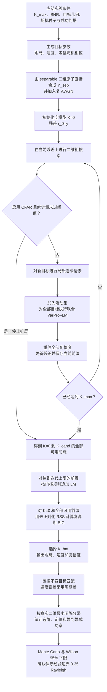

# 二维 NOMP 联合精修：目标构造、观测矩阵与数学推导

## 0. 文档定位与主线边界

> **本文只展开正式 separable 主线。** physical-LFM 只在本节用于说明两条路线的区别；相关观测链路、原子、数值导数、初始化和先导实验已集中迁移至[《20.5.2D_NOMP physical-LFM 扩展》](./20.5.2D_NOMP_physical-LFM扩展.md)，后文不再穿插讨论。

| 路线 | 观测与原子 | 当前证据定位 |
| --- | --- | --- |
| **本文正式主线** | 直接构造 $y_{\mathrm{sep}}=A_{\mathrm{sep}}(\boldsymbol\theta)\boldsymbol\beta+w$，其中 $A_{\mathrm{sep}}$ 的列为 $a_D(v_k)\otimes a_R(R_k)$ | 支撑二维 NOMP、VarPro–LM、unknown-$K$ BIC/CFAR、迭代上限门控及第 8 节全部正式 Monte Carlo 结论 |
| **physical-LFM 扩展** | 从完整 LFM 回波和脉冲压缩得到距离–慢时间观测，并用匹配原子或 separable 原子解释 | 独立研究分支；不能直接继承本文的正式边界 |

正式主线中的二维观测为

\[
Y_{\mathrm{sep}}
=\operatorname{reshape}\!\left(
A_{\mathrm{sep}}(\boldsymbol\theta)\boldsymbol\beta+w,
N_R,N_p
\right),
\qquad
w\sim\mathcal{CN}(0,\sigma^2I_M).
\]

第 8 节的正式边界只由上述 $Y_{\mathrm{sep}}$ 观测支撑。两条路线具有相同的距离–慢时间矩阵外形，但生成机制、原子可分离性、噪声口径和证据等级不同，不能共用同一条实验边界。除本节外，本文的公式、算法步骤和结果均默认指精确 separable 合成观测。

本文把项目中“二维 NOMP + 联合 VarPro–LM 精修”的数学链路写成一个可以独立阅读的推导。重点是：

1. 如何构造距离–速度二维目标；
2. 正式主线如何在距离–慢时间矩阵层构造模型匹配观测；
3. 二维原子、向量化和 Kronecker 字典之间的关系；
4. NOMP 的二维粗搜索、局部精修、活动集联合精修、幅度回代和残差递推；
5. 二维联合精修与一维 NOMP 在参数维数、Jacobian、相干性、复杂度和评价方式上的区别；
6. 复高斯似然、未知 $K$ 的 BIC、二维 CFAR 与迭代上限门控；
7. 置换不变定位误差、二维最小间隔、FIM/CRB 与 Wilson 成功边界；
8. 已完成正式实验如何验证上述数学链路。

除非特别说明，本文采用正式主线的准静态、可分离模型：

- 一个 CPI 内目标距离近似不随脉冲变化；
- 目标的复幅度在 CPI 内保持不变；
- 速度用“接近雷达为正”的符号约定；
- 输入是直接在距离–慢时间矩阵层合成的 $Y_{\mathrm{sep}}$；
- 估计器默认使用 AtomMode='separable'。

本文的正式数学主线不是“把距离–多普勒 FFT 图上的峰逐个拟合”，而是在 $Y_{\mathrm{sep}}$ 上直接拟合连续的 $(R,v)$。因此，本文可以作为当前 `separable` 二维 NOMP 主线的数学总览；候选簇、Top-$L$ 多起点等后续选择审计属于求解器外围机制，不改变这里的基本观测模型和 VarPro–LM 主式。

### 0.1 当前雷达、波形与采样配置

> **配置来源与口径：** 下列数值由当前 `src/core/generate_domp_scene.m`、`src/core/build_range_doppler_model.m` 和正式启动脚本 `experiments/range_doppler/run_2d_nomp_unknown_k_k3_random_geometry_gap_boundary_mc500.m` 共同确定。
>
> 正式 Monte Carlo 在距离–慢时间层直接合成 $Y_{\mathrm{sep}}$；雷达参数通过距离 PSF、慢时间 Doppler 原子、无模糊区间和 Rayleigh 标尺进入本文的正式模型。

| 项目 | 符号或代码量 | 当前配置 |
| --- | --- | --- |
| 雷达体制与速度符号 | — | X 波段单站脉冲多普勒；代码采用双程时延和双程 Doppler，径向速度以“接近雷达为正” |
| 载频与波长 | $f_0,\lambda=c/f_0$ | $f_0=10\ \mathrm{GHz}$，$\lambda=0.03\ \mathrm m$ |
| 发射波形 | $T_p,B,\mu=B/T_p$ | LFM，$T_p=10\ \mu\mathrm s$，$B=10\ \mathrm{MHz}$，$\mu=10^{12}\ \mathrm{Hz/s}$，时宽带宽积 $BT_p=100$ |
| 快时间采样 | $F_s,N,T_s$ | $F_s=10\ \mathrm{MHz}$，每脉冲 $N=1000$ 点，$T_s=0.1\ \mu\mathrm s$，记录长度 $N/F_s=100\ \mu\mathrm s$ |
| 脉冲重复参数 | $T_r,\mathrm{PRF}$ | PRI/PRT $T_r=100\ \mu\mathrm s$，$\mathrm{PRF}=10\ \mathrm{kHz}$ |
| CPI 脉冲数与名义时长 | $N_p,N_pT_r$ | $N_p=64$，名义相干处理时长 $6.4\ \mathrm{ms}$；慢时间样点为 $0{:}63\,T_r$，首末脉冲相隔 $6.3\ \mathrm{ms}$ |
| 距离标尺 | $\Delta R_{\mathrm{res}},R_{\mathrm{ua}}$ | 项目采用 $\Delta R_{\mathrm{res}}=c/(2B)=15\ \mathrm m$ 作为 Rayleigh 归一化标尺；名义无模糊距离 $R_{\mathrm{ua}}=cT_r/2=15\ \mathrm{km}$ |
| 速度标尺与周期 | $\Delta v_{\mathrm{res}},v_{\mathrm{ua}},P_v$ | $\Delta v_{\mathrm{res}}=\lambda/(2N_pT_r)=2.34375\ \mathrm{m/s}$，$v_{\mathrm{ua}}=\lambda/(4T_r)=75\ \mathrm{m/s}$，主区间 $[-75,75)\ \mathrm{m/s}$，周期 $P_v=150\ \mathrm{m/s}$ |
| 正式字典的加窗口径 | $w_R,w_D$ | 距离 PSF 使用频域 Hamming 窗；正式 separable 慢时间原子使用矩形窗 $w_D[m]=1$。场景生成器中的慢时间 Hamming 窗只用于距离–Doppler FFT 显示，不进入正式 $Y_{\mathrm{sep}}$ 估计原子 |

“X 波段”指通常约 $8$–$12\ \mathrm{GHz}$ 的微波频段，本项目的 $10\ \mathrm{GHz}$ 载频位于其中；“单站”表示发射和接收共用同一站点，因而时延和 Doppler 都是双程关系；“脉冲多普勒”表示通过多个相干脉冲的慢时间相位变化估计径向速度。

这里的 $15\ \mathrm m$ 和 $2.34375\ \mathrm{m/s}$ 是当前代码用于几何生成、误差判定和边界报告的 Rayleigh 标尺，不是过采样网格步长。距离维 Hamming 窗会改变实际 PSF 主瓣形状，因此 $15\ \mathrm m$ 应理解为项目冻结的名义归一化分辨率，而不是另行测得的半功率主瓣宽度。

### 0.2 正式五带边界的观测与搜索配置

| 项目 | 正式冻结值 |
| --- | --- |
| 正式观测 | 精确 separable $Y_{\mathrm{sep}}$ 加复 AWGN；距离 ROI 含 $N_R=23$ 个粗采样，故 $Y_{\mathrm{sep}}\in\mathbb C^{23\times64}$，向量化后 $M=1472$ |
| 距离 ROI | 模型 ROI 以 $3000\ \mathrm m$ 为中心、半宽 $180\ \mathrm m$；由于端点采用严格不等号，实际粗距离轴为 $2835{:}15{:}3165\ \mathrm m$ |
| 粗搜索网格 | `RangeOversample=4`，距离细网格 92 点、步长约 $3.62637\ \mathrm m$；`VelocityOversample=8`，估计范围 $[-30,30)\ \mathrm{m/s}$，实际速度网格为 $-29.8828125{:}0.29296875{:}29.8828125\ \mathrm{m/s}$，共 205 点 |
| 目标、噪声与候选阶数 | 真实 $K=3$，$K_{\max}=5$，等幅、独立均匀随机相位；$20\ \mathrm{dB}$ `fixed_per_target` |
| 随机几何 | `CenterSamplingMode='safe_roi_uniform'`；距离/速度归一化半跨度分别为 $0.90/0.55$ Rayleigh；五带为 $[0.20,0.25)$、$[0.25,0.30)$、$[0.30,0.35)$、$[0.35,0.40)$、$[0.40,+\infty)$ |
| 统计协议 | 每带 500 个独立场景，共 2500 个场景；完整前缀 BIC 为主模式，CFAR+BIC 为同观测配对次模式，共 5000 行求解结果；双侧 Wilson 95% 下限需不低于 95%；正式种子为 3141593，带间步长为 100000 |

`safe_roi_uniform` 会直接在安全 ROI 内随机抽取每个 trial 的场景中心。因此，正式启动脚本中保留的 `CenterVelocityMps=12` 在该分支下只是名义/兼容参数，并不表示所有正式场景都固定在 $12\ \mathrm{m/s}$；$3000\ \mathrm m$ 则用于固定距离模型 ROI 的中心。

### 0.3 正式主线总流程

下图给出从冻结实验条件到 unknown-$K$ 选阶和二维边界统计的完整流程，后续公式均可对应到其中一个步骤。



固定 $K$ 实验在已知阶数处停止前缀扩展并直接输出对应活动集；unknown-$K$ 正式实验则保留 $K=0$ 和全部可用前缀，经门控复核后再使用 BIC 选择 $\widehat K$。

### 0.4 公式来源与审计口径

本文的公式按“建模假设→数学恒等式或统计分布→当前代码”的顺序得到，不是根据实验结果反向拟合公式。主要来源如下：

| 公式组 | 直接来源 | 本文位置 |
| --- | --- | --- |
| 距离/速度 Rayleigh 标尺与速度周期 | 带宽所给时延分辨尺度、慢时间 DFT 频率间隔以及离散相位的 $2\pi$ 周期性 | 第 1 节、第 4.2 节 |
| 二维外积原子、Kronecker 原子与矩阵化相关 | 准静态条件下的可分离响应、$\operatorname{vec}(ab^{\mathsf T})=b\otimes a$ 以及 Frobenius 内积恒等式 | 第 3–4 节 |
| 粗搜索分数 | 单个复幅度线性最小二乘的精确 RSS 下降量 | 第 5.1 节“为什么粗搜索分数等于最优 RSS 下降” |
| Ridge、VarPro、投影 Jacobian 与 LM | Tikhonov 增广最小二乘、线性幅度消元、增广列空间投影和实参数复残差的 Gauss–Newton 展开；当前 Jacobian 明确是 Kaufman 近似 | 第 5.2 节 |
| BIC 与 CFAR | 正则复高斯似然的极大化，以及固定原子白噪声相关分数的指数尾分布 | 第 5.4–5.5 节 |
| 投影 FIM/CRB 与 Wilson 边界 | 消去 nuisance 复幅度后的复高斯 Fisher 信息，以及二项成功计数的 Wilson 置信区间 | 第 6.4 节、第 7.4 节 |

因此，原子、粗搜、Ridge/VarPro、LM、BIC、CFAR 和 FIM/CRB 的主式在后文都有局部推导或明确的成立条件。第 8 节的 $0.35$ Rayleigh 则不是从上述公式解出的理论常数，而是冻结算法、生成分布和统计判据下的 Monte Carlo 经验边界。

## 1. 符号、坐标和基本假设

> **本阶段代码对照：** 用 `src/core/build_range_doppler_model.m` 核对距离轴、慢时间轴、波长、PRI 和 Rayleigh 标尺；
>
> 用正式入口 `experiments/range_doppler/run_2d_nomp_unknown_k_k3_random_geometry_gap_boundary_mc500.m` 核对 SNR 口径、搜索范围及冻结参数。符号表是对这些代码量的数学命名，并不引入第二套独立配置。

| 符号 | 含义 | 单位或维度 |
|---|---|---|
| $c$ | 光速 | $\mathrm{m/s}$ |
| $\lambda$ | 载波波长 | $\mathrm m$ |
| $T_r$ | 脉冲重复间隔 PRI | $\mathrm s$ |
| $N_R$ | 距离 ROI 中的采样数 | — |
| $N_p$ | CPI 内脉冲数 | — |
| $M=N_RN_p$ | 向量化后的复观测样本数 | — |
| $B$ | 发射信号的等效带宽 | $\mathrm{Hz}$ |
| $K$ | 真实目标数或固定模型阶数 | — |
| $R_k$ | 第 $k$ 个目标距离 | $\mathrm m$ |
| $v_k$ | 第 $k$ 个目标径向速度 | $\mathrm{m/s}$ |
| $\beta_k$ | 第 $k$ 个目标复幅度 | 复数 |
| $\varphi_k$ | 第 $k$ 个目标初始相位 | $\mathrm{rad}$ |
| $\sigma^2$ | 每个复样本的白噪声功率 | 观测功率单位 |
| $\Delta R_{\mathrm{res}}$ | 名义距离 Rayleigh 分辨率 | $\mathrm m$ |
| $\Delta v_{\mathrm{res}}$ | 名义速度 Rayleigh 分辨率 | $\mathrm{m/s}$ |
| $A(\boldsymbol\theta)$ | 当前活动集二维原子矩阵 | $M\times K$ |
| $r$ | 向量化残差 $y-A\widehat{\boldsymbol\beta}$ | $M\times1$ |

其中 $c$、$\lambda$ 和 $T_r$ 是已知配置常数，只参与距离、Doppler 和尺度换算，不是当前估计器的未知量。因此 LM 外层只更新 $\boldsymbol\theta=[R_1,v_1,\ldots,R_K,v_K]^{\mathsf T}$，不会把 $c$、$\lambda$ 或 $T_r$ 放进优化变量；复幅度 $\boldsymbol\beta$ 则由 VarPro 的线性内层重新求解。

第 $k$ 个目标参数写为

\[
\theta_k=
\begin{bmatrix}
R_k\\
v_k
\end{bmatrix},\qquad
\beta_k=\rho_k e^{\mathrm j\varphi_k},\quad \rho_k\ge 0.
\]

整个场景的连续参数向量采用交错排列：

\[
\boldsymbol\theta=
[R_1,v_1,R_2,v_2,\ldots,R_K,v_K]^{\mathsf T}
\in\mathbb R^{2K}.
\]

在理想均匀采样和矩形窗条件下，常用的 Rayleigh 分辨率为

\[
\Delta R_{\mathrm{res}}=\frac{c}{2B},\qquad
\Delta v_{\mathrm{res}}=\frac{\lambda}{2N_pT_r}.
\]

其中，距离式来自时延分辨尺度 $1/B$ 与单站双程关系 $R=c\tau/2$；速度式则由慢时间频率间隔 $1/(N_pT_r)$ 代入 $f_D=2v/\lambda$ 得到。

实际实验中如果采用距离窗或慢时间窗，主瓣宽度会发生变化。因此 $\Delta R_{\mathrm{res}}$ 和 $\Delta v_{\mathrm{res}}$ 应以项目中实际字典或预先标定的 Rayleigh 基准为准；过采样网格步长不能代替物理分辨率。

令 $M=N_RN_p$，并把噪声矩阵按列向量化为 $w=\operatorname{vec}(W)$。当前白噪声模型应准确写为

\[
w\sim\mathcal{CN}(0,\sigma^2 I_M),
\]

即每个复样本满足 $w_n\sim\mathcal{CN}(0,\sigma^2)$，其实部和虚部方差均为 $\sigma^2/2$。给定干净观测 $y_{\mathrm{clean}}$ 时，若采用“总场景 SNR”，则

\[
\operatorname{SNR}_{\mathrm{scene}}
=10\log_{10}
\frac{\|y_{\mathrm{clean}}\|_2^2/M}{\sigma^2}.
\]

当前随机几何正式边界实验采用 `fixed_per_target`：单目标复幅度的模固定为 1，并按当前生成原子的实际列能量计算单目标参考功率

\[
P_{\mathrm{atom}}
=\frac{\|\phi_{\mathrm{sep}}(R,v)\|_2^2}{M}
\approx\frac{1}{M}
\]

设置噪声方差。近似等号来自当前 $\phi_{\mathrm{sep}}$ 的列二范数数值归一；代码本身使用 `mean(abs(reference_atom).^2)`，因而不需要假设浮点计算下的列范数严格等于 1。噪声直接在精确 separable 合成观测层加入：

\[
\sigma^2
=\frac{P_{\mathrm{atom}}}{10^{\operatorname{SNR}_{\mathrm{dB}}/10}}.
\]

因此多目标相干叠加后的实际总场景功率会随相位和几何变化，不能把 `fixed_per_target` 的 20 dB 直接解释为每个场景都具有完全相同的总观测 SNR。本文第 8 节的 20 dB 明确指 $Y_{\mathrm{sep}}$ 层的单目标参考 SNR。

## 2. 二维目标的构造

> **本阶段代码对照：** 一般规则几何可对照 `src/core/generate_domp_scene.m` 的目标参数接口；
>
> 正式无固定排列随机几何应直接看 `demos/demo_2d_unknown_k_random_k_random_geometry.m` 的目标生成、`safe_roi_uniform` 中心采样和最小二维间隔计算。
>
> 五带边界实验的具体范围与种子由 `experiments/range_doppler/run_2d_nomp_unknown_k_k3_random_geometry_gap_boundary_mc500.m` 冻结。

### 2.1 一般 $K$ 目标构造

先给定场景中心 $(R_c,v_c)$，再给定每个目标相对于中心的偏移：

\[
R_k=R_c+\delta R_k,\qquad
v_k=v_c+\delta v_k,\qquad k=1,\ldots,K.
\]

复幅度可以写成

\[
\beta_k=\rho_k e^{\mathrm j\varphi_k}.
\]

等幅随机相位实验对应

\[
\rho_k=\rho,\qquad
\varphi_k\overset{\mathrm{i.i.d.}}{\sim}\mathcal U[0,2\pi).
\]

若需要控制强弱目标，则只改变 $\rho_k/\rho_1$，不要同时改变目标间距和噪声定义，否则无法判断成功率下降究竟来自相干性还是幅度差。

### 2.2 由归一化间隔生成规则几何

定义中心对称索引

\[
q_k=k-\frac{K+1}{2}.
\]

若所有相邻目标的距离间隔和速度间隔分别为

\[
\Delta R=\eta_R\Delta R_{\mathrm{res}},\qquad
\Delta v=\eta_v\Delta v_{\mathrm{res}},
\]

则规则对角线目标可以写成

\[
R_k=R_c+q_k\Delta R,\qquad
v_k=v_c+q_k\Delta v.
\]

这里 $\eta_R$ 和 $\eta_v$ 是无量纲的 Rayleigh 归一化间隔。它们小于 1 时，对应维度进入名义分辨率以内（“名义”表示它们由理想带宽与慢时间观测长度推导，并作为目标生成、误差评价和结果比较的统一参考尺度，它们不等同于加窗后实际字典主瓣的实测宽度，也不是目标能否分开的绝对阈值）；当 $\eta_R<1$ 或 $\eta_v<1$ 时，只表示相应维度的目标间隔小于一个名义 Rayleigh 分辨单元。是否能够成功恢复，仍必须由多次噪声试验和定位误差共同判定。

对于 $K=3$，$q_k=(-1,0,1)$，因此

\[
\begin{aligned}
(R_1,v_1)&=(R_c-\Delta R,\;v_c-\Delta v),\\
(R_2,v_2)&=(R_c,\;v_c),\\
(R_3,v_3)&=(R_c+\Delta R,\;v_c+\Delta v).
\end{aligned}
\]

三种常用的固定 $K=3$ 几何为：

1. **距离轴几何**

   \[
   R_k=R_c+q_k\eta_R\Delta R_{\mathrm{res}},\qquad v_k=v_c.
   \]

   三个目标共享速度，只在距离轴排列。它主要检验距离 PSF 近邻造成的高相干。

2. **速度轴几何**

   \[
   R_k=R_c,\qquad v_k=v_c+q_k\eta_v\Delta v_{\mathrm{res}}.
   \]

   三个目标共享距离，只在慢时间相位斜率上分开。它主要检验速度维连续精修和速度相位累积。

3. **联合对角线几何**

   \[
   R_k=R_c+q_k\eta_R\Delta R_{\mathrm{res}},\qquad
   v_k=v_c+q_k\eta_v\Delta v_{\mathrm{res}}.
   \]

   两个维度同时变化。某一维的相干性可以由另一维的差异部分抵消，因此它通常不能用“只看距离”或“只看速度”的一维结论代替。

对非均匀间隔、L 型排列、近目标加远目标等几何，只需把 $(\delta R_k,\delta v_k)$ 从规则的 $q_k\Delta$ 改为指定的二维点集；后续观测模型和 NOMP 流程不变。

### 2.3 目标生成时必须固定的事项

正式 Monte Carlo 试验在每个条件下至少应固定：

- $K$ 是真实目标数还是算法已知阶数；
- $R_c,v_c$ 以及目标是否靠近边界；
- $\eta_R,\eta_v$ 如何转换成物理间隔；
- 幅度比 $\rho_k/\rho_1$；
- 相位是固定、随机还是分层随机；
- 噪声是否在每次 trial 重新生成；
- 目标参数是否在粗网格上，还是专门加入 off-grid 偏移；
- 目标排序只用于记录，成功判定时应允许目标置换匹配。

### 2.4 无固定排列的随机目标簇

第 8 节的正式随机几何不是把某一个目标固定在 $(R_c,v_c)$，再单独移动其余目标。它先在安全 ROI 内随机抽取一个**簇参考中心** $(R_c,v_c)$，再对 $K\ge2$ 个目标联合生成无量纲偏移 $u_k\in[-1,1]^2$，并按坐标分量重心化包围盒：

\[
f_k=u_k-
\frac{\min_j u_j+\max_j u_j}{2}.
\]

随后生成

\[
R_k=R_c+f_{k,R}\,\eta_{R,\mathrm{span}}\Delta R_{\mathrm{res}},
\qquad
v_k=v_c+f_{k,v}\,\eta_{v,\mathrm{span}}\Delta v_{\mathrm{res}}.
\]

只有当所有目标均位于安全 ROI 内，且由三对 $(R_i,v_i)$ 计算的最小二维间隔 $d_{\min}$ 落入当前预先冻结的 band 时才接受该 trial；否则重新生成场景。$K=1$ 时唯一目标位于参考中心；$K\ge2$ 时没有任何目标被强制固定在参考中心。这个构造用于随机局部簇，而不是“已知中心目标加周边目标”的受控模型。

---

## 3. 正式主线的观测矩阵

> **本阶段代码对照：** 正式观测不是从显示用距离–Doppler 图反推，而是在 `demos/demo_2d_unknown_k_random_k_random_geometry.m` 或边界 demo 中调用 `src/core/build_range_doppler_atoms.m` 后，以原子矩阵、复幅度和复 AWGN 直接合成。阅读时同时核对 `src/core/build_range_doppler_model.m` 给出的矩阵尺寸，并用 `tests/test_range_doppler_core.m` 检查向量化/矩阵化约定。

本文的估计输入固定为距离–慢时间复数矩阵 $Y_{\mathrm{sep}}\in\mathbb C^{N_R\times N_p}$。矩阵行对应距离 ROI 采样，列对应 CPI 内脉冲；这一约定与 MATLAB 的列主序向量化、二维原子和后续 VarPro–LM 完全一致。

### 3.1 精确 separable 合成的距离–慢时间矩阵

在一个 CPI 内距离走动和加速度可忽略时，单目标的距离 PSF 与慢时间 Doppler 相位近似可分离。参考二维 delay–Doppler NOMP 的可分离建模思路，本项目将距离维具体化为连续 LFM-PSF 响应 $a_R(R)$，将速度维具体化为慢时间 Doppler 复指数 $a_D(v)$。因此，后文的外积/Kronecker 结构不是任意拼接两个一维字典，而是上述准静态假设和按列向量化共同推出的。

正式主线在相同的矩阵尺寸、ROI、距离 PSF 和慢时间采样约定下，直接构造

\[
Y_{\mathrm{sep}}
=\sum_{k=1}^{K}
\beta_k a_R(R_k)a_D(v_k)^{\mathsf T}+W,
\qquad
W(:)\sim\mathcal{CN}(0,\sigma^2I_M).
\]

因此观测模型与估计器使用同一组可分离原子，后文 $\phi(R,v)=a_D(v)\otimes a_R(R)$ 与正式合成观测严格对应。正式五带边界和 $K_{\mathrm{true}}=0{:}3$ 的端到端结果均属于这一观测层。

### 3.2 距离–多普勒 FFT 复数图仅作为对照层

若对 $Y_{\mathrm{sep}}$ 的慢时间维做 FFT，则

\[
D[\ell,q]
=\sum_{m=0}^{N_p-1}
w_D[m]\,Y_{\mathrm{sep}}[\ell,m]\,
e^{-\mathrm j2\pi qm/N_p}.
\]

它适合：

- RDM 可视化；
- 传统 FFT 峰值检测；
- 观察 Doppler 泄漏和旁瓣；
- 构造传统 CFAR 的显示或对比基线。

但需要注意：

1. 若只保存 $|D|$ 或功率图，复数相位已经丢失，不能直接作为当前复数 LS/VarPro 模型的观测；
2. FFT 频点会引入速度栅格量化和 off-grid 泄漏；
3. 慢时间窗会改变噪声相关性和原子形状；
4. 若在 FFT 后继续做连续精修，必须把 FFT 归一化、窗函数和边界条件写进原子模型。

因此，距离–多普勒图适合显示、FFT 峰值检测或传统 CFAR 对比，不作为本文连续复数 LS/VarPro–LM 的估计输入。

### 3.3 观测选择结论

本文后续只使用 $Y_{\mathrm{sep}}$ 作为二维 NOMP 输入，使用 $a_R(R)a_D(v)^{\mathsf T}$ 解释每个目标，并通过 $Y_{\mathrm{sep}}(:)$ 与 Kronecker 原子建立严格对应。距离–多普勒 FFT 图只承担显示或对照职责，不参与本文正式连续精修和边界统计。

## 4. 二维目标观测矩阵和原子的构造

> **本阶段代码对照：** 距离维公式对应 `src/core/build_psf_dictionary.m`，速度维复指数对应 `src/core/build_doppler_dictionary.m`，Kronecker 列与列归一化对应 `src/core/build_range_doppler_atoms.m`。
>
> 建议打开 `tests/test_range_doppler_core.m` 对照每个函数的输入轴、输出尺寸和归一化，而不要仅凭公式猜测共轭、转置或 `vec` 顺序。

### 4.1 距离原子

距离压缩后，一个连续距离 $R$ 对应一个距离 PSF 向量

\[
a_R(R)\in\mathbb C^{N_R}.
\]

它由发射波形、匹配滤波器、距离采样轴和 ROI 共同决定。项目中 build_psf_dictionary 以连续距离为输入，并将每个距离列归一化。这里的 $R$ 是物理距离，不是“第几个过采样网格点”。

### 4.2 慢时间速度原子

设慢时间 $t_m=mT_r$，$m=0,\ldots,N_p-1$。在“接近为正”的约定下

\[
f_D(v)=\frac{2v}{\lambda}.
\]

不考虑慢时间窗时：

\[
\widetilde a_D(v)[m]
=\exp\!\left(
\mathrm j2\pi f_D(v)t_m
\right)
=\exp\!\left(
\mathrm j\frac{4\pi v}{\lambda}mT_r
\right).
\]

加入慢时间窗 $w_D[m]$ 并做二范数归一化：

\[
a_D(v)
=\frac{
\left[
w_D[m]\exp\!\left(
\mathrm j\frac{4\pi v}{\lambda}mT_r
\right)
\right]_{m=0}^{N_p-1}
}{
\left\|
\left[
w_D[m]\exp\!\left(
\mathrm j\frac{4\pi v}{\lambda}mT_r
\right)
\right]_{m=0}^{N_p-1}
\right\|_2
}.
\]

速度无模糊区间由

\[
|v|<v_{\mathrm{ua}},\qquad
v_{\mathrm{ua}}=\frac{\lambda}{4T_r}
\]

给出。这一边界可以直接从离散慢时间相位得到：若速度增加 $P_v$，要使每个脉冲的相位只多一个整数周期，需要

\[
\frac{4\pi P_v}{\lambda}mT_r=2\pi m,
\qquad
P_v=\frac{\lambda}{2T_r}=2v_{\mathrm{ua}}.
\]

因而 $a_D(v+P_v)=a_D(v)$，连续速度参数只能在一个长度为 $P_v$ 的主区间内唯一表示。代码选择 $[-v_{\mathrm{ua}},v_{\mathrm{ua}})$ 这个半开区间，以避免两个周期端点重复。

### 4.3 单目标二维矩阵原子

可分离模型中，单目标二维矩阵原子为

\[
\Psi(R,v)=a_R(R)a_D(v)^{\mathsf T}
\in\mathbb C^{N_R\times N_p}.
\]

这里是普通转置 ${}^{\mathsf T}$，不是共轭转置。原因是矩阵第 $m$ 列应该携带 $a_D(v)[m]$ 的相位，而不是其共轭。

对于 $K$ 个目标，干净观测矩阵为

\[
Y_{\mathrm{clean}}
=\sum_{k=1}^{K}
\beta_k\Psi(R_k,v_k),
\]

加噪后得到

\[
Y_{\mathrm{obs}}
=Y_{\mathrm{clean}}+W.
\]

这说明二维观测不是把三个目标矩阵横向拼接，而是三个二维原子的复幅度线性叠加。

### 4.4 向量化和 Kronecker 形式

MATLAB 使用按列向量化：

\[
y=\operatorname{vec}(Y_{\mathrm{obs}})
=Y_{\mathrm{obs}}(:)
\in\mathbb C^{N_RN_p}.
\]

由

\[
\operatorname{vec}(ab^{\mathsf T})=b\otimes a
\]

可得二维向量原子

\[
\phi(R,v)
=\operatorname{vec}(\Psi(R,v))
=a_D(v)\otimes a_R(R).
\]

定义活动集原子矩阵

\[
A(\boldsymbol\theta)
=
\begin{bmatrix}
\phi(R_1,v_1)&\cdots&\phi(R_K,v_K)
\end{bmatrix}
\in\mathbb C^{N_RN_p\times K},
\]

则多目标观测模型为

\[
y=A(\boldsymbol\theta)\boldsymbol\beta+w.
\]

若距离网格字典和速度网格字典分别为

\[
A_R=
\begin{bmatrix}
a_R(R_1^g)&\cdots&a_R(R_{G_R}^g)
\end{bmatrix},
\]

\[
A_D=
\begin{bmatrix}
a_D(v_1^g)&\cdots&a_D(v_{G_v}^g)
\end{bmatrix},
\]

完整的有限二维 Kronecker 字典为

\[
D=A_D\otimes A_R
\in\mathbb C^{N_RN_p\times G_RG_v}.
\]

它包含所有距离–速度网格组合，但当前实现不显式分配这个大矩阵。

### 4.5 矩阵化二维相关：在既有残差上进行原子匹配

> **本阶段代码对照：** 公式的直接实现是 `src/algorithms/coarse_range_doppler_search.m`；
>
> 它接收当前残差向量/矩阵和两个一维字典，计算全部距离–速度网格的相关分数并返回峰值索引。
>
> 上层调用位置在 `src/algorithms/nomp_range_doppler_refinement.m`，递推使用方式由 `tests/test_range_doppler_sequential_detection.m` 验证。这里的相关式是在既有残差上匹配候选原子，不是重新“构造残差”。

首先要区分“残差构造”和“残差相关”。当前残差矩阵 $E\in\mathbb C^{N_R\times N_p}$ 已由观测减去现有活动集的重构结果得到；第一次检测时活动集为空，所以 $E=Y_{\mathrm{obs}}$。第 5.1 节给出粗搜索所使用的残差定义，第 5.3 节再给出活动集更新后的完整残差递推。本节中的

\[
\phi_{ij}^{\mathsf H}\operatorname{vec}(E)
\]

**不是在构造残差**，而是在计算候选二维原子 $\phi_{ij}$ 与既有残差向量之间的复内积，即该候选对当前残差的匹配相关值。

对距离–速度网格点 $(R_i^g,v_j^g)$，记

\[
r_i=a_R(R_i^g)\in\mathbb C^{N_R},
\qquad
d_j=a_D(v_j^g)\in\mathbb C^{N_p}.
\]

对应的矩阵原子和向量原子分别为

\[
\Psi_{ij}=r_i d_j^{\mathsf T}
\in\mathbb C^{N_R\times N_p},
\qquad
\phi_{ij}=\operatorname{vec}(\Psi_{ij})
=d_j\otimes r_i
\in\mathbb C^{N_RN_p}.
\]

因此

\[
\underbrace{\phi_{ij}^{\mathsf H}}_{1\times N_RN_p}
\underbrace{\operatorname{vec}(E)}_{N_RN_p\times1}
\]

得到的是一个复数标量。利用向量内积与 Frobenius 内积的等价关系，有

\[
\begin{aligned}
q_{ij}
&=\phi_{ij}^{\mathsf H}\operatorname{vec}(E)\\
&=\operatorname{vec}(r_i d_j^{\mathsf T})^{\mathsf H}
  \operatorname{vec}(E)\\
&=\left\langle r_i d_j^{\mathsf T},E\right\rangle_F\\
&=r_i^{\mathsf H}E\,\overline{d_j}.
\end{aligned}
\]

逐元素展开为

\[
q_{ij}
=\sum_{n=1}^{N_R}\sum_{m=1}^{N_p}
\overline{r_i[n]d_j[m]}
\,E[n,m].
\]

这相当于拿候选距离–速度响应作为一个二维复数模板，与残差矩阵逐点匹配后相干求和。若候选距离正确，$r_i^{\mathsf H}E$ 会使距离响应对齐；若候选速度也正确，再乘 $\overline{d_j}$ 会使各脉冲的慢时间相位同相累加，因而 $|q_{ij}|$ 较大。距离或速度不匹配时，包络或相位不能同时对齐，求和会发生抵消。

这里右侧出现 $\overline{d_j}$，是因为本文将矩阵原子定义为非共轭外积 $r_i d_j^{\mathsf T}$，而不是 $r_i d_j^{\mathsf H}$；该约定与代码中的 `range_atom * doppler_atom.'` 一致。

若逐个遍历全部 $(i,j)$，就要分别计算每一个 $q_{ij}$。利用可分离结构，可以把所有候选一次写成

\[
C=A_R^{\mathsf H}E\,\overline{A_D}
\in\mathbb C^{G_R\times G_v},
\]

并且

\[
C_{ij}=q_{ij}
=\phi_{ij}^{\mathsf H}\operatorname{vec}(E).
\]

其维度对应为

\[
\underbrace{A_R^{\mathsf H}}_{G_R\times N_R}
\underbrace{E}_{N_R\times N_p}
\underbrace{\overline{A_D}}_{N_p\times G_v}
=
\underbrace{C}_{G_R\times G_v}.
\]

也可以把这一计算理解为两级匹配：

\[
B=A_R^{\mathsf H}E
\in\mathbb C^{G_R\times N_p}
\]

先在每个脉冲上同时匹配全部距离候选，再计算

\[
C=B\,\overline{A_D}
\]

沿慢时间同时匹配全部速度候选。完整 Kronecker 字典与矩阵化结果严格满足

\[
D^{\mathsf H}\operatorname{vec}(E)
=\operatorname{vec}(C),
\qquad
D=A_D\otimes A_R.
\]

因此矩阵化相关并没有改变粗搜索目标，只是避免显式存储完整字典。对未归一化原子，粗搜索使用

\[
S_{ij}
=\frac{|C_{ij}|^2}
{\|r_i\|_2^2\|d_j\|_2^2};
\]

当前距离和速度字典列均已归一化时，$S_{ij}=|C_{ij}|^2$。随后在排除已有目标邻域后寻找最大的 $S_{ij}$，得到新目标的粗距离和粗速度；这只是 NOMP 的粗检测/初始化步骤，后面仍需进行连续局部精修和全活动集联合精修。

## 5. 二维 NOMP 的数学流程

> **本阶段代码对照：** 本节应沿真实调用链阅读：`nomp_range_doppler_refinement.m` 负责编排粗搜、CFAR 停止、加目标、联合精修和残差递推，`coarse_range_doppler_search.m` 负责网格检测，`compute_2d_cfar_threshold.m` 负责阈值换算，`joint_varpro_range_doppler_refinement.m` 负责连续参数的 VarPro–LM，`solve_ridge_least_squares.m` 负责线性幅度回代。`nomp_range_doppler_unknown_k.m` 在外层传入 CFAR 配置、保存可用前缀、执行迭代上限门控并完成 BIC 选阶。
> 
> **适用范围。** 本节至第 7 节只推导 $Y_{\mathrm{sep}}$ 与 $A_{\mathrm{sep}}$ 的精确可分离主线。

NOMP 可以概括为：

> 在当前残差上用二维粗网格找“新目标大致在哪”，再用连续参数精修消除网格失配；每加入一个目标后，对当前活动集进行联合精修并重新计算残差。

固定 $K$ 的主流程为：

~~~text
二维复数观测 Y
        ↓
初始化残差 E0 = Y，活动集为空
        ↓
对 m = 1,...,K：
    对当前残差做二维相关
        ↓
    排除已有目标邻域并取得最大候选
        ↓
    对新候选做局部二维 VarPro–LM
        ↓
    加入活动集
        ↓
    对全部 m 个目标做联合 VarPro–LM
        ↓
    回代复幅度，更新残差 Em
        ↓
达到固定 K 或 K_max，或由 CFAR 停止候选扩展；
unknown-K 的 BIC 在已保存前缀中事后选阶
~~~

### 5.1 二维残差粗搜索：候选、分数、排重

二维 NOMP 的一次粗搜索只完成一件事：在第 $m$ 轮开始时已经存在的残差矩阵上，选择本轮分数最大的一个距离–速度网格候选。它不会一次性完成全部目标估计，也不会在函数内部减去目标或生成新残差。

第一轮尚无活动目标，因此

\[
E_0=Y_{\mathrm{obs}}.
\]

第 $m$ 轮开始时，前 $m-1$ 个目标已经完成联合精修和复幅度回代。令上一轮最终活动原子矩阵为 $A_{m-1}$，则本轮输入残差为

\[
E_{m-1}
=
Y_{\mathrm{obs}}
-
\operatorname{reshape}\!\left(
A_{m-1}\widehat{\boldsymbol\beta}_{m-1},
N_R,N_p
\right).
\]

此时 $E_{m-1}$ 一般同时包含尚未检测的目标、噪声以及已有目标的少量拟合误差。“当前残差”只表示第 $m$ 轮开始时外层 NOMP 已经准备好的输入；粗搜索只读取它，不会修改它。函数调用关系可以概括为

\[
E_{m-1}
\xrightarrow{\text{二维粗搜索}}
\left(
\widehat R_{m,\mathrm{grid}},
\widehat v_{m,\mathrm{grid}},
S_{\max}^{(m)}
\right),
\qquad
E_{m-1}\ \text{保持不变}.
\]

若本轮候选通过可选的 CFAR 门控，同一个 $E_{m-1}$ 和粗网格坐标随后一起交给第 5.2 节的局部 VarPro–LM。

**固定输入残差与有效位置候选集**

全部二维网格索引构成初始位置集合

\[
\mathcal G
=
\left\{
(i,j):
i=1,\ldots,G_R,\;
j=1,\ldots,G_v
\right\}.
\]

这里的 $(i,j)$ 只表示一个可能存在新目标的距离–速度网格位置，不是已经确认的目标，也不是 unknown-$K$ 外层用于 BIC 比较的阶数候选。

为了避免同一真实目标在相邻网格点上被重复选中，代码在第 $m$ 轮建立排除集合

\[
\mathcal E_{m-1}
=
\mathcal I_{m-1}^{\mathrm{support}}
\cup
\bigcup_{\ell=1}^{m-1}
\mathcal N_{\delta_c}
\left(
\widehat R_\ell,\widehat v_\ell
\right).
\]

其中 $\mathcal I_{m-1}^{\mathrm{support}}$ 包含前几轮已经选过的粗网格支撑点，连续参数附近的排重邻域定义为

\[
\mathcal N_{\delta_c}
\left(
\widehat R_\ell,\widehat v_\ell
\right)
=
\left\{
(i,j)\in\mathcal G:
\left(
\frac{R_i^g-\widehat R_\ell}{s_R}
\right)^2
+
\left(
\frac{
d_v(v_j^g,\widehat v_\ell)
}{s_v}
\right)^2
\le
\delta_c^2
\right\}.
\]

这里 $s_R=\texttt{model.range\_scale\_m}$、$s_v=\texttt{model.velocity\_scale\_mps}$，$d_v$ 是周期速度差，$\delta_c=\texttt{CoarseDuplicateDistance}$。去除排除集合后，本轮真正允许参加竞争的位置为

\[
\mathcal C_{m-1}
=
\mathcal G\setminus\mathcal E_{m-1}.
\]

排除集合只决定“哪些网格点有资格成为本轮候选”，不会改变 $E_{m-1}$、观测模型、VarPro 目标或最终连续参数。

**矩阵化相关、归一化分数与本轮候选**

在网格点 $(R_i^g,v_j^g)$ 上，矩阵形式的二维原子为

\[
\Psi(R_i^g,v_j^g)
=
a_R(R_i^g)a_D(v_j^g)^{\mathsf T}.
\]

它与当前残差的复相关值为

\[
C_{ij}
=
\left\langle
\Psi(R_i^g,v_j^g),
E_{m-1}
\right\rangle_F.
\]

利用可分离结构，全部网格点的相关值可以一次写成矩阵

\[
C
=
A_R^{\mathsf H}
E_{m-1}
\overline{A_D}
\in\mathbb C^{G_R\times G_v}.
\]

这个 $C$ 是整张二维相关图；图中可以同时出现多个峰，但当前 NOMP 的一次粗搜索只从中选择一个峰。代码随后计算每个网格原子的能量归一化分数

\[
S_{ij}
=
\frac{
|C_{ij}|^2
}{
\|a_R(R_i^g)\|_2^2
\|a_D(v_j^g)\|_2^2
}.
\]

正式主线的距离字典列和 Doppler 字典列均按单位范数构造，因此在数值舍入误差范围内，

\[
S_{ij}=|C_{ij}|^2.
\]

`coarse_range_doppler_search.m` 先计算完整的 $S_{ij}$，再把 $\mathcal E_{m-1}$ 中的位置分数置为 $-\infty$。最后只在有效位置集合 $\mathcal C_{m-1}$ 中选择一个最大项：

\[
(\widehat i_m,\widehat j_m)
=
\arg\max_{(i,j)\in\mathcal C_{m-1}}
S_{ij},
\]

\[
\left(
\widehat R_{m,\mathrm{grid}},
\widehat v_{m,\mathrm{grid}}
\right)
=
\left(
R_{\widehat i_m}^g,
v_{\widehat j_m}^g
\right),
\qquad
S_{\max}^{(m)}
=
S_{\widehat i_m,\widehat j_m}.
\]

因此，分数回答的是：

> 在本轮允许参加搜索的所有网格点中，哪一个单原子候选最能解释当前残差？

它不直接回答场景中一共有多少个目标。即使分数图中可见多个峰，本轮也只返回其中分数最大的一个粗候选；粗搜索完成后，$E_{m-1}$ 仍然没有改变。

**为什么粗搜索分数等于最优 RSS 下降**

令

\[
e_{m-1}
=
\operatorname{vec}(E_{m-1}),
\]

并考察某个网格候选对应的向量化原子 $\phi$。如果只允许在当前残差中加入这一个原子，无正则复幅度最小二乘为

\[
\widehat\alpha
=
\arg\min_{\alpha\in\mathbb C}
\left\|
e_{m-1}-\alpha\phi
\right\|_2^2
=
\frac{
\phi^{\mathsf H}e_{m-1}
}{
\phi^{\mathsf H}\phi
}.
\]

将 $\widehat\alpha$ 回代可得

\[
\begin{aligned}
\min_\alpha
\left\|
e_{m-1}-\alpha\phi
\right\|_2^2
&=
\|e_{m-1}\|_2^2
-
\frac{
|\phi^{\mathsf H}e_{m-1}|^2
}{
\|\phi\|_2^2
},\\
\Delta\operatorname{RSS}(\phi)
&=
\frac{
|\phi^{\mathsf H}e_{m-1}|^2
}{
\|\phi\|_2^2
}.
\end{aligned}
\]

可分离二维原子满足

\[
\|\phi(R_i^g,v_j^g)\|_2^2
=
\|a_R(R_i^g)\|_2^2
\|a_D(v_j^g)\|_2^2.
\]

因此，$S_{ij}$ 正是“在该网格点加入一个无正则、最优复幅度单原子时，可以获得的最大数据 RSS 下降”。选择最大的 $S_{ij}$，就是选择当前有效位置集合中最有希望的连续精修初值，而不是任意选择热图中的亮点。

粗搜索本身不使用第 5.2 节 VarPro 内层的 ridge。这里的无正则 $\widehat\alpha$ 只用于解释粗搜索分数；进入连续局部精修后，复幅度会按照第 5.2 节的 ridge 口径重新估计。

> **与 CFAR、BIC 和排重尺度的接口**
>
> 最大分数 $S_{\max}^{(m)}$ 在当前两种 unknown-$K$ 协议中承担不同职责：
>
> - **完整前缀 BIC 主模式：** `UseCFAR=false`。$S_{\max}^{(m)}$ 只用于确定本轮最优粗位置，不用于判断“是否还有目标”。外层继续生成 $K=0,1,\ldots,K_{\max}$ 的可用前缀，再由 BIC 事后选阶；正式配置为 $K_{\max}=5$。
> - **CFAR+BIC 配对模式：** `UseCFAR=true`。外层在调用第 5.2 节之前，先比较 $S_{\max}^{(m)}$ 与阈值 $\gamma_m$。若 $S_{\max}^{(m)}\le\gamma_m$，则停止扩展前缀；若 $S_{\max}^{(m)}>\gamma_m$，才把残差和粗候选交给连续精修。正式配置采用 `CFARPfa=1e-3` 和校准后的 `CFARSearchCells=2500`。
>
> 这里必须区分两类“候选”：
>
> - $\mathcal C_{m-1}$ 是本轮粗搜索中的距离–速度**位置候选集**；
> - $K=0,1,\ldots,K_{\max}$ 是 unknown-$K$ 外层供 BIC 比较的**阶数前缀候选集**。
>
> 排重参数也使用算法坐标尺度，而不是实验评价中的 Rayleigh 尺度。正式五带主线使用默认 $\delta_c=0.5$；当前
>
> $$
> s_R\approx3.62637\ \mathrm m,
> \qquad
> s_v\approx0.29296875\ \mathrm{m/s}.
> $$
>
> 因此排重邻域在两坐标轴上的截距约为 $1.81319\ \mathrm m$ 和 $0.146484\ \mathrm{m/s}$，分别约为 $0.1209$ 距离 Rayleigh 和 $0.0625$ 速度 Rayleigh。这里的 $\delta_c=0.5$ 表示“半个过采样网格尺度”，不是 $0.5$ Rayleigh。它只用于避免同一目标的邻近残余峰被重复加入，不应与最终定位误差或物理分辨率混用。

**为什么粗网格候选还不是最终估计**

设真实目标位于 $(R^\star,v^\star)$，而本轮粗搜索最大峰位于 $(R_i^g,v_j^g)$。只要真实参数不恰好落在网格上，就有

\[
(R_i^g,v_j^g)
\ne
(R^\star,v^\star).
\]

如果直接把网格点作为最终估计，误差下限将受到网格步长限制。因此：

- 粗搜索负责把算法带入正确的局部吸引域；
- 第 5.2 节的局部 VarPro–LM 负责去除新目标的 off-grid 偏差；
- 第 5.3 节的活动集联合精修负责处理不同目标之间的相干和相互牵制。

所以，第 5.1 节新产生的输出只有粗网格坐标与最大分数：

\[
\left(
\widehat R_{m,\mathrm{grid}},
\widehat v_{m,\mathrm{grid}},
S_{\max}^{(m)}
\right).
\]

输入残差 $E_{m-1}$ 在粗搜索期间保持不变。若 CFAR 未在本轮停止，外层程序再把该残差与粗网格坐标组合成第 5.2 节的输入：

\[
\left(
E_{m-1},
\widehat R_{m,\mathrm{grid}},
\widehat v_{m,\mathrm{grid}}
\right)
\xrightarrow{\text{局部 VarPro--LM}}
\left(
\widehat R_m^{\mathrm{loc}},
\widehat v_m^{\mathrm{loc}},
\widehat\beta_m^{\mathrm{loc}}
\right).
\]

残差只有在第 5.3 节完成活动集联合精修和全部复幅度回代之后，才由 $E_{m-1}$ 更新为 $E_m$。

### 5.2 连续 VarPro–LM 求解器：局部与联合的统一形式

> **本阶段代码对照：** `src/algorithms/nomp_range_doppler_refinement.m` 将第 5.1 节输出的一个粗候选与未改变的残差矩阵一起送入连续精修；`src/algorithms/joint_varpro_range_doppler_refinement.m` 实现局部与联合共用的 VarPro–LM；`src/core/solve_ridge_least_squares.m` 实现复幅度回代和 Jacobian 投影所需的 ridge 最小二乘。对应回归测试为 `tests/test_range_doppler_k1_refinement.m`、`tests/test_range_doppler_k2_refinement.m` 和 `tests/test_range_doppler_k3_refinement.m`。

第 5.1 节已经完成粗搜索，并从有效位置候选集 $\mathcal C_{m-1}$ 中选出本轮分数最大的一个网格候选

\[
\left(
\widehat R_{m,\mathrm{grid}},
\widehat v_{m,\mathrm{grid}}
\right).
\]

局部求解器不会接收整个候选集 $\mathcal C_{m-1}$，也不会接收整张分数图。它只接收以下信息：

| 输入 | 在局部求解器中的作用 |
| --- | --- |
| 上一轮外层残差矩阵 $E_{m-1}$ | 提供已减去前 $m-1$ 个活动目标重构、但尚未减去本轮新候选的复观测数据 |
| 一个粗候选 $(\widehat R_{m,\mathrm{grid}},\widehat v_{m,\mathrm{grid}})$ | 提供连续距离–速度优化的初值 |
| 冻结雷达模型与数值选项 | 提供连续原子、导数、坐标尺度和边界规则 |

具体地，

\[
E_{m-1}
=
Y_{\mathrm{obs}}
-
\widehat Y_{m-1}.
\]

下标 $m-1$ 表示它只减去了上一轮已经确认的 $m-1$ 个活动目标，不表示它已经减去本轮第 $m$ 个新候选。当 $m=1$ 时，$\widehat Y_0=0$，因而 $E_0=Y_{\mathrm{obs}}$。因此可以先记住一句话：

> 粗候选告诉求解器“从哪里开始”，残差告诉求解器“要拟合什么”。

#### 5.2.1 局部单目标模型：候选给初值，残差给数据

在上述输入中，先将外层残差向量化为

\[
e_{m-1}
=
\operatorname{vec}(E_{m-1}),
\]

并用粗候选初始化连续参数：

\[
\boldsymbol\theta^{(0)}
=
\begin{bmatrix}
\widehat R_{m,\mathrm{grid}}\\
\widehat v_{m,\mathrm{grid}}
\end{bmatrix}.
\]

上式已经给出了下文 $(R,v)$ 的来源：初始化时，$(R^{(0)},v^{(0)})$ 就是第 5.1 节选出的唯一粗候选 $(\widehat R_{m,\mathrm{grid}},\widehat v_{m,\mathrm{grid}})$。局部精修不会重新检测另一个目标，而是从这个初值出发，连续调整同一个新目标的距离和速度。因此，后续不带 `grid` 下标的 $(R,v)$ 表示 LM 正在迭代的连续位置；只有初始点落在粗网格上，接受后的更新点不必再与网格重合。

在任一当前位置或试探位置 $(R,v)$，求解器重新构造二维连续原子，并用下列单目标模型拟合外层输入 $e_{m-1}$：

\[
e_{m-1}
\approx
\beta\phi(R,v),
\qquad
\phi(R,v)
=
a_D(v)\otimes a_R(R).
\]

其中：

- $a_R(R)$ 来自“时延为 $2R/c$ 的 LFM 回波经过脉压后的距离 PSF”；
- $a_D(v)$ 来自“Doppler 频率为 $2v/\lambda$ 时跨脉冲积累的复指数相位”；
- 在 CPI 内距离走动可忽略时，二者可分离地组合为 $\phi(R,v)=a_D(v)\otimes a_R(R)$。
- 在一般第 $m$ 轮的单目标模型 $e_{m-1}\approx\beta\phi(R,v)$ 中，$\beta=|\beta|\exp(\mathrm j\arg\beta)$ 是给定 $(R,v)$ 后由输入残差 $e_{m-1}$ 估计的复系数，并非粗搜索直接传入。由于 $\phi(R,v)$ 由归一化原子构成，$|\beta|$ 表示该原子在残差中的系数幅度，$\arg(\beta)$ 表示相对于该原子的整体相位偏置。这个整体相位可统一包含复散射、传播常相位和系统相位，不应单独解释为某一种物理相位。

因此，$(R,v)$ 决定原子的连续位置，复幅度 $\beta$ 决定该原子以多大的复权重参与拟合。粗搜索只提供位置初值，精确连续位置、目标强度和相位由后续 VarPro–LM 估计。

局部 VarPro 求解带 ridge 的问题

\[
\min_{R,v,\beta}
\left\{
\left\|
e_{m-1}-\beta\phi(R,v)
\right\|_2^2
+
\lambda_{\mathrm{ridge}}
|\beta|^2
\right\}.
\]

先固定一个试探位置 $(R,v)$。此时 $\phi=\phi(R,v)$ 已知，只需寻找使拟合误差最小的复幅度。定义

\[
J_\beta(\beta)
=
\left\|
e_{m-1}-\beta\phi
\right\|_2^2
+
\lambda_{\mathrm{ridge}}
|\beta|^2.
\]

展开可得

\[
J_\beta(\beta)
=
e_{m-1}^{\mathsf H}e_{m-1}
-
2\operatorname{Re}\!\left(
\beta^*\phi^{\mathsf H}e_{m-1}
\right)
+
|\beta|^2
\left(
\phi^{\mathsf H}\phi
+
\lambda_{\mathrm{ridge}}
\right).
\]

令其对 $\beta^*$ 的导数为零：

\[
\frac{\partial J_\beta}{\partial\beta^*}
=
-\phi^{\mathsf H}e_{m-1}
+
\left(
\phi^{\mathsf H}\phi
+
\lambda_{\mathrm{ridge}}
\right)\beta
=
0,
\]

得到条件最优复幅度

\[
\boxed{
\widehat\beta(R,v)
=
\frac{
\phi(R,v)^{\mathsf H}e_{m-1}
}{
\|\phi(R,v)\|_2^2
+
\lambda_{\mathrm{ridge}}
}
}.
\]

当 $\lambda_{\mathrm{ridge}}=0$ 且 $\|\phi\|_2=1$ 时，有 $\widehat\beta=\phi^{\mathsf H}e_{m-1}$。复幅度不是只在初始网格点估计一次：每当 LM 产生一个试探位置，代码都会重新构造 $\phi(R_{\mathrm{trial}},v_{\mathrm{trial}})$，重新求解条件最优复幅度，再评估试探目标函数。因此，$\beta$ 被线性最小二乘解析消元，LM 只更新非线性的距离和速度。

**首轮 $m=1$ 的幅度口径。** 此时 $e_0=\operatorname{vec}(Y_{\mathrm{obs}})$，粗搜索已经在最大分数网格点计算复相关值

\[
C_{\mathrm{grid}}
=
\phi_{\mathrm{grid}}^{\mathsf H}e_0.
\]

在无正则单原子最小二乘下，它隐含的网格幅度为

\[
\widehat\alpha_{\mathrm{grid}}
=
\frac{
C_{\mathrm{grid}}
}{
\|\phi_{\mathrm{grid}}\|_2^2
}.
\]

但是，当前代码不会把 $C_{\mathrm{grid}}$ 或 $\widehat\alpha_{\mathrm{grid}}$ 作为幅度初值传入局部求解器；粗搜索只提供网格坐标。局部 VarPro 在该坐标重新构造连续原子，并从 $e_0$ 重新求解 $\widehat\beta(R,v)$。当前首轮有效 ridge 为 $10^{-8}$，所以初始位置上的 $\widehat\beta$ 与无正则复投影数值上非常接近，但二者的算法角色不同。

若场景中还有其他目标，首轮输入 $e_0$ 同时包含所有目标逐采样点相加后的复数回波。由于不同目标的二维原子通常不完全正交，用一个原子拟合 $e_0$ 时，$\widehat\beta_1^{\mathrm{loc}}$ 除了包含本目标分量，还可能包含其他目标在该原子方向上的投影。因此，它只是首轮单原子拟合得到的暂时复系数；活动集更新后，全部复幅度还会在原始观测 $y$ 上联合重新估计。

| 量 | 来源与用途 | 是否为最终复幅度 |
| --- | --- | --- |
| $C_{\mathrm{grid}}$ | 粗网格原子与 $e_0$ 的复相关值，用于计算粗搜索分数 | 否 |
| $\widehat\beta_1^{\mathrm{loc}}$ | 一个连续原子对 $e_0$ 的局部条件最优系数 | 首轮只是暂时值 |
| $\widehat{\boldsymbol\beta}$ | 活动集最终位置确定后，在原始观测上联合回代全部复幅度 | 是 |

#### 5.2.2 消去复幅度：从三变量问题到局部约化目标

前面已经得到给定 $(R,v)$ 时的条件最优复幅度 $\widehat\beta(R,v)$。因此，可以先在复幅度上完成内层最小化，把原来的三变量问题等价地写成

\[
\min_{R,v}F_{\mathrm{loc}}(R,v).
\]

其中，局部约化目标定义为

\[
F_{\mathrm{loc}}(R,v)
\triangleq
\min_{\beta\in\mathbb C}
\left\{
\left\|
e_{m-1}
-
\beta\phi(R,v)
\right\|_2^2
+
\lambda_{\mathrm{ridge}}
|\beta|^2
\right\}.
\]

这里的 $F_{\mathrm{loc}}(R,v)$ 并非另行引入的目标函数，而是前述三变量目标在 $\beta$ 上取条件最小值后的等价写法。为写出其回代形式，先定义当前位置对应的局部拟合误差

\[
r(R,v)
=
e_{m-1}
-
\widehat\beta(R,v)\phi(R,v).
\]

对每一个给定的 $(R,v)$，内层最小二乘都由 $\widehat\beta(R,v)$ 取得最小值。将它回代约化目标，并使用上面定义的 $r(R,v)$，得到

\[
F_{\mathrm{loc}}(R,v)
=
\|r(R,v)\|_2^2
+
\lambda_{\mathrm{ridge}}
|\widehat\beta(R,v)|^2.
\]

这里从 $e_{m-1}$ 中减去的是复重构向量 $\widehat\beta\phi$，而不是标量能量；$\|r(R,v)\|_2^2$ 才是回代后的数据拟合误差。为了避免两层“残差”混淆，本节采用不同记号：

- $E_{m-1}$ 或 $e_{m-1}$ 是进入求解器前已经存在的 **NOMP 外层残差**；它已减去前 $m-1$ 个活动目标，但尚未减去本轮新候选；
- $r(R,v)$ 是从 $e_{m-1}$ 中进一步减去本轮单原子重构后得到的 **局部拟合误差**，只用于评价试探位置和构造 LM 更新。

因此，$r(R,v)$ 不会立即替换外层残差 $E_{m-1}$。供下一轮粗搜索使用的 $E_m$，仍要在活动集联合精修和全部复幅度回代完成后，由原始观测统一重算。

继续代入 $\widehat\beta(R,v)$ 的闭式解，还可写成

\[
F_{\mathrm{loc}}(R,v)
=
\|e_{m-1}\|_2^2
-
\frac{
\left|
\phi(R,v)^{\mathsf H}e_{m-1}
\right|^2
}{
\|\phi(R,v)\|_2^2
+
\lambda_{\mathrm{ridge}}
}.
\]

在本次局部调用中，$\|e_{m-1}\|_2^2$ 是常数。因此，最小化 $F_{\mathrm{loc}}(R,v)$ 等价于最大化

\[
\frac{
\left|
\phi(R,v)^{\mathsf H}e_{m-1}
\right|^2
}{
\|\phi(R,v)\|_2^2
+
\lambda_{\mathrm{ridge}}
}.
\]

这个等价关系把第 5.1 节的粗搜索与本节的连续精修连接起来：当 $\lambda_{\mathrm{ridge}}=0$ 时，上式就是把离散网格分数扩展到连续的 $(R,v)$ 参数域。粗搜索先给出一个高分网格点，局部 VarPro–LM 再从该点出发，在连续域中寻找更小的 $F_{\mathrm{loc}}$。

因此，单目标 Variable Projection 的计算链可以概括为：给定当前位置，先求条件最优复幅度 $\widehat\beta(R,v)$；再将其回代，得到只关于距离和速度的标量目标 $F_{\mathrm{loc}}(R,v)$；LM 随后只更新 $(R,v)$。为避免与 NOMP 从 $E_{m-1}$ 更新到 $E_m$ 的迭代层混淆，下文将前者称为 **VarPro 非线性层**，不再简称“外层”。

#### 5.2.3 统一求解器表述：局部 $K=1$ 与联合 $K=m$

前两小节已经完成新候选 $K=1$ 局部问题的推导。当前 MATLAB 实现没有为局部精修和活动集联合精修编写两套求解器，而是由同一个 VarPro–LM 函数支持任意活动目标数 $K$；后续投影 Jacobian 和 LM 方程也以这一通用矩阵形式实现。因此，在继续推导参数更新之前，需要先把单目标记号推广到任意 $K$。

本小节只建立局部与联合精修共用的求解器表示；该求解器在 NOMP 序贯流程中的具体调用时机留到第 5.3 节说明。统一记

\[
(z,K)
=
\begin{cases}
\bigl(e_{m-1},1\bigr),
&\text{本节入口处的新候选局部精修},\\[1mm]
\bigl(y,m\bigr),
\quad
y=\operatorname{vec}(Y_{\mathrm{obs}}),
&\text{加入新目标后的活动集联合精修}.
\end{cases}
\]

令 $M=N_RN_p$，连续参数、活动原子矩阵和复幅度向量分别为

\[
\boldsymbol\theta
=
[R_1,v_1,\ldots,R_K,v_K]^{\mathsf T},
\]

\[
A(\boldsymbol\theta)
=
\begin{bmatrix}
\phi(R_1,v_1)&
\cdots&
\phi(R_K,v_K)
\end{bmatrix}
\in\mathbb C^{M\times K},
\]

\[
\boldsymbol\beta
=
[\beta_1,\ldots,\beta_K]^{\mathsf T}.
\]

通用目标为

\[
\min_{\boldsymbol\theta,\boldsymbol\beta}
\left\{
\|z-A(\boldsymbol\theta)\boldsymbol\beta\|_2^2
+
\lambda_{\mathrm{ridge}}
\|\boldsymbol\beta\|_2^2
\right\}.
\]

固定 $\boldsymbol\theta$ 后，条件最优复幅度向量满足

\[
\widehat{\boldsymbol\beta}(\boldsymbol\theta)
=
\arg\min_{\boldsymbol\beta}
\left(
\|A\boldsymbol\beta-z\|_2^2
+
\lambda_{\mathrm{ridge}}
\|\boldsymbol\beta\|_2^2
\right),
\]

其形式解为

\[
\widehat{\boldsymbol\beta}
=
\left(
A^{\mathsf H}A
+
\lambda_{\mathrm{ridge}}I
\right)^{-1}
A^{\mathsf H}z.
\]

代码不显式计算逆矩阵，而是求解严格等价的增广最小二乘：

\[
\widehat{\boldsymbol\beta}
=
\arg\min_{\boldsymbol\beta}
\left\|
\begin{bmatrix}
A\\
\sqrt{\lambda_{\mathrm{ridge}}}I
\end{bmatrix}
\boldsymbol\beta
-
\begin{bmatrix}
z\\0
\end{bmatrix}
\right\|_2^2.
\]

通用内层拟合误差和 VarPro 约化目标分别为

\[
r(\boldsymbol\theta)
=
z
-
A(\boldsymbol\theta)
\widehat{\boldsymbol\beta}(\boldsymbol\theta),
\]

\[
F(\boldsymbol\theta)
=
\|r(\boldsymbol\theta)\|_2^2
+
\lambda_{\mathrm{ridge}}
\|\widehat{\boldsymbol\beta}(\boldsymbol\theta)\|_2^2.
\]

因此：

- 代入 $z=e_{m-1}$、$K=1$，就是前面推导的本轮局部单目标问题；
- 代入 $z=y$、$K=m$，就是加入新目标后的活动集联合问题。

至此，局部 $K=1$ 与联合 $K=m$ 已经统一为同一个约化目标 $F(\boldsymbol\theta)$。该目标可以评价当前位置的拟合优劣，但不能单独给出各个 $R_k$ 和 $v_k$ 的更新方向；下一步需要在这一统一形式上构造投影 Jacobian。

#### 5.2.4 投影 Jacobian：从目标值到更新方向

第 5.2.3 节得到的 $F(\boldsymbol\theta)$ 是一个标量：它可以判断当前参数的拟合优劣，却不能单独告诉算法应该增大还是减小某个 $R_k$ 或 $v_k$。为此，需要建立当前拟合误差对全部连续参数的局部线性模型，这就是投影 Jacobian 的作用。

需要强调的是，投影 Jacobian 不读取真实目标参数，也不会直接“指向真值”。真实目标的信息体现在当前尚未解释的残差中；Jacobian 所做的是描述“距离或速度微调后，这些残差会怎样变化”。后续 LM 通过匹配残差与这些变化方向，才产生参数更新。

整个构造可分为四步：先求单个原子对距离和速度的导数，再结合当前复幅度得到原始模型导数，随后投影掉可由复幅度重调吸收的分量，最后将保留下来的导数与当前残差匹配。

第一步是构造单个二维原子的参数导数。对第 $k$ 个目标，

\[
\phi_{k,R}
=
\frac{\partial\phi(R_k,v_k)}{\partial R_k}
=
a_D(v_k)\otimes
\frac{\partial a_R(R_k)}{\partial R_k},
\]

\[
\phi_{k,v}
=
\frac{\partial\phi(R_k,v_k)}{\partial v_k}
=
\frac{\partial a_D(v_k)}{\partial v_k}
\otimes a_R(R_k).
\]

在正式 separable 主线和 approaching-positive（接近为正）约定下，令慢时间采样为 $t_n=nT_r$，则速度原子的解析导数为

\[
\frac{\partial a_D(v)[n]}{\partial v}
=
\mathrm j
\frac{4\pi}{\lambda}
t_n
a_D(v)[n],
\qquad
n=0,\ldots,N_p-1.
\]

其含义是：速度改变会改变慢时间相位斜率。慢时间窗已经包含在 $a_D(v)$ 中；只要窗系数不随 $v$ 改变，上述解析导数仍成立。

距离方向采用已经归一化的连续二维原子的两点有限差分：

\[
\phi_R(R,v)
\approx
\frac{
\phi(R_+,v)
-
\phi(R_-,v)
}{
R_+-R_-
},
\]

\[
R_-=\max(R-h_R,R_{\min}),
\qquad
R_+=\min(R+h_R,R_{\max}).
\]

默认差分步长为

\[
h_R
=
\max\!\left(
\frac{\Delta R_{\mathrm{grid}}}{8},
10^{-4}\ \mathrm m
\right),
\]

正式网格下约为 $0.4533\ \mathrm m$。靠近距离 ROI 边界时，差分端点会被裁剪到合法范围。

上面的距离有限差分特意作用于已经归一化的连续原子 $\phi(R,v)$，而不是先对未归一化距离响应求导后再简单归一化。原因是归一化因子本身也随 $R$ 变化。若未归一化距离响应为 $\widetilde a_R(R)$，且

\[
a_R(R)
=
\frac{\widetilde a_R(R)}
{\|\widetilde a_R(R)\|_2},
\]

则其导数为

\[
\frac{\partial a_R}{\partial R}
=
\frac{\widetilde a_R'}{\|\widetilde a_R\|_2}
-
\frac{
\widetilde a_R\,
\operatorname{Re}\!\left(
\widetilde a_R^{\mathsf H}
\widetilde a_R'
\right)
}{
\|\widetilde a_R\|_2^3
}.
\]

第二项正是归一化因子随距离变化产生的修正项。因此，若只对 $\widetilde a_R(R)$ 求导再除以其范数，就会漏掉这一部分。当前代码在 $R_-$ 和 $R_+$ 处分别调用 `build_range_doppler_atoms`，先得到各自已经归一化的连续原子，再对两者作差；所以上述归一化修正已经自动包含在数值有限差分中，不需要另外手工添加。

第二步是把原子导数转化为当前拟合信号的导数。为避免与 NOMP 轮次索引 $m$ 混淆，将当前拟合信号记为

\[
\widehat z(\boldsymbol\theta)
=A(\boldsymbol\theta)
\widehat{\boldsymbol\beta}.
\]

若先暂时固定当前复幅度，则小参数增量引起的模型变化近似为

\[
\widehat z(\boldsymbol\theta+\Delta\boldsymbol\theta)
\approx
\widehat z(\boldsymbol\theta)
+D_\theta\Delta\boldsymbol\theta,
\]

其中

\[
D_{\theta}
=
\begin{bmatrix}
\widehat\beta_1\phi_{1,R}&
\widehat\beta_1\phi_{1,v}&
\cdots&
\widehat\beta_K\phi_{K,R}&
\widehat\beta_K\phi_{K,v}
\end{bmatrix}
\in\mathbb C^{M\times 2K}.
\]

乘上 $\widehat\beta_k$ 是必要的：参数导数描述的是整个目标回波的变化，而不只是单位原子的变化。目标幅度越小，其距离和速度微调对整体拟合信号的影响也越弱。

第三步是去掉可由复幅度重调吸收的变化。$D_\theta$ 仅描述“暂时固定复幅度”时的原始模型灵敏度，但 VarPro 在每个 $\boldsymbol\theta$ 上都会重新求解 $\widehat{\boldsymbol\beta}(\boldsymbol\theta)$。因此，原子的整体缩放、整体相位旋转，或多目标之间的幅度重新分配，都可能在不移动距离和速度的情况下被吸收。只有距离 PSF 的真正平移、Doppler 相位斜率改变等无法由复幅度解释的变化，才应驱动 $R_k$ 和 $v_k$ 更新。

先忽略 ridge，这一几何关系可以直观地写为

\[
C_0=A^\dagger D_\theta,
\qquad
J_0
=D_\theta-AC_0
=P_A^\perp D_\theta,
\]

\[
P_A^\perp=I-AA^\dagger.
\]

$AC_0$ 是 $D_\theta$ 在当前活动原子张成空间中的最佳表示，$J_0$ 则是不能由复幅度重调解释的剩余方向。如果某个导数列恰好满足 $d_\ell=Ac$，则其投影结果为零；这表示该方向只包含幅度或相位重调，没有可用于更新连续参数的独立信息。

当 $\lambda_{\mathrm{ridge}}>0$ 时，代码在与幅度求解相同的增广最小二乘空间中实现这一投影。投影系数为

\[
C_\lambda
=
\arg\min_C
\left(
\|D_\theta-AC\|_F^2
+
\lambda_{\mathrm{ridge}}
\|C\|_F^2
\right),
\]

即

\[
C_\lambda
=
\left(
A^{\mathsf H}A
+
\lambda_{\mathrm{ridge}}I
\right)^{-1}
A^{\mathsf H}D_\theta.
\]

定义增广原子矩阵、增广拟合误差和增广原始导数

\[
\widetilde A
=
\begin{bmatrix}
A\\
\sqrt{\lambda_{\mathrm{ridge}}}I
\end{bmatrix},
\qquad
\widetilde r
=
\begin{bmatrix}
r\\
-\sqrt{\lambda_{\mathrm{ridge}}}
\widehat{\boldsymbol\beta}
\end{bmatrix},
\qquad
\widetilde D_\theta
=
\begin{bmatrix}
D_\theta\\0
\end{bmatrix}.
\]

从增广原始导数中减去能够由复幅度重新调整所解释的分量 $\widetilde A C_\lambda$，得到代码实际使用的投影 Jacobian：

\[
\widetilde J
=
\widetilde D_\theta
-
\widetilde A C_\lambda
=
\begin{bmatrix}
D_\theta-AC_\lambda\\
-\sqrt{\lambda_{\mathrm{ridge}}}
C_\lambda
\end{bmatrix}.
\]

由投影系数的正规方程和幅度的条件最优性，有

\[
\widetilde A^{\mathsf H}\widetilde J=0,
\qquad
\widetilde A^{\mathsf H}\widetilde r=0.
\]

这表明，投影 Jacobian 和当前增广残差都已排除了沿幅度子空间的分量。因此，整个投影过程可以归纳为三层：

1. $D_\theta$ 描述“暂时固定复幅度时，移动距离或速度会怎样改变模型”；
2. $\widetilde A C_\lambda$ 描述“其中有多少变化可以通过重新调整复幅度吸收”；
3. $\widetilde J$ 保留“必须改变距离或速度才能解释的变化”。

严格地说，当前代码使用的是投影/Kaufman 近似，而不是完整的 Golub–Pereyra 约化残差 Jacobian。它保留了上述主要投影导数，省略了一项与当前残差成比例的修正。因此，当粗候选已进入正确局部吸引域、拟合残差逐渐减小时，该近似更可靠；后续对试探点重新计算精确 $F$ 的接受规则，会防止不准确的局部线性化被直接接受。

第四步是用投影导数解释当前残差。在尚未做坐标缩放时，投影 Jacobian 给出局部线性化

\[
\widetilde r
\left(
\boldsymbol\theta
+
\Delta\boldsymbol\theta
\right)
\approx
\widetilde r(\boldsymbol\theta)
-
\widetilde J
\Delta\boldsymbol\theta.
\]

为看清更新方向的来源，暂时只考察某一列 $\widetilde j_\ell$ 及其实参数增量 $\Delta\theta_\ell$。局部预测残差的平方范数为

\[
\left\|
\widetilde r
-\widetilde j_\ell\Delta\theta_\ell
\right\|_2^2
=
\|\widetilde r\|_2^2
-2\Delta\theta_\ell
\operatorname{Re}\!\left(
\widetilde j_\ell^{\mathsf H}\widetilde r
\right)
+\Delta\theta_\ell^2
\|\widetilde j_\ell\|_2^2.
\]

因此，$\operatorname{Re}(\widetilde j_\ell^{\mathsf H}\widetilde r)$ 决定该参数的局部更新符号：它为正时，适当增大参数能够降低预测残差；它为负时，适当减小参数更有利；它接近零时，当前残差中几乎没有沿该导数方向的可解释结构。这就是“残差携带目标位置信息，投影 Jacobian 把它分解到距离和速度方向”的具体含义。

在局部单目标调用中，$K=1$，$\widetilde J$ 只包含新目标的距离列和速度列。在活动集联合调用中，$K=m$，$\widetilde J$ 同时包含全部 $2K$ 个距离–速度方向；$A^{\mathsf H}A$ 和投影系数 $C_\lambda$ 会把不同目标耦合起来。所谓“联合”，正是指所有活动目标的参数列同时进入同一个 Jacobian 和同一个 LM 方程，使算法能够在一次更新中考虑它们之间的相互牵制。

至此，$\widetilde J$ 已经给出各个连续参数的局部方向信息。下一小节先对距离和速度坐标进行无量纲缩放，再用 LM 方程把这些方向信息组合成可控的联合步长。

#### 5.2.5 无量纲坐标、LM 更新与接受规则

距离和速度具有不同单位与数量级。定义坐标尺度矩阵

\[
S
=
\operatorname{diag}
(s_R,s_v,\ldots,s_R,s_v),
\]

\[
s_R
=
\texttt{model.range\_scale\_m},
\qquad
s_v
=
\texttt{model.velocity\_scale\_mps}.
\]

定义无量纲坐标 $q=S^{-1}\boldsymbol\theta$，并令 $\delta\in\mathbb R^{2K}$ 为其增量，则物理参数增量为

\[
\Delta\boldsymbol\theta
=
S\delta.
\]

由于 $\widetilde J$ 是相对于 $(R_1,v_1,\ldots,R_K,v_K)$ 的 Jacobian，所以相对于无量纲坐标的 Jacobian 必须按列缩放为

\[
J_q
=
\widetilde J S.
\]

当前模型把 $s_R$ 和 $s_v$ 分别设为过采样距离网格步长和速度网格步长，约为

\[
s_R
=
3.62637\ \mathrm m,
\qquad
s_v
=
0.29296875\ \mathrm{m/s}.
\]

它们是求解器的坐标缩放尺度，不是雷达的 Rayleigh 物理分辨率。

在当前点附近，增广拟合误差近似为

\[
\widetilde r_{\mathrm{trial}}
\approx
\widetilde r
-
J_q\delta.
\]

虽然 $\widetilde r$ 和 $J_q$ 是复数，但距离、速度增量 $\delta$ 是实数，因此 Gauss–Newton 量为

\[
H
=
\operatorname{Re}\!\left(
J_q^{\mathsf H}J_q
\right),
\qquad
g
=
\operatorname{Re}\!\left(
J_q^{\mathsf H}
\widetilde r
\right).
\]

这正对应代码中的 `real(J'*J)` 和 `real(J'*residual)`。将局部线性化代入增广目标，得到

\[
\begin{aligned}
F_{\mathrm{quad}}(\delta)
&=
\left\|
\widetilde r-J_q\delta
\right\|_2^2\\
&=
\|\widetilde r\|_2^2
-2g^{\mathsf T}\delta
+\delta^{\mathsf T}H\delta.
\end{aligned}
\]

因此，该局部二次模型对 $\delta$ 的梯度为 $-2g+2H\delta$，当前点的负梯度方向由 $g$ 给出。$g$ 汇总了上一小节中“每个投影导数与当前残差的相关性”，$H$ 则描述各个距离–速度方向的灵敏度大小及它们之间的耦合。

为避免 Hessian 对角元素过小而使阻尼尺度退化，代码先定义

\[
d_{\mathrm{floor}}
=
10^{-12}
\max\!\left(
\operatorname{Re}\operatorname{tr}(H),
\epsilon_{\mathrm{mach}}
\right),
\]

其中 $\epsilon_{\mathrm{mach}}$ 表示当前数值类型的机器精度。再令

\[
D_H
=
\operatorname{diag}
\left(
\max(H_{11},d_{\mathrm{floor}}),
\ldots,
\max(H_{2K,2K},d_{\mathrm{floor}})
\right),
\]

则 LM 步由

\[
\left(
H
+
\mu_{\mathrm{eff}}D_H
\right)
\delta
=
g
\]

给出。阻尼 $\mu_{\mathrm{eff}}$ 使算法在局部线性化不可靠或活动原子高度相关时采取更保守的步长。

现在可以说明为什么这一步在局部会把估计值推向目标。记当前无量纲坐标为 $q$，正确目标对应的坐标为 $q_\star$，并定义局部参数误差

\[
e=q_\star-q.
\]

当粗候选已进入正确局部吸引域、一阶线性化有效、模型匹配，且 $J_q$ 在待估参数方向上具有足够的可辨识性时，当前尚未解释的增广残差近似为

\[
\widetilde r
\approx
J_qe+\widetilde w_\perp,
\]

其中 $\widetilde w_\perp$ 统一表示投影后的噪声、ridge 引起的偏差和局部高阶误差。代入 $g$ 的定义得

\[
g
\approx
He+
\operatorname{Re}\!\left(
J_q^{\mathsf H}\widetilde w_\perp
\right).
\]

忽略噪声和高阶项时，无阻尼 Gauss–Newton 步满足 $H\delta=g$，因而 $\delta\approx e$；即算法根据残差反解出从当前位置到目标位置的局部修正量。加入 LM 阻尼后，

\[
\delta
\approx
\left(
H+\mu_{\mathrm{eff}}D_H
\right)^{-1}He,
\]

即对这一修正量进行保守缩减。若只考察一个参数方向，令对应的 $H$ 和 $D_H$ 对角元素分别为 $h$ 和 $d$，则

\[
\delta
\approx
\frac{h}{h+\mu_{\mathrm{eff}}d}e,
\qquad
e_{\mathrm{new}}
=e-\delta
\approx
\frac{\mu_{\mathrm{eff}}d}
{h+\mu_{\mathrm{eff}}d}e.
\]

这个式子表明，LM 在局部不是盲目跳到某个位置，而是沿残差提供的纠错方向消除一部分参数误差。$\mu_{\mathrm{eff}}$ 越大，单次消除的误差越少，更新也越保守。这一解释只在正确的局部吸引域内成立，并不构成对全局收敛或每次真值误差单调下降的保证。

得到 $\delta$ 后，先映射回物理单位

\[
\Delta\boldsymbol\theta
=
S\delta,
\]

再限制单次最大距离步长和速度步长，并把试探参数约束到合法 ROI。随后必须重新执行一次完整 VarPro 评估：

1. 用试探距离和速度重新构造全部连续二维原子；
2. 在试探位置重新求解全部复幅度；
3. 重新计算局部拟合误差 $r_{\mathrm{trial}}$ 和 ridge 惩罚；
4. 比较 $F_{\mathrm{trial}}$ 与 $F_{\mathrm{current}}$。

只有目标函数确实下降时才接受该步并减小阻尼；否则拒绝该步、保留当前参数并增大阻尼，再尝试一个更保守的 LM 步。因此，投影 Jacobian 主要决定局部方向，坐标缩放、阻尼和步长上限共同控制步幅，而精确 $F$ 的重新计算则决定这一步是否真正生效。由此形成

\[
\text{当前位置}
\longrightarrow
\text{求最佳复幅度}
\longrightarrow
\text{计算 }r
\longrightarrow
\text{构造投影 Jacobian}
\longrightarrow
\text{求 LM 步}
\longrightarrow
\text{试探位置重新做 VarPro}
\longrightarrow
\text{接受或拒绝}.
\]

上述 LM 方程同时适用于局部 $K=1$ 与联合 $K=m$ 两种调用。现在回到本轮新候选的局部 $K=1$ 分支：这里“局部”有三层含义，即以粗搜索选中的同一个候选为初值、在 NOMP 外层残差中只拟合一个新目标，以及每次 LM 更新使用当前点附近的线性化。它不表示参数被限制在初始网格点周围的固定小框中；单次更新虽然受步长上限约束，但多次被接受的更新可以累计跨过一个以上网格步长。

本轮局部调用最终输出

\[
\left(
\widehat R_m^{\mathrm{loc}},
\widehat v_m^{\mathrm{loc}},
\widehat\beta_m^{\mathrm{loc}}
\right).
\]

其中 $\widehat\beta_m^{\mathrm{loc}}$ 只是在“单原子拟合 $E_{m-1}$”条件下得到的局部复幅度。第 5.3 节会把新位置加入活动集：当 $m\ge2$ 时，在原始观测 $Y_{\mathrm{obs}}$ 上联合更新全部位置；无论 $m=1$ 还是 $m\ge2$，都会在最终位置重新回代全部活动目标的复幅度。

#### 5.2.6 实现细节与代码对应

前面的主线中出现了三种容易混淆的数值机制，它们作用在不同层面：

| 机制 | 作用对象 | 主要作用 |
| --- | --- | --- |
| ridge 系数 $\lambda_{\mathrm{ridge}}$ | 线性复幅度 $\boldsymbol\beta$ | 稳定近邻原子下的幅度最小二乘 |
| 坐标尺度 $S$ | 距离–速度增量 $\delta$ | 消除米与米每秒之间的单位和数量级差异 |
| LM 阻尼 $\mu_{\mathrm{eff}}$ | 非线性参数更新 | 在线性化不可靠或 Gram 病态时缩小试探步 |

它们不能互相替代：ridge 不是距离–速度步长惩罚，坐标缩放也不是正则化，LM 阻尼不会改变最终报告的复幅度定义。

输入选项 `Ridge` 是相对系数。`solve_ridge_least_squares.m` 实际使用

\[
\lambda_{\mathrm{ridge}}
=
\texttt{Ridge}\,
\max\!\left(
\frac{
\operatorname{Re}
\operatorname{tr}
\left(
A^{\mathsf H}A
\right)
}{K},
1
\right).
\]

当前 separable 原子的每列范数经归一化后略小于但数值上约等于 1，因此平均列能量不超过 1，`max(...,1)` 固定取 1。默认 `Ridge=1e-8` 时，

\[
\lambda_{\mathrm{ridge}}
=
10^{-8}.
\]

该数值由 `ridge_diagnostics.ridge_scale` 报告。公共线性求解器在本节中有两次用途：

\[
\texttt{solve\_ridge\_least\_squares}
(A,z,\texttt{Ridge})
\longrightarrow
\widehat{\boldsymbol\beta},
\]

\[
\texttt{solve\_ridge\_least\_squares}
(A,D_\theta,\texttt{Ridge})
\longrightarrow
C_\lambda.
\]

前者回代复幅度，后者去除可由复幅度调整所吸收的导数分量；两次调用使用相同的有效 ridge 口径。

需要准确说明的是，当前 `joint_varpro_range_doppler_refinement.m` 使用增广模型上的投影/Kaufman 近似，诊断字段为 `projected_kaufman_approximation`，并明确设置 `jacobian_is_exact_golub_pereyra=false`。因此本文将其称为“VarPro + 投影/Kaufman 近似 Jacobian”，不把它表述为严格的 Golub–Pereyra 精确 Jacobian。

代码还根据归一化活动原子 Gram 矩阵的条件数 $\kappa_G$ 增强 LM 阻尼。这里

\[
\kappa_{\mathrm{ref}}
=
\texttt{ConditionNumberReference}
=50,
\qquad
\gamma_{\max}
=
\texttt{MaxConditionDamping}
=10^4,
\]

\[
\mu_{\max}
=
\texttt{MaxDamping}
=10^{12}.
\]

$\kappa_{\mathrm{ref}}$ 是开始增强阻尼的条件数参考值，$\gamma_{\max}$ 限制条件数放大因子，$\mu_{\max}$ 限制最终有效阻尼。具体地，

\[
\gamma
=
\min\!\left(
\gamma_{\max},
\max\!\left(
1,
\frac{\kappa_G}{\kappa_{\mathrm{ref}}}
\right)
\right),
\qquad
\mu_{\mathrm{eff}}
=
\min(
\mu_{\max},
\mu\gamma
).
\]

令

\[
N_z
=
\|z\|_2^2
+
\epsilon_{\mathrm{mach}},
\]

则试探步的实际接受条件为

\[
F_{\mathrm{trial}}
<
F_{\mathrm{current}}
-
\texttt{ObjectiveTolerance}\,
\max\!\left(
F_{\mathrm{current}},
N_z
\epsilon_{\mathrm{mach}}
\right).
\]

每轮最多进行 `MaxLmTrials=12` 次阻尼试探。停止条件包括投影梯度足够小、距离和速度实际步长足够小、试探步静止、全部 LM 试探被拒绝、Jacobian 出现非有限值，或达到最大迭代次数；第 5.6 节的迭代上限门控只处理最后一种情况。

正式五带主线中，局部阶段使用 `LocalMaxIterations=10`。默认单次距离与速度步长上限分别约为 $3.62637\ \mathrm m$ 和 $0.29296875\ \mathrm{m/s}$。速度搜索 ROI 为 $[-30,30)\ \mathrm{m/s}$，严格小于完整无模糊区间 $[-75,75)\ \mathrm{m/s}$，所以 `VelocityBoundaryMode='auto'` 最终采用 `clip`；只有速度边界覆盖完整无模糊周期时才采用 `wrap`。

最后需要区分三个目标值：

- LM 接受步比较的是带 ridge 的总目标 $F$；
- 实验报告中的 `data RSS` 只取 $\|r\|_2^2$；
- 默认 BIC 使用 `BICRidge=0` 重新计算未正则化幅度和数据 RSS。

三者不能混写成同一个“RSS”。

### 5.3 加入目标、联合精修和残差递推

> **本阶段代码对照：** 本节以 `src/algorithms/nomp_range_doppler_refinement.m` 为主，依次查看局部结果怎样进入活动集、全部位置怎样送回 `joint_varpro_range_doppler_refinement.m`、最终复幅度怎样重新回代，以及残差怎样重算。`tests/test_range_doppler_sequential_detection.m` 验证序贯链，K=2/K=3 refinement 测试验证联合活动集输出。

第 5.2 节已经给出局部与联合精修共用的 VarPro–LM 求解器。本节不再重复求解器内部推导，而是回到 NOMP 的序贯流程，说明局部结果怎样进入活动集、何时触发联合调用，以及残差怎样递推。

在本轮 $K=1$ 局部调用中，求解器从粗候选得到新目标的连续结果

\[
\left(
\widehat R_m^{\mathrm{loc}},
\widehat v_m^{\mathrm{loc}},
\widehat\beta_m^{\mathrm{loc}}
\right).
\]

局部复幅度 $\widehat\beta_m^{\mathrm{loc}}$ 是“只用一个原子拟合上一轮残差”时的条件最优系数。它帮助完成新候选的局部精修，但不会直接与旧幅度拼接成最终多目标幅度。NOMP 外层首先把新目标的位置加入已有活动集，形成联合精修初值

\[
\mathcal A_m^{(0)}
=
\left\{
(\widehat R_1,\widehat v_1),\ldots,
(\widehat R_{m-1},\widehat v_{m-1}),
(\widehat R_m^{\mathrm{loc}},\widehat v_m^{\mathrm{loc}})
\right\}.
\]

这里前 $m-1$ 个位置来自上一轮联合结果，最后一个位置来自本轮局部精修。随后分两种情况处理：

- 当 $m=1$ 时，初始残差就是完整观测，局部单目标问题与联合单目标问题相同，因此代码直接复用局部位置和诊断结果；
- 当 $m\ge2$ 时，代码回到原始完整观测 $Y_{\mathrm{obs}}$，以 $\mathcal A_m^{(0)}$ 为初值，调用第 5.2 节的同一 VarPro–LM 求解器，并取 $z=y$、$K=m$，同时更新全部 $2m$ 个距离–速度参数。

联合位置结果记为

\[
\widehat{\boldsymbol\theta}_m
=
[
\widehat R_1,\widehat v_1,\ldots,
\widehat R_m,\widehat v_m
]^{\mathsf T}.
\]

无论 $m=1$ 还是 $m\ge2$，NOMP 外层都会在最终位置重新构造活动原子矩阵

\[
A_m
=
A(\widehat{\boldsymbol\theta}_m),
\]

并在原始观测向量 $y=\operatorname{vec}(Y_{\mathrm{obs}})$ 上重新求解全部复幅度：

\[
\widehat{\boldsymbol\beta}_m
=
\arg\min_{\boldsymbol\beta}
\left(
\|y-A_m\boldsymbol\beta\|_2^2
+
\lambda_{\mathrm{ridge}}
\|\boldsymbol\beta\|_2^2
\right).
\]

因此一般不能写成

\[
\widehat{\boldsymbol\beta}_m
=
\begin{bmatrix}
\widehat{\boldsymbol\beta}_{m-1}\\
\widehat\beta_m^{\mathrm{loc}}
\end{bmatrix}.
\]

加入新目标后，全部原子之间的相关性发生变化，旧目标和新目标的复幅度都必须在同一个活动集上重新回代。

完成联合位置精修和全活动集幅度重估后，第 $m$ 轮 NOMP 外层的最终残差向量及其矩阵形式为

\[
r_m
=
y-A_m\widehat{\boldsymbol\beta}_m,
\]

\[
E_m
=
\operatorname{reshape}
\left(
r_m,N_R,N_p
\right).
\]

$E_m$ 会成为第 $m+1$ 轮第 5.1 节粗搜索的输入。因此，从局部连续结果到新残差的状态更新可概括为

\[
\left(
\widehat R_m^{\mathrm{loc}},
\widehat v_m^{\mathrm{loc}}
\right)
\longrightarrow
\text{加入活动集}
\longrightarrow
\text{全部目标联合精修}
\longrightarrow
\text{全部复幅度重新回代}
\longrightarrow
E_m
\]

至此，本轮处理结束；下一轮以 $E_m$ 为输入重新回到第 5.1 节。粗候选的分数、候选集和排重规则只在第 5.1 节定义，VarPro–LM 的内部公式只在第 5.2 节定义，本节不再重复二者。

为了支持后续的未知-$K$ 模型选择，空模型会与本次运行实际生成的全部活动集前缀共同构成候选集，其阶数为

\[
K=0,1,\ldots,K_{\mathrm{cand}},
\qquad
K_{\mathrm{cand}}\le K_{\max}.
\]

若未触发提前终止，则 $K_{\mathrm{cand}}=K_{\max}$。固定-$K$ 流程以给定的 $K$ 作为序贯循环终点，并输出第 $K$ 个前缀的结果；未知-$K$ 流程则以 $K_{\max}$ 为上限，可先由 CFAR 决定候选序列是否提前停止，再由 BIC 在空模型和全部可用前缀中选择最终阶数。下一节将具体说明这两条外层流程。

### 5.4 固定 $K$ 与未知 $K$

> **本阶段代码对照：** 固定阶数看 `src/algorithms/nomp_range_doppler_refinement.m`；未知阶数看 `src/algorithms/nomp_range_doppler_unknown_k.m`，尤其是空模型、全部可用前缀、`evaluate_candidate`、`bic_amplitudes_and_rss` 和最小 BIC 选择。用 `tests/test_range_doppler_unknown_k_bic.m` 核对候选维数、未正则化 RSS 和输出阶数。

第 5.3 节已经说明，一次序贯运行会保留实际生成的活动集前缀。这些前缀如何转化为最终输出，取决于目标数 $K$ 是否已知。

固定-$K$ 情形下，算法以已知的真实目标数作为序贯循环终点：

\[
K=K_{\mathrm{true}}.
\]

此时直接输出第 $K$ 个活动集前缀 $\mathcal M_K$，重点考察粗检测、连续精修和联合回代的定位能力。

未知-$K$ 情形下，$K_{\mathrm{true}}$ 不向算法提供。算法以 $K_{\max}$ 为上限生成前缀，实际可用的阶数集合为

\[
\mathcal K_{\mathrm{available}}
=\{0,1,\ldots,K_{\mathrm{cand}}\},
\qquad
K_{\mathrm{cand}}\le K_{\max}.
\]

因而候选模型集合为

\[
\mathcal C_{\mathrm{available}}
=\{\mathcal M_0,\mathcal M_1,\ldots,
\mathcal M_{K_{\mathrm{cand}}}\}.
\]

若未触发提前终止，则 $K_{\mathrm{cand}}=K_{\max}$，此时得到完整前缀序列。其中 $\mathcal M_0$ 是空模型，满足

\[
A_0\in\mathbb C^{M\times0},\qquad
\widehat{\boldsymbol\beta}_0=\varnothing,
\qquad \operatorname{RSS}_0=\|y\|_2^2.
\]

对任意非空候选 $K\in\mathcal K_{\mathrm{available}}$，默认 `BICRidge=0`，因此先在已精修的位置上重新求解未正则化最小二乘幅度

\[
\widehat{\boldsymbol\beta}_K^{\mathrm{BIC}}
=\arg\min_{\boldsymbol\beta}
\left\|y-A_K\boldsymbol\beta\right\|_2^2,
\]

并计算数据残差平方和

\[
\operatorname{RSS}_K
=\left\|y-A_K
\widehat{\boldsymbol\beta}_K^{\mathrm{BIC}}\right\|_2^2.
\]

在

\[
y\mid\boldsymbol\theta_K,\boldsymbol\beta_K,\sigma^2
\sim\mathcal{CN}(A_K\boldsymbol\beta_K,\sigma^2 I_M)
\]

下，对数似然为

\[
\log L_K
=-M\log(\pi\sigma^2)-\frac{\operatorname{RSS}_K}{\sigma^2}.
\]

噪声方差的极大似然估计是

\[
\widehat\sigma_K^2=\frac{\operatorname{RSS}_K}{M}.
\]

每个目标包含 $R_k,v_k$ 两个实参数，以及复幅度的实部、虚部两个实参数，因此参数数目为 $p_K=4K$。若把共同未知方差也计入参数数目，所有候选都会增加同一个 $\log M$，不改变最小 BIC 对应的阶数，因此代码省略该公共项。

为避免对零或极小 RSS 取对数，数值实现先定义

\[
\operatorname{RSS}_{K,\mathrm{floor}}
=\max(\operatorname{RSS}_K,
\varepsilon_{\mathrm{BIC}}\|y\|_2^2)
\]

其中 $\varepsilon_{\mathrm{BIC}}>0$ 由 `BICRelativeRssFloor` 给定。代回似然并删除所有候选共有的常数后，得到当前复杂高斯 BIC：

\[
\operatorname{BIC}(K)
=2M\log\left(
\frac{\operatorname{RSS}_{K,\mathrm{floor}}}{M}
\right)
+4K\log M,
\qquad M=N_RN_p.
\]

最终阶数只在实际可用的候选中选择：

\[
\widehat K_{\mathrm{BIC}}
=\arg\min_{K\in\mathcal K_{\mathrm{available}}}
\operatorname{BIC}(K).
\]

BIC 的任务是在可用候选中选阶，不会替代目标定位误差的单独评估。默认 `SelectionMode='bic'` 也不会因 Gram 条件数或重复告警自动改选；`bic_reliable` 是另一个可选模式，必须与主 BIC 结果分开报告。至于 $\mathcal K_{\mathrm{available}}$ 能够增长到多大，由下一节的 CFAR 停止规则决定。

### 5.5 二维 CFAR 的统计量和停止阈值

> **本阶段代码对照：** 阈值换算公式对应 `src/algorithms/compute_2d_cfar_threshold.m`；CFAR 在生成下一个前缀之前的实际调用和停止位置在 `src/algorithms/nomp_range_doppler_refinement.m`。`src/algorithms/nomp_range_doppler_unknown_k.m` 只负责传入 CFAR 选项并在已生成的前缀上选阶。噪声口径和虚警行为由 `tests/test_range_doppler_cfar_noise_only.m`、`tests/test_range_doppler_cfar_noise_only_sweep.m` 及相关 demo 校准；`SearchCells` 必须按实现中的有效搜索单元解释。

CFAR 负责决定是否继续扩展候选集 $\mathcal C_{\mathrm{available}}$，而不是在已生成的多个阶数之间替代 BIC。在尝试生成第 $m$ 个前缀时，令当前残差 $r=r_{m-1}$。第 5.1 节已经证明，粗搜索最大分数等于最优单原子拟合带来的 RSS 下降。对单个固定归一化原子和复白噪声，有

\[
T=\frac{|\phi^{\mathsf H}r|^2}{\|\phi\|_2^2},
\qquad
\frac{T}{\sigma^2}\sim\operatorname{Exp}(1).
\]

设整个序贯检测允许的总虚警率为 $p_{\mathrm{fa}}$，本次运行最多检查 $J$ 次，每次有 $N_{\mathrm{cell}}$ 个等效搜索单元。当前实现中，固定-$K$ 流程取 $J=K$，未知-$K$ 流程取 $J=K_{\max}$。在把这些等效检验视为独立的 Šidák 近似下，总虚警率首先分配到每次检测：

\[
p_{\mathrm{fa,step}}
=1-(1-p_{\mathrm{fa}})^{1/J},
\]

再分配到单个等效单元：

\[
q=1-(1-p_{\mathrm{fa,step}})^{1/N_{\mathrm{cell}}}.
\]

指数尾概率 $P(T>\tau)=\exp(-\tau/\sigma^2)$ 给出

\[
\tau=\widehat\sigma^2[-\log q],
\qquad
T_{\max}>\tau
\]

时才允许生成下一个目标。默认中位数噪声估计为

\[
\widehat\sigma^2
=\frac{\operatorname{median}(|r_n|^2)}{\log2},
\]

之后再施加 `NoiseVarianceFloor`。由于过采样网格原子高度相关，而且后续残差取决于前面已检测目标，“所有检验独立”并不严格成立。因此 $N_{\mathrm{cell}}$ 是需要噪声-only Monte Carlo 校准的等效单元数，不能机械地等于 $G_RG_v$；上式是当前工程 CFAR 的近似全局虚警换算，不是对相关自适应搜索的严格有限样本定理。若 CFAR 在第 $m$ 个候选前停止，则 $K_{\mathrm{cand}}=m-1$，BIC 只能在空模型和已生成的前缀中选阶。

至此，CFAR 解决了“是否继续生成前缀”的问题。但对于已生成的前缀，其联合 LM 仍可能因达到迭代上限而停在未充分收敛的状态；下一节针对这一情形引入可选的迭代上限门控追加 LM。

### 5.6 迭代上限门控追加 LM

> **本阶段代码对照：** 门控判定和追加 LM 由 `src/algorithms/iteration_cap_gated_range_doppler_refinement.m` 实现，上层接入 unknown-K 候选的位置在 `src/algorithms/nomp_range_doppler_unknown_k.m`。单元合同看 `tests/test_range_doppler_iteration_cap_gate.m`，正式配对证据看 `experiments/range_doppler/run_2d_nomp_unknown_k_k3_iteration_cap_gate_boundary_mc500.m` 及对应 demo。

与 CFAR 控制“是否生成前缀”不同，迭代上限门控处理的是“已生成前缀是否需要补充精修”。该机制在算法接口中默认关闭；在本节代码对照所指的正式边界实验协议中，则固定为开启。因此，它应被理解为未知-$K$ 流程中可选的候选级补充精修，而不是观测模型或 VarPro 目标函数的一部分。

设某个已生成前缀的第一次联合 LM 输出为 $(\widehat{\boldsymbol\theta}^{(0)},\widehat{\boldsymbol\beta}^{(0)})$。只有当

\[
\texttt{stop\_reason}=\text{``maximum iterations reached''}
\]

时，门控才从未经截断或舍入的完整精度基线状态出发，追加最多 $L_{\mathrm{extra}}$ 次联合 LM；其他停止原因直接保留基线结果。为避免与距离参数 $R$ 混淆，将基线和追加候选的数据残差平方和分别记为

\[
\operatorname{RSS}_0^{\mathrm{gate}}
=\left\|y-A(\widehat{\boldsymbol\theta}^{(0)})
\widehat{\boldsymbol\beta}^{(0)}\right\|_2^2,
\]

\[
\operatorname{RSS}_1^{\mathrm{gate}}
=\left\|y-A(\widehat{\boldsymbol\theta}^{(1)})
\widehat{\boldsymbol\beta}^{(1)}\right\|_2^2.
\]

令 $\tau_{\mathrm{rss}}$ 表示 `RSSComparisonRelativeTolerance`，$\varepsilon_{\mathrm{mach}}$ 表示代码中 `eps` 对应的数值下限。只有当追加候选满足严格下降条件

\[
\operatorname{RSS}_1^{\mathrm{gate}}
<
\operatorname{RSS}_0^{\mathrm{gate}}
-\tau_{\mathrm{rss}}
\max\left(
\operatorname{RSS}_0^{\mathrm{gate}},
\varepsilon_{\mathrm{mach}}
\right)
\]

时，第一层门控才接受追加 LM。求解异常、非有限结果或 RSS 不严格改善时，均回退到基线。

第一层门控通过后，未知-$K$ 外层还会按 `BICRidge` 分别重新计算基线和追加候选的 BIC 数据 RSS，并执行同样的严格下降保护：

\[
\operatorname{RSS}_{1,\mathrm{BIC}}^{\mathrm{gate}}
<
\operatorname{RSS}_{0,\mathrm{BIC}}^{\mathrm{gate}}
-\tau_{\mathrm{rss}}
\max\left(
\operatorname{RSS}_{0,\mathrm{BIC}}^{\mathrm{gate}},
\varepsilon_{\mathrm{mach}}
\right).
\]

只有两层 RSS 保护都通过，追加结果才替换基线前缀。该门控不读取真值，也不以定位误差作为接受条件，因此仍属于可部署算法。但 RSS 下降并不保证真值误差单调下降，这一点需要由独立的配对实验检查。至此，候选生成、可选补充精修和模型选择三个外层环节均已定义，下一节将它们汇总为完整数学链条。

### 5.7 从观测到最终输出的完整数学链

综合第 5.1—5.6 节，从观测到最终输出的数学链条可概括为以下六步。

1. 初始化

   \[
   r_0=y,\qquad \mathcal A_0=\varnothing.
   \]

2. 第 $m$ 轮在排除集合外做二维网格粗搜索。令

   \[
   \Theta_{\mathrm{grid}}
   =\left\{
   [R_i,v_j]^{\mathsf T}:
   1\le i\le G_R,\ 1\le j\le G_v
   \right\},
   \]

   则

   \[
   \theta_m^{g}
   =\arg\max_{\theta\in
   \Theta_{\mathrm{grid}}\setminus\mathcal E_{m-1}}
   \frac{|\phi(\theta)^{\mathsf H}r_{m-1}|^2}
   {\|\phi(\theta)\|_2^2}.
   \]

3. 在上一轮残差上做新目标的连续局部 VarPro–LM

   \[
   \theta_m^{\mathrm{loc}}
   \approx\arg\min_{\theta}
   \min_{\alpha\in\mathbb C}
   \left[
   \|r_{m-1}-\alpha\phi(\theta)\|_2^2
   +\lambda_{\mathrm{ridge}}|\alpha|^2
   \right].
   \]

4. 将新目标加入活动集，并回到完整观测做全部目标联合精修

   \[
   \widehat{\boldsymbol\theta}_m
   \approx\arg\min_{\boldsymbol\theta\in\mathbb R^{2m}}
   \min_{\boldsymbol\beta\in\mathbb C^m}
   \left[
   \|y-A_m(\boldsymbol\theta)\boldsymbol\beta\|_2^2
   +\lambda_{\mathrm{ridge}}\|\boldsymbol\beta\|_2^2
   \right].
   \]

5. 回代幅度并更新残差前缀

   \[
   \widehat{\boldsymbol\beta}_m
   =\arg\min_{\boldsymbol\beta}
   \left[
   \|y-A_m(\widehat{\boldsymbol\theta}_m)\boldsymbol\beta\|_2^2
   +\lambda_{\mathrm{ridge}}\|\boldsymbol\beta\|_2^2
   \right],
   \]

   \[
   r_m=y-A_m(\widehat{\boldsymbol\theta}_m)
   \widehat{\boldsymbol\beta}_m.
   \]

6. 停止、可选补充精修与最终输出。CFAR 在步骤 2 得到最大粗搜索分数后，决定是否生成第 $m$ 个前缀；可选迭代上限门控则对已生成前缀决定是否追加 LM。两种阶数设定对应的最终输出可统一写为

   \[
   \widehat K
   =\begin{cases}
   K,
   & \text{固定-}K\text{ 流程},\\
   \displaystyle
   \arg\min_{q\in\mathcal K_{\mathrm{available}}}
   \operatorname{BIC}(q),
   & \text{未知-}K\text{ 流程},
   \end{cases}
   \]

   \[
   \{\widehat R_k,\widehat v_k,\widehat\beta_k\}_{k=1}^{\widehat K}
   \leftarrow\mathcal M_{\widehat K}.
   \]

这六步构成了当前“二维 NOMP 联合精修”的完整数学流程。Top-$L$ 多起点、候选解聚类和簇级选择器改变的是步骤 2–4 的初始化与候选管理方式，不改变观测模型、VarPro 目标函数、活动集前缀的定义或最终阶数决策规则。在这条完整链条的基础上，下一节将从参数维数、原子结构和联合精修方式三个方面，对比二维 NOMP 与一维 NOMP。

---

## 6. 二维 NOMP 与一维 NOMP 的数学区别

> **本阶段代码对照：** 二维维数与联合更新可回看 `src/algorithms/joint_varpro_range_doppler_refinement.m`；Gram、投影 FIM 和 CRB 的实验诊断不是核心求解器输出，当前集中在 `demos/demo_2d_k3_theoretical_limit_representatives.m` 与 `demos/demo_2d_k3_random_geometry_generalization.m` 的局部诊断函数中。随机几何诊断的自动检查见 `tests/test_range_doppler_k3_random_geometry_generalization_demo.m`。

第 5 章已经给出二维 NOMP 的完整求解链。本章的目的不是重复该链条，而是说明它与一维 NOMP 的本质差异。这种差异不只是“每个目标多一个速度参数”，还同时体现在三个层面：二维原子的乘积相干结构、消去复幅度后的局部可辨识性，以及联合 LM 中目标之间和距离–速度之间的交叉耦合。下面先从模型和参数维数开始。

### 6.1 从一维模型到二维模型

以一维距离 NOMP 为例：

\[
y_{\mathrm{1D}}
=\sum_{k=1}^{K}
\beta_k a_R(R_k)+w.
\]

连续参数向量为

\[
\boldsymbol\theta_{\mathrm{1D}}
=[R_1,\ldots,R_K]^{\mathsf T}
\in\mathbb R^K.
\]

单目标导数只有

\[
\frac{\partial a_R(R)}{\partial R}.
\]

若是一维速度 NOMP，则将 $a_R(R)$ 和 $R$ 换成 $a_D(v)$ 和 $v$。

二维模型为

\[
y_{\mathrm{2D}}
=\sum_{k=1}^{K}
\beta_k
\left[
a_D(v_k)\otimes a_R(R_k)
\right]
+w,
\]

其中 Kronecker 积 $a_D(v_k)\otimes a_R(R_k)$ 表示同一个目标同时具有距离方向的 PSF 形状和慢时间方向的 Doppler 相位变化。将二维观测矩阵向量化后，这两部分共同构成一根二维原子；因而距离和速度不是两份互不相关的一维数据。

连续参数向量扩展为

\[
\boldsymbol\theta_{\mathrm{2D}}
=[R_1,v_1,\ldots,R_K,v_K]^{\mathsf T}
\in\mathbb R^{2K}.
\]

从参数空间看，一维 NOMP 中的每个目标是距离轴或速度轴上的一个点；二维 NOMP 中的每个目标则是距离–速度平面上的一个点。因此，每加入一个目标，待精修的非线性坐标由一个增加为两个，每个目标的 Jacobian 也由一列增加为距离列和速度列。

但二维联合精修并不是简单地“把一维代码调用两次”。原子已由单个距离或速度响应变为 Kronecker 积，粗搜索、残差、活动集和 Jacobian 也都进入二维结构。

### 6.2 先看整体差异：逐项对比

| 对比项 | 一维 NOMP | 二维联合 NOMP |
|---|---|---|
| 输入 | 一个一维复数观测向量 | $Y\in\mathbb C^{N_R\times N_p}$ 或 $y=Y(:)$ |
| 每个目标的连续参数 | $R_k$ 或 $v_k$ | $(R_k,v_k)$ |
| 全部非线性参数数目 | $K$ | $2K$ |
| 单目标原子 | $a_R(R)$ 或 $a_D(v)$ | $a_D(v)\otimes a_R(R)$ |
| 粗搜索结果 | 一个一维峰 | 一个二维距离–速度峰 |
| 粗搜索图 | 一维相关曲线 | 二维得分图（score map） |
| 局部 Jacobian | 一列导数 | 每个目标两列导数 |
| 活动集联合更新 | 目标之间的距离或速度耦合 | 目标之间以及距离–速度两个维度共同耦合 |
| 能利用的信息 | 单一维度 | 距离 PSF 和慢时间相位同时利用 |
| 主要风险 | 一维近邻相干、off-grid 偏差 | 二维峰融合、速度周期边界、Gram 病态、二维初始化失败 |
| 计算量 | 粗搜索和精修较低 | 粗搜索需要 $G_RG_v$ 个候选，精修需要 $2K$ 个参数列 |
| 典型评价 | 一维定位误差和成功率 | 距离误差、速度误差、目标置换匹配、塌缩率、Gram 条件数和成功率 |

表中的差异可以进一步归结为三个问题：二维原子是否比某一个单独维度更容易区分？当复幅度未知时，距离和速度是否在局部仍然可辨识？求解器如何利用不同目标、不同维度之间的交叉信息？第 6.3—6.5 节将依次回答这三个问题。

### 6.3 为什么二维有时更容易区分：相干性的乘积结构

当二维原子都已归一化且严格可分离时，有

\[
\left\langle
\phi(R_i,v_i),\phi(R_j,v_j)
\right\rangle
=
\left\langle a_R(R_i),a_R(R_j)\right\rangle
\left\langle a_D(v_i),a_D(v_j)\right\rangle.
\]

因此二维归一化相干度满足

\[
\mu_{\mathrm{2D}}
=
\left|
\left\langle a_R(R_i),a_R(R_j)\right\rangle
\right|
\cdot
\left|
\left\langle a_D(v_i),a_D(v_j)\right\rangle
\right|.
\]

这解释了为什么二维联合观测有时比单看距离维更容易区分目标：即使两个距离原子高度相关，只要对应速度原子的内积较小，整体二维原子仍可能明显分离。

例如，下列数值只用于说明乘积机制，不代表本文实验测量值。若距离和速度方向的归一化相干度分别为

\[
\mu_R=0.95,
\qquad
\mu_v=0.20,
\]

则整体二维相干度为

\[
\mu_{\mathrm{2D}}
=\mu_R\mu_v
=0.19.
\]

虽然距离方向单独看很难分开，速度方向仍提供了显著的区分信息。反过来，如果两个目标在距离和速度上同时接近，两个因子都接近 1，二维 Gram 矩阵会迅速病态。

这不意味着“二维在所有条件下都一定优于一维”。如果速度完全相同，速度因子等于 1，问题退化为距离轴上的近邻分离；如果距离完全相同，则退化为速度轴上的近邻分离。由于二维相干度正是活动原子 Gram 矩阵非对角元素的模，下一节将进一步说明它如何影响数值稳定性和距离–速度参数的局部可辨识性。

### 6.4 从原子混淆到参数可辨识：Gram、投影 FIM 与 CRB

第 6.3 节给出了两个二维原子之间的相干度。为了进一步判断这种相干性会带来什么后果，需要区分三个问题：

1. **Gram 矩阵：** 在目标位置已固定时，不同原子是否过于相似，从而使复幅度难以稳定分离？
2. **投影 Fisher 信息：** 消去复幅度后，观测对距离和速度的微小变化还剩下多少可辨识信息？
3. **CRB：** 在局部无偏、模型正确的理想条件下，这些信息对应多小的估计方差下界？

先看第一个问题。对列归一化活动原子矩阵 $A$，定义

\[
G=A^{\mathsf H}A,
\qquad
\mu(A)=\max_{i\ne j}|G_{ij}|.
\]

因为 $A$ 的每一列都已归一化，所以 $G_{ii}=1$，而 $G_{ij}$ 就是第 $i$ 个和第 $j$ 个活动原子的复内积。可以把 $G$ 理解为一张“活动原子相似度表”：非对角元素的模越接近 1，对应两个目标的回波形状越难区分。

若 $G$ 正定，则

\[
\kappa(G)=\frac{\lambda_{\max}(G)}{\lambda_{\min}(G)},
\qquad
\kappa(A)=\sqrt{\kappa(G)}.
\]

对两个归一化原子，若它们的相干度为 $\mu$，则 Gram 矩阵的两个特征值为 $1+\mu$ 和 $1-\mu$，因而

\[
\kappa(G)
=\frac{1+\mu}{1-\mu}.
\]

当 $\mu\to1$ 时，最小特征值趋近零，条件数迅速增大。这表明两个原子已经几乎重合，很小的噪声或数值扰动都可能引起复幅度的大幅重新分配。对任意 $K$，高相干同样会把 $\lambda_{\min}(G)$ 压向零，使幅度最小二乘和连续参数更新同时变得敏感。

但 Gram 条件数只描述“当前原子列有多相似”，它还没有包含噪声功率、目标复幅度，以及原子对距离和速度的导数。因此，Gram 可以诊断幅度分离的病态程度，却不能单独回答距离和速度是否可精确估计。第二个问题需要投影 Fisher 信息。

第 5.2.5 节已经用 $q=S^{-1}\boldsymbol\theta$ 表示基于求解器坐标尺度的无量纲参数。本节使用的是另一种 Rayleigh 归一化尺度，因此改用 $\boldsymbol\xi$ 表示：

\[
\boldsymbol\xi=
\left[
\frac{R_1}{\Delta R_{\mathrm{res}}},
\frac{v_1}{\Delta v_{\mathrm{res}}},\ldots,
\frac{R_K}{\Delta R_{\mathrm{res}}},
\frac{v_K}{\Delta v_{\mathrm{res}}}
\right]^{\mathsf T},
\]

该理论诊断在真值附近进行：活动原子和参数导数都在真实距离、真实速度处评估，并使用真实复幅度构造 Rayleigh 尺度导数矩阵

\[
D=
\begin{bmatrix}
\beta_1\phi_{1,R}\Delta R_{\mathrm{res}}&
\beta_1\phi_{1,v}\Delta v_{\mathrm{res}}&\cdots&
\beta_K\phi_{K,R}\Delta R_{\mathrm{res}}&
\beta_K\phi_{K,v}\Delta v_{\mathrm{res}}
\end{bmatrix}.
\]

这里乘上真实复幅度是因为目标越强，其微小位置变化对观测的影响越明显，所提供的局部信息也越多。复幅度虽然需要估计，但不是此处关心的距离–速度参数，因此属于附带参数（nuisance parameter）。将其对应的列空间投影掉，得到

\[
D_\perp=P_A^\perp D
=\left(I-AA^\dagger\right)D.
\]

其中 $A^\dagger$ 是 Moore–Penrose 广义逆。若 $D_\perp$ 的某一列接近零，说明对应距离或速度微调产生的信号变化，几乎都可以通过重新调整复幅度来伪装。这种参数方向就很难从观测中独立辨认。

这与第 5.2.4 节投影 Jacobian 的几何思想相同：都要去掉可以通过复幅度重调吸收的导数分量。但两者的用途和尺度不同：第 5.2.4 节的求解器 Jacobian 使用当前估计幅度、ridge 增广投影和 LM 坐标尺度 $S$；本节的理论诊断使用真实幅度、无 ridge 正交投影和 Rayleigh 归一化尺度。

在复圆对称白噪声、噪声方差 $\sigma^2$ 已知的局部模型下，当前诊断使用

\[
\mathcal I_{\boldsymbol\xi}
=\frac{2}{\sigma^2}
\operatorname{Re}(D_\perp^{\mathsf H}D_\perp)
\]

作为消除复幅度后的 Fisher 信息矩阵。它的对角元素表示各个 Rayleigh 归一化参数方向上的局部信息强度，非对角元素表示不同目标或不同维度之间的信息耦合。最小特征值越小，说明至少存在一个参数组合对观测的影响很弱，局部越难辨识。

第三个问题由 CRB 回答。当 $\mathcal I_{\boldsymbol\xi}$ 满秩时，其逆矩阵给出局部无偏估计协方差的理论下界。为了同时覆盖数值秩亏情形，当前诊断统一计算

\[
\operatorname{CRB}_{\boldsymbol\xi}
=\mathcal I_{\boldsymbol\xi}^\dagger.
\]

由于 $\boldsymbol\xi$ 已按 Rayleigh 归一化，代码报告的

\[
\max_k\sqrt{
[\operatorname{CRB}_{\boldsymbol\xi}]_{2k-1,2k-1}},
\qquad
\max_k\sqrt{
[\operatorname{CRB}_{\boldsymbol\xi}]_{2k,2k}}
\]

在 $\mathcal I_{\boldsymbol\xi}$ 满秩时，分别是所有目标中最大的距离和速度 Rayleigh 归一化 CRB 标准差。它们越小，表明理想局部条件下可能达到的估计精度越高；它们越大，表明参数对噪声越敏感。

若 $\mathcal I_{\boldsymbol\xi}$ 秩亏，`pinv` 返回的是 Moore–Penrose 广义逆，其对角元不能被解读为“不可辨识方向仍有有限方差下界”。此时必须同时查看最小特征值、数值秩和条件数，并把 $\operatorname{CRB}_{\boldsymbol\xi}$ 只作为广义逆诊断，而不是有限方差下界。

需要限制解释：CRB 是真值附近、局部无偏和模型正确条件下的理论诊断。它不能预测粗搜索是否进入正确吸引域，也不能保证非凸 LM 找到正确极小值。在诊断实验中，若把真实距离和速度直接作为 LM 初值仍然失败，问题更可能来自局部可辨识性或数值优化；若真值初始化成功、但完整 NOMP 仍失败，则更指向粗搜索或候选初始化问题。

投影 Fisher 信息和 LM Hessian 近似都由“投影导数的内积”构成。前者从统计角度诊断局部可辨识信息，后者则在实际求解中把相同类型的导数几何转化为参数更新。下一节将继续说明二维联合 LM 如何保留这些交叉信息。

### 6.5 为什么必须联合更新：Hessian 交叉项

第 6.4 节的投影 Fisher 信息用于诊断“哪些距离–速度组合在局部难以区分”；实际求解器中的 LM Hessian 近似则利用相同类型的导数内积，决定这些参数应当如何联合更新。因此，二维联合精修的核心差异不只是待估参数由 $K$ 个增加到 $2K$ 个，更在于新增的距离–速度交叉项被完整保留。

一维距离精修可写成

\[
\min_{R_1,\ldots,R_K}
\min_{\boldsymbol\beta\in\mathbb C^K}
\left[
\left\|y-A_R(R_1,\ldots,R_K)\boldsymbol\beta\right\|_2^2
+\lambda_{\mathrm{ridge}}\|\boldsymbol\beta\|_2^2
\right].
\]

此时每个目标只有一个距离参数，Gauss–Newton/LM 方程主要描述不同目标的距离导数之间如何耦合。二维联合精修则是

\[
\min_{\substack{R_1,v_1,\ldots,R_K,v_K}}
\min_{\boldsymbol\beta\in\mathbb C^K}
\left[
\left\|y-A_{\mathrm{2D}}(\boldsymbol\theta)\boldsymbol\beta\right\|_2^2
+\lambda_{\mathrm{ridge}}\|\boldsymbol\beta\|_2^2
\right].
\]

在二维问题中，Hessian 近似的维数为 $2K\times2K$。若 $J_{i,R}$ 和 $J_{j,v}$ 分别表示经幅度缩放、变量投影和坐标缩放后的导数列，则其中的距离–速度交叉元素为

\[
H_{(i,R),(j,v)}
=\operatorname{Re}\!\left(J_{i,R}^{\mathsf H}J_{j,v}\right).
\]

这个内积的绝对值接近零时，两个参数方向在局部近似独立；绝对值较大时，两种参数变化会对残差产生相似或相互抵消的影响，必须放在同一个线性方程中权衡。

当 $i=j$ 时，它表示同一目标的距离与速度微调是否会产生相似的残差变化；当 $i\ne j$ 时，它表示第 $i$ 个目标的距离更新与第 $j$ 个目标的速度更新之间的交叉耦合。这些项不为零时，某一个目标的距离变化可能与另一个目标的速度变化共同解释当前残差，因此不能将它们完全拆开求解。

在尚未做投影和坐标缩放的基本导数层，该交叉项与

\[
\operatorname{Re}\!\left(
\overline\beta_i\beta_j
\phi_{i,R}^{\mathsf H}\phi_{j,v}
\right)
\]

成比例。第 5.2.4 节的联合投影会再消去可由复幅度重调解释的部分，最终只保留必须通过距离或速度移动才能解释的耦合。

若把二维 Hessian 强行近似为块对角矩阵，虽然可能减少计算量，却会丢掉同一目标的距离–速度交叉信息，以及不同目标之间的交叉信息。在近邻或部分重叠场景中，这些正是联合精修最需要保留的信息。下一节用三目标活动集作一个具体说明。

### 6.6 “联合”不等于“定两个找一个”

“序贯检测”和“联合精修”作用在不同阶段：新目标候选是逐个从残差中加入的，但一旦进入活动集，所有已加入目标都会进入同一个联合问题。活动集可以包含三个目标，也可以包含任意 $K$ 个目标。

例如，若当前活动集有三个目标，LM 在同一个方程中联合更新六个非线性参数

\[
(R_1,v_1,R_2,v_2,R_3,v_3),
\]

并在每个试探位置上通过 VarPro 条件重新求解三个复幅度。因此，它既不是固定前两个目标后只寻找第三个，也不是先找到三个网格点后就不再调整。完整流程是：

1. 逐个从残差中产生候选；
2. 每加入一个候选，重新构造全部活动原子；
3. 对全部活动目标的距离和速度一起做 VarPro–LM；
4. 重新估计全部复幅度和残差。

因而，二维 NOMP 与一维 NOMP 的核心差异可以归纳为：原子由单维响应变为距离–速度乘积结构，局部可辨识性由投影后的两维导数决定，求解器则在完整 $2K\times2K$ Hessian 近似中联合处理目标间和维度间耦合。这些差异决定了后续实验不能只报告单一定位误差，还必须同时检查距离误差、速度误差、目标置换匹配、Gram 病态性和局部可辨识性。第 7 章将据此给出从观测生成到统计汇总的可复现实验流程。

---

## 7. 从数学推导到可复现实验判据

第 6 章已经说明了二维目标的相干性、局部可辨识性以及联合精修中的参数耦合。要把这些理论分析落实为可以复查的实验结论，还需要进一步固定四件事：观测和目标如何生成、估计结果如何与真值匹配、场景难度如何度量，以及在有限次 Monte Carlo 实验下怎样判断某个间隔区间是否可靠。

因此，本章的作用是把前述数学定义转换为一套可执行、可复算的实验协议。本章只规定实验流程、误差定义和统计判据，不报告最终边界；第 8 章将在这些规则全部冻结后，汇总正式实验结果并给出适用范围内的经验结论。

> **本阶段代码对照：** 先运行或阅读冻结 `experiments/range_doppler/run_*.m`，再进入它调用的 `demos/demo_*.m` 查看单个 trial 的观测合成、求解、目标匹配和统计汇总。当前随机 K 主流程对应 `run_2d_nomp_unknown_k_random_geometry_k0to3_kmax5_mc500.m` 与 `demo_2d_unknown_k_random_k_random_geometry.m`；正式五带边界对应第 8 章列出的 gap-boundary 入口。结果解释必须同时核对 MAT/CSV，而不能只看绘图脚本。

### 7.1 从目标生成到结果汇总：一次实验如何执行

为了让本文数学定义和正式 Monte Carlo 结果一一对应，正式主线的每个伪随机场景（trial）都按以下顺序执行：

~~~text
给定 K、簇参考中心或其抽样分布、目标几何分布
        ↓
生成 (R_k, v_k, beta_k)
        ↓
直接由可分离二维原子生成 $Y_{\mathrm{sep}}$
        ↓
建立 model 和二维粗网格
        ↓
运行固定 K 或 unknown-K 二维序贯 NOMP
        ↓
保存各活动集前缀，按协议执行 CFAR/门控/BIC
        ↓
取目标置换匹配后的距离/速度误差
        ↓
记录成功、漏检、目标塌缩、求解失败、RSS、Gram 条件数
        ↓
对所有 trial 汇总成功率和置信区间
~~~

### 7.2 怎样判断定位成功：目标匹配与周期速度误差

判断定位是否成功之前，需要先解决两个容易忽略的问题。第一，真实目标和估计目标都没有固定的物理编号：估计结果中的“第一个目标”不一定对应真值中的“第一个目标”，因此不能直接按数组下标计算误差。第二，速度以周期 $P_v=2v_{\mathrm{ua}}$ 表示，周期两端的两个数值虽然表面上相差很大，在物理上却可能非常接近。

因此，正确的比较顺序是：先把速度差折回一个周期内，再在所有一一对应关系中寻找总定位误差最小的匹配。首先定义周期速度差

\[
d_v(\widehat v,v)
=\operatorname{mod}
\left(\widehat v-v+\frac{P_v}{2},P_v\right)
-\frac{P_v}{2}.
\]

这个定义把普通速度差折回区间 $[-P_v/2,P_v/2)$，从而得到两点沿周期速度轴的最短有符号距离。

当 $\widehat K=K$ 时，在全部排列 $\pi\in\mathfrak S_K$ 中选择

\[
\pi^\star
=\arg\min_{\pi\in\mathfrak S_K}
\sum_{k=1}^{K}
\left[
\left(
\frac{\widehat R_{\pi(k)}-R_k}{\Delta R_{\mathrm{res}}}
\right)^2
+
\left(
\frac{d_v(\widehat v_{\pi(k)},v_k)}{\Delta v_{\mathrm{res}}}
\right)^2
\right].
\]

这里的 $\pi^\star$ 只用于确定“哪个估计目标对应哪个真实目标”，并不会改变任何估计值。代价函数先分别用距离分辨率和速度分辨率归一化两个方向的误差，再选择总平方误差最小的一一匹配。

匹配后定义

\[
e_R=\max_k
\frac{|\widehat R_{\pi^\star(k)}-R_k|}
{\Delta R_{\mathrm{res}}},
\qquad
e_v=\max_k
\frac{|d_v(\widehat v_{\pi^\star(k)},v_k)|}
{\Delta v_{\mathrm{res}}},
\]

\[
e_\infty=\max(e_R,e_v).
\]

当前正式随机几何实验使用 $\varepsilon_R=\varepsilon_v=0.10$，定位成功为

\[
I_{\mathrm{loc}}
=\mathbf1\!\left\{e_R\le0.10\ \text{且}\ e_v\le0.10\right\},
\]

未知 $K$ 的端到端成功则为

\[
I_{\mathrm{E2E}}
=\mathbf1\!\left\{\widehat K=K\right\}I_{\mathrm{loc}}.
\]

若 $\widehat K\ne K$，定位误差记为无穷或不适用，不能通过重复匹配把错阶结果变成成功。一一置换已经禁止两个估计目标同时匹配同一真值。求解器异常需要单独计数；Gram 条件数、重复告警和幅度异常当前是可靠性诊断，除非实验协议预先规定，否则不额外并入默认 `EndToEndSuccess` 标签。

结果至少应分开报告：

\[
P(\widehat K=K),
\qquad
P(I_{\mathrm{loc}}=1\mid\widehat K=K),
\qquad
P(I_{\mathrm{E2E}}=1).
\]

这样才能区分失败来自模型选阶，还是来自正确阶数条件下的连续定位。

### 7.3 怎样描述场景难度：Rayleigh 归一化最小间隔

对每一对真实目标，定义 Rayleigh 归一化二维距离

\[
d_{ij}
=\sqrt{
\left(\frac{R_i-R_j}{\Delta R_{\mathrm{res}}}\right)^2
+
\left(\frac{d_v(v_i,v_j)}{\Delta v_{\mathrm{res}}}\right)^2
},
\]

以及场景最小间隔

\[
d_{\min}=\min_{i<j}d_{ij}.
\]

可以把 $R/\Delta R_{\mathrm{res}}$ 和 $v/\Delta v_{\mathrm{res}}$ 看成归一化距离–速度平面的两个坐标，$d_{ij}$ 就是目标 $i$ 与目标 $j$ 在这个平面中的欧氏距离。因此，两个目标不需要在距离和速度两个方向上都相隔很远；只要两维差异合起来足够大，就能共同提供分离信息。$d_{\min}$ 则取所有目标对中最小的一个，用来表示整个场景中最难分开的那一对目标。

这种定义正好对应第 6.3 节的二维相干乘积结构。不过，$d_{\min}$ 不是充分统计量：具有相同 $d_{\min}$ 的三目标场景仍可能拥有不同排列、相位、三对间隔和 Gram/FIM 条件数。因此，实验中只用它划分场景难度和设置门控范围，不能声称成功率完全由标量 $d_{\min}$ 决定。

### 7.4 怎样判断结果可靠：Wilson 区间与保守边界

有限次 Monte Carlo 实验得到的成功率 $\widehat p$ 只是样本估计。特别是当它接近 95% 判定阈值时，点估计可能因为随机波动而略高于真实成功概率。为了避免仅凭一次偏乐观的点估计宣布某个间隔区间“安全”，本项目同时考察成功率的不确定性，并使用 Wilson 置信区间给出更保守的判断。

对 $n$ 次独立伪随机场景中的 $x$ 次成功，记 $\widehat p=x/n$，取 $z=1.9599639845$。双侧 Wilson 95% 区间为

\[
\frac{
\widehat p+\frac{z^2}{2n}
\pm z\sqrt{
\frac{\widehat p(1-\widehat p)}{n}
+\frac{z^2}{4n^2}}
}{1+\frac{z^2}{n}}.
\]

因此，当前边界协议不仅要求点估计 $\widehat p\ge0.95$，还要求 Wilson 下限满足

\[
L_{0.95}(x,n)\ge0.95.
\]

当 $n=500$ 时，至少需要 $485/500=97.0\%$ 才能通过该判据。五个间隔带按 $d_{\min}$ 从高到低做固定顺序判断；保守边界是“当前带及所有更高间隔带均通过”的最低带下边界，不能越过一个失败带去选择更低的偶然通过点。

至此，观测生成流程、真值与估计值的匹配方式、场景难度指标、端到端成功标签以及间隔带的统计通过规则均已固定。第 8 章将严格沿用这套协议，对五个 $d_{\min}$ 区间的正式结果进行汇总，并据此确定当前实验条件下的保守经验边界。

---

## 8. 精确可分离观测下的实验结果与经验边界

> **本阶段代码对照：** 本节全部正式数字只对应 `experiments/range_doppler/run_2d_nomp_unknown_k_k3_random_geometry_gap_boundary_mc500.m`、`demos/demo_2d_unknown_k_k3_random_geometry_gap_boundary.m` 和 `tests/test_range_doppler_unknown_k_k3_random_geometry_gap_boundary_demo.m`。逐带成功率、Wilson 区间、边界与配对标签应从同名前缀的冻结 MAT/CSV 读取；图像只用于展示，不作为独立数值来源。

### 8.1 五带随机二维最小间隔实验

第 7 章已经固定了观测生成、目标匹配、成功判据和统计边界判据。本章不再调整这些规则，而是把它们应用于正式五带实验。本节全部正式结果均来自 $Y_{\mathrm{sep}}$ 的模型匹配 Monte Carlo：观测由可分离二维原子线性叠加并直接加入复 AWGN 生成，用于验证当前 separable 二维 NOMP 联合精修与 unknown-$K$ 选阶链路。

按照第 7 章完整协议生成的正式输出中，与第 7.3–7.4 节的场景分层和边界判据直接对应的文件为：

```text
data/range_doppler_unknown_k_k3_random_geometry_gap_boundary_mc500.mat
data/range_doppler_unknown_k_k3_random_geometry_gap_boundary_mc500_summary.csv
data/range_doppler_unknown_k_k3_random_geometry_gap_boundary_mc500_boundary.csv
data/range_doppler_unknown_k_k3_random_geometry_gap_boundary_mc500_trials.csv
images/range_doppler_unknown_k_k3_random_geometry_gap_boundary_mc500.png
```

冻结条件为：真实 $K=3$、候选 $K_{\max}=5$、20 dB `fixed_per_target`、可分离二维原子、安全 ROI 均匀中心、距离半跨度 0.90 Rayleigh、速度半跨度 0.55 Rayleigh、匹配容差 0.10 Rayleigh，并始终开启“首轮达到迭代上限才追加最多 10 步 LM”的最终门控。主模式是完整前缀 BIC，CFAR+BIC 是同观测次要对照。

五个预先冻结的 $d_{\min}$ 区间各生成 500 个场景，共 2500 个独立场景；每个场景运行 BIC 和 CFAR+BIC 两个严格配对分支，共 5000 行求解结果。完整性核验得到：

- 五带均为 500 个唯一种子，种子范围与冻结公式完全一致；
- 每个种子恰有 BIC/CFAR+BIC 两行，真值、观测能量和复校验和逐值相同；
- 所有实测 $d_{\min}$ 都位于相应的左闭右开区间；
- 外层求解失败 0 次，门控内部追加 LM 失败 0 次；
- 五个关键源文件 SHA-256 与运行前冻结值一致；
- 独立复算的 Wilson 区间与 CSV 最大差异为 $4.44\times10^{-16}$；
- 与本文公式对应的 core、unknown-$K$/BIC、迭代上限门控和五带边界入口共 22 个 MATLAB 单元测试全部通过。

### 8.2 逐带成功率与保守边界

主模式完整前缀 BIC 的结果为：

| $d_{\min}$ 区间 | 成功数 | 成功率 | Wilson 95% 区间 | 下限 $\ge95\%$ |
|---|---:|---:|---:|:---:|
| $[0.20,0.25)$ | 466/500 | 93.2% | [90.648%, 95.093%] | 否 |
| $[0.25,0.30)$ | 474/500 | 94.8% | [92.490%, 96.427%] | 否 |
| $[0.30,0.35)$ | 481/500 | 96.2% | [94.142%, 97.554%] | 否 |
| $[0.35,0.40)$ | 486/500 | 97.2% | [95.355%, 98.325%] | 是 |
| $[0.40,+\infty)$ | 498/500 | 99.6% | [98.553%, 99.890%] | 是 |

CFAR+BIC 次要模式为：

| $d_{\min}$ 区间 | 成功数 | 成功率 | Wilson 95% 区间 | 下限 $\ge95\%$ |
|---|---:|---:|---:|:---:|
| $[0.20,0.25)$ | 461/500 | 92.2% | [89.515%, 94.242%] | 否 |
| $[0.25,0.30)$ | 470/500 | 94.0% | [91.564%, 95.765%] | 否 |
| $[0.30,0.35)$ | 484/500 | 96.8% | [94.866%, 98.021%] | 否 |
| $[0.35,0.40)$ | 485/500 | 97.0% | [95.110%, 98.174%] | 是 |
| $[0.40,+\infty)$ | 500/500 | 100.0% | [99.238%, 100.000%] | 是 |

两种模式均只有最高的两个区间连续通过固定顺序判据，因此冻结网格上的保守边界一致为

\[
\boxed{d_{\min,\mathrm{safe}}=0.35\ \text{Rayleigh}}.
\]

最容易误读的是 $[0.30,0.35)$：BIC 点成功率 96.2% 已超过 95%，但 Wilson 下限只有 94.142%，所以它不能按当前保守协议通过。由此可见“点估计超过 95%”和“以 95% 置信下限保证超过 95%”是两个不同结论。

本项目的名义分辨率为

\[
\Delta R_{\mathrm{res}}=15\ \mathrm m,
\qquad
\Delta v_{\mathrm{res}}=2.34375\ \mathrm{m/s}.
\]

因此 $d_{\min}\ge0.35$ 对每对目标意味着

\[
\left(\frac{\Delta R_{ij}}{15\ \mathrm m}\right)^2
+\left(\frac{d_v(v_i,v_j)}{2.34375\ \mathrm{m/s}}\right)^2
\ge0.35^2.
\]

若某一维差异恰为零，这个几何公式分别对应 $|\Delta R|\ge5.25\ \mathrm m$ 或 $|\Delta v|\ge0.8203125\ \mathrm{m/s}$。这两个数只是二维归一化圆的轴截距，不是本次无结构随机几何实验单独确认过的“纯距离边界”或“纯速度边界”。

### 8.3 门控是否带来改进：独立配对证据

第 8.2 节回答了“目标至少相隔多远时，当前算法能够稳定工作”，但五带边界实验始终开启门控，因此它本身不能回答“门控是否带来了改进”。为了把经验边界与门控效果区分开，门控证据来自更早一批独立、同观测开关配对的 $K=0{:}3$、每个 $K$ 500 场景实验。真实 $K=3$ 时：

| 模式 | 门控关闭 | 门控开启 | 配对变化 | 精确 McNemar |
|---|---:|---:|---:|---:|
| 完整前缀 BIC | 473/500 = 94.6% | 480/500 = 96.0% | +1.4 个百分点；7 次救回、0 次伤害 | $p=0.015625$ |
| CFAR+BIC | 475/500 = 95.0% | 482/500 = 96.4% | +1.4 个百分点；7 次救回、0 次伤害 | $p=0.015625$ |

完整 BIC 的配对风险差近似 95% 区间为 $[0.369,2.431]$ 个百分点，门控内部求解失败为 0。七个救回场景在两种模式下完全相同；其中完整 BIC 有五次把 $K=4$ 过估计修正为 $K=3$，另两次在选阶已正确时把连续定位误差压回 0.10 Rayleigh 内。

这证明的是：在该冻结分布和相同观测上，门控改善了端到端成功标签。它不证明每次 RSS 下降都会降低真值误差，也不能把五带边界的全部表现都归因于门控。

### 8.4 经验结论及其适用范围

在下列条件同时成立时：

- 三目标局部随机簇，真实 $K=3$，候选 $K_{\max}=5$；
- 20 dB `fixed_per_target`、等幅随机相位、准静态可分离原子；
- 目标相对中心的距离半跨度 0.90 Rayleigh、速度半跨度 0.55 Rayleigh；
- 安全 ROI 均匀中心、最终迭代上限门控开启；
- 完整前缀 BIC 为主模式，定位容差为 0.10 Rayleigh；
- 每个间隔带 500 个预先冻结伪随机场景；

可以把 $d_{\min}\ge0.35$ 作为当前随机二维目标生成器的保守工作边界。边界分辨率只有 0.05 Rayleigh，因此更准确的表述是

\[
d_{\min}\in[0.30,0.35)\ \text{未通过保守判据},
\qquad
d_{\min}\in[0.35,0.40)\ \text{通过}.
\]

不能把 0.35 外推成任意 SNR、任意强弱比、任意目标数、任意 ROI 或任意观测模型下的普适理论极限。它是当前算法、当前生成分布和当前统计协议下已经由新伪随机种子确认的经验安全边界。

---

## 9. 小结

二维 NOMP 联合精修的数学核心可以压缩为六个层次：

1. **目标层：** 用 $(R_k,v_k,\beta_k)$ 构造 $K$ 个二维目标，并用 $\eta_R,\eta_v$ 控制相对物理分辨率的间隔；
2. **观测层：** 直接使用精确可分离的距离–慢时间矩阵 $Y_{\mathrm{sep}}$，距离–多普勒 FFT 图只用于显示或对照；
3. **原子层：** 可分离模型使用

   \[
   \Psi(R,v)=a_R(R)a_D(v)^{\mathsf T},\qquad
   \phi(R,v)=a_D(v)\otimes a_R(R);
   \]

4. **优化层：** 二维粗搜索产生初始化，局部精修消除网格失配，VarPro 消除复幅度，联合 LM 同时更新所有活动目标的距离和速度，最后回代幅度并更新残差；
5. **选阶层：** CFAR 可在生成下一前缀前在线停止，迭代上限门控可安全追加 LM，复杂高斯 BIC 在 $K=0$ 和全部可用前缀中选择最终 $\widehat K$；
6. **评价层：** 用置换不变、速度周期化的 Rayleigh 误差定义端到端成功，用 Gram/FIM/CRB 解释局部可辨识性，并用 Wilson 下限确定随机二维最小间隔的保守经验边界。

与一维 NOMP 相比，二维方法多出的不是一个简单坐标，而是：

- 每个目标多一个连续参数；
- 每个活动目标多一列 Jacobian；
- 粗搜索从一维相关曲线变成二维 score map；
- 目标间相干性具有距离和速度两个因子的乘积结构；
- 需要同时处理速度周期边界、尺度归一化、Gram/FIM 病态、未知 $K$ 选阶和二维定位误差。

因此，后续无论做固定 $K=3$ 还是未知 $K$，都应把“观测矩阵定义、向量化顺序、联合 Jacobian、选阶规则和成功判据”一起固定，不能只更换一张结果图而不说明数据层和模型层是否发生了变化。当前冻结设置下，正式五带实验已经把**精确 separable 合成观测**下随机二维目标生成器的保守经验边界确认到 $d_{\min}=0.35$ Rayleigh；这个数值是工程工作区间，不是脱离模型、SNR 和统计协议的普适分辨极限。
