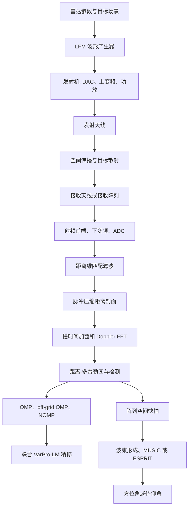

# 项目雷达信号处理、NOMP 与联合精修研究路线

> 本文档按“雷达体制与信号处理流程 -> 雷达方程和分辨率 -> 传统测距测速 -> OMP/off-grid OMP -> NOMP -> 联合精修 -> 一维 unknown-K -> 二维 NOMP 联合精修 -> 二维 unknown-K -> 角度测量接口”的顺序组织。
> 文中明确区分当前代码已经实现的内容、已有实验结论。

## 1. 雷达体制和信号处理模块总流程

### 1.1 当前项目采用的雷达设计

当前 MATLAB 工程采用的是**单基地脉冲多普勒雷达**，脉冲内部采用复基带 LFM 波形。距离维使用匹配滤波完成脉冲压缩，慢时间使用多个脉冲的 Doppler FFT 完成速度估计。

当前代码不是 FMCW 雷达。FMCW 通常通过混频去调频或拍频得到距离信息；本项目采用的是脉冲体制，使用发射 LFM 和接收回波之间的频域匹配滤波。

代码从 `generate_domp_scene.m` 中的复基带发射参考信号 `x_tx` 开始，直接模拟目标回波和数字接收处理。真实系统中的 DAC、上变频、功率放大器、射频天线、低噪声放大器、下变频和 ADC 被折叠进数学模型，没有逐一建立硬件级模型。

### 1.2 完整信号处理流程



当前项目已经实现到距离、速度和距离-速度联合精修；阵列空间处理和角度测量还没有实现。

### 1.3 当前雷达参数

| 参数 | 当前设置 | 作用 |
|---|:--:|:-:|
| 雷达体制 | 单基地 PD | 距离使用双程传播，速度使用双程 Doppler |
| 载波频率 $f_0$ | 10 GHz | X 波段传播相位参考 |
| 波长 $\lambda$ | 0.03 m | $\lambda=c/f_0$ |
| LFM 脉冲宽度 $T_p$ | 10 μs | 脉冲持续时间 |
| LFM 带宽 $B$ | 10 MHz | 决定距离分辨率 |
| 调频率 β | $B/T_p=10^{12}$ Hz/s | 线性扫频斜率 |
| 快时间采样率 $F_s$ | 10 MHz | 每个脉冲的距离采样率 |
| 快时间点数 $N$ | 1000 | 每个脉冲的快时间长度 |
| PRT $T_r$ | 100 μs | 脉冲重复时间 |
| PRF | 10 kHz | PRF = 1/$T_r$ |
| 脉冲数 $N_p$ | 64 | 慢时间 CPI 长度 |
| 常规距离分辨率 | 15 m | c/(2B) |
| 速度分辨率 | 约 2.34375 m/s | $\lambda/(2N_pT_r)$ |
| 最大无模糊速度 | ±75 m/s | λ/(4$T_r$) |
| 距离字典过采样率 | 默认 10 | 构造距离精细网格 |
| 二维速度过采样率 | 默认 8 | 速度网格步长约 0.293 m/s |
| 默认 SNR | 20 dB | 当前仿真的噪声控制参数 |

### 1.4 当前目标和回波设定

场景由 $K$ 个点目标组成，每个目标由初始距离 $R_k$ 和径向速度 $v_k$ 描述。当前仿真中目标默认采用相同的单位回波幅度，没有显式加入 RCS、$1/R^4$ 距离衰减、杂波、天线方向图或阵列通道相位。

第 $m$ 个脉冲的目标距离和双程时延为：

$$
R_k[m] = R_k - v_k mT_r
$$

$$
τ_{m,k} = 2R_k/c - 2mT_r v_k/c
$$

当前速度符号约定是：

- $v_k>0$ 表示目标靠近雷达；
- $v_k<0$ 表示目标远离雷达；
- $f_{D,k}=2v_k/λ$；
- 正速度落在当前 `v_axis` 的正半轴。

复基带 LFM 发射脉冲写成：

$$
s_tx(t) = rect((t-T_p/2)/T_p) exp(jπβ(t-T_p/2)^2)
$$

单个脉冲总回波可以概括为：

$$
s_rx,m(t) = Σ[k=1..K] s_tx(t-τ_{m,k}) exp(-j2πf_0τ_{m,k}) + n_m(t)
$$

由于时延随慢时间变化，载波相位项展开后产生慢时间相位：

$$
exp(j2π f_D mT_r) = exp(j2π(2v/λ)mT_r)
$$

## 2. 雷达方程和当前仿真观测模型

### 2.1 单基地雷达方程

在理想自由空间、点目标和单基地条件下，接收功率常写为：

$$
P_r = P_t G_t G_r λ^2 σ / ((4π)^3 R^4 L)
$$

其中：

- $P_t$ 是发射功率；
- $G_t$ 和 $G_r$ 是发射、接收天线增益；
- λ 是波长；
- σ 是目标 RCS；
- $R^4$ 来自发射单程扩散和目标回波返回的单程扩散；
- $L$ 汇总系统损耗、极化损耗、传播损耗和实现损耗。

如果发射和接收使用同一副天线并且增益相同，可以近似写成 $G_tG_r=G^2$。

接收机输入端单脉冲 SNR 可写成近似形式：

$$
SNR_in ≈ P_r / (k T_0 F B_n)
$$

其中 $k$ 是 Boltzmann 常数，$T_0$ 是参考噪声温度，$F$ 是噪声系数，$B_n$ 是等效噪声带宽。

### 2.2 脉冲压缩和相干积累带来的处理增益

LFM 匹配滤波的主要处理增益近似为时间带宽积：

$$
G_pc ≈ BT_p
$$

如果在 CPI 内对 $N_p$ 个脉冲进行相干积累，理想情况下还可以获得约 $N_p$ 的相干积累增益。因此可用一个概念性的输出 SNR 关系表示：

$$
SNR_out ≈ SNR_in × BT_p × N_p × G_window × G_loss
$$

其中 $G_window$ 表示窗函数带来的主瓣和噪声带宽影响，$G_loss$ 表示实现损耗。这个式子用于解释参数影响，不是当前 MATLAB 仿真的精确功率标定公式。

### 2.3 当前代码与雷达方程的差别

当前 `generate_domp_scene.m` 的噪声设置是：

```matlab
sigma2 = 1 / (10^(SNR_dB / 10));
y_noise = echo(m, :) + sqrt(sigma2/2) * ...
          (randn(1, N) + 1j * randn(1, N));
```

因此当前仿真中的 SNR 主要是一个复高斯噪声控制参数，而不是由 $P_t$、$G$、σ、$R$、$kT_0BF$ 等物理量共同计算出来的系统链路预算。

这带来两个重要结论：

1. 当前实验适合研究字典相干性、网格量化、NOMP 初始化和联合精修机制；
2. 当前结果不能直接解释为某个真实雷达功率、探测距离或 RCS 条件下的工程性能。

如果以后需要工程化，可以在场景生成器中加入目标 RCS、$1/R^4$ 衰减、噪声温度、接收机噪声系数、窗函数损失和脉冲间 Swerling 起伏。

## 3. 距离分辨率、速度分辨率和影响因素

### 3.1 常规距离分辨率

对带宽为 $B$ 的 LFM 脉冲，匹配滤波后的常规距离 Rayleigh 分辨率近似为：

$$
ΔR_Rayleigh ≈ c/(2B)
$$

当前 $B=10$ MHz，因此：

$$
ΔR_Rayleigh ≈ 3×10^8/(2×10^7) = 15 m
$$

快时间采样得到的距离 bin 间隔为：

$$
ΔR_bin = c/(2F_s)
$$

本项目 $F_s=B=10$ MHz，因此距离 bin 也约为 15 m。需要注意，距离 bin 间隔、匹配滤波主瓣宽度和两个目标可稳定分辨的间距不是同一个概念。

### 3.2 距离分辨率受哪些因素影响

主要因素包括：

- **LFM 带宽 $B$**：带宽越大，匹配滤波主瓣越窄，常规距离分辨率越高；
- **采样率 $F_s$**：决定距离轴采样间隔，采样率过低会造成距离量化和混叠；
- **窗函数**：Hamming 等窗函数降低旁瓣，但会展宽主瓣，造成分辨率和旁瓣抑制的折中；
- **SNR**：SNR 降低时峰值位置抖动增大，两个近目标的可分离概率下降；
- **目标幅度比和复相位**：强目标旁瓣可能掩盖弱目标，复数叠加可能相长或相消；
- **波形和字典失配**：发射脉冲、匹配滤波器和连续原子不一致会产生定位偏差；
- **距离走动和加速度**：长 CPI 内目标不再停留在同一距离单元，简单可分离原子会失配；
- **多径、杂波和干扰**：会改变距离剖面结构，产生虚假峰或模型残差。

常规 FFT 或峰值检测的分辨率由主瓣和采样决定；OMP、NOMP 和联合精修研究的是在已知或近似正确物理模型下，能否在主瓣重叠区域进一步估计连续目标参数。因此超分辨不是把 15 m 这个物理主瓣宽度改写成零，而是在一定 SNR、相干性和模型准确度下进行参数分解。

### 3.3 常规速度分辨率

对 $N_p$ 个脉冲组成的 CPI：

$$
T_CPI = N_p T_r
$$

Doppler 频率分辨率近似为：

$$
Δf_D ≈ 1/T_CPI = 1/(N_pT_r)
$$

单基地雷达中 $f_D=2v/λ$，所以速度分辨率近似为：

$$
Δv_Rayleigh ≈ λ/(2N_pT_r) = λ PRF/(2N_p)
$$

当前参数给出：

$$
Δv_Rayleigh ≈ 0.03/(2×64×100×10^-6) = 2.34375 m/s
$$

最大无模糊 Doppler 频率约为 ±PRF/2，对应最大无模糊速度为：

$$
|v| < v_amb = λ/(4T_r) = λ PRF/4
$$

当前 $v_amb≈75$ m/s。

### 3.4 速度分辨率受哪些因素影响

- **CPI 长度 $T_CPI$**：脉冲数越多或 PRT 越大，速度主瓣越窄，但运动目标更容易产生距离走动和加速度失配；
- **载波频率和波长 $\lambda$**：频率越高、波长越短，速度分辨率 $\Delta v$ 的数值越小，分辨能力越高；
- **PRF/PRT**：决定速度采样率和无模糊速度范围；提高 PRF 会扩大无模糊速度范围，但在脉冲数固定时会缩短 CPI；
- **慢时间窗**：Hamming 等窗函数降低 Doppler 旁瓣，但展宽 Doppler 主瓣；
- **相干性和相位稳定性**：脉冲间相位误差会降低相干积累增益；
- **加速度和距离走动**：会使慢时间相位不再是单一复指数，导致 Doppler 峰展宽或偏移；
- **SNR、目标幅度比和目标间距**：决定两个近 Doppler 目标能否稳定分解。

## 4. 传统雷达测距测速方法

### 4.1 传统测距

传统 LFM 测距流程为：

```text
接收回波
    -> 与发射 LFM 做匹配滤波
    -> 得到脉冲压缩距离剖面
    -> 找峰值或使用 CFAR 检测峰值
    -> 用 R = c * t_peak / 2 换算距离
```

代码中的距离轴为 `r_axis = t * c / 2`。传统测距输出只能稳定地把明显分开的峰识别为不同目标；当两个目标的 PSF 主瓣高度重叠时，峰值可能合并、偏移或只保留强目标。

### 4.2 传统测速

传统测速流程为：

```text
每个脉冲完成距离压缩
    -> 固定距离单元，沿脉冲序号形成慢时间序列
    -> 加 Doppler 窗并做慢时间 FFT
    -> 在 Doppler 谱或 RDM 中找峰值
    -> 用 v = λ f_D / 2 换算径向速度
```

在当前实现中，`echo_doppler` 是慢时间 FFT 后的结果，`v_axis` 是根据 Doppler 频率换算出来的速度轴。`dopp_idx` 选择能量最大的 Doppler 行，再提取该行的距离剖面作为一维距离超分辨输入。

### 4.3 传统方法的局限

传统峰值检测的局限不是实现不够复杂，而是它主要利用峰值位置，没有显式利用多个目标的复数 PSF 叠加模型：

- 两个目标距离小于主瓣宽度时，两个峰可能融合；
- 强目标旁瓣可能覆盖弱目标；
- 噪声、窗函数和模型失配会使峰值位置发生偏差；
- 传统 FFT 的输出受距离或速度采样网格限制；
- 只通过局部峰值很难解释近目标之间的相干叠加。

### 4.4 为什么传统 OMP 仍然需要作为基线

脉冲压缩后，在一个距离 ROI 内可以建立稀疏模型：

$$
y = A_R x + n
$$

其中 $A_R$ 的每一列是一个假设距离对应的 LFM-PSF，$x$ 是稀疏距离谱。传统网格 OMP 的每一步是：

1. 计算 `abs(A_R' * residual)`；
2. 选择相关性最大的字典列；
3. 用最小二乘重新估计已选原子的复幅度；
4. 更新残差并重复。

OMP 的输出距离只能落在距离字典网格上。增加过采样率可以减小网格量化误差，但不能从根本上消除近目标字典列高度相似带来的互干扰。

### 4.5 项目中的一阶 off-grid OMP

项目实现的 off-grid OMP 是传统 OMP 和 NOMP 之间的过渡方法。对 OMP 已选择的支撑集 $S$，用一阶 Taylor 模型：

$$
a(R_n+β_n) ≈ a(R_n) + b(R_n)β_n
$$

从而得到：

$$
y ≈ (A_S + B_S diag(β))x
$$

其中 $B_S$ 是距离原子的导数字典，$β_n$ 是限制在半个网格步长内的连续偏移。

当前 `offgrid_omp_refinement.m` 固定 OMP 支撑集，在复幅度 $x$ 和偏移 $β$ 之间交替最小二乘更新。它能降低网格量化误差，但如果 OMP 第一步已经把两个近目标选成了错误位置，固定支撑的 off-grid 修正不一定能够恢复正确目标分解。

### 4.6 当前传统方法的结果对照

| 方法 | 实验口径 | 当前结果 | 主要解释 |
|---|---|---|---|
| grid OMP | SNR=20 dB，500 次 | 90% 成功率间隔约 40 m | 固定网格和贪心互干扰共同限制性能 |
| off-grid OMP | SNR=20 dB，200 次过渡区 | 90% 测试网格约 38 m，插值交点约 37.6 m；40 m 处 RMSE 约 0.32 m | 主要削弱网格量化误差 |
| 传统 Doppler OMP | SNR=20 dB，500 次 | 90% 速度间隔约 6.5 m/s | 速度维也可以使用稀疏字典超分辨，但仍受相干性限制 |

以上结果的试验次数和参数并不完全相同，适合作为阶段性基线，不应当直接当作严格的同条件排名。

## 5. NOMP 的提出、原理和测量优势

### 5.1 为什么从 OMP 过渡到 NOMP

传统 OMP 的两个主要问题是：

1. 目标参数被限制在离散字典网格上，存在网格量化误差；
2. 近目标对应的 PSF 列高度相干，贪心选择容易把多个目标的叠加误认为一个偏移目标。

off-grid OMP 只在 OMP 选中的支撑附近做一阶小范围修正。为了更直接地在连续参数上优化目标位置，NOMP 将 OMP 的离散选原子过程和 Newton/cyclic refinement 结合起来。

NOMP 的核心思想是：**先用网格完成全局粗定位，再把目标参数从网格点提升为连续变量，并反复利用残差对所有已检测目标进行局部精修。**

### 5.2 一维距离 NOMP 的基本流程

设距离原子为 $a(R)$，观测为：

$$
y = Σ[k=1..K] c_k a(R_k) + n
$$

一维距离 NOMP 的典型流程是：

```text
residual = y
active_set = empty

for k = 1 ... K
    1. 在当前残差上做网格相关搜索
    2. 得到新目标的粗距离 R_k^grid
    3. 对新目标做连续距离 single refinement
    4. 加入 active_set
    5. 对 active_set 中所有目标做 cyclic refinement
    6. 联合最小二乘更新所有复幅度
    7. 更新 residual
end
```

项目的 `nomp_range_refinement.m` 支持两种连续精修模式：

- `newton`：有限差分得到一阶/二阶局部信息，执行 Newton 式更新，作为默认模式；
- `search`：局部粗扫后使用一维连续搜索，作为稳健对照。

项目中的 NOMP 原子不是论文中理想正弦 steering vector，而是当前 LFM 脉压、频域窗和 ROI 截取后得到的 LFM-PSF。因此，NOMP 的导数、局部搜索半径和接受条件都必须针对 LFM-PSF 重新定义。

### 5.3 NOMP 与传统 OMP/off-grid OMP 的不同

| 项目 | grid OMP | off-grid OMP | NOMP |
|---|---|---|---|
| 参数空间 | 离散网格 | 网格 + 一阶偏移 | 连续距离参数 |
| 支撑集 | 贪心固定 | OMP 支撑固定 | 顺序检测后可连续重估 |
| 局部模型 | $y≈Ax$ | $y≈(A+Bdiag(β))x$ | 直接生成连续 PSF 原子 |
| 精修方式 | 无 | 幅度和偏移交替 LS | single + cyclic Newton/search |
| 对网格误差 | 敏感 | 有修正 | 直接绕开网格量化 |
| 对近目标相干 | 敏感 | 仍然敏感 | 有所改善，但仍可能失败 |
| 目标数 | 通常预设 | 通常预设 | 当前实现仍固定 $K$ |

### 5.4 NOMP 的测量优势

- 目标距离不再被最终锁定在粗网格点上；
- 能利用连续 PSF 结构做局部参数精修；
- cyclic refinement 会反复修正已检测目标，而不是只修正最后一个目标；
- 通过联合幅度最小二乘，已选目标的复幅度会随位置更新；
- 在同样的 LFM-PSF 字典上，NOMP 可以作为一维联合精修的高质量初始化器。

当前 NOMP 小样本结果为：30-45 m 过渡区 100% 分离；24 m 成功率 99%，22 m 为 98%，20 m 降到 75%，18 m 为 74%；90% 测试网格极限约 22 m，线性插值交点约 21.3 m。

这说明 NOMP 相比 grid OMP 和 off-grid OMP 有明显改进，但该结果是 100 次小样本测试，主要用于机制验证；正式论文结果仍应使用同条件、足够次数的 Monte Carlo。

### 5.5 NOMP 的不足

NOMP 把连续参数精修接到贪心检测之后，但没有完全消除贪心初始化的影响：

1. **顺序检测偏差**：第一个原子可能吸收多个近目标的合成响应，后续目标在错误残差上检测；
2. **强相干导致局部退化**：两个 PSF 列接近时，一个偏移原子可能用较低残差解释两个目标，导致距离偏移和幅度失真；
3. **局部优化依赖初值**：Newton/cyclic refinement 主要在当前原子附近更新，初始支撑严重错误时不一定能跳到正确盆地；
4. **目标间参数耦合没有被完全联合处理**：逐目标更新和单目标局部精修不能同时优化所有近目标的距离；
5. **通常需要预先知道 $K$ 或设置停止阈值**：固定 $K$ 不适合未知目标数，残差阈值又容易受噪声、窗函数和模型失配影响；
6. **模型失配会限制超分辨**：真实运动 LFM 回波与简化可分离原子不一致时，优化器可能是在拟合模型误差。

因此，NOMP 的下一步不是简单把网格加密，而是把已经检测到的目标作为一个整体进行联合连续精修。

## 6. 联合精修的原理、方法和作用

### 6.1 从逐目标 NOMP 到联合模型

对于已检测到的 $K$ 个距离候选，构造：

$$
Φ(R) = [a(R_1), a(R_2), ..., a(R_K)]
$$

模型为：

$$
y = Φ(R)c + n
$$

其中 $R=[R_1,...,R_K]^T$ 是非线性距离参数，$c$ 是线性复幅度参数。

如果直接同时优化 $R$ 和 $c$，变量维度较高且幅度与距离强耦合。Variable Projection 的做法是：给定距离 $R$，先用最小二乘消去复幅度：

$$
c_hat(R) = argmin_c ||y-Φ(R)c||_2^2
$$

再把外层目标变为：

$$
F(R) = ||y-Φ(R)c_hat(R)||_2^2
$$

这样外层只优化距离参数，复幅度由内层 LS 或带小 Ridge 的稳定 LS 得到。

### 6.2 投影 Jacobian 和 LM 更新

记当前残差为 $r=y-Φc$，距离原子导数为 $d a(R_k)/dR_k$。VarPro 的关键不是直接使用原始导数，而是把导数投影到当前字典列空间的正交补中：

```text
D = [c_1 da(R_1)/dR, ..., c_K da(R_K)/dR]
J = D - Φ * solve(Φ, D)
```

然后构造阻尼 Gauss-Newton/LM 系统：

$$
(J^H J + μD_LM) ΔR = real(J^H r)
$$

通过阻尼因子 μ 控制步长；如果新残差下降则接受并减小阻尼，否则增大阻尼重试。

当前一维联合精修还加入了：

- 距离上下界和 ROI 约束；
- 目标距离排序约束；
- 最小目标间距约束；
- 最大物理步长；
- 基于原子相干性/Gram 条件数的自适应阻尼；
- 多起点，包括 NOMP 初值和二原子网格 VarPro 初值；
- 残差单调下降接受策略。

### 6.3 联合精修解决了 NOMP 的什么不足

联合精修的作用不是替代 NOMP 的检测，而是修正 NOMP 检测后留下的目标分解偏差：

| NOMP 的问题 | 联合精修的处理 |
|---|---|
| 一个偏移原子吸收两个近目标 | 同时优化多个距离，使多个 PSF 共同解释观测 |
| 目标间幅度相互补偿 | 每次距离更新后重新联合估计所有复幅度 |
| 逐目标局部更新不充分 | 使用完整的联合 Jacobian 和联合 LM 步长 |
| 近目标导致 Hessian/Gram 病态 | 条件数感知阻尼、最小间距和步长限制 |
| NOMP 结果落在局部低残差但参数偏差较大的位置 | 多起点比较和联合残差优化降低局部偏差 |

联合精修不能保证救回完全错误的支撑，也不能消除物理模型失配。它最适合的场景是：NOMP 已经找到了正确目标簇的大致位置，但近目标之间存在强相干和参数互相补偿。

### 6.4 一维 NOMP 和联合精修的实验差异

在一个确定性双目标示例中，当前项目得到：

| 指标 | 真值 | NOMP | Joint VarPro-LM |
|---|---:|---:|---:|
| 目标距离 | `[2994, 3006] m` | 偏移约 4.11 m | 最大误差约 0.87 m |
| 复系数幅值 | `[1.00, 0.90]` | `[1.41, 0.48]` | `[1.09, 0.81]` |
| 相位差 | 36.0 deg | 43.1 deg | 36.8 deg |
| 复数相对残差 | - | 0.0460 | 0.0266 |

这说明 NOMP 可能通过偏移的距离和失真的复幅度，拟合出相近的合成回波；联合精修则更接近真实的目标分解。

在 SNR=20 dB、随机相位、500 次双目标距离扫描中，`joint_lm` 的 90% 测试网格间隔约为 8 m，插值交点约为 7.281 m。该结果与 grid OMP、off-grid OMP、NOMP 的试验次数和配置不完全一致，不能直接作为严格排名，但足以支持“联合精修明显提高近距离双目标参数分解能力”的阶段性判断。

## 7. 本实验的一维设计：NOMP 初始化 + 联合精修 + unknown-K

### 7.1 固定 $K=2$ 双目标设计

当前一维双目标实验链路为：

```text
y_roi 和 LFM-PSF 距离字典
    -> sequential NOMP 检测两个粗候选
    -> 新目标 single refinement 和 cyclic refinement
    -> 得到两个连续距离初值
    -> Joint Variable-Projection LM
    -> 联合 LS 更新复幅度
    -> 输出两个距离、复幅度、残差、条件数和收敛诊断
```

固定 $K=2$ 适合研究近距离双目标分辨极限，优点是变量和实验解释清晰；缺点是目标数必须预先知道，不能直接处理三个以上目标或空场景。

### 7.2 固定 $K$ 的局部目标簇设计

`cluster_varpro_range_refinement.m` 将双目标联合精修推广到固定 $K$ 的局部簇：

$$
Φ(R) = [a(R_1), ..., a(R_K)]
$$

外层联合优化 $[R_1,...,R_K]$，内层消去 $K$ 个复幅度。当前已支持 K=3 机制 demo 和固定-K 目标簇实验，但它是局部簇求解器，不做全局 K 元组枚举。

当前固定-K 一维流程的职责分工是：

- NOMP：给出固定 $K$ 的顺序初值；
- cluster VarPro-LM：在已知 $K$ 的局部距离簇内做联合连续精修；
- 条件数和塌缩诊断：判断目标是否真的可辨识。

### 7.3 一维 unknown-K 设计

一维 unknown-K 不是让 NOMP 自己凭一个残差阈值决定所有事情，而是对多个候选模型分别完成精修后再比较：

```text
候选 K = 0, 1, ..., Kmax

对每个 K:
    K=0: 空模型，RSS0 = ||y||^2
    K>=1: NOMP 产生 K 个距离初值
           fixed-K cluster VarPro-LM 精修
           重新 LS 估计复幅度
           计算最终 RSS、条件数和塌缩诊断

统一计算 BIC/MDL/AIC 或复高斯 BIC
选择 K_hat
再用可靠性门控判断 K_hat 是否可解释
```

当前一维距离局部簇的参数计数为：

$$
p_K = K + 2K = 3K
$$

即 $K$ 个实距离参数，加上 $K$ 个复幅度的 $2K$ 个实参数。

当前代码支持普通 BIC、严格复高斯 BIC，以及带条件数/塌缩门控的选择模式。应同时报告：

- `OrderSuccessRate`：$K_hat$ 选对的比例；
- `UnderestimateRate` 和 `OverestimateRate`：欠估计/过估计比例；
- `SelectedKLocalizationSuccessRate`：先选 $K_hat$ 再定位的端到端成功率；
- `ConditionalLocalizationSuccessRate`：条件于 $K_hat=K_true$ 时的后端精修成功率；
- `OracleKRefinedSuccessRate`：直接使用真实 $K$ 的上限参考；
- 最终残差、Gram 条件数、Atom 条件数和 CollapseRate。

信息准则和可靠性门控的职责不同：

- BIC/MDL 选择拟合和模型复杂度之间更合适的阶数；
- 条件数和塌缩门控判断这些目标是否能被稳定分解；
- CFAR 判断当前残差中是否还存在显著新目标。

### 7.4 一维 unknown-K 当前结果

当前一维 unknown-K 已有 500 次实验结果：

| 场景 | 目标数 | 90% 测试网格极限 | 插值交点 | 说明 |
|---|---:|---:|---:|---|
| symmetric_triplet | 3 | 18 m | 17.333 m | BIC 在较大间隔下能稳定选中 K=3 |
| one_close_pair | 3 | 12 m | 10.735 m | 三目标中只有一对近目标时，整体性能更依赖近对可辨识性 |

例如 `symmetric_triplet` 在 20 m 间隔时 selected-K localization success 约 97.2%，在 18 m 时约 93.4%；`one_close_pair` 在 12 m 时约 96.2%，在 10 m 时约 86.4%。

这些结果说明一维 unknown-K 已经可以作为实验模块写入论文，但必须说明它解决的是**单 Doppler 切片/单速度门内的局部簇 unknown-K**，不是完整二维全局检测器。

### 7.5 一维方法链的最终定位

| 方法 | 输入和作用 | 解决的问题 | 仍然存在的不足 |
|---|---|---|---|
| 峰值/FFT | 距离剖面或慢时间 Doppler 谱 | 常规测距测速 | 主瓣重叠、网格限制、弱目标遮蔽 |
| grid OMP | 离散 LFM-PSF 字典 | 稀疏多目标基线 | 网格量化、贪心互干扰 |
| off-grid OMP | OMP 支撑的一阶连续偏移 | 降低网格误差 | 固定支撑，不能可靠修正错选 |
| NOMP | 粗检测 + 连续 single/cyclic refinement | 连续参数估计、减小网格限制 | 顺序初始化、局部相干、固定 K |
| Joint VarPro-LM | 多目标联合连续距离优化 | 减少近目标参数互相补偿 | 仍依赖初值和模型，固定 K 时需已知目标数 |
| unknown-K Joint | 候选 K 精修 + BIC/门控 | 不预先固定局部目标数 | 当前只覆盖一维局部簇，未扩展到二维 |

## 8. 二维 NOMP 联合精修设计

### 8.1 为什么需要从一维过渡到二维

一维距离联合精修假设 Doppler 维已经通过 RDM 峰值或速度门处理完成，输入是某一条 Doppler 切片上的 `y_roi`。这个方法适合：

- 目标速度相同或非常接近；
- 目标已被选入同一速度门；
- 研究重点是同一 Doppler 单元内的距离 close pair。

如果两个目标在距离和速度上同时接近，或者速度差不足以在 Doppler FFT 中分开，那么只保留一条切片会损失慢时间相位信息。此时应直接使用距离压缩后的完整矩阵：

```text
Y = y2d_roi
行: 距离 ROI 样本
列: 脉冲序号/慢时间
```

### 8.2 二维距离-速度模型

距离原子仍由当前 LFM-PSF 字典生成，速度原子使用慢时间复指数：

$$
a_D(v)[m] = exp(j2π(2v/λ)mT_r)
$$

在距离走动可以忽略的第一版模型中，二维原子采用可分离形式：

$$
A(R,v) = a_R(R) a_D(v)^T
$$

列向量化后：

$$
vec(A(R,v)) = a_D(v) ⊗ a_R(R)
$$

对应的多目标观测为：

$$
vec(Y) = Φ(R,V)c + n
$$

其中 $R=[R_1,...,R_K]^T$、$V=[v_1,...,v_K]^T$，每个目标有一个复幅度。

### 8.3 二维 NOMP + 联合精修流程

```text
Y = y2d_roi
    -> 初始化 residual = Y，active_set = empty
    -> 对 residual 做矩阵化二维粗搜索
       C = A_R^H * residual * conj(A_D)
    -> 得到新目标的粗距离和粗速度
    -> 对新目标做 K=1 局部二维 VarPro-LM
    -> 加入 active_set
    -> 对所有 active targets 做联合二维 VarPro-LM
    -> 联合更新复幅度和 residual
    -> 重复直到固定 K 个目标
```

二维粗搜索不显式构造完整 Kronecker 字典，而使用矩阵化相关：

```matlab
correlation = model.range_dictionary' * ...
              residual_matrix * conj(model.doppler_dictionary);
```

二维联合精修的优化变量是：

$$
θ = [R_1,v_1,R_2,v_2,...,R_K,v_K]^T
$$

复幅度仍由 Variable Projection 内层消去。K=2 时是完整四参数联合 Jacobian，K=3 时是完整六参数联合 Jacobian，不是多个 K=1 问题的独立拼接。

### 8.4 二维实现成果

当前二维基础和 fixed-K 主线已经完成：

- `generate_domp_scene.m` 输出距离-慢时间矩阵 `range_slowtime` 和二维 ROI `y2d_roi`；
- `build_doppler_dictionary.m` 生成与正速度约定一致的慢时间 Doppler 原子；
- `build_range_doppler_model.m` 组合距离字典、速度字典和物理边界；
- `build_range_doppler_atoms.m` 生成活动目标的连续二维原子；
- `coarse_range_doppler_search.m` 完成矩阵化二维粗搜索；
- `joint_varpro_range_doppler_refinement.m` 已实现固定 K=1/2/3 的二维连续联合精修；
- `nomp_range_doppler_refinement.m` 已实现固定 K=1/2/3 的残差顺序检测、局部精修、活动集全局精修和联合幅度更新；
- 已完成 K=2 的距离轴、速度轴和联合二维带噪间隔扫描；
- 已完成 K=3 的机制 pilot、随机相位扩展和独立距离-速度二维间隔网格实验。

### 8.5 二维实验结果的阶段性结论

在精确可分离二维原子、SNR=20 dB 的 K=3 随机相位 100 次实验中：

| 场景 | eta=0.8 | eta=0.6 | eta=0.4 |
|---|---:|---:|---:|
| range_axis | 95% | 67% | 23% |
| velocity_axis | 71% | 59% | 47% |
| joint | 100% | 100% | 98% |

这说明目标在距离和速度两个维度同时存在可分离结构时，联合二维精修比只沿单一距离轴或单一速度轴精修更稳定。

在 K=3 的独立二维距离-速度间隔网格、随机相位、每点 50 次实验中，成功率矩阵为：

```text
eta_R 行，eta_v 列:
100%  100%  100%
100%  100%  100%
100%  100%   96%
```

本轮所有网格点的 collapse rate 和 solver failure rate 均为 0。随着距离或速度间隔减小，最终 Gram 条件数上升，说明性能改善不是无条件的，仍受二维原子相干性限制。

### 8.6 物理 LFM 失配带来的二维边界

当前二维正式原子主要使用 `AtomMode='separable'`，而 `generate_domp_scene.m` 的真实物理回波包含距离时延、载波相位和 CPI 内距离走动。因此物理回波与可分离二维原子之间存在模型失配。

物理 LFM pilot 的主要结论是：

- SNR=Inf 时，真实物理回波代入可分离模型的相对残差约为 0.003-0.01；
- 物理原子与可分离原子的相关性仍可能高于 0.99994，但高相关不等于无偏估计；
- 在 5 次 pilot 中，range_axis 成功率为 20%/0%/0%，而 velocity_axis 和 joint 均为 100%/100%/100%；
- 加入 SNR=20 dB 后，range_axis 仍为 20%/0%/0%，joint 仍保持 100%/100%/100%；
- collapse rate 和 solver failure rate 为 0，说明距离轴失败主要来自模型失配和近距离相干，而不是 LM 求解器直接崩溃；
- 后续应独立实现 physical-LFM moving atom，再判断距离轴的性能上限。

所以二维联合精修已经完成了算法机制验证，但不能把当前 `separable` pilot 直接表述为完整物理 LFM 三维雷达处理器的最终性能。

## 9. 二维联合 unknown-K 的设计

### 9.1 当前状态

二维 unknown-K 目前**尚未实现**。当前二维代码支持固定 K=1/2/3 的顺序检测和联合精修，但还没有把候选阶数选择、二维 CFAR、K>3 和物理 moving atom 统一起来。

因此文档中应把二维 unknown-K 写成下一阶段方法设计，而不是写成当前成果。

### 9.2 二维 unknown-K 的候选模型

对候选目标数 $K=0,1,...,Kmax$，每个模型都使用同一份二维距离-慢时间观测 $Y$：

$$
y = vec(Y)
$$

$$
y = Φ_K(R,V)c + n
$$

对每个候选 K：

1. 用二维顺序 NOMP 或二维 CFAR 生成 K 个初值；
2. 用固定-K 二维联合 VarPro-LM 精修所有距离和速度；
3. 用最终连续二维原子重新估计复幅度；
4. 计算残差 RSS、Gram 条件数、原子条件数和目标间周期速度距离；
5. 计算信息准则并比较所有候选 K。

二维模型的实参数计数可先采用：

$$
p_K = K 个距离参数 + K 个速度参数 + K 个复幅度的 2K 个实参数 = 4K
$$

如果噪声方差也作为未知参数估计，可以额外计一个公共噪声参数；但该项对不同 K 是共同结构，必须在实现中统一处理。

普通 BIC 和严格复高斯 BIC 可以分别写成：

$$
BIC_real(K) = N_c log(RSS_K/N_c) + p_K log(N_c)
$$

$$
BIC_complex(K) = 2N_c log(RSS_K/N_c) + p_K log(N_c)
$$

其中 $N_c=N_RN_p$ 是复数观测样本数。最终采用哪一种，需要结合噪声白化和相邻距离样本相关性进行标定，不能只凭公式选择。

### 9.3 二维 unknown-K 的推荐工作流

```text
阶段 A: 二维粗检测
    用矩阵化粗搜索、二维 CFAR 或 residual threshold 产生候选前缀

阶段 B: fixed-K 后端
    K=0: 空模型
    K>=1: 二维 NOMP 初始化 + fixed-K 联合 VarPro-LM

阶段 C: 模型选择
    对所有 K 计算 RSS、BIC/complex BIC、条件数和 collapse
    得到 K_stat = 统计准则最优阶数

阶段 D: 可靠性判断
    过滤不收敛、目标塌缩、Gram 条件数过高的候选
    得到 K_reliable = 可可靠分解的阶数

阶段 E: 输出
    输出 K_hat、距离、速度、复幅度、残差和可靠性标志
```

二维 CFAR、BIC 和联合 VarPro-LM 的职责应保持分离：

- CFAR：判断残差里有没有显著的新目标，负责顺序检测/停止；
- BIC/MDL：比较不同目标数的拟合和复杂度，负责模型阶数选择；
- VarPro-LM：给定 K 后估计连续距离和速度；
- 条件数/塌缩门控：判断估计出的多个目标是否真的可辨识。

### 9.4 二维 unknown-K 的实现前置条件

二维 unknown-K 不能只把一维代码的 `KMax` 换成二维变量，至少需要先处理：

1. fixed-K 二维联合精修的 K>3 扩展或明确 Kmax=3 的应用边界；
2. physical-LFM moving atom，否则模型误差可能被错误解释成额外目标；
3. 二维 CFAR 或 residual-based candidate gate；
4. 目标距离和速度的周期边界、重复候选和目标置换；
5. 二维 Gram 条件数、collapse、幅度趋零和速度 wrap 的可靠性诊断；
6. unknown-K 下的端到端指标，而不只看最终 RSS。

建议二维 unknown-K 的最终报告至少包含：

- `OrderSuccessRate`、`UnderestimateRate`、`OverestimateRate`；
- `SelectedKLocalizationSuccessRate`；
- 距离 RMSE、速度 RMSE 和目标置换后的最大误差；
- `K_stat` 与 `K_reliable` 的差异；
- Gram/Atom 条件数、CollapseRate、solver failure rate；
- Oracle fixed-K 结果，区分模型选择失败和后端精修失败。

## 10. 从发射机到角度测量的系统边界

### 10.1 当前项目是否已经测角

当前工程没有实现角度测量，因为观测模型没有空间维度：

- `generate_domp_scene.m` 只生成一个复数接收通道；
- `range_slowtime` 尺寸是距离样本 × 脉冲数，没有阵元维；
- `scene` 没有目标角度、阵元位置、阵元间距和通道校准字段；
- 没有波束形成、空间 FFT、MUSIC 或 ESPRIT。

代码中的 `angle(amp)` 表示复幅度相位，不是空间到达角。

### 10.2 后续测角模块

若加入均匀线阵，接收数据应扩展为：

```text
距离 x 慢时间 x 接收通道
```

阵列导向矢量可以写成：

$$
a_A(θ) = [1, exp(j2πd sin(θ)/λ), ..., exp(j2π(Q-1)d sin(θ)/λ)]^T
$$

推荐的第一版空间处理流程是：

```text
每个接收通道分别匹配滤波
    -> 每个通道分别做 Doppler FFT
    -> 在距离-速度图中检测目标门
    -> 提取各阵元复数值形成空间快拍
    -> 通道幅相校准和时延校正
    -> Bartlett/空间 FFT 测角
    -> 多快拍条件下再扩展 MUSIC/ESPRIT
```

后续若把角度纳入稀疏超分辨，三维原子可以写为：

$$
a(R,v,θ) = a_D(v) ⊗ a_R(R) ⊗ a_A(θ)
$$

但这属于三维阵列扩展，不应与当前单通道二维距离-速度成果混写。

## 11. 代码模块、实验文件和成果状态

| 模块 | 主要文件 | 状态 |
|---|---|---|
| LFM 发射、目标回波、匹配滤波、RDM | `src/core/generate_domp_scene.m` | 已实现 |
| LFM-PSF 距离字典 | `src/core/build_psf_dictionary.m` | 已实现 |
| 传统距离 OMP | `src/algorithms/omp_detection.m` | 已实现，作为基线 |
| 一阶 off-grid OMP | `src/algorithms/offgrid_omp_refinement.m` | 已实现，作为过渡基线 |
| 一维距离 NOMP | `src/algorithms/nomp_range_refinement.m` | 已实现 |
| 一维双目标联合精修 | `src/algorithms/joint_varpro_range_refinement.m` | 已实现，固定 K=2 |
| 一维固定 K 局部簇精修 | `src/algorithms/cluster_varpro_range_refinement.m` | 已实现 |
| 一维 unknown-K | `experiments/cluster_unknown_k/` | 已实现，局部簇范围 |
| Doppler 字典 | `src/core/build_doppler_dictionary.m` | 已实现 |
| 二维模型和二维原子 | `src/core/build_range_doppler_model.m`, `build_range_doppler_atoms.m` | 已实现，可分离原子 |
| 二维 NOMP/联合精修 | `src/algorithms/nomp_range_doppler_refinement.m`, `joint_varpro_range_doppler_refinement.m` | 已实现固定 K=1/2/3 |
| 二维 unknown-K | - | 尚未实现，下一阶段 |
| 二维 CFAR | - | 尚未实现，下一阶段 |
| 多通道阵列和角度测量 | - | 尚未实现 |

## 12. 最终建议

### 12.1 论文或报告中的推荐章节顺序

```text
1. 雷达体制和整体信号处理流程
2. 雷达方程、脉冲压缩和 SNR 关系
3. 距离分辨率、速度分辨率及影响因素
4. 传统峰值测距测速
5. 网格 OMP 和 off-grid OMP 基线
6. NOMP 的提出、原理、优势和不足
7. 一维 NOMP 初始化 + 联合 VarPro-LM
8. 一维固定-K、unknown-K 和实验对比
9. 二维 NOMP + 联合 VarPro-LM 设计
10. 二维 fixed-K 实验成果和 physical-LFM 边界
11. 二维 unknown-K/CFAR 的后续设计
12. 阵列空间处理和角度测量扩展
13. 总结
```

### 12.2 当前最合理的下一步

```text
第一步：不重写一维联合精修核心，补齐一维方法对照和 unknown-K 结果说明；
第二步：以一维 NOMP 作为二维顺序检测和初始化的参考，继续完善二维 fixed-K；
第三步：先解决二维 physical-LFM atom/model mismatch；
第四步：再实现二维 unknown-K + CFAR/可靠性门控；
第五步：最后加入多通道阵列和角度测量。
```

这样写，逻辑上既能说明联合精修为什么从 NOMP 自然引出，也能把当前已经完成的成果和还没有完成的二维 unknown-K、角度模块清楚分开。

## 13. 主要依据

- `README_DOMP.md`
- `src/core/generate_domp_scene.m`
- `src/core/build_psf_dictionary.m`
- `src/core/build_doppler_dictionary.m`
- `src/core/build_range_doppler_model.m`
- `src/core/build_range_doppler_atoms.m`
- `src/algorithms/omp_detection.m`
- `src/algorithms/offgrid_omp_refinement.m`
- `src/algorithms/nomp_range_refinement.m`
- `src/algorithms/joint_varpro_range_refinement.m`
- `src/algorithms/cluster_varpro_range_refinement.m`
- `experiments/cluster_unknown_k/eval_cluster_varpro_unknown_k_limit.m`
- `docs/OFFGRID_OMP_RANGE_NOTES.md`
- `docs/UNKNOWN_K_SELECTION_LEARNING.md`
- `docs/2D_NOMP_CODE_DESIGN.md`
